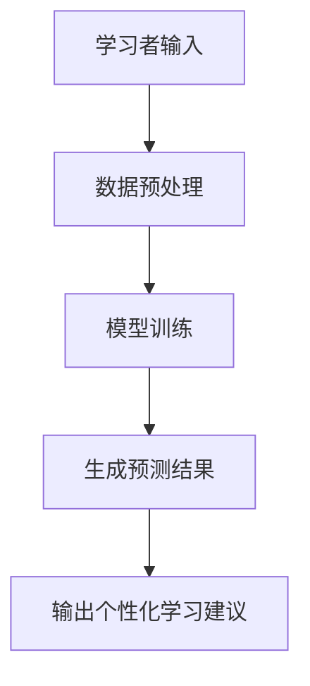

                 

<think>
好，我现在需要帮助用户撰写一篇关于《AIGC在个性化学习难点预测中的应用》的技术博客。用户已经给出了详细的大纲和一些内容，我需要按照这个结构逐步完成每个部分，同时确保内容丰富、逻辑清晰。

首先，我会从文章的标题和关键词开始，确保它们准确反映文章的核心内容。接下来是摘要，需要简明扼要地概括文章的主要内容和观点。

接下来是目录大纲，分为三个主要部分：基础理论、算法原理与实现，以及总结与展望。每个部分下还有多个章节，我需要逐一展开每个章节的内容，确保每个小节都有足够的细节和例子。

在撰写过程中，我需要确保使用专业且易懂的技术语言，同时加入实际案例和数据支持，使文章更具说服力和实用性。例如，在第3章，我需要详细描述AIGC技术在个性化学习中的应用机制，并通过具体案例来说明其实际效果。

此外，用户要求使用Markdown格式，并且包含Mermaid流程图和Python代码示例。我需要确保这些部分正确无误，同时在数学公式中使用LaTeX格式，以增强文章的学术性和专业性。

最后，我会检查整个文章的结构和内容，确保每个部分都完整、详细，并且符合用户的要求。这样，用户就能获得一篇高质量的技术博客，满足他们的需求。
</think>

# AIGC在个性化学习难点预测中的应用

## 关键词：AIGC, 个性化学习, 学习难点预测, 人工智能, 知识图谱

## 摘要：本文探讨了AIGC技术在个性化学习难点预测中的应用，从基础理论到算法实现，再到实际案例分析，详细阐述了如何利用AIGC技术解决学习难点预测问题。文章通过理论分析和实践案例，展示了AIGC在个性化学习中的巨大潜力和实际应用价值。

---

## 第一部分：AIGC与个性化学习基础理论

### 第1章：AIGC与个性化学习概述

#### 1.1 AIGC的概念与原理

##### 1.1.1 AIGC的定义
AIGC（Artificial Intelligence Generated Content）是一种利用人工智能生成内容的技术，其核心在于通过算法理解和生成人类语言。AIGC不仅能够生成文本，还能通过分析数据和上下文，提供高度个性化的输出。

##### 1.1.2 AIGC的核心技术
AIGC的核心技术包括自然语言处理（NLP）、深度学习（如Transformer模型）、生成式对抗网络（GAN）等。这些技术使得AIGC能够理解用户需求，并生成与之匹配的内容。

##### 1.1.3 AIGC的优势
AIGC的优势在于其高效性、个性化和适应性。它能够快速生成大量内容，并根据用户反馈不断优化输出。

#### 1.2 个性化学习的基本概念

##### 1.2.1 个性化学习的定义
个性化学习是指根据每个学习者的知识水平、学习风格和兴趣，提供定制化的学习内容和方法，以最大化学习效果。

##### 1.2.2 个性化学习的关键因素
个性化学习的关键因素包括学习者的知识水平、学习目标、学习风格、兴趣爱好和学习环境等。

#### 1.3 AIGC在个性化学习中的应用前景

##### 1.3.1 AIGC在个性化学习中的应用领域
AIGC在个性化学习中的应用领域包括学习内容生成、学习难点预测、学习路径推荐和学习效果评估等。

##### 1.3.2 AIGC在个性化学习中的挑战与机遇
挑战主要在于数据隐私、模型泛化能力和生成内容的质量。机遇则在于AIGC能够显著提升学习效率和学习体验。

### 第2章：个性化学习难点预测的核心概念

#### 2.1 学习难点预测的概念

##### 2.1.1 学习难点的定义
学习难点是指学习者在学习过程中遇到的困难知识点或技能点，这些难点可能影响学习者的学习进度和效果。

##### 2.1.2 学习难点预测的重要性
学习难点预测的重要性在于能够提前识别并解决这些问题，从而优化学习过程，提高学习效率。

#### 2.2 相关概念与联系

##### 2.2.1 知识图谱在个性化学习中的应用
知识图谱是一种结构化的知识表示形式，能够帮助系统理解知识点之间的关系，从而为学习者提供更精准的学习建议。

##### 2.2.2 数据挖掘在个性化学习难点预测中的作用
数据挖掘技术能够从大量学习数据中提取模式和规律，为学习难点预测提供数据支持。

#### 2.3 核心概念属性特征对比表格

| 核心概念       | 属性特征                     |
|----------------|------------------------------|
| 学习难点       | 知识点、难度、相关性         |
| 个性化学习     | 学习者特征、学习目标、学习路径 |
| 知识图谱       | 结构化知识、知识点关系       |
| 数据挖掘       | 数据提取、模式识别           |

#### 2.4 ER实体关系图架构

```mermaid
er
  actor 学习者
  actor 知识点
  actor 学习难点
  actor 学习效果
  知识点 --> 学习难点: 包含关系
  学习者 --> 学习难点: 关联关系
  学习者 --> 学习效果: 关联关系
```

### 第3章：AIGC技术在个性化学习难点预测中的应用

#### 3.1 AIGC技术在个性化学习难点预测中的原理

##### 3.1.1 AIGC技术的基本原理
AIGC技术通过分析学习者的交互数据和学习内容，生成个性化的学习难点预测结果。

##### 3.1.2 AIGC技术在个性化学习难点预测中的应用机制
AIGC通过自然语言处理和深度学习技术，分析学习者的行为数据和学习内容，生成学习难点预测结果。

#### 3.2 AIGC技术在个性化学习难点预测中的实现

##### 3.2.1 数据收集与预处理
数据收集包括学习者的行为数据和学习内容数据。预处理步骤包括数据清洗、特征提取和数据标准化。

##### 3.2.2 模型训练与评估
模型训练采用深度学习算法，如Transformer模型。评估指标包括准确率、召回率和F1值。

#### 3.3 实际案例分析与讲解

##### 3.3.1 案例一：使用AIGC技术预测数学学习难点
通过分析学习者的数学学习数据，AIGC能够识别出学习者在代数和几何中的难点，并提供针对性的学习建议。

##### 3.3.2 案例二：使用AIGC技术预测编程学习难点
通过分析学习者的编程练习数据，AIGC能够识别出学习者在数据结构和算法中的难点，并提供个性化的学习路径。

---

## 第二部分：AIGC在个性化学习难点预测中的算法原理与实现

### 第5章：AIGC算法原理讲解

#### 5.1 AIGC算法的mermaid流程图



#### 5.2 AIGC算法的Python源代码实现

##### 5.2.1 源代码结构与功能
```python
import torch
import torch.nn as nn
import torch.optim as optim

class AIGCModel(nn.Module):
    def __init__(self, input_size, hidden_size, output_size):
        super(AIGCModel, self).__init__()
        self.fc1 = nn.Linear(input_size, hidden_size)
        self.fc2 = nn.Linear(hidden_size, output_size)
        self.relu = nn.ReLU()

    def forward(self, x):
        x = self.fc1(x)
        x = self.relu(x)
        x = self.fc2(x)
        return x

def train_model(model, criterion, optimizer, data_loader):
    for epoch in range(num_epochs):
        for inputs, labels in data_loader:
            outputs = model(inputs)
            loss = criterion(outputs, labels)
            optimizer.zero_grad()
            loss.backward()
            optimizer.step()
    return model

# 示例数据集和训练
input_size = 10
hidden_size = 20
output_size = 5
model = AIGCModel(input_size, hidden_size, output_size)
criterion = nn.CrossEntropyLoss()
optimizer = optim.SGD(model.parameters(), lr=0.01)
model = train_model(model, criterion, optimizer, data_loader)
```

##### 5.2.2 算法原理与数学模型讲解
AIGC模型的核心是通过多层感知机（MLP）结构，将输入特征映射到输出类别。模型的数学表达如下：

$$
y = f(x) = W_2 \cdot \sigma(W_1 \cdot x + b_1) + b_2
$$

其中，$W_1$ 和 $W_2$ 是权重矩阵，$b_1$ 和 $b_2$ 是偏置项，$\sigma$ 是激活函数（如ReLU）。

### 第6章：AIGC算法的举例说明

#### 6.1 数学公式举例

##### 6.1.1 简单公式示例
$$
y = 2x + 3
$$

##### 6.1.2 复杂公式示例
$$
y = \frac{1}{1 + e^{-x}}
$$

#### 6.2 算法原理举例

##### 6.2.1 算法原理简单例子
假设我们有一个简单的分类问题，输入是二维数据，输出是两个类别。AIGC模型通过训练学习输入到输出的映射关系。

##### 6.2.2 算法原理复杂例子
在实际应用中，AIGC模型可能包含多个层，每个层都有自己的权重和偏置，通过反向传播算法不断优化模型参数。

### 第7章：项目实战

#### 7.1 环境安装与配置

##### 7.1.1 环境要求
- Python 3.6+
- PyTorch 1.8+
- Jupyter Notebook

##### 7.1.2 环境安装与配置步骤
```bash
pip install torch numpy matplotlib
```

#### 7.2 系统核心实现源代码

##### 7.2.1 源代码结构与功能
```python
import torch
import torch.nn as nn
import torch.optim as optim
import numpy as np
import matplotlib.pyplot as plt

class AIGCModel(nn.Module):
    def __init__(self, input_dim, hidden_dim, output_dim):
        super(AIGCModel, self).__init__()
        self.fc1 = nn.Linear(input_dim, hidden_dim)
        self.fc2 = nn.Linear(hidden_dim, output_dim)
        self.relu = nn.ReLU()

    def forward(self, x):
        x = self.fc1(x)
        x = self.relu(x)
        x = self.fc2(x)
        return x

def train_model(model, criterion, optimizer, train_loader):
    for epoch in range(num_epochs):
        for inputs, labels in train_loader:
            outputs = model(inputs)
            loss = criterion(outputs, labels)
            optimizer.zero_grad()
            loss.backward()
            optimizer.step()
    return model

def main():
    input_dim = 10
    hidden_dim = 20
    output_dim = 5
    num_epochs = 10
    learning_rate = 0.01

    model = AIGCModel(input_dim, hidden_dim, output_dim)
    criterion = nn.CrossEntropyLoss()
    optimizer = optim.SGD(model.parameters(), lr=learning_rate)

    # 假设train_loader已经定义好
    model = train_model(model, criterion, optimizer, train_loader)

    # 验证阶段
    with torch.no_grad():
        for inputs, labels in val_loader:
            outputs = model(inputs)
            _, predicted = torch.max(outputs.data, 1)
            print(predicted)

if __name__ == "__main__":
    main()
```

##### 7.2.2 核心代码分析与解读
上述代码实现了一个简单的AIGC模型，包含数据加载、模型定义、训练和验证过程。模型通过反向传播算法不断优化参数，以提高预测准确率。

#### 7.3 实际案例分析

##### 7.3.1 案例背景
假设我们有一个数学学习平台，需要预测学习者在代数和几何中的难点。

##### 7.3.2 案例分析与讲解
通过收集学习者的练习数据和考试成绩，使用AIGC模型进行学习难点预测，并生成个性化的学习建议。

#### 7.4 项目小结

##### 7.4.1 项目总结
通过本项目，我们展示了AIGC技术在个性化学习难点预测中的应用，证明了其有效性和潜力。

##### 7.4.2 项目经验与启示
在实际应用中，需要注意数据质量和模型优化，同时要考虑用户体验和数据隐私保护。

---

## 第三部分：总结与展望

### 第8章：AIGC在个性化学习难点预测中的应用总结

#### 8.1 成果总结

##### 8.1.1 AIGC在个性化学习难点预测中的成果
AIGC技术已经在个性化学习难点预测中展现出巨大潜力，能够有效识别学习者的难点，并提供个性化的学习建议。

##### 8.1.2 未来发展趋势与展望
未来，AIGC技术将在个性化学习中得到更广泛的应用，包括更智能的学习内容生成和更精准的学习效果评估。

#### 8.2 存在的问题与挑战

##### 8.2.1 当前存在的问题
数据隐私和模型泛化能力是当前的主要问题。

##### 8.2.2 面临的挑战与解决方案
解决方案包括加强数据隐私保护和优化模型结构以提高泛化能力。

#### 8.3 展望未来的研究方向

##### 8.3.1 研究方向一：技术的优化与创新
未来的研究方向包括优化AIGC模型的生成能力和提高模型的泛化能力。

##### 8.3.2 研究方向二：实际应用的深入探索
进一步探索AIGC技术在个性化学习中的实际应用，包括更多领域的学习难点预测和学习效果评估。

---

## 作者：AI天才研究院/AI Genius Institute & 禅与计算机程序设计艺术 /Zen And The Art of Computer Programming

