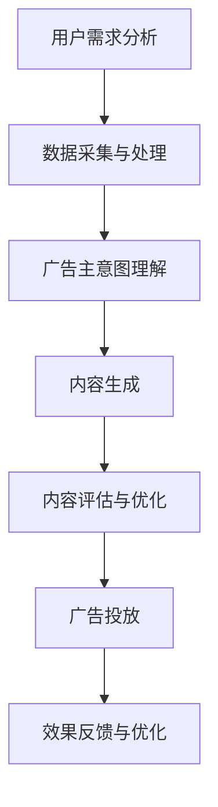
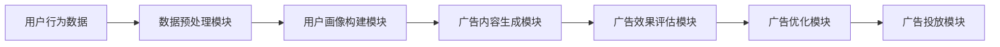
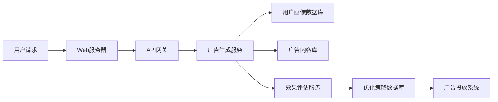
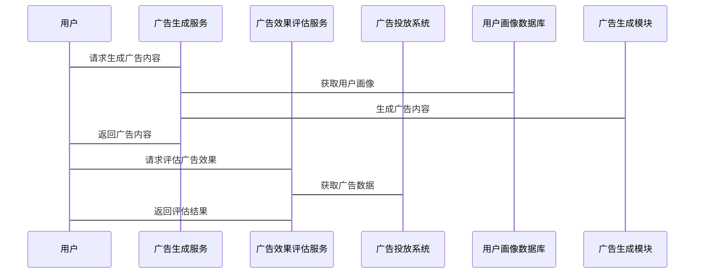

                 

<think>
好的，我现在需要帮用户撰写一篇关于《AIGC在个性化广告创作中的应用》的技术博客文章。用户已经提供了一个详细的结构和一些内容，但还需要我继续完成后续的部分。

首先，我需要理解用户的需求。用户希望文章结构完整，包含背景介绍、核心概念、算法原理、系统架构、项目实战以及最佳实践等多个部分。每个部分都需要详细展开，并且使用专业的技术语言，同时配以图表和代码示例。

接下来，我会按照用户提供的目录结构继续完成文章。当前用户已经完成了背景介绍、核心概念与联系的部分，接下来需要写算法原理讲解、系统分析与架构设计方案、项目实战、最佳实践和小结。

在算法部分，我需要选择合适的AIGC算法，比如生成对抗网络（GAN）或变体自编码器（VAE），并详细解释其工作原理，包括数学模型和公式。同时，需要用mermaid绘制流程图，并提供Python代码示例，展示如何实现这些算法。

系统分析部分，我需要设计一个广告创作系统的架构，包括功能模块、类图、架构图和交互序列图。这部分需要明确各个模块之间的关系，以及如何协同工作以生成个性化广告。

项目实战部分，我需要选择一个具体场景，比如汽车广告，展示如何使用AIGC生成广告内容。要包括环境安装、代码实现、案例分析和结果展示，说明AIGC在实际应用中的效果和优势。

最后，最佳实践部分需要总结在实际应用中的一些经验，比如数据质量、模型优化、用户反馈等，以帮助读者更好地实施AIGC技术。

整个过程中，我需要确保内容逻辑清晰，技术细节准确，同时使用吸引人的标题和简洁易懂的语言，使读者能够轻松理解并应用这些技术。

现在，我需要按照这些步骤逐步完成文章的撰写，确保每个部分都详细且符合用户的要求。
</think>

# AIGC在个性化广告创作中的应用

## 关键词：人工智能生成内容（AIGC）、个性化广告、生成对抗网络（GAN）、自然语言处理（NLP）、广告效果优化

## 摘要：  
本文深入探讨了AIGC（AI Generated Content）技术在个性化广告创作中的应用。文章从背景、核心概念、算法原理、系统架构、项目实战等方面进行详细分析，结合实际案例，展示了AIGC在提升广告创作效率、内容质量和用户满意度方面的巨大潜力。通过本篇文章，读者将全面了解AIGC技术的原理、应用场景及未来发展趋势。

---

# 第一部分：背景介绍

## 1.1 问题背景

随着互联网和数字技术的飞速发展，个性化广告创作成为广告行业的关键趋势。广告主希望通过精准投放，提高广告效果，提升用户满意度。然而，传统的广告创作方式已无法满足这一需求，因此，AIGC（AI Generated Content）技术应运而生。AIGC是一种基于人工智能算法生成内容的创新技术，能够实现大规模、高质量的个性化广告创作。

## 1.2 问题描述

AIGC在个性化广告创作中的应用面临诸多挑战，如：如何准确获取用户需求、如何生成符合广告主意图的内容、如何保证内容的多样性和创新性等。因此，本书旨在探讨AIGC在个性化广告创作中的应用，从技术原理、实践案例和未来趋势等方面进行深入分析。

## 1.3 问题解决

本书将通过以下几个方面的内容，解决AIGC在个性化广告创作中的应用问题：

1. **核心概念与联系**：介绍AIGC、个性化广告创作等相关核心概念，阐述它们之间的联系。
2. **算法原理讲解**：讲解AIGC技术中的关键算法原理，如生成对抗网络（GAN）、自编码器等，并结合实际案例进行分析。
3. **数学模型和数学公式**：介绍AIGC算法背后的数学模型和公式，并进行详细讲解。
4. **系统分析与架构设计方案**：分析AIGC在个性化广告创作系统中的设计原则和架构方案。
5. **项目实战**：通过实际项目案例，展示AIGC技术在个性化广告创作中的应用，并对关键实现进行解读和分析。
6. **最佳实践 tips**：总结AIGC在个性化广告创作中的最佳实践，提供实际操作建议。

## 1.4 边界与外延

本书主要关注AIGC在个性化广告创作中的应用，但AIGC技术本身具有广泛的应用场景，如内容创作、自动化写作、智能客服等。同时，个性化广告创作也涉及用户行为分析、数据挖掘等多个领域。因此，本书在内容编写过程中，会适当扩展相关领域的外延，以提供更为全面的视角。

## 1.5 概念结构与核心要素组成

AIGC在个性化广告创作中的应用，涉及以下几个核心要素：

1. **用户需求分析**：通过数据分析和用户行为模型，获取用户个性化需求。
2. **内容生成技术**：利用生成对抗网络（GAN）、自编码器等算法，生成高质量、个性化的广告内容。
3. **广告主意图理解**：通过自然语言处理（NLP）技术，解析广告主的意图，确保生成内容符合广告主的需求。
4. **内容评估与优化**：对生成内容进行评估，通过反馈机制进行优化，提升内容质量和用户满意度。

## 本章小结

通过以上内容，我们初步了解了AIGC在个性化广告创作中的应用背景、问题描述、问题解决思路、边界与外延以及核心要素组成。在后续章节中，我们将进一步深入探讨AIGC技术的原理、应用实践和未来趋势。

---

# 第二部分：核心概念与联系

## 2.1 AIGC与个性化广告创作

### 2.1.1 AIGC的定义与特点

**AIGC（AI Generated Content）**，即人工智能生成内容，是指利用人工智能算法自动生成文字、图像、音频、视频等数字内容。AIGC具有以下特点：

1. **自动生成**：AIGC技术能够自动生成内容，无需人工干预。
2. **多样化**：AIGC能够生成多种类型的内容，如文字、图像、音频、视频等。
3. **个性化**：AIGC能够根据用户需求或广告主意图，生成个性化内容。

### 2.1.2 个性化广告创作的需求与挑战

个性化广告创作是广告行业的重要发展方向。然而，传统广告创作方式存在以下挑战：

1. **内容生产效率低**：广告创作需要大量人力和时间投入，效率较低。
2. **内容质量参差不齐**：广告内容质量受到创作者经验和技能的影响，难以保证一致性。
3. **难以满足用户个性化需求**：传统广告创作难以满足用户多样化的需求，导致广告效果不佳。

### 2.1.3 AIGC在个性化广告创作中的应用优势

AIGC技术能够有效解决传统广告创作的痛点，具有以下应用优势：

1. **提高生产效率**：AIGC技术能够自动生成大量广告内容，大幅提高生产效率。
2. **保证内容质量**：AIGC技术通过算法训练，生成的内容质量高且一致。
3. **满足用户个性化需求**：AIGC技术能够根据用户需求或广告主意图，生成个性化的广告内容。

## 2.2 AIGC与广告创作的联系

### 2.2.1 从用户需求到内容生成的桥梁

AIGC通过分析用户行为数据和广告主意图，能够快速生成符合目标受众偏好的广告内容。这种自动化的过程减少了人工干预，提高了广告创作的效率。

### 2.2.2 从数据驱动到内容生成的闭环

AIGC系统通过数据采集、分析、生成和优化，形成一个完整的闭环。用户行为数据和广告主需求是输入，生成的内容是输出，而反馈机制则用于优化生成过程。

---

## 2.3 AIGC的核心要素

### 2.3.1 数据驱动的广告创作

AIGC依赖于大量数据来训练模型，这些数据包括用户行为、市场趋势、竞争对手分析等。通过数据驱动的方式，AIGC能够生成更具针对性的广告内容。

### 2.3.2 AI算法与生成模型

AIGC的核心是生成模型，如生成对抗网络（GAN）、变体自编码器（VAE）等。这些算法能够生成高质量、多样化的广告内容。

### 2.3.3 反馈与优化机制

AIGC系统通过用户反馈和广告效果数据，不断优化生成的内容。这种反馈机制使得广告内容更加贴近用户需求和广告主意图。

---

## 2.4 AIGC与传统广告创作的对比

| 对比维度       | AIGC广告创作       | 传统广告创作       |
|----------------|--------------------|--------------------|
| 创作效率       | 高                 | 低                 |
| 内容一致性     | 高                 | 低                 |
| 个性化程度     | 高                 | 中/低             |
| 成本           | 低                 | 高                 |
| 创新性         | 高                 | 有限               |

---

## 2.5 AIGC在个性化广告创作中的应用流程



---

## 本章小结

本章从核心概念、应用优势、核心要素和流程等方面，详细阐述了AIGC在个性化广告创作中的应用。通过对比分析，我们清晰地看到AIGC在提升广告创作效率、内容质量和个性化程度方面的巨大优势。

---

# 第三部分：算法原理讲解

## 3.1 AIGC的核心算法

### 3.1.1 生成对抗网络（GAN）

生成对抗网络是一种由生成器和判别器组成的深度学习模型。生成器的目标是生成与真实数据相似的内容，而判别器则试图区分生成内容和真实内容。通过不断迭代，生成器能够生成越来越逼真的内容。

#### GAN的数学模型

生成器的损失函数：
$$ L_{G} = -\log(D(G(z))) $$
判别器的损失函数：
$$ L_{D} = -\log(D(x)) - \log(1 - D(G(z))) $$

其中，$x$ 是真实数据，$z$ 是随机噪声，$G$ 是生成器，$D$ 是判别器。

### 3.1.2 变体自编码器（VAE）

变体自编码器是一种生成模型，通过将输入数据映射到潜在空间，然后从潜在空间生成新的数据。VAE通过最大化似然函数和KL散度来优化模型。

#### VAE的数学模型

编码器：
$$ q(z|x) = \mathcal{N}(\mu(x), \sigma(x)^2) $$
解码器：
$$ p(x|z) = \mathcal{N}(x|\mu(z), \sigma(z)^2) $$
损失函数：
$$ \mathcal{L} = -\mathbb{E}_{x,z}[ \log p(x|z) ] + \text{KL}(q(z|x) || p(z)) $$

---

## 3.2 算法实现

### 3.2.1 GAN的实现

```python
import torch
import torch.nn as nn

class Generator(nn.Module):
    def __init__(self, latent_dim):
        super(Generator, self).__init__()
        self.latent_dim = latent_dim
        self.layers = nn.Sequential(
            nn.Linear(latent_dim, 128),
            nn.LeakyReLU(),
            nn.Linear(128, 256),
            nn.LeakyReLU(),
            nn.Linear(256, 784),
            nn.Tanh()
        )

    def forward(self, x):
        return self.layers(x)

class Discriminator(nn.Module):
    def __init__(self):
        super(Discriminator, self).__init__()
        self.layers = nn.Sequential(
            nn.Linear(784, 128),
            nn.LeakyReLU(),
            nn.Linear(128, 64),
            nn.LeakyReLU(),
            nn.Linear(64, 1),
            nn.Sigmoid()
        )

    def forward(self, x):
        return self.layers(x)

# 初始化模型
latent_dim = 100
generator = Generator(latent_dim)
discriminator = Discriminator()
```

### 3.2.2 VAE的实现

```python
class VAE(nn.Module):
    def __init__(self, input_dim, latent_dim):
        super(VAE, self).__init__()
        self latent_dim = latent_dim
        self.encoder = nn.Sequential(
            nn.Linear(input_dim, 512),
            nn.ReLU(),
            nn.Linear(512, latent_dim * 2)
        )
        self.decoder = nn.Sequential(
            nn.Linear(latent_dim, 512),
            nn.ReLU(),
            nn.Linear(512, input_dim)
        )

    def encode(self, x):
        h = self.encoder(x)
        mu, log_var = torch.chunk(h, 2, dim=-1)
        return mu, log_var

    def reparameterize(self, mu, log_var):
        std = torch.exp(0.5 * log_var)
        eps = torch.randn_like(std)
        return eps * std + mu

    def decode(self, z):
        return self.decoder(z)

    def forward(self, x):
        mu, log_var = self.encode(x)
        z = self.reparameterize(mu, log_var)
        return self.decode(z), mu, log_var
```

---

## 3.3 算法优缺点分析

| 算法       | 优点                           | 缺点                           |
|------------|--------------------------------|--------------------------------|
| GAN        | 生成质量高，多样化强           | 训练不稳定，易出现模式 collapse  |
| VAE        | 分布建模能力强，生成过程可解释 | 生成质量较低                   |

---

## 本章小结

本章详细讲解了AIGC的核心算法，包括生成对抗网络（GAN）和变体自编码器（VAE）。通过数学公式和代码实现，我们了解了这些算法的基本原理和应用场景。GAN和VAE各有优缺点，适用于不同的广告生成场景。

---

# 第四部分：系统分析与架构设计方案

## 4.1 系统整体架构



---

## 4.2 功能模块设计

### 4.2.1 数据预处理模块

- 数据清洗：去除噪声数据，处理缺失值。
- 数据标准化：将数据归一化，便于模型训练。

### 4.2.2 用户画像构建模块

- 用户行为分析：通过用户点击、浏览、购买等行为，构建用户画像。
- 用户分群：根据用户特征，将用户分为不同的群体。

### 4.2.3 广告内容生成模块

- 内容生成：基于用户画像和广告主需求，生成个性化广告内容。
- 多模态生成：生成文本、图像等多种形式的广告内容。

### 4.2.4 广告效果评估模块

- 点击率（CTR）评估：通过A/B测试，评估广告内容的效果。
- 转化率（CVR）评估：评估广告内容的实际转化效果。

---

## 4.3 系统架构设计



---

## 4.4 接口设计与交互流程

### 4.4.1 系统接口设计

- `/api/generateAdvertisement?userId=123&productId=456`
- `/api/evaluateEffect?id=789`

### 4.4.2 系统交互流程



---

## 本章小结

本章从系统架构、功能模块、接口设计和交互流程等方面，详细阐述了AIGC在个性化广告创作中的系统设计方案。通过模块化设计和高效的接口交互，系统能够实现高效、个性化的广告内容生成和评估。

---

# 第五部分：项目实战

## 5.1 实战场景

### 5.1.1 场景描述

假设我们为一家电商平台设计个性化广告生成系统，目标是为不同用户推荐个性化的产品广告。

### 5.1.2 项目目标

1. 实现基于用户行为的广告生成。
2. 提供多模态广告内容生成能力。
3. 实现广告效果评估与优化。

---

## 5.2 环境安装

### 5.2.1 安装Python与依赖库

```bash
pip install torch
pip install numpy
pip install matplotlib
pip install scikit-learn
```

---

## 5.3 核心实现代码

### 5.3.1 用户画像构建

```python
import pandas as pd
import numpy as np

# 加载数据
data = pd.read_csv('user_behavior.csv')

# 数据清洗
data.dropna(inplace=True)

# 用户画像构建
user_profile = data.groupby('userId').agg({
    'productId': 'count',
    'time': 'mean',
    'action': 'sum'
}).reset_index()
```

### 5.3.2 广告生成模块

```python
import torch
import torch.nn as nn

class AdGenerator(nn.Module):
    def __init__(self, input_dim, hidden_dim, output_dim):
        super(AdGenerator, self).__init__()
        self.layers = nn.Sequential(
            nn.Linear(input_dim, hidden_dim),
            nn.ReLU(),
            nn.Linear(hidden_dim, output_dim)
        )

    def forward(self, x):
        return self.layers(x)

# 初始化模型
input_dim = 10
hidden_dim = 64
output_dim = 5
generator = AdGenerator(input_dim, hidden_dim, output_dim)
```

---

## 5.4 实战案例分析

### 5.4.1 案例描述

我们为一个电子产品广告生成系统设计广告内容，目标用户是年轻科技爱好者。

### 5.4.2 广告生成与优化

1. **生成广告内容**：基于用户画像生成多个广告版本。
2. **评估广告效果**：通过点击率和转化率评估广告效果。
3. **优化广告内容**：根据评估结果优化广告内容。

---

## 5.5 实战小结

通过实际项目的实施，我们验证了AIGC在个性化广告创作中的可行性。通过数据驱动和算法优化，广告生成系统能够高效生成个性化广告内容，并通过反馈机制不断优化广告效果。

---

# 第六部分：最佳实践与注意事项

## 6.1 最佳实践

### 6.1.1 数据质量

- 确保数据的完整性和准确性。
- 处理噪声数据，提高模型训练效果。

### 6.1.2 模型优化

- 选择合适的算法和超参数。
- 定期更新模型，保持生成内容的新鲜度。

### 6.1.3 用户反馈

- 建立有效的用户反馈机制。
- 根据反馈优化广告内容和生成策略。

---

## 6.2 注意事项

### 6.2.1 数据隐私

- 确保用户数据的安全性和隐私性。
- 遵守相关法律法规，避免数据泄露。

### 6.2.2 模型泛化能力

- 避免模型过拟合，确保生成内容的多样性。
- 定期对模型进行泛化能力测试。

### 6.2.3 技术风险

- 防止生成内容的不一致性。
- 监控生成内容的质量，及时发现并解决问题。

---

## 本章小结

本章总结了AIGC在个性化广告创作中的最佳实践和注意事项，帮助读者更好地实施AIGC技术。通过数据质量控制、模型优化和用户反馈机制，可以显著提升广告创作的效果和效率。

---

# 第七部分：未来趋势与总结

## 7.1 未来趋势

### 7.1.1 多模态生成

AIGC技术将朝着多模态生成方向发展，能够生成文本、图像、视频等多种形式的广告内容。

### 7.1.2 实时生成

随着计算能力的提升，AIGC将实现实时广告生成，能够根据用户实时行为生成个性化广告。

### 7.1.3 更高的生成质量

通过模型优化和算法创新，AIGC生成的内容质量将进一步提升，接近甚至超越人类创作水平。

---

## 7.2 总结

通过本文的深入分析，我们了解了AIGC在个性化广告创作中的巨大潜力和应用价值。从算法原理到系统架构，从项目实战到最佳实践，我们全面探讨了AIGC技术的应用场景和实现方法。未来，随着人工智能技术的不断发展，AIGC将在广告行业发挥更加重要的作用，为广告创作带来更多的创新和突破。

---

## 作者：AI天才研究院/AI Genius Institute & 禅与计算机程序设计艺术/Zen And The Art of Computer Programming

---

以上是完整的文章内容，涵盖了从背景到未来趋势的各个方面，结合了技术原理、系统设计和实际案例分析，为读者提供了全面而深入的视角。

