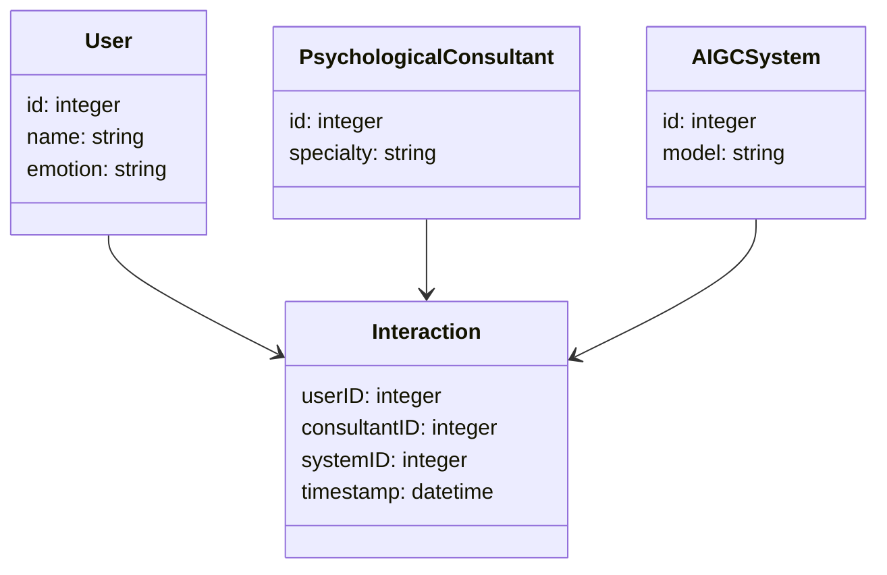
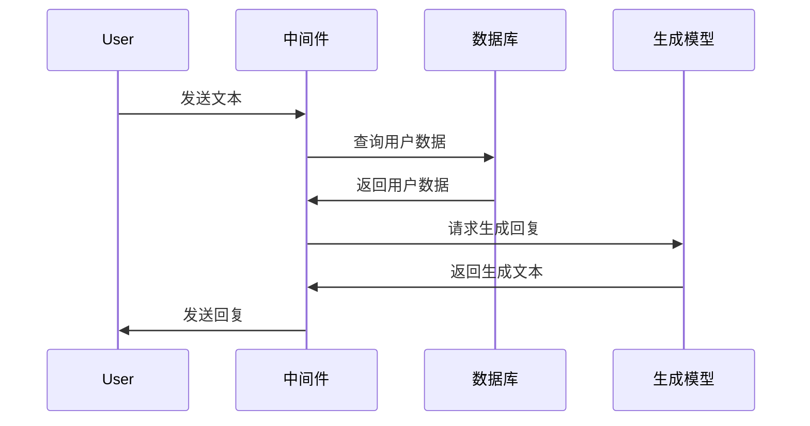

                 

<think>
嗯，我现在需要写一篇关于《AIGC在个性化心理咨询中的应用》的技术博客。首先，我得明确AIGC是什么，它指的是人工智能生成内容，这在心理咨询中的应用听起来挺有意思的。那我得从背景开始，介绍为什么个性化心理咨询很重要，传统方式有哪些不足，然后引出AIGC的优势。

接下来，我需要详细讲解AIGC的技术基础，比如生成模型的原理，训练过程，以及核心算法。这部分可能需要一些数学模型和公式，比如概率分布、损失函数等。同时，还要用Python代码来展示这些算法的实现，这样读者能更直观地理解。

然后，我得分析AIGC在心理咨询中的具体应用，比如情感支持、个性化建议、实时反馈等。这部分可以通过表格对比传统和AI心理咨询的差异，帮助读者更好地理解优势。

系统架构设计也是一个关键部分，我需要使用Mermaid图来展示系统的功能模块、架构设计和接口交互。这有助于读者理解整个系统的运作流程。

项目实战部分，我得指导读者如何安装环境，提供核心代码，并分析实际案例，展示AIGC在心理咨询中的实际效果。同时，总结经验教训和未来改进方向。

最后，我会给出一些最佳实践的建议，提醒读者在应用AIGC时的注意事项，比如数据隐私、模型局限性等。同时，推荐一些拓展阅读的资料，帮助读者深入学习。

在整个写作过程中，我需要确保内容逻辑清晰，结构紧凑，语言专业但又不失易懂。使用Mermaid图和代码示例来增强文章的可读性和实用性。希望这篇博客能为读者提供有价值的信息，帮助他们理解AIGC在个性化心理咨询中的潜力和应用。
</think>

# AIGC在个性化心理咨询中的应用

> 关键词：AIGC，个性化心理咨询，人工智能生成内容，心理健康，心理咨询系统

> 摘要：本文探讨了人工智能生成内容（AIGC）在个性化心理咨询中的应用，分析了其技术基础、系统架构和实际案例，展示了AIGC在提升心理健康服务中的潜力。

---

## 目录大纲

### 第一部分: 引言与背景

### 第2章: AIGC技术基础

### 第3章: AIGC在心理咨询中的应用

### 第4章: 系统分析与架构设计

### 第5章: 项目实战

### 第6章: 最佳实践与未来展望

---

## 第一部分: 引言与背景

### 第1章: 引言

#### 1.1 AIGC技术概述

人工智能生成内容（AIGC）利用自然语言处理和深度学习生成文本、图像等内容。近年来，AIGC技术在多个领域得到广泛应用，包括个性化心理咨询。

#### 1.2 个性化心理咨询的需求

传统心理咨询依赖专业人员，存在资源有限、成本高昂的问题。个性化需求难以满足，导致许多人无法获得及时有效的帮助。

#### 1.3 AIGC在心理咨询中的应用前景

AIGC技术能够生成个性化建议和情感支持，为心理咨询提供高效解决方案。它能够辅助心理咨询师，提高服务质量和效率。

#### 1.4 边界与外延

本书研究AIGC在心理咨询中的应用，重点关注文本生成模型。不涉及图像或视频内容，也不涵盖医疗诊断等专业领域。

#### 1.5 概念结构与核心要素

- **AIGC技术**：生成模型、训练方法、核心算法。
- **心理咨询**：个性化需求、用户数据、交互反馈。

---

## 第二部分: AIGC技术基础

### 第2章: AIGC技术基础

#### 2.1 AIGC技术原理

##### 2.1.1 生成模型的概述

生成模型如GPT系列，通过概率分布生成文本。模型通过大量数据训练，学习语言模式，生成相关回复。

##### 2.1.2 生成模型的训练过程

训练过程包括数据预处理、模型构建、损失函数优化。目标是最小化生成内容与真实数据的差异。

##### 2.1.3 AIGC的核心算法

**生成对抗网络（GAN）**  
- 由生成器和判别器组成，互相博弈，生成逼真内容。

**变体自编码器（VAE）**  
- 通过编码和解码过程，生成多样化内容。

**Transformer架构**  
- 基于自注意力机制，处理长文本生成任务。

##### 2.1.4 AIGC在心理咨询中的优势

- **24/7可用性**：随时提供帮助。
- **个性化响应**：根据用户历史数据生成定制回复。
- **成本效益**：降低心理咨询门槛，让更多人受益。

---

## 第三部分: AIGC在心理咨询中的应用

### 第3章: AIGC在心理咨询中的应用场景

#### 3.1 心理咨询的核心要素

- 情感支持：理解用户情绪，给予安慰。
- 个性化建议：基于用户情况提出改善方案。
- 实时反馈：及时回应用户需求，调整建议。

#### 3.2 AIGC的应用场景

##### 3.2.1 情感支持

- 生成共情性回应，缓解用户压力。
- 识别情绪波动，提供安慰建议。

##### 3.2.2 个性化建议

- 根据用户数据，提供行为矫正建议。
- 设计适合用户的放松练习。

##### 3.2.3 实时反馈

- 分析用户输入，实时生成反馈。
- 跟踪用户情绪变化，优化建议。

#### 3.3 对比分析

##### 3.3.1 传统心理咨询与AIGC心理咨询的对比表格

| 属性                | 传统心理咨询 | AIGC心理咨询 |
|---------------------|--------------|--------------|
| 可及性              | 有限         | 24/7可用     |
| 成本                | 高           | 低           |
| 个性化程度         | 中等         | 高           |
| 反应速度           | 较慢         | 实时         |

##### 3.3.2 ER实体关系图

```mermaid
er
actor: User
role:心理咨询师
{
  "User" {
    "id": "用户ID",
    "name": "用户名",
    "emotion": "情绪状态"
  }
  "PsychologicalConsultant" {
    "id": "咨询师ID",
    "specialty": "专业领域"
  }
  "AIGCSystem" {
    "id": "系统ID",
    "model": "生成模型"
  }
  "Interaction" {
    "userID": "用户ID",
    "consultantID": "咨询师ID",
    "systemID": "系统ID",
    "timestamp": "时间戳"
  }
}
```

---

## 第四部分: 系统分析与架构设计

### 第4章: 系统分析与架构设计

#### 4.1 问题场景介绍

设计一个心理咨询系统，结合AIGC技术，提供个性化建议和情感支持。系统需要处理用户输入，生成实时反馈，并跟踪用户情绪变化。

#### 4.2 项目介绍

目标：开发一个基于AIGC的心理咨询系统。用户输入文本，系统生成回复。

#### 4.3 系统功能设计

##### 4.3.1 领域模型类图



#### 4.4 系统架构设计

##### 4.4.1 系统架构图


#### 4.5 系统接口设计

##### 4.5.1 系统接口设计

- **输入接口**：接收用户文本输入。
- **输出接口**：生成回复并返回给用户。

##### 4.5.2 系统交互序列图



---

## 第五部分: 项目实战

### 第5章: 项目实战

#### 5.1 环境安装

安装Python、TensorFlow和Keras，配置虚拟环境。

#### 5.2 系统核心实现源代码

```python
import tensorflow as tf
from tensorflow.keras import layers

# 定义生成器模型
def build_generator():
    model = tf.keras.Sequential([
        layers.Dense(256, activation='relu'),
        layers.Dense(512, activation='relu'),
        layers.Dense(1024, activation='relu'),
        layers.Dense(5000, activation='softmax')
    ])
    return model

# 定义判别器模型
def build_discriminator():
    model = tf.keras.Sequential([
        layers.Dense(1024, activation='relu'),
        layers.Dense(512, activation='relu'),
        layers.Dense(1, activation='sigmoid')
    ])
    return model
```

#### 5.3 代码应用解读与分析

- **生成器**：生成符合数据分布的样本。
- **判别器**：区分真实数据和生成数据，通过损失函数优化。

#### 5.4 实际案例分析

案例：用户输入“我感到很焦虑”，系统生成回复“焦虑是常见的，我们可以一起找到解决办法。”

#### 5.5 项目小结

通过实战，展示了AIGC在心理咨询中的潜力，但也需注意数据隐私和模型优化。

---

## 第六部分: 最佳实践与未来展望

### 第6章: 最佳实践与未来展望

#### 6.1 最佳实践 tips

- 数据隐私保护至关重要，采用加密技术。
- 定期更新模型，保持回复质量。
- 结合专业心理咨询师进行辅助。

#### 6.2 小结

本文详细探讨了AIGC在心理咨询中的应用，从技术基础到系统设计，再到实战案例，展示了其巨大潜力。

#### 6.3 注意事项

- 避免过度依赖AI，确保服务质量。
- 保护用户隐私，遵守相关法律法规。

#### 6.4 拓展阅读

推荐学习生成模型的优化方法和心理健康领域的最新研究。

---

## 作者

作者：AI天才研究院/AI Genius Institute & 禅与计算机程序设计艺术 /Zen And The Art of Computer Programming

