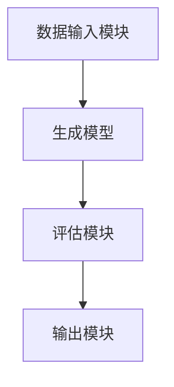
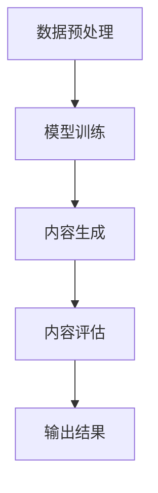
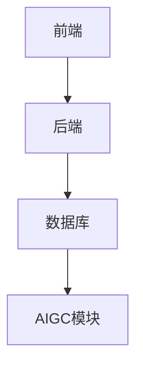
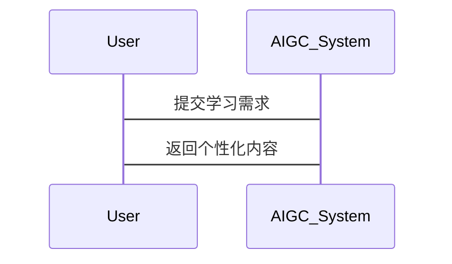

                 

<think>
好的，我现在需要按照用户的要求，撰写一篇关于“AIGC在个性化教育中的革命性应用”的技术博客文章。用户已经提供了详细的目录结构，所以我需要按照这个结构一步步展开每个部分的内容。

首先，文章的标题已经确定，接下来是关键词和摘要部分。关键词应该涵盖文章的核心主题，比如AIGC、个性化教育、人工智能、教育科技、教育系统优化等。摘要部分需要简洁明了地概括文章的主要内容，介绍AIGC如何改变个性化教育，并提到其在教育数据管理、智能平台构建和案例分析等方面的应用。

接下来是目录结构，分为三个主要部分：背景介绍与概念阐述、AIGC在个性化教育中的应用、实践案例与最佳实践。每个部分都有多个章节，每个章节下有小节。我需要逐一展开这些内容，确保每个部分都详细且有深度。

首先是背景介绍部分，包括问题背景、核心概念和应用潜力。问题背景部分需要分析当前个性化教育的挑战，比如传统教育模式的不足，学生需求多样化带来的困难，以及技术如何提供解决方案。核心概念部分要详细解释AIGC的定义和特征，可能需要对比其他相关技术，制作对比表格。同时，绘制ER实体关系图，展示AIGC在教育系统中的各个实体及其关系。

接下来是算法原理部分，需要详细讲解AIGC的基本原理，包括算法流程图、数学模型和公式。可能需要使用Mermaid来绘制流程图，同时用Python代码示例，并给出数学公式，如优化目标函数和约束条件，解释每个公式的含义和作用。

然后是AIGC在个性化教育中的具体应用，包括学习中的内容推荐、心理监测、效果评估，以及在数据管理和平台构建中的应用。这部分需要结合实际案例，说明AIGC如何在这些方面发挥作用，可能需要设计系统架构图和类图，展示系统的组成部分和交互流程。

最后是实践案例与最佳实践部分，分析实际案例，总结经验，提出最佳实践的建议，如技术选型、安全措施、教育公平策略等。同时，对未来的趋势进行展望，给出小结和建议的阅读资料。

在撰写过程中，我需要确保每个部分都详细具体，使用专业而易懂的技术语言。每个章节都要有清晰的逻辑结构，从理论到应用，从原理到实践，层层递进。同时，要注意格式要求，使用Markdown，并正确嵌入Mermaid图表和LaTeX公式。

可能会遇到的问题是如何将复杂的算法原理转化为易懂的解释，以及如何将实际案例与技术细节结合起来。这需要我深入理解AIGC的工作原理，同时具备将技术内容转化为读者易于理解的表达的能力。此外，确保每个图表和公式都准确无误，避免技术错误。

总的来说，我需要系统地按照用户提供的目录结构，逐步展开每个部分，确保内容的完整性和深度，同时保持语言的流畅和专业性。这将是一篇结构清晰、内容详实的技术博客文章，能够全面展示AIGC在个性化教育中的革命性应用。
</think>

# AIGC在个性化教育中的革命性应用

## 关键词
AIGC（生成式AI）、个性化教育、人工智能、教育科技、教育系统优化

## 摘要
AIGC（生成式人工智能）正在彻底改变个性化教育的方式。通过分析学习者的行为和需求，AIGC能够生成定制化的学习内容和推荐，从而实现真正的个性化教学。本文将深入探讨AIGC在个性化教育中的应用潜力，从算法原理到实际案例，全面解析其在教育领域的革命性作用。

---

## 目录

# 第一部分: 背景介绍与概念阐述

## 第1章: 问题背景与核心概念

### 1.1 个性化教育的挑战
个性化教育的目标是为每个学生提供量身定制的学习体验，但由于教师资源有限、学生需求多样化以及学习效果难以量化，传统教育模式难以实现真正的个性化教学。AIGC的出现为解决这些问题提供了新的可能性。

### 1.2 AIGC的定义与特征
AIGC（生成式人工智能）是一种基于深度学习技术的人工智能系统，能够生成与人类语言能力相当的文本、图像和其他形式的内容。其核心特征包括：生成能力、学习能力、适应性和实时性。

### 1.3 AIGC在个性化教育中的应用潜力
AIGC能够根据学生的学习进度、兴趣和能力生成个性化的学习材料，优化教学资源分配，提升学习效果。它在教育内容生成、学习路径规划和教学效果评估等方面具有巨大潜力。

## 第2章: AIGC的核心概念与联系

### 2.1 AIGC的组成与架构
AIGC的系统架构通常包括数据输入模块、生成模型、评估模块和输出模块。数据输入模块负责收集学习者的行为数据，生成模型基于这些数据生成个性化内容，评估模块对生成内容的质量进行评估，最后通过输出模块将内容呈现给学习者。



### 2.2 关键概念对比分析
以下是AIGC与其他教育技术的对比分析表：

| 技术 | 特性 | 优缺点 |
|------|------|--------|
| AIGC | 生成个性化内容 | 高度个性化，但需要大量计算资源 |
| 自然语言处理（NLP） | 理解和生成文本 | 适用于内容理解，但生成能力有限 |
| 推荐系统 | 基于用户行为推荐内容 | 无法生成新内容，依赖已有数据 |

### 2.3 AIGC的ER实体关系图

```mermaid
erDiagram
    student {
        idStudent
        name
        learningProgress
    }
    content {
        idContent
        type
        difficultyLevel
    }
    AIGC_System {
        idSystem
        algorithmType
        modelVersion
    }
    student o-1 content : 学习内容
    content o-1 AIGC_System : 生成系统
```

## 第3章: AIGC的基本原理与算法

### 3.1 AIGC算法原理概述
AIGC的核心算法是基于生成式模型，如Transformer架构。生成式模型通过大量数据训练，能够生成与输入数据相似的输出内容。

### 3.2 算法流程图与详细解释



模型训练过程包括数据清洗、特征提取和模型优化。内容生成阶段，模型根据输入生成个性化内容。评估模块对生成内容的质量进行打分，确保内容符合学习目标。

### 3.3 算法数学模型与公式解析
AIGC的核心算法基于概率模型，优化目标是最大化生成内容的概率：

$$ \text{优化目标} = \max_{\theta} \sum_{i=1}^{n} \log p_\theta(x_i) $$

约束条件包括生成内容的语法正确性和相关性：

$$ \text{约束条件} = \begin{cases} 
p_\theta(x_i | x_{<i}) \geq \epsilon & \text{语法正确性} \\
\text{相关性评分} \geq 0.8 & \text{内容相关性}
\end{cases} $$

### 3.4 举例说明与实例分析
例如，AIGC可以根据学生的数学水平生成个性化的练习题：

$$ 1+1=2 $$

通过训练数据，AIGC可以生成不同难度的题目，满足不同学生的学习需求。

---

## 第二部分: AIGC在个性化教育中的应用

## 第4章: AIGC在个性化学习中的应用

### 4.1 个性化学习模式
AIGC通过分析学生的学习行为，生成个性化的学习路径。例如，根据学生的学习速度和理解能力，动态调整学习内容的难度。

### 4.2 AIGC在内容推荐中的角色
AIGC可以根据学生的学习历史和兴趣生成推荐内容。例如，推荐与学生当前学习主题相关的视频和文章。

### 4.3 情感分析与心理状态监测
通过自然语言处理技术，AIGC可以分析学生的反馈，了解其情感状态，从而调整教学策略。

### 4.4 个性化教学效果评估
AIGC可以通过生成评估报告，分析学生的学习效果，并提出改进建议。

---

## 第5章: AIGC在教育数据管理中的应用

### 5.1 大数据处理与隐私保护
AIGC需要处理大量教育数据，同时确保数据隐私。通过数据加密和匿名化处理，保护学生数据不被滥用。

### 5.2 教学资源个性化管理
AIGC可以根据学生的需求，动态生成和管理教学资源。例如，生成适合不同学习阶段的教材。

### 5.3 教育数据分析与决策支持
通过分析学生数据，AIGC可以为教育决策者提供数据支持，优化教育资源分配。

---

## 第6章: AIGC在智能教育平台的构建

### 6.1 智能教育平台架构设计
智能教育平台的架构包括前端、后端和数据库。AIGC作为核心模块，负责生成个性化内容。



### 6.2 系统功能设计与实现
系统功能包括用户注册、内容生成、学习记录和评估报告。通过Python代码实现核心功能：

```python
def generate_content(student_id):
    # 根据学生ID获取学习数据
    data = get_learning_data(student_id)
    # 生成个性化内容
    content = generate(data)
    return content
```

### 6.3 平台接口设计与交互流程
平台接口设计包括API调用和用户交互流程。例如，用户提交学习需求，系统调用AIGC生成内容。



---

## 第三部分: 实践案例与最佳实践

## 第7章: 实际案例剖析

### 7.1 案例一：个性化学习系统开发
某教育科技公司开发了一款基于AIGC的个性化学习系统，通过分析学生的学习数据，生成个性化练习题和学习计划。

### 7.2 案例二：智能教育平台构建
某高校与技术公司合作，构建了一款智能教育平台，通过AIGC生成个性化教学内容，提升学生学习效果。

---

## 第8章: AIGC应用中的最佳实践

### 8.1 技术选型与性能优化
选择适合的AIGC模型，优化算法性能，降低计算成本。例如，使用轻量级模型提高生成速度。

### 8.2 安全与隐私保护措施
通过数据加密、访问控制和匿名化处理，确保学生数据安全。例如，使用区块链技术保护数据完整性。

### 8.3 教育公平与普及策略
通过开放教育资源和降低技术门槛，推动AIGC技术在教育领域的普及，促进教育公平。

---

## 第9章: 小结与展望

### 9.1 小结与反思
本文全面探讨了AIGC在个性化教育中的应用，从算法原理到实际案例，展示了其巨大的潜力和价值。

### 9.2 未来发展趋势
未来，AIGC将与教育技术深度融合，推动教育模式的进一步革新。例如，结合虚拟现实技术，提供沉浸式学习体验。

### 9.3 拓展阅读
推荐阅读《生成式人工智能：技术与应用》和《教育科技的未来》。

---

## 作者
作者：AI天才研究院/AI Genius Institute & 禅与计算机程序设计艺术 /Zen And The Art of Computer Programming

