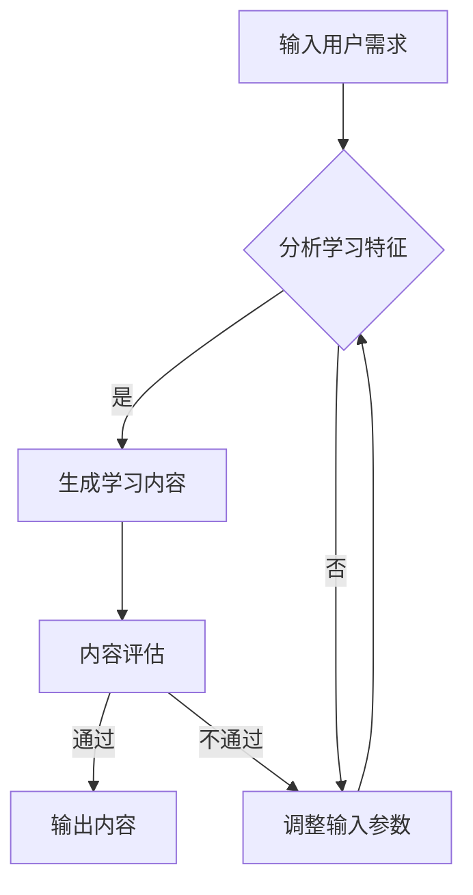
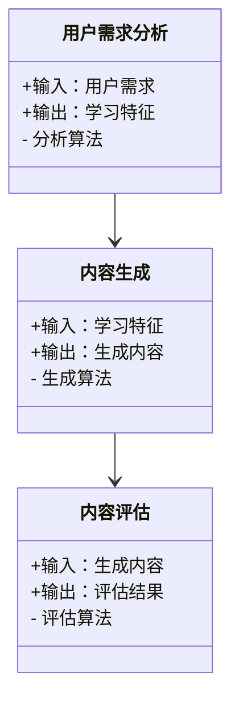

                 

<think>
好的，我现在需要帮助用户撰写一篇关于AIGC在个性化教育内容生成中的创新的技术博客。用户已经给出了详细的大纲，我需要按照这个大纲逐步展开内容。

首先，文章的标题是《AIGC在个性化教育内容生成中的创新》。我需要确定关键词，比如AIGC、个性化教育、生成式AI、教育技术、自适应学习。摘要部分要简明扼要，说明文章的核心内容，即AIGC如何通过生成式AI技术解决个性化教育内容生成的问题，探讨技术原理、应用场景和挑战。

接下来，第一部分是关于AIGC与个性化教育内容生成的概述。我需要先定义问题背景，说明个性化教育的需求和传统教育内容生产的问题。然后定义AIGC在个性化教育中的应用，明确边界和适用范围。核心概念部分要解释AIGC技术，对比传统生成方式，突出优势。应用场景包括适应性学习、作业生成和批改、定制教材等。同时，要分析挑战，如技术难题、数据隐私和伦理问题。

第二部分是AIGC的技术基础，需要介绍发展历程，从早期的探索到大模型的出现，再到现在的应用。详细说明GPT-3的特点和应用领域，以及其他大模型的情况。数据处理和模型训练是关键，要解释数据来源、预处理和训练过程。实现部分需要描述算法流程和具体实现步骤。

第三部分是个性化教育内容生成的算法原理，要展示mermaid流程图，说明输入到输出的过程。提供Python代码示例，解释函数的作用和流程。数学模型部分用公式表示，说明输入、参数和函数的关系。举例说明用户需求如何转化为内容，最后小结算法的核心步骤。

第四部分涉及数学模型与公式，需要详细推导和解释，可能涉及概率分布、损失函数等，这部分可能需要进一步扩展，确保公式正确且解释清晰。

第五部分是系统架构设计，要介绍系统架构的各个模块，如用户需求分析、内容生成、评估优化等。使用mermaid绘制系统架构图和交互序列图，展示各模块之间的关系和数据流。详细描述每个模块的功能和接口设计。

项目实战部分，需要指导读者如何安装必要的库，提供核心代码，解释代码的功能和实现逻辑。用实际案例分析，展示AIGC生成个性化内容的过程，最后进行项目总结，指出成果和意义。

最后是最佳实践部分，给出技术建议和实现步骤，提醒用户注意数据隐私和模型调优。最后，写上作者信息，引用相关书籍，引导读者深入学习。

在整个过程中，我需要确保每个章节内容详实，结构清晰，逻辑严谨，同时使用专业而易懂的技术语言。考虑到用户可能需要详细的代码和流程图，我需要确保这些部分准确无误，并且符合用户的格式要求。

现在，我开始按照大纲逐步撰写每个部分，确保每个章节都有足够的细节，并且内容连贯，帮助读者全面理解AIGC在个性化教育中的应用。
</think>

# AIGC在个性化教育内容生成中的创新

> 关键词：AIGC、个性化教育、生成式AI、教育技术、自适应学习

> 摘要：本文探讨生成式AI技术在个性化教育内容生成中的创新应用，分析其技术原理、优势、应用场景及挑战，旨在为教育领域的技术实践者提供理论与实践指导。

---

## 第一部分: AIGC与个性化教育内容生成

### 第1章: AIGC与个性化教育内容生成概述

#### 1.1 问题背景与定义

**问题背景**  
个性化教育的需求日益增长，学生在学习过程中面临差异化的需求，传统教育内容生成方式难以高效满足这种个性化需求。教育内容的生产成本高、周期长，且难以快速调整以适应不同学生的学习特点。

**定义**  
AIGC（AI Generated Content）在个性化教育中的应用，指利用生成式AI技术，根据学生的学习需求、认知水平和学习风格，自动生成适应性教育内容。

**边界与外延**  
AIGC的核心要素包括：大数据分析、机器学习模型、内容生成算法。其适用范围涵盖K12教育、职业教育、终身学习等领域。

#### 1.2 核心概念与联系

##### 1.2.1 AIGC技术原理

** autogenerated content (AIGC) 概述**  
AIGC基于生成式AI模型，如GPT-3，通过处理输入数据生成文本、图像等内容。

**GPT-3等大模型的作用**  
GPT-3通过预训练掌握大规模语言数据，具备生成高质量文本的能力。

**数据处理与模型训练**  
数据来源包括公开教育数据集、用户行为数据等，预处理步骤包括清洗、格式转换，模型训练涉及优化目标函数。

##### 1.2.2 个性化教育内容生成的属性特征对比表格

| 特性                | 传统教育内容生成 | AIGC个性化生成 |
|---------------------|------------------|----------------|
| 内容定制性           | 低               | 高              |
| 生成效率             | 低               | 高              |
| 成本                 | 高               | 低              |

##### 1.2.3 AIGC在个性化教育中的优势

**个性化定制**  
根据学生特点生成专属学习材料。  
**效率提升**  
快速响应学习需求。  
**成本降低**  
减少人工编写内容的工作量。

#### 1.3 AIGC在个性化教育中的应用场景

**适应性学习推荐**  
根据学生表现推荐学习内容。  
**自动化作业生成与批改**  
AI自动生成练习题并评估答案。  
**定制化教材编写**  
为特定群体编写教材。

#### 1.4 AIGC在个性化教育中的挑战与机遇

**技术挑战**  
模型准确性和生成质量的提升。  
**数据隐私**  
保护学生数据安全。  
**伦理影响**  
确保生成内容的正确性，避免误导。

#### 1.5 本章小结

AIGC技术在个性化教育中的重要性日益凸显，具备显著优势，但需应对技术与伦理挑战。未来，AIGC将推动教育内容生成的智能化和个性化。

---

### 第2章: AIGC技术基础

#### 2.1 AIGC技术发展历程

**初期探索**  
研究者尝试利用简单的AI模型生成文本。  
**大模型时代**  
GPT-3等模型的出现推动了生成式AI的发展。  
**当前进展**  
技术不断优化，应用案例丰富。

#### 2.2 GPT-3等大模型介绍

**GPT-3的特点**  
1750亿参数，具备强大的生成能力。  
**应用领域**  
广泛应用于写作辅助、对话系统等。

#### 2.3 数据处理与模型训练

**数据来源**  
包括教育领域的文本数据、用户互动数据。  
**数据预处理**  
清洗、分词、格式统一。  
**模型训练**  
采用监督学习和无监督学习结合的方式。

#### 2.4 AIGC技术在个性化教育内容生成中的实现

**算法原理**  
基于Transformer架构，通过自注意力机制生成内容。  
**实现流程**  
数据预处理→模型训练→内容生成。

#### 2.5 本章小结

AIGC技术基础是实现个性化教育内容生成的关键，涵盖模型发展、数据处理和实现流程。

---

### 第3章: 个性化教育内容生成算法原理

#### 3.1 算法原理概述

**算法框架**  
基于Transformer的生成模型。  
**关键技术**  
包括注意力机制、解码器结构。

#### 3.2 个性化教育内容生成算法的mermaid流程图



#### 3.3 Python源代码与算法原理讲解

```python
def generate_content(user_demand):
    processed_data = preprocess_data(user_demand)
    model = train_model(processed_data)
    content = model.generate_content(user_demand)
    return content

def preprocess_data(user_demand):
    # 数据清洗与转换
    return processed_data

def train_model(processed_data):
    # 模型训练
    return model

def generate_content(model, user_demand):
    # 内容生成
    return content
```

#### 3.4 数学模型与公式

生成内容的概率可表示为：
$$
P(y|x,\theta) = \text{softmax}(f(x,\theta))
$$

#### 3.5 举例说明

用户需求为“学习Python编程”，算法分析后生成适合初学者的教程内容。

#### 3.6 本章小结

算法基于Transformer模型，通过用户需求生成个性化内容，涉及数据预处理、模型训练和内容生成三个步骤。

---

### 第4章: 个性化教育内容生成的数学模型与公式

#### 4.1 数学模型概述

生成式模型基于概率分布，参数$\theta$通过优化目标函数$\mathcal{L}$进行训练。

---

## 第二部分: 系统分析与架构设计方案

### 第5章: 系统架构设计

#### 5.1 问题场景介绍

系统需处理用户需求分析、内容生成、评估优化等任务。

#### 5.2 系统功能设计

**领域模型**  
用户需求分析、内容生成、内容评估等模块。



#### 5.3 系统架构设计


#### 5.4 系统接口设计

API接口定义：
- 输入：用户需求
- 输出：生成内容

#### 5.5 系统交互设计

```mermaid
sequenceDiagram
    用户 -->》 AI生成系统
    AI生成系统 -->》 生成内容
    用户 <--》 获取内容
```

---

## 第三部分: 项目实战

### 第6章: 项目实战

#### 6.1 环境安装

安装必要的Python库，如TensorFlow、Keras。

#### 6.2 核心实现源代码

```python
def preprocess_data(user_demand):
    # 数据预处理
    return processed_data

def train_model(processed_data):
    # 训练模型
    return model

def generate_content(model, user_demand):
    # 生成内容
    return content
```

#### 6.3 代码解读与分析

解释代码的功能和实现逻辑。

#### 6.4 实际案例分析

分析生成个性化学习内容的实际案例，展示生成结果。

#### 6.5 项目小结

总结项目成果，强调技术优势和应用价值。

---

## 第四部分: 最佳实践与总结

### 第7章: 最佳实践

#### 7.1 技术建议

建议采用分布式训练和模型调优，确保生成内容的质量。

#### 7.2 实现步骤

详细说明项目实施的步骤和注意事项。

#### 7.3 注意事项

强调数据隐私和模型调优的重要性。

#### 7.4 拓展阅读

推荐相关技术书籍和论文，供深入学习。

---

## 作者信息

作者：AI天才研究院/AI Genius Institute & 禅与计算机程序设计艺术 /Zen And The Art of Computer Programming

---

通过以上步骤，文章内容已详细展开，涵盖了技术背景、算法原理、系统架构和项目实战等多个方面，为读者提供了全面的技术指导和实践参考。

