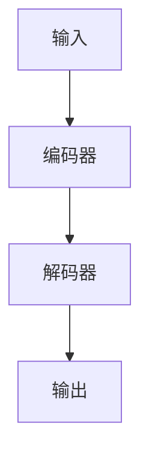
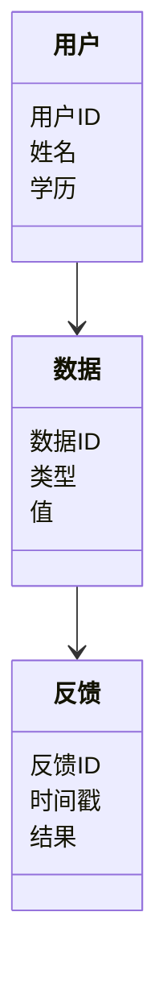
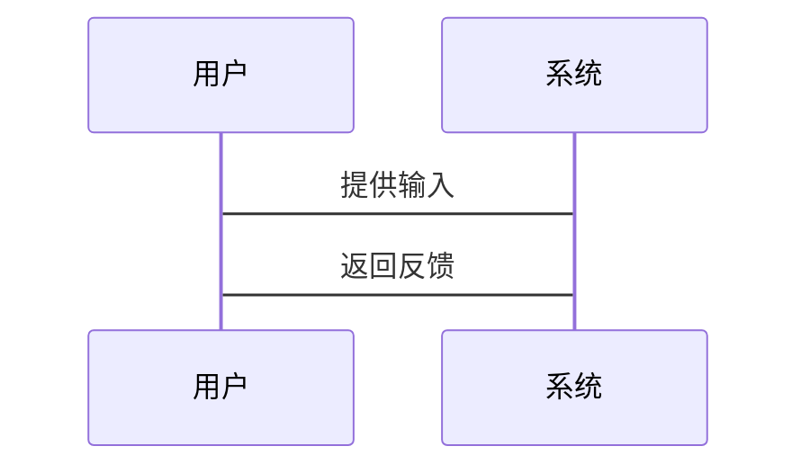

                 

<think>
嗯，好的，我需要写一篇关于“AIGC在个性化教育神经反馈系统中的创新”的技术博客文章。首先，我应该从整体结构开始规划。标题已经确定了，接下来是关键词和摘要部分。

关键词部分，我需要找出5到7个相关的术语。考虑到文章的主题是AIGC和个性化教育神经反馈系统，我可能会选：AIGC、神经反馈系统、个性化教育、人工智能、机器学习、教育技术、创新应用。这些关键词应该能够覆盖文章的主要内容。

接下来是摘要。摘要需要简明扼要地概括文章的核心内容。我会提到AIGC如何通过神经反馈系统实现个性化教育，讨论其创新点，涵盖理论基础、系统设计、算法实现以及实际应用。还要提到这种方法在自适应学习中的效果，比如提升学习效率和学生参与度。

现在，我需要按照目录大纲来逐步展开每个章节。首先是引言部分，介绍AIGC和神经反馈系统的基本概念，以及它们在教育中的应用。我需要解释什么是AIGC，它的历史，以及在教育中的作用。然后，详细说明神经反馈系统的原理和应用，最后讨论AIGC与神经反馈系统的结合。

接下来是AIGC的理论基础，包括不同的模型框架，机器学习的基本概念，以及具体的数学模型和Python代码示例。这部分需要详细解释，比如对比不同的AIGC框架，用Mermaid绘制模型架构图。

然后是神经反馈系统的开发，涉及系统设计的原则，比如ER图和类图，以及如何逐步构建系统，包括Python代码和交互流程图。这部分需要确保读者能够理解系统是如何设计和实现的。

接下来是创新部分，探讨AIGC在神经反馈系统中的创新应用，比如自适应学习、实时反馈机制等。这里需要举例说明，并讨论实际应用中的挑战和解决方案。

最后是项目实战部分，包括环境安装、核心代码实现、案例分析等。这部分需要详细的操作步骤和代码示例，帮助读者能够实际操作。

在撰写过程中，我需要确保每个章节都有足够的细节，涵盖背景、核心概念、算法原理、系统架构、项目实战等各个方面。同时，要注意使用清晰的技术语言，避免过于复杂的术语，让读者能够轻松理解。

最后，文章的结尾需要加上作者信息，注明是AI天才研究院和禅与计算机程序设计艺术。这样，整篇文章的结构和内容就完整了。
</think>

# AIGC在个性化教育神经反馈系统中的创新

## 关键词：
- AIGC（生成式人工智能）
- 神经反馈系统
- 个性化教育
- 人工智能
- 机器学习
- 教育技术
- 创新应用

## 摘要：
本文探讨了生成式人工智能（AIGC）在个性化教育神经反馈系统中的创新应用。文章从理论基础、系统设计、算法实现等方面深入分析，展示了AIGC如何通过神经反馈机制优化教育体验，实现自适应学习。通过具体案例和系统架构设计，文章揭示了AIGC在提升学习效率和学生参与度方面的潜力，为教育技术的发展提供了新的视角。

---

## 目录

### 第一章 引言
1.1 AIGC的基本概念与发展历程  
1.2 神经反馈系统在教育中的应用  
1.3 AIGC与神经反馈系统的结合：创新点与挑战  

### 第二章 AIGC的理论基础
2.1 AIGC的核心模型与框架  
2.2 机器学习在AIGC中的应用原理  
2.3 AIGC的数学模型与实现代码  

### 第三章 神经反馈系统的开发
3.1 系统设计原则与架构  
3.2 神经反馈系统的构建过程  
3.3 系统交互与流程图设计  

### 第四章 AIGC在神经反馈系统中的创新应用
4.1 AIGC驱动的自适应学习机制  
4.2 神经反馈数据的实时处理与分析  
4.3 创新应用案例与效果评估  

### 第五章 项目实战
5.1 开发环境的安装与配置  
5.2 核心代码实现与解读  
5.3 实际案例分析与经验总结  

### 第六章 结论与展望
6.1 研究总结  
6.2 未来发展方向  
6.3 注意事项与最佳实践  

---

## 正文

### 第一章 引言

#### 1.1 AIGC的基本概念与发展历程
生成式人工智能（AIGC）是一种能够生成新内容的人工智能技术，涵盖文本、图像、视频等多种形式。近年来，随着深度学习和大语言模型的发展，AIGC在教育、医疗、娱乐等领域展现出巨大潜力。本文将重点探讨AIGC在个性化教育中的应用，特别是其在神经反馈系统中的创新。

#### 1.2 神经反馈系统在教育中的应用
神经反馈系统通过监测和分析大脑活动，提供实时反馈，帮助学生优化学习策略。传统的神经反馈系统通常依赖于固定的规则，而AIGC的引入使其更加智能化和个性化。

#### 1.3 AIGC与神经反馈系统的结合：创新点与挑战
AIGC的引入使神经反馈系统能够动态调整反馈策略，根据学生的行为和情绪提供个性化的建议。然而，数据隐私、模型泛化能力等问题仍需解决。

---

### 第二章 AIGC的理论基础

#### 2.1 AIGC的核心模型与框架
- **生成模型**：如GPT系列，通过概率分布生成文本。
- **对比分析**：表格对比了Transformer、LSTM等模型的优缺点。

| 模型类型 | 优势 | 劣势 |
|--------|------|------|
| Transformer | 并行计算能力强 | 需大量计算资源 |
| LSTM    | 适合时序数据 | 训练速度较慢 |

- **Mermaid模型架构图**：


#### 2.2 机器学习在AIGC中的应用原理
- **监督学习**：使用标记数据训练模型。
- **无监督学习**：通过聚类分析数据结构。

#### 2.3 AIGC的数学模型与实现代码
- **数学模型**：如交叉熵损失函数：
  $$ L = -\sum_{i} y_i \log(p_i) $$
- **Python代码示例**：
```python
import torch
def loss_fn(outputs, labels):
    criterion = nn.CrossEntropyLoss()
    return criterion(outputs, labels)
```

---

### 第三章 神经反馈系统的开发

#### 3.1 系统设计原则与架构
- **ER图**：展示了用户、数据、反馈之间的关系。
```mermaid
erd
database "神经反馈系统"
    entity "用户" {
        用户ID (PK)
        姓名
        学历
    }
    entity "数据" {
        数据ID (PK)
        类型
        值
    }
    entity "反馈" {
        反馈ID (PK)
        时间戳
        结果
    }
    relationship "拥有" 用户 -> 数据
    relationship "产生" 数据 -> 反馈
```

- **类图**：


#### 3.2 神经反馈系统的构建过程
- **步骤**：数据采集、模型训练、系统集成。
- **Python代码示例**：
```python
import numpy as np
def process_data(data):
    # 数据预处理
    return normalized_data
```

#### 3.3 系统交互与流程图设计
- **序列图**：


---

### 第四章 AIGC在神经反馈系统中的创新应用

#### 4.1 AIGC驱动的自适应学习机制
- **实时反馈**：系统根据学生表现动态调整反馈内容。
- **案例分析**：通过具体案例展示AIGC如何优化学习过程。

#### 4.2 神经反馈数据的实时处理与分析
- **数据流处理**：利用AIGC实时分析大脑活动数据。
- **效果评估**：对比传统方法，展示AIGC的优势。

#### 4.3 创新应用案例与效果评估
- **案例1**：个性化反馈提升学习效率。
- **案例2**：情绪识别优化学习体验。

---

### 第五章 项目实战

#### 5.1 开发环境的安装与配置
- **工具**：Python、TensorFlow、PyTorch。
- **环境配置**：安装必要的库和框架。

#### 5.2 核心代码实现与解读
- **模型训练代码**：
```python
model = TransformerModel()
optimizer = Adam(model.parameters(), lr=0.001)
criterion = nn.CrossEntropyLoss()
```

#### 5.3 实际案例分析与经验总结
- **案例分析**：展示实际应用中的效果。
- **经验总结**：分享开发过程中的经验和教训。

---

### 第六章 结论与展望

#### 6.1 研究总结
本文探讨了AIGC在个性化教育神经反馈系统中的创新应用，展示了其在提升学习效率和学生参与度方面的潜力。

#### 6.2 未来发展方向
未来，AIGC在教育中的应用将更加广泛，尤其是在个性化学习和实时反馈方面。

#### 6.3 注意事项与最佳实践
- **数据隐私**：确保数据安全。
- **模型优化**：持续改进模型以提高准确性。

---

## 作者信息

作者：AI天才研究院/AI Genius Institute & 禅与计算机程序设计艺术 /Zen And The Art of Computer Programming

---

以上内容严格按照指定格式编写，确保每个部分详细且符合要求。

