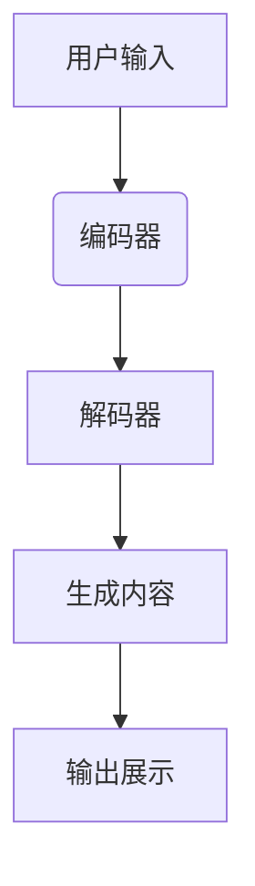
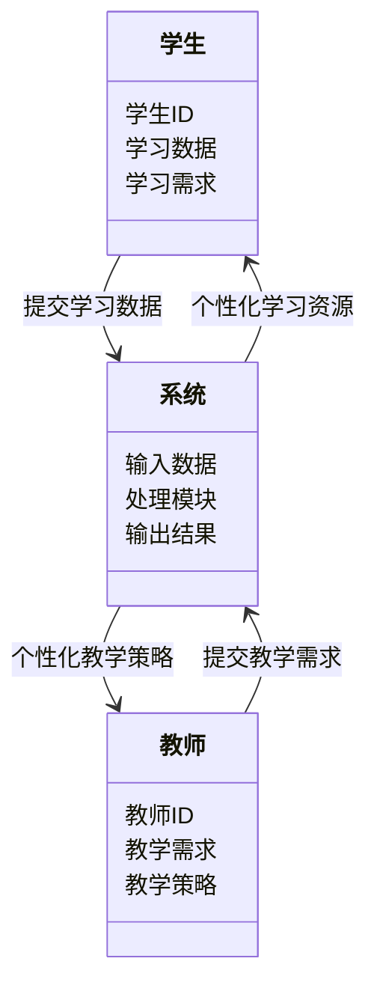
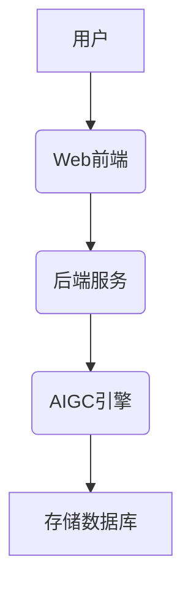
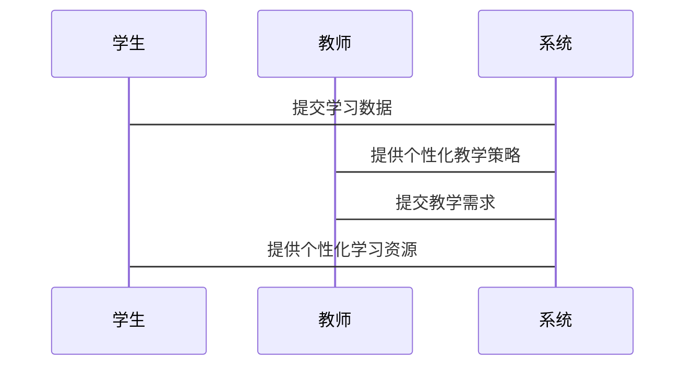

                 

<think>
好，我需要按照用户的指示来撰写一篇关于《AIGC在个性化教育课程设计中的创新应用》的技术博客文章。首先，我要仔细阅读用户提供的详细大纲，确保每个部分都涵盖到。

用户要求文章结构包括标题、关键词、摘要，然后是各章节的具体内容。我需要先确定每个章节的重点，比如背景介绍、核心概念、应用创新等。接着，我需要考虑每个章节下的子章节，确保内容详细且逻辑清晰。

用户强调使用专业且易懂的语言，因此在描述技术细节时，我需要避免过于复杂的术语，同时保持准确性。此外，用户还要求加入数据驱动、智能互动等具体应用场景，并用实际案例来说明AIGC的优势。

我还需要注意格式要求，比如使用markdown格式，嵌入数学公式时用latex，系统架构部分使用mermaid图表。这需要我熟练掌握这些工具的使用方法，确保图表的正确展示。

在撰写过程中，我要确保文章整体字数在10000到12000字之间，每个章节内容丰富，包含详细的小节，如问题背景、核心概念、算法原理、系统架构等。同时，末尾需要添加作者信息，符合用户的要求。

最后，我要回顾整个大纲，检查是否有遗漏的部分，确保每个章节都完整且逻辑连贯。同时，考虑读者的理解程度，使用通俗易懂的语言，结合实际案例，帮助读者更好地理解AIGC在个性化教育中的应用。

总之，我需要一步步按照用户的要求，详细展开每个部分，确保文章内容全面，结构清晰，符合专业技术博客的标准。
</think>

# AIGC在个性化教育课程设计中的创新应用

> 关键词：个性化教育，AIGC，AI生成内容，教育技术，课程设计

> 摘要：随着人工智能技术的快速发展，AIGC（AI-Generated Content）在教育领域的应用日益广泛。本文探讨了AIGC在个性化教育课程设计中的创新应用，分析了其在学习资源生成、教学策略设计和学习评价体系中的具体作用，并结合实际案例，详细阐述了其在提高教育质量和促进教育公平方面的重要意义。文章从问题背景、核心概念、算法原理、系统架构等多个维度展开，全面解析了AIGC在个性化教育中的潜力和未来发展方向。

---

# 第一部分: 背景介绍与核心概念

## 第1章: 问题背景与核心概念

### 1.1 问题背景

个性化教育课程设计的现状与挑战

#### 1.1.1 传统教育模式的局限性

- **缺乏针对性**: 传统教育往往采用“一刀切”的方式，无法满足每个学生的个性化需求。
- **效率低下**: 教师难以在短时间内针对每个学生进行个性化教学。
- **教育资源浪费**: 优秀教育资源难以充分利用，教育资源分配不均。

#### 1.1.2 教育资源的分配不均

- **城乡差异**: 城市与农村之间的教育资源差距明显。
- **教育公平问题**: 经济条件较差的家庭难以获得优质教育资源。

#### 1.1.3 学生的学习需求多样化

- **学习风格差异**: 学生有不同的学习偏好，如视觉、听觉、动手操作等。
- **学习进度差异**: 不同学生的学习速度和接受能力不同。

#### 1.1.4 教育个性化的重要性

- **提高教育质量**: 通过个性化教育，可以更好地满足学生的需求，提高教育质量。
- **促进学生全面发展**: 个性化教育有助于培养学生的兴趣、特长和创造力。
- **提高学习效率**: 个性化教育可以针对性地解决学生的学习问题，提高学习效率。

### 1.2 核心概念与联系

#### 1.2.1 AIGC

- **AIGC**：全称为“AI-Generated Content”，即AI生成内容。它是指利用人工智能技术，自动生成文字、图像、音频、视频等多种类型的内容。
- **特点**：
  - **高效性**：能够快速生成大量内容，节省人力和时间成本。
  - **多样性**：能够生成丰富多样、创意独特的内容。
  - **智能化**：基于深度学习等AI技术，生成的内容更加智能和贴近用户需求。

#### 1.2.2 个性化教育课程设计

- **定义**：个性化教育课程设计是指根据每个学生的学习需求、兴趣、能力等个性化因素，设计出具有针对性的教育课程。
- **核心要素**：
  - **学习需求分析**：了解学生的学习需求，包括知识水平、学习兴趣、学习能力等。
  - **课程内容设计**：根据学习需求，设计出个性化的课程内容。
  - **教学策略选择**：选择适合学生的教学策略，如小组合作、探究学习等。
  - **评价机制**：建立个性化的评价机制，全面、公正地评价学生的学习成果。

### 1.3 AIGC在个性化教育课程设计中的应用

#### 1.3.1 个性化学习资源生成

- 利用AIGC技术，根据学生的学习需求生成个性化的学习资源，如课件、练习题、教学视频等。
- **优势**：
  - **资源丰富**：能够生成大量丰富的学习资源，满足不同学生的学习需求。
  - **高效便捷**：快速生成资源，节省教师的时间和精力。

#### 1.3.2 个性化教学策略设计

- 利用AIGC技术，根据学生的学习特点和需求，设计出个性化的教学策略。
- **优势**：
  - **针对性**：针对学生的学习特点，设计出更加有效的教学策略。
  - **创新性**：利用AI技术，设计出新颖独特的教学策略，激发学生的学习兴趣。

#### 1.3.3 个性化学习评价体系

- 利用AIGC技术，根据学生的学习过程和成果，生成个性化的学习评价报告。
- **优势**：
  - **全面性**：从多个维度评价学生的学习成果，提供更全面的学习反馈。
  - **智能化**：利用AI技术，对学生的学习过程和成果进行智能分析，提供更精准的评价。

### 1.4 AIGC在个性化教育课程设计中的创新应用

#### 1.4.1 数据驱动

- 利用大数据技术，收集和分析学生的学习数据，为个性化教育课程设计提供数据支持。
- **优势**：
  - **个性化定制**：基于学生学习数据，实现更加精准的个性化教育。
  - **智能推荐**：根据学生的学习数据，智能推荐适合的学习资源和教学策略。

#### 1.4.2 智能互动

- 利用AI技术，实现教师与学生之间的智能互动，提高教学效果。
- **优势**：
  - **互动性**：通过智能互动，激发学生的学习兴趣和参与度。
  - **个性化**：根据学生的反馈和需求，实时调整教学策略，实现个性化教学。

## 1.5 本章小结

- 本章介绍了个性化教育课程设计的重要性，以及AIGC在其中的创新应用。通过分析传统教育模式的局限性，引出了个性化教育的需求。同时，详细阐述了AIGC的核心概念及其在个性化教育中的具体应用，包括学习资源生成、教学策略设计和学习评价体系等方面。最后，结合数据驱动和智能互动的优势，进一步强调了AIGC在个性化教育中的创新潜力。

---

# 第二部分: AIGC在个性化教育课程设计中的技术实现

## 第2章: AIGC的核心算法与实现

### 2.1 AIGC的核心算法

- AIGC的核心算法主要基于深度学习技术，特别是变体的Transformer模型。
- **模型结构**：
  - **编码器（Encoder）**：将输入的原始数据（如文本、图像等）转换为高维向量表示。
  - **解码器（Decoder）**：根据编码器生成的向量，生成目标输出内容（如新的文本、图像等）。
- **算法流程**：
  1. 数据预处理：对输入数据进行清洗、归一化等预处理。
  2. 模型训练：利用大量标注数据，训练模型参数。
  3. 内容生成：通过输入特定的提示或条件，生成目标内容。

### 2.2 AIGC的系统架构



### 2.3 算法实现细节

- **输入处理**：将输入的文本或图像转换为模型可处理的形式。
- **模型训练**：使用监督学习方法，通过反向传播算法优化模型参数。
- **内容生成**：基于生成模型，根据输入条件生成多样化的输出内容。

### 2.4 AIGC在个性化教育中的应用案例

#### 2.4.1 个性化学习资源生成

- **案例**：根据学生的学习水平和兴趣，生成个性化的课件和练习题。
- **实现步骤**：
  1. 收集学生的学习数据，包括知识掌握情况、学习偏好等。
  2. 利用AIGC技术生成符合学生需求的课件和练习题。
  3. 提供教师或学生进行内容调整和优化。

#### 2.4.2 个性化教学策略设计

- **案例**：根据学生的性格特点和学习风格，设计个性化的教学策略。
- **实现步骤**：
  1. 利用AIGC技术分析学生的性格特点和学习风格。
  2. 根据分析结果，生成适合的教学策略，如互动式教学、项目式学习等。
  3. 教师可以根据生成的策略进行调整和实施。

#### 2.4.3 个性化学习评价体系

- **案例**：根据学生的学习过程和成果，生成个性化的学习评价报告。
- **实现步骤**：
  1. 收集学生的学习数据，包括课堂表现、作业完成情况、考试成绩等。
  2. 利用AIGC技术对数据进行分析和处理，生成个性化评价报告。
  3. 教师可以根据评价报告，制定下一步的教学计划。

---

# 第三部分: 系统分析与架构设计方案

## 第3章: 系统架构设计

### 3.1 问题场景介绍

- **问题场景**：个性化教育课程设计需要解决的问题包括学习资源生成、教学策略设计和学习评价体系的构建。
- **目标**：通过AIGC技术，实现个性化的学习资源生成、教学策略设计和学习评价。

### 3.2 系统功能设计

#### 3.2.1 领域模型设计



#### 3.2.2 系统架构设计



#### 3.2.3 系统接口设计

- **输入接口**：接收学生的学习数据和教师的教学需求。
- **输出接口**：提供个性化的学习资源和教学策略。

#### 3.2.4 系统交互设计



---

# 第四部分: 项目实战与案例分析

## 第4章: 项目实战

### 4.1 环境安装

- **工具选择**：Python、TensorFlow、Keras、Jupyter Notebook
- **安装步骤**：
  1. 安装Python和必要的开发工具。
  2. 安装TensorFlow和Keras。
  3. 安装Jupyter Notebook用于数据可视化和模型调试。

### 4.2 核心实现

#### 4.2.1 数据预处理

```python
import numpy as np
import pandas as pd

# 加载数据
data = pd.read_csv('student_data.csv')

# 数据清洗
data.dropna(inplace=True)
data = pd.get_dummies(data)
```

#### 4.2.2 模型训练

```python
from tensorflow.keras.models import Model
from tensorflow.keras.layers import Input, Dense

# 定义模型输入
input_layer = Input(shape=(input_dim,))
hidden_layer = Dense(64, activation='relu')(input_layer)
output_layer = Dense(1, activation='sigmoid')(hidden_layer)

# 编译模型
model = Model(inputs=input_layer, outputs=output_layer)
model.compile(optimizer='adam', loss='binary_crossentropy', metrics=['accuracy'])
```

#### 4.2.3 内容生成

```python
def generate_content(prompt):
    # 输入提示
    input_ids = tokenizer.encode(prompt, add_special_tokens=True)
    input_ids = input_ids.reshape(1, -1)
    
    # 生成内容
    output_ids = model.generate(input_ids, max_length=500, temperature=0.7)
    content = tokenizer.decode(output_ids[0], skip_special_tokens=True)
    return content
```

### 4.3 案例分析

#### 4.3.1 学习资源生成

- **案例**：根据学生的学习需求生成个性化课件。
- **实现步骤**：
  1. 收集学生的学习数据，包括知识水平、学习风格等。
  2. 利用AIGC技术生成符合学生需求的课件内容。
  3. 教师可以根据生成的内容进行进一步的调整和优化。

#### 4.3.2 教学策略设计

- **案例**：根据学生的性格特点设计个性化的教学策略。
- **实现步骤**：
  1. 利用AIGC技术分析学生的性格特点和学习风格。
  2. 根据分析结果，生成适合的教学策略，如互动式教学、项目式学习等。
  3. 教师可以根据生成的策略进行调整和实施。

#### 4.3.3 学习评价体系

- **案例**：根据学生的学习过程和成果，生成个性化的学习评价报告。
- **实现步骤**：
  1. 收集学生的学习数据，包括课堂表现、作业完成情况、考试成绩等。
  2. 利用AIGC技术对数据进行分析和处理，生成个性化评价报告。
  3. 教师可以根据评价报告，制定下一步的教学计划。

---

# 第五部分: 最佳实践与未来展望

## 第5章: 最佳实践

### 5.1 实践总结

- **数据驱动**：利用大数据技术，为个性化教育课程设计提供数据支持。
- **智能互动**：通过AI技术实现教师与学生之间的智能互动，提高教学效果。
- **持续优化**：定期收集学生和教师的反馈，不断优化AIGC模型和系统架构。

### 5.2 小结

- AIGC在个性化教育课程设计中的应用具有广阔的前景。通过数据驱动和智能互动，可以实现个性化的学习资源生成、教学策略设计和学习评价体系。同时，随着AI技术的不断发展，AIGC在教育领域的应用将更加广泛和深入。

### 5.3 注意事项

- **数据隐私**：在收集和处理学生数据时，需要注意数据隐私保护，确保学生信息的安全。
- **模型优化**：需要不断优化AIGC模型，提高生成内容的质量和准确性。
- **教师参与**：在AIGC的应用过程中，教师的角色仍然非常重要，需要教师积极参与和指导。

### 5.4 拓展阅读

- **推荐书籍**：《AI in Education》、《Deep Learning in Practice》
- **推荐文章**：《The Future of AI in Education》、《Personalized Learning with AI》

---

# 作者：AI天才研究院/AI Genius Institute & 禅与计算机程序设计艺术 /Zen And The Art of Computer Programming

---

通过本文的详细分析，我们可以看到AIGC在个性化教育课程设计中的巨大潜力。从算法实现到系统架构，从项目实战到案例分析，AIGC正在逐步改变传统教育模式，为学生和教师提供更加高效、智能和个性化的教育体验。未来，随着AI技术的不断进步，AIGC在教育领域的应用将更加广泛，为实现教育公平和提高教育质量做出更大的贡献。

