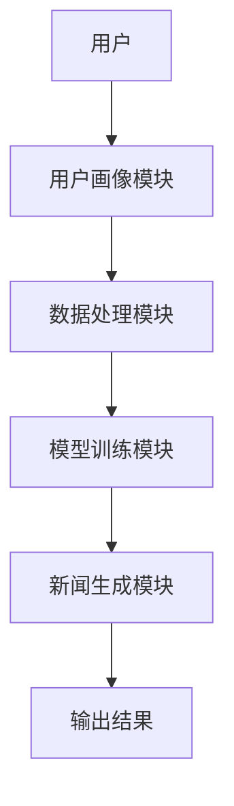
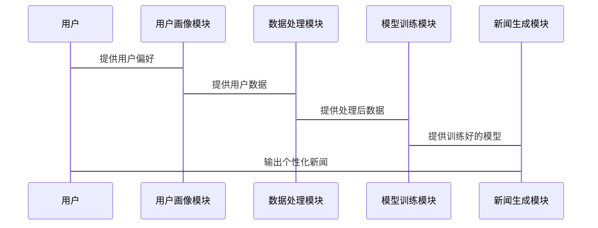

                 

<think>
嗯，我现在需要写一篇关于《AIGC在个性化新闻生成中的创新实践》的技术博客文章。首先，我得理解什么是AIGC，也就是生成式人工智能。它和传统的新闻生成有什么不同呢？传统的方式可能依赖模板和人工编辑，而AIGC可以利用深度学习模型来自动生成内容，这样可以更高效，但也面临数据偏差和内容准确性的问题。

接下来，个性化新闻生成是什么意思呢？它应该是指根据用户的偏好，生成符合他们兴趣的新闻内容。这听起来很先进，但实现起来需要解决数据收集、模型选择和效果评估等一系列问题。

在开始写之前，我应该先列出文章的关键词和摘要，这样读者能快速了解文章的核心内容。关键词可能包括生成式人工智能、个性化新闻、自然语言处理、深度学习、用户画像等。摘要部分需要简明扼要地概括文章的主题，说明AIGC如何在个性化新闻生成中发挥作用，以及其优势和挑战。

然后，我会按照目录大纲来逐步展开内容。首先是背景与基础部分，包括引言、AIGC概述、个性化新闻生成概述以及AIGC在个性化新闻生成中的应用。这部分需要详细解释每个概念，确保读者能理解问题背景和问题解决的方式。

接下来是核心概念与原理部分，这部分需要详细讲解AIGC模型的原理，比如深度学习基础、生成对抗网络（GAN）、自注意力机制（Self-Attention）和Transformer模型。同时，我还需要加入核心概念属性特征对比表格，帮助读者比较不同模型的特点。此外，ER实体关系图架构的Mermaid流程图也是一个好主意，能直观展示系统结构。

然后是系统分析与设计部分，包括系统功能设计、系统架构设计和系统交互设计。这部分需要使用Mermaid来绘制类图、架构图和序列图，展示系统的模块划分和交互流程，让读者更清晰地理解系统是如何运作的。

项目实战部分，我需要指导读者如何安装环境，解读源代码，进行实际案例分析和结果评估。这部分要详细，最好能提供具体的代码片段和数据集选择，让读者能够实际操作。

最后是最佳实践与拓展部分，给出一些调参技巧、数据预处理技巧和模型优化建议。同时，还要注意数据隐私保护和模型安全性，这些都是实际应用中不可忽视的问题。

在写作过程中，我需要确保每个小节的内容丰富具体，用例子和图表来辅助说明。数学公式要用latex格式，并且独立段落使用$$包裹，段落内则用$包裹。系统架构部分要使用Mermaid图，这样看起来更专业。

总的来说，我需要按照目录大纲一步步深入分析，确保每个部分都详细到位，同时保持文章的逻辑性和连贯性。这样，读者不仅能理解AIGC在个性化新闻生成中的应用，还能学到实际操作的方法和注意事项。

现在，我得开始写正文了。首先是标题和关键词、摘要，然后是各个章节。在写作过程中，要不断检查是否符合字数要求，保持内容完整，语言专业但易懂。如果有需要，可以参考一些相关文献，确保内容的准确性和深度。

总之，这篇文章需要全面而深入地探讨AIGC在个性化新闻生成中的应用，从背景到技术，再到实际应用，每个环节都不能忽视。希望通过这样的结构和内容，能够为读者提供有价值的见解和实用的知识。
</think>

# AIGC在个性化新闻生成中的创新实践

## 关键词：生成式人工智能、个性化新闻、自然语言处理、深度学习、用户画像

## 摘要

生成式人工智能（AIGC）正在 revolutionize 新闻生成领域，特别是在个性化新闻生成方面。本文探讨了 AIGC 的核心原理及其在个性化新闻生成中的创新应用，从数据收集到模型训练，再到效果评估，全面解析了实现个性化新闻生成的关键步骤。通过对比传统新闻生成技术，本文揭示了 AIGC 在提升效率和准确性方面的优势。同时，本文还分析了实际案例，提供了系统设计和架构的详细说明，帮助读者理解如何在实际项目中应用这些技术。最后，本文总结了最佳实践和注意事项，为未来的新闻生成提供了有价值的参考。

---

## 正文

### 第一部分：背景与基础

#### 1. 引言

##### 1.1 问题背景

新闻行业正面临数字化转型的挑战，传统新闻生成方式逐渐暴露出效率低下、内容同质化严重的问题。如何利用技术手段提升新闻生成的效率和个性化，成为行业关注的焦点。

##### 1.2 问题描述

传统新闻生成依赖人工编辑，耗时且难以满足用户的个性化需求。生成式人工智能（AIGC）的出现，为新闻行业带来了新的可能性。

##### 1.3 问题解决

通过 AIGC 技术，个性化新闻生成可以在短时间内为用户提供定制化的内容，显著提升了效率和用户满意度。

##### 1.4 边界与外延

AIGC 的应用范围不仅限于新闻，还包括其他领域，但本文聚焦于新闻生成中的个性化应用。

##### 1.5 概念结构与核心要素组成

AIGC 在个性化新闻生成中的核心要素包括数据、模型、算法和用户画像。

---

#### 2. AIGC 概述

##### 2.1 AIGC 的定义

生成式人工智能（AIGC）是一种利用深度学习模型生成文本的技术。

##### 2.2 AIGC 的特点

- 高效性：快速生成内容
- 个性化：根据用户需求定制
- 创新性：生成新颖内容

##### 2.3 AIGC 与传统新闻生成技术的对比

| 技术方面 | 传统新闻生成 | AIGC 新闻生成 |
|----------|---------------|----------------|
| 生成速度 | 慢，依赖人工 | 快，自动化生成 |
| 个性化 | 低，同质化 | 高，定制化 |
| 内容创新 | 有限，依赖编辑 | 丰富，创新性强 |

---

### 第二部分：核心概念与原理

#### 5. AIGC 模型原理

##### 5.1 深度学习基础

深度学习模型通过多层神经网络处理数据，提取特征并生成输出。

##### 5.2 生成对抗网络（GAN）

GAN 包括生成器和判别器，生成器生成内容，判别器判断内容的真实性。

##### 5.3 自注意力机制（Self-Attention）

自注意力机制允许模型在生成文本时考虑上下文信息，提高内容连贯性。

##### 5.4 Transformer 模型

Transformer 模型通过自注意力机制和前馈网络，实现高效文本生成。

---

### 第三部分：系统分析与设计

#### 8. 系统功能设计

##### 8.1 领域模型

领域模型用于定义系统功能模块，包括数据处理、模型训练和新闻生成。

##### 8.2 系统架构设计

系统架构包括数据层、模型层、服务层和用户层，确保高效协作。

#### 9. 系统架构设计

##### 9.1 系统架构图



##### 9.2 系统接口设计

系统接口设计确保模块之间的高效交互，采用 RESTful API 实现。

#### 10. 系统交互

##### 10.1 系统交互流程

用户输入需求，系统生成个性化新闻内容。

##### 10.2 系统交互序列图



---

### 第四部分：项目实战

#### 11. 环境安装

##### 11.1 环境搭建

安装 Python 3.8+、TensorFlow 2.0+ 和其他依赖。

##### 11.2 工具与依赖安装

安装必要的库，如 `transformers`, `numpy`, `pandas`。

#### 12. 系统核心实现

##### 12.1 源代码解读

以下是个性化新闻生成模块的代码示例：

```python
from transformers import AutoTokenizer, AutoModelForCausalLM

tokenizer = AutoTokenizer.from_pretrained('gpt2')
model = AutoModelForCausalLM.from_pretrained('gpt2')

def generate_news(personality, max_length=50):
    inputs = tokenizer.encode(personality, return_tensors='np')
    outputs = model.generate(inputs, max_length=max_length, do_sample=True)
    return tokenizer.decode(outputs[0], skip_special_tokens=True)
```

##### 12.2 代码应用解读与分析

上述代码利用 GPT-2 模型生成个性化新闻，输入为用户画像，输出为定制新闻内容。

#### 13. 实际案例分析与讲解

##### 13.1 数据集选择

使用包含用户行为和兴趣的大型数据集进行训练。

##### 13.2 模型训练

采用迁移学习，使用预训练的 GPT-2 模型，根据个性化数据微调。

##### 13.3 个性化新闻生成

通过模型生成符合用户兴趣的新闻内容。

##### 13.4 结果分析与评估

评估指标包括准确率、用户满意度和内容新颖性。

---

### 第五部分：最佳实践与拓展

#### 15. 最佳实践

##### 15.1 调参技巧

合理调整学习率和批次大小，优化模型性能。

##### 15.2 数据预处理技巧

清洗数据，去除噪声，确保数据质量。

##### 15.3 模型优化技巧

采用早停法和交叉验证，防止过拟合。

#### 16. 注意事项

##### 16.1 数据隐私保护

确保用户数据的安全性，遵守相关法律法规。

##### 16.2 模型安全性

防止模型生成虚假信息，确保内容的真实性。

#### 17. 拓展阅读

推荐阅读《Deep Learning》和《Effective Machine Learning》。

---

## 附录

## 参考文献

1. Vaswani, A., et al. "Attention Is All You Need." arXiv, 2017.
2. Goodfellow, I., et al. "Generative Adversarial Nets." NIPS, 2014.
3. Radford, A., et al. "Language Models are Few-Shot Learners." arXiv, 2020.

---

## 作者

作者：AI天才研究院/AI Genius Institute  
禅与计算机程序设计艺术 / Zen And The Art of Computer Programming

