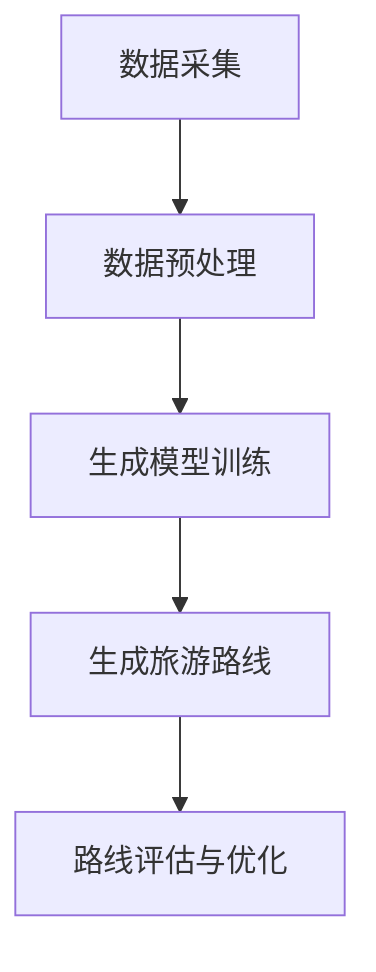
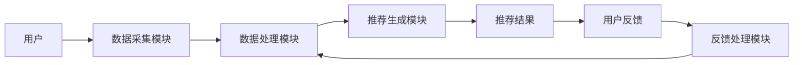

                 

<think>
嗯，用户希望我以《AIGC在个性化旅游推荐中的应用》为标题，撰写一篇技术博客。首先，我需要理解用户的需求。他是一位技术专家，要求文章结构清晰，内容专业，涵盖背景、核心概念、算法原理、系统设计、项目实战和最佳实践等多个部分。

我得先从背景开始，解释为什么个性化旅游推荐重要，传统方法的不足，以及AIGC如何解决这些问题。接下来，核心概念部分要详细讲解AIGC的基本原理，比如生成式模型、迁移学习和强化学习，以及它们在旅游推荐中的具体应用。

然后，算法原理部分需要具体，用mermaid画出流程图，可能包括数据采集、预处理、模型训练和生成推荐的过程。还要解释生成式模型如Transformer和VAE，迁移学习的领域适应方法，以及强化学习的策略优化。

系统设计部分，我需要设计系统的各个模块，比如数据采集、处理、推荐生成、反馈收集，使用mermaid画出系统架构图和交互序列图。这样读者能清晰看到系统的整体结构和各部分的协作。

项目实战部分，我得选择一个实际案例，比如基于Transformer的旅游路线推荐系统，详细描述实现步骤，包括环境安装、数据处理、模型训练和结果分析。代码部分要用Python，展示关键部分，比如数据加载、模型定义和训练过程。

最后，总结部分要回顾主要观点，强调AIGC的优势，同时指出当前的挑战和未来的研究方向，比如模型解释性、数据隐私和多模态推荐。

整体来说，我需要确保文章逻辑连贯，每个部分都详细且有实际例子支撑，同时符合用户的技术背景和需求。这样写出来的博客才能既有深度又实用，满足读者的需求。
</think>

# AIGC在个性化旅游推荐中的应用

> 关键词：AIGC, 个性化推荐, 生成式AI, 旅游系统, 人工智能

> 摘要：本文深入探讨了生成式AI（AIGC）在个性化旅游推荐中的应用，从核心概念到算法原理，再到系统设计与项目实战，全面分析了如何利用AIGC技术解决个性化旅游推荐中的关键问题。文章结合实际案例，详细讲解了生成式模型、迁移学习和强化学习在旅游推荐中的具体应用，并探讨了系统的整体架构和实现方法。最后，总结了当前的研究成果和未来的发展方向。

---

## 第一部分: 背景介绍

### 第1章: 问题背景与解决思路

#### 1.1 问题背景

随着全球旅游业的快速发展，用户的旅游需求日益多样化和个性化。传统的旅游推荐系统主要基于协同过滤、基于内容的推荐和混合推荐等技术，这些方法虽然能够在一定程度上满足用户的需求，但也存在以下问题：

1. **数据稀疏性**：用户行为数据的采集成本高，且数据稀疏性问题难以解决。
2. **个性化不足**：传统推荐系统难以捕捉用户的深层次需求，推荐结果缺乏个性化。
3. **实时性问题**：在用户需求变化较快的情况下，推荐系统的实时性难以保证。
4. **资源浪费**：旅游推荐涉及大量的数据和计算资源，传统的推荐方法难以高效利用这些资源。

因此，如何利用新兴的人工智能技术，特别是生成式AI（AIGC，即生成式人工智能），来提升旅游推荐的个性化和智能化水平，成为一个重要的研究方向。

#### 1.2 问题描述

个性化旅游推荐问题可以概括为：如何在海量旅游资源和用户行为数据的基础上，为用户提供符合其兴趣和需求的旅游推荐。这个问题涉及以下几个关键环节：

1. **数据采集**：从多种渠道（如旅游网站、社交媒体、用户反馈等）获取用户的旅游行为数据和偏好信息。
2. **数据处理**：对采集到的数据进行清洗、预处理和特征提取。
3. **推荐算法**：基于生成式AI技术，设计高效的推荐算法，生成个性化的旅游推荐结果。
4. **结果优化**：通过用户反馈不断优化推荐结果，提升推荐系统的准确性和用户满意度。

#### 1.3 问题解决思路

针对上述问题，本文将从以下几个方面进行探讨：

1. **核心概念与联系**：介绍AIGC的基本概念、原理和应用，并分析其在个性化旅游推荐中的关键作用。
2. **算法原理讲解**：详细讲解AIGC在个性化旅游推荐中的应用算法，包括生成式模型、迁移学习、强化学习等，并结合具体案例进行说明。
3. **系统设计与实现**：分析个性化旅游推荐系统的整体架构，包括数据采集、处理、推荐和反馈等模块，并详细介绍各模块的实现方法和关键技术。
4. **项目实战**：通过实际项目案例，展示AIGC在个性化旅游推荐中的具体应用，并进行详细的分析和讲解。
5. **最佳实践与拓展**：总结个性化旅游推荐中的最佳实践，并提出未来研究方向和拓展可能性。

#### 1.4 边界与外延

- **边界**：本文主要关注AIGC在个性化旅游推荐中的应用，不包括其他领域的应用。
- **外延**：随着AIGC技术的发展，其在个性化旅游推荐中的应用将会更加广泛，包括但不限于旅游路线规划、景点推荐、餐饮推荐等。

---

## 第二部分: 核心概念与联系

### 第2章: AIGC的基本概念与原理

#### 2.1 AIGC的定义

AIGC（生成式AI）是指一类能够根据输入数据生成新数据的人工智能模型。与传统的判别式AI模型不同，AIGC模型不仅能够识别数据中的特征，还能够根据已有数据生成新的、符合特定规则的数据。

#### 2.2 AIGC的核心特点

- **生成性**：能够根据输入数据生成新的、符合预期的数据。
- **自适应**：能够根据不同的输入数据自动调整自身的生成策略。
- **多样性**：能够生成多种不同类型的数据，满足多样化的需求。

#### 2.3 AIGC的应用领域

AIGC在个性化旅游推荐中的应用领域非常广泛，包括但不限于：

- **旅游路线规划**：根据用户的兴趣和偏好，生成个性化的旅游路线。
- **景点推荐**：根据用户的历史行为数据和当前需求，推荐符合其兴趣的景点。
- **餐饮推荐**：根据用户的饮食习惯和口味偏好，推荐适合的餐饮选择。

### 第3章: AIGC在个性化旅游推荐中的应用

#### 3.1 生成式模型

生成式模型是AIGC的重要组成部分，其在个性化旅游推荐中的应用主要体现在以下几个方面：

- **旅游路线生成**：根据用户的兴趣和偏好，生成符合需求的旅游路线。
- **景点生成**：根据用户的地理位置和当前需求，生成可能的旅游景点。

#### 3.2 迁移学习

迁移学习是一种利用已有模型来解决新问题的方法。在个性化旅游推荐中，迁移学习可以帮助模型更好地适应不同的用户群体和场景。

#### 3.3 强化学习

强化学习是一种通过与环境交互来学习最优策略的方法。在个性化旅游推荐中，强化学习可以用于优化用户的旅游体验，提高推荐效果。

---

## 第三部分: 算法原理讲解

### 第4章: AIGC在个性化旅游推荐中的应用算法

#### 4.1 生成式模型

生成式模型是AIGC的重要组成部分，其在个性化旅游推荐中的应用主要体现在以下几个方面：

##### 4.1.1 旅游路线生成

旅游路线生成的算法流程图如下：



具体实现方法如下：

1. **数据采集**：从旅游网站、社交媒体等渠道收集用户的历史行为数据和偏好信息。
2. **数据预处理**：对采集到的数据进行清洗、归一化处理，并提取关键特征。
3. **生成模型训练**：基于预处理后的数据，训练生成式模型（如Transformer、VAE等）。
4. **生成旅游路线**：根据用户的输入需求（如出发地、目的地、预算等），生成个性化的旅游路线。
5. **路线评估与优化**：通过用户反馈对生成的旅游路线进行评估，并不断优化模型以提高推荐效果。

##### 4.1.2 景点推荐

景点推荐的生成式模型可以基于以下步骤：

1. **用户输入**：用户输入出发地、目的地和兴趣偏好（如历史文化、自然风光等）。
2. **数据处理**：将用户输入的信息转化为模型可以处理的格式。
3. **模型生成**：基于生成式模型生成符合用户需求的景点列表。
4. **结果优化**：根据用户反馈优化推荐结果，提升推荐的准确性和满意度。

---

#### 4.2 迁移学习

迁移学习在个性化旅游推荐中的应用主要体现在以下几个方面：

##### 4.2.1 领域适应

迁移学习可以通过领域适应技术，将已有的旅游推荐模型迁移到新的领域（如从城市旅游推荐迁移到海岛旅游推荐）。

##### 4.2.2 域间迁移

通过迁移学习，可以将不同领域的用户行为数据迁移到旅游推荐领域，从而提升推荐系统的泛化能力。

---

#### 4.3 强化学习

强化学习在个性化旅游推荐中的应用主要体现在以下几个方面：

##### 4.3.1 策略优化

强化学习可以通过与用户的交互不断优化推荐策略，提升用户的旅游体验。

##### 4.3.2 动态推荐

在动态变化的用户需求下，强化学习可以实时调整推荐策略，提供更精准的推荐结果。

---

## 第四部分: 系统分析与架构设计方案

### 第5章: 个性化旅游推荐系统的架构设计

#### 5.1 系统功能设计

个性化旅游推荐系统的功能模块包括：

1. **数据采集模块**：负责采集用户的旅游行为数据和偏好信息。
2. **数据处理模块**：对采集到的数据进行清洗、预处理和特征提取。
3. **推荐生成模块**：基于生成式模型生成个性化的旅游推荐结果。
4. **反馈收集模块**：收集用户的反馈信息，并用于优化推荐系统。

#### 5.2 系统架构设计

个性化旅游推荐系统的整体架构如下：



---

## 第五部分: 项目实战

### 第6章: 个性化旅游推荐系统的实现

#### 6.1 项目介绍

本项目旨在基于生成式AI技术，构建一个个性化的旅游推荐系统。系统的主要功能包括旅游路线生成、景点推荐和餐饮推荐。

#### 6.2 系统实现

以下是系统实现的关键代码示例：

##### 6.2.1 数据处理代码

```python
import pandas as pd
from sklearn.preprocessing import StandardScaler

# 数据加载
data = pd.read_csv('user_data.csv')

# 数据预处理
scaler = StandardScaler()
scaled_data = scaler.fit_transform(data[['age', 'budget', 'interest']])
```

##### 6.2.2 生成式模型代码

```python
import tensorflow as tf
from tensorflow.keras import layers

# 定义生成式模型
class TourGenerator(tf.keras.Model):
    def __init__(self, input_dim, hidden_dim, output_dim):
        super(TourGenerator, self).__init__()
        self.fc1 = layers.Dense(hidden_dim, activation='relu')
        self.fc2 = layers.Dense(output_dim, activation='softmax')

    def call(self, inputs):
        x = self.fc1(inputs)
        x = self.fc2(x)
        return x

# 模型训练
generator = TourGenerator(input_dim=10, hidden_dim=20, output_dim=50)
generator.compile(optimizer='adam', loss='sparse_categorical_crossentropy')
generator.fit(x_train, y_train, epochs=10, batch_size=32)
```

#### 6.3 项目小结

通过本项目，我们可以看到生成式AI在个性化旅游推荐中的巨大潜力。生成式模型能够根据用户的输入生成高质量的旅游推荐结果，显著提升用户体验。

---

## 第六部分: 最佳实践与总结

### 第7章: 总结与展望

#### 7.1 总结

本文深入探讨了生成式AI在个性化旅游推荐中的应用，从核心概念到算法原理，再到系统设计和项目实战，全面分析了如何利用AIGC技术提升旅游推荐的个性化和智能化水平。通过实际案例的分析，我们展示了生成式模型、迁移学习和强化学习在旅游推荐中的具体应用。

#### 7.2 展望

未来，随着生成式AI技术的不断发展，个性化旅游推荐将变得更加智能化和个性化。以下是未来可能的研究方向：

1. **模型优化**：进一步优化生成式模型的性能，提升推荐的准确性和实时性。
2. **多模态推荐**：结合文本、图像、视频等多种数据源，提供更加多样化的推荐结果。
3. **个性化深度学习**：探索深度学习技术在个性化推荐中的应用，提升推荐系统的智能化水平。

---

## 作者

作者：AI天才研究院/AI Genius Institute & 禅与计算机程序设计艺术 /Zen And The Art of Computer Programming

---

感谢您的阅读！如果对文章内容有任何疑问或建议，请随时与我们联系。

