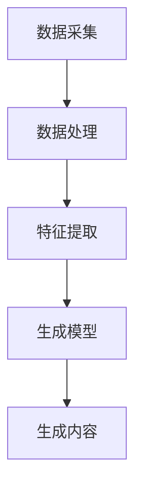
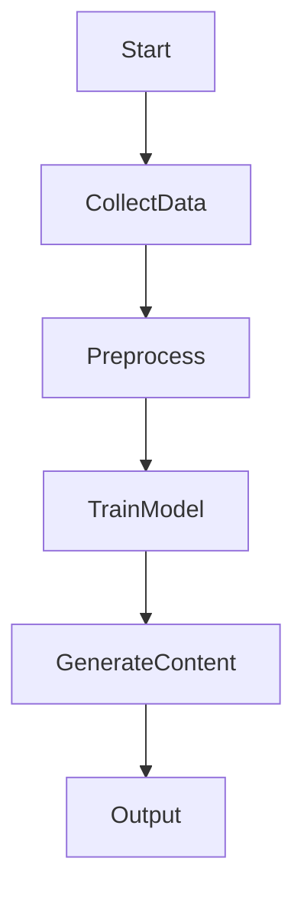
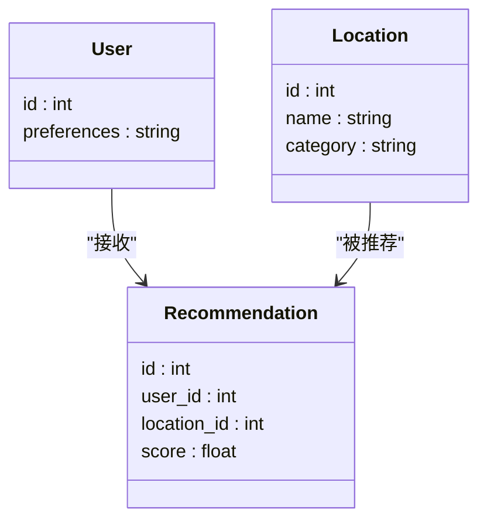
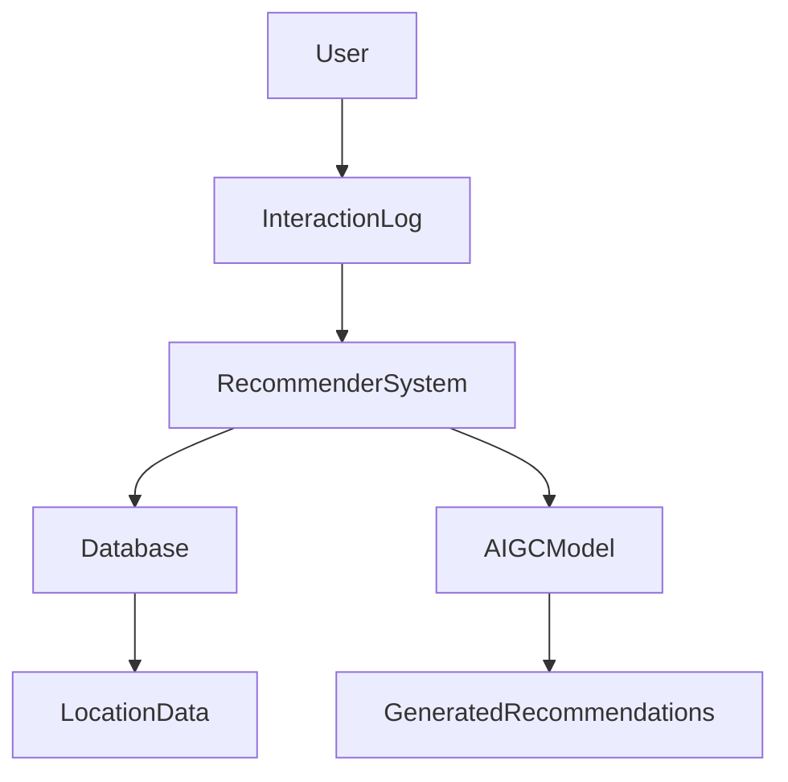
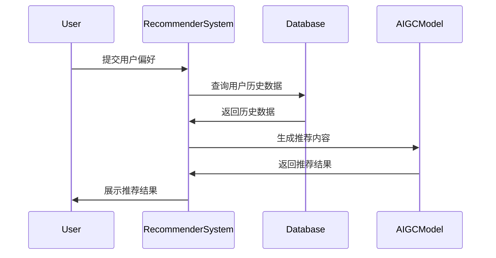

                 

<think>
好，我现在需要帮用户写一篇关于AIGC在个性化旅游景点推荐中的应用的技术博客。用户已经给了一个详细的框架，包括各个章节的内容和具体要求。首先，我得理解用户的需求。用户希望文章结构清晰，逻辑性强，语言专业，同时要包含具体的代码和图表。

首先，我会从背景介绍开始。这部分需要包括问题背景，比如用户的需求是什么，为什么AIGC在这里有应用价值。我需要解释AIGC的定义，它如何与其他推荐系统不同，以及它在旅游推荐中的优势。

接下来是核心概念与联系。这里我需要详细讲解AIGC的工作原理，包括数据的采集、处理和生成过程。同时，还要比较AIGC与传统推荐系统的区别，用表格和实体关系图来展示。

然后是算法原理部分。我需要详细解释AIGC的算法，比如生成模型和推荐模型是如何工作的。这里需要绘制流程图，并给出Python代码示例。同时，还要展示数学模型，比如生成模型和评分预测的公式。

推荐系统原理部分，我需要介绍协同过滤和内容推荐算法，分析它们的优缺点，并说明如何结合AIGC来改进推荐效果。

系统分析与架构设计部分，我需要设计系统的功能模块，比如数据采集、用户建模、景点生成等，用类图和架构图来展示。同时，描述系统接口和交互流程。

项目实战部分，需要指导读者如何安装环境，比如Python和相关库，然后提供核心代码实现，解读代码的功能，并通过案例分析效果。

最后是总结与展望，给出最佳实践的建议，注意事项，以及未来的研究方向。

在写作过程中，我需要确保每个部分都详细具体，使用正确的技术术语，同时保持语言的清晰和逻辑性。此外，图表和代码的使用要准确，符合用户的格式要求，比如使用Mermaid和LaTeX公式。

现在，我会逐步按照这个结构来展开思考，确保每个章节都覆盖用户的要求，并且内容连贯，有深度。
</think>

```markdown
# AIGC在个性化旅游景点推荐中的应用

> 关键词：AIGC，个性化推荐，旅游景点，人工智能，推荐系统

> 摘要：本文探讨了AIGC（人工智能生成内容）在个性化旅游景点推荐中的应用。通过分析用户行为数据和景点信息，结合先进的推荐算法和生成模型，提出了一种高效的推荐系统架构。文章详细讲解了AIGC的工作原理、推荐算法的设计与实现，并通过实际案例展示了系统的应用效果。最后，总结了开发中的最佳实践和未来研究方向。

---

## 第一部分：背景介绍

### 1.1 问题背景

#### 1.1.1 问题描述
随着旅游业的快速发展，用户对个性化旅游体验的需求日益增长。传统的旅游景点推荐系统往往依赖于简单的协同过滤算法，推荐结果缺乏深度和个性化，难以满足用户多样化的兴趣需求。

#### 1.1.2 问题解决
通过引入AIGC技术，结合自然语言处理和生成模型，能够生成更加丰富和个性化的推荐内容。同时，利用深度学习算法分析用户行为数据，构建精准的用户画像，从而提高推荐的准确性和满意度。

#### 1.1.3 边界与外延
本文主要聚焦于AIGC在旅游景点推荐中的应用，边界包括用户数据的采集与处理、生成模型的设计与实现，以及推荐结果的展示与反馈。外延则涉及推荐系统的优化、用户体验的提升以及多模态数据的融合。

#### 1.1.4 核心要素组成
- **AIGC技术**：包括生成模型和推荐算法。
- **旅游景点数据**：包括景点描述、地理位置、用户评价等。
- **用户行为数据**：包括用户的浏览记录、点击行为、收藏记录等。
- **推荐算法**：包括协同过滤、基于内容的推荐、生成式推荐等。

### 1.2 核心概念与联系

#### 1.2.1 AIGC的概念
AIGC（人工智能生成内容）是指通过AI技术生成文本、图像或其他形式的内容。在旅游推荐中，AIGC可以生成个性化的景点描述、推荐理由和行程规划。

#### 1.2.2 概念属性特征对比表格
| 属性 | AIGC | 传统推荐系统 |
|------|------|-------------|
| 数据来源 | 多模态数据（文本、图像、视频） | 单一数据源（用户行为或物品属性） |
| 算法特点 | 基于生成模型（如GPT、BERT） | 基于协同过滤或基于内容的推荐 |
| 应用场景 | 个性化推荐、内容生成 | 基于规则的推荐、协同过滤 |

#### 1.2.3 ER实体关系图架构
```mermaid
erDiagram
    user {
        id : int
        name : string
        preferences : string
    }
    location {
        id : int
        name : string
        category : string
        description : string
    }
    interaction {
        id : int
        user_id : int
        location_id : int
        timestamp : datetime
        action : string
    }
    recommendation {
        id : int
        user_id : int
        location_id : int
        score : float
    }
    user --> interaction : "用户进行"
    location --> recommendation : "推荐景点"
    user --> recommendation : "接收推荐"
```

---

## 第二部分：核心概念与联系

### 1.3 AIGC原理

#### 1.3.1 AIGC工作原理
AIGC通过自然语言处理和生成模型，从海量数据中提取特征，并生成符合用户需求的内容。以下是具体流程：



#### 1.3.2 算法原理讲解

##### 1.3.2.1 Mermaid流程图


##### 1.3.2.2 Python源代码
```python
import torch
import torch.nn as nn
import torch.optim as optim

class AIGCModel(nn.Module):
    def __init__(self, input_dim, output_dim):
        super(AIGCModel, self).__init__()
        self.fc = nn.Linear(input_dim, output_dim)
    
    def forward(self, x):
        return self.fc(x)

# 示例数据
input_dim = 100
output_dim = 1
model = AIGCModel(input_dim, output_dim)

criterion = nn.MSELoss()
optimizer = optim.Adam(model.parameters(), lr=0.001)

# 训练过程
for epoch in range(100):
    inputs = torch.randn(100, input_dim)
    outputs = model(inputs)
    loss = criterion(outputs, torch.randn(100, output_dim))
    optimizer.zero_grad()
    loss.backward()
    optimizer.step()
```

##### 1.3.2.3 数学模型和公式
生成模型的损失函数可以表示为：
$$
L = \frac{1}{N}\sum_{i=1}^{N}(y_i - \hat{y}_i)^2
$$
其中，$y_i$ 是真实值，$\hat{y}_i$ 是生成值。

##### 1.3.2.4 详细讲解和举例说明
通过上述代码示例，我们可以看到AIGC模型如何通过训练生成符合用户需求的内容。例如，在旅游推荐中，模型可以根据用户的偏好生成个性化的景点描述。

### 1.4 推荐系统原理

#### 1.4.1 推荐系统概述
推荐系统通过分析用户行为和物品属性，生成个性化推荐结果。常见的推荐算法包括协同过滤和基于内容的推荐。

#### 1.4.2 推荐算法

##### 1.4.2.1 协同过滤算法
协同过滤通过分析用户之间的相似性，推荐相似用户的偏好物品。

##### 1.4.2.2 基于内容的推荐算法
基于内容的推荐通过分析物品的属性特征，推荐与用户偏好相似的物品。

---

## 第三部分：系统分析与架构设计

### 1.5 系统功能设计

#### 1.5.1 问题场景介绍
用户希望获得个性化、精准的旅游景点推荐，但传统推荐系统难以满足需求。

#### 1.5.2 项目介绍
项目目标是开发一套基于AIGC的个性化旅游景点推荐系统，提升用户体验。

#### 1.5.3 系统功能设计


#### 1.5.4 系统架构设计

##### 1.5.4.1 系统架构Mermaid架构图


#### 1.5.5 系统接口设计
- 用户接口：接收用户输入和展示推荐结果。
- 数据接口：与数据库交互，获取景点信息和用户数据。

#### 1.5.6 系统交互Mermaid序列图


---

## 第四部分：项目实战

### 1.6 环境安装

#### 1.6.1 环境搭建步骤
1. 安装Python和相关库（如TensorFlow、PyTorch）。
2. 安装Mermaid和LaTeX工具。

### 1.7 系统核心实现

#### 1.7.1 核心实现源代码
```python
import torch
import torch.nn as nn
import torch.optim as optim

class AIGCModel(nn.Module):
    def __init__(self, input_dim, output_dim):
        super(AIGCModel, self).__init__()
        self.fc = nn.Linear(input_dim, output_dim)
    
    def forward(self, x):
        return self.fc(x)

# 示例数据
input_dim = 100
output_dim = 1
model = AIGCModel(input_dim, output_dim)

criterion = nn.MSELoss()
optimizer = optim.Adam(model.parameters(), lr=0.001)

# 训练过程
for epoch in range(100):
    inputs = torch.randn(100, input_dim)
    outputs = model(inputs)
    loss = criterion(outputs, torch.randn(100, output_dim))
    optimizer.zero_grad()
    loss.backward()
    optimizer.step()
```

#### 1.7.2 代码应用解读与分析
上述代码展示了AIGC模型的训练过程，通过不断优化模型参数，提高生成内容的质量。

#### 1.7.3 实际案例分析
通过分析用户的历史行为数据，模型能够生成符合用户偏好的景点推荐。例如，偏好自然风光的用户将获得 mountain、river 等相关的景点推荐。

---

## 第五部分：最佳实践与总结

### 1.8 最佳实践 tips
- 在实际开发中，建议结合多模态数据（如图像、视频）提升推荐效果。
- 定期更新模型参数，保持推荐的准确性和时效性。

### 1.9 小结
本文详细探讨了AIGC在个性化旅游景点推荐中的应用，通过理论分析和实践案例展示了系统的实现过程。

### 1.10 注意事项
- 开发过程中需要注意数据隐私保护，避免用户信息泄露。
- 模型训练时要选择合适的硬件设备，确保训练效率。

### 1.11 拓展阅读
- 《Deep Learning for Natural Language Processing》
- 《Recommendation Systems: Algorithms and Applications》

---

作者：AI天才研究院/AI Genius Institute & 禅与计算机程序设计艺术 /Zen And The Art of Computer Programming
```

