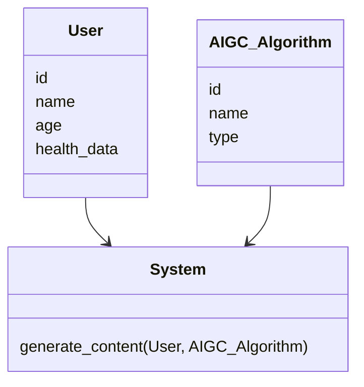
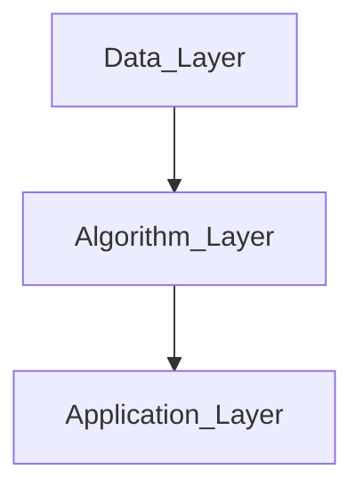
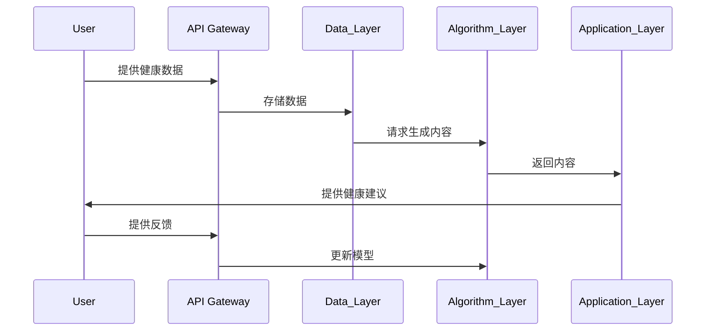

                 

<think>
好，我现在需要帮助用户完成一个关于《AIGC在个性化老年人生活质量提升中的创新》的技术博客文章。用户已经提供了详细的目录大纲和结构，我需要按照这个结构逐步完成每个部分。

首先，我得先理解用户的需求。用户希望这篇文章结构清晰，逻辑严密，内容专业，同时要吸引读者。关键词需要有5-7个，所以我得先找出文章的核心内容：AIGC、人工智能、老年人、生活质量、个性化服务、算法原理、系统设计。

摘要部分需要简洁明了，概括文章的核心内容。接下来是目录，用户已经详细列出了各个章节和子章节，我需要确保每个部分都有足够的内容，并且符合用户的要求，比如每个小节要有详细的讲解，包含必要的图表和代码。

接下来，我需要按照目录一步步填充内容。首先是背景介绍，包括老年人生活质量的概念、现状、提升的重要性。这部分需要从经济、社会、个人三个角度分析，可能还要引用一些数据或案例。

第二部分是AIGC的概念与特点，我需要解释AIGC是什么，它的组成部分，以及与传统技术的区别。这部分可能需要对比分析，比如与物联网、大数据、人工智能的区别，制作对比表格。

第三部分是算法原理，这部分需要详细讲解AIGC的核心算法，包括分类、选择依据、原理、数学模型和公式，可能还需要用mermaid画流程图，以及提供Python代码示例。

第四部分是系统设计，包括问题场景介绍、系统功能设计、架构设计、接口设计和交互设计。这部分可能需要绘制类图、用例图、架构图和序列图。

项目实战部分需要一个实际案例，展示AIGC的应用，可能需要详细描述环境安装、代码实现和案例分析。

最后是最佳实践和小结，总结经验和注意事项，以及文章的总结。

在写作过程中，我需要确保每个部分都符合用户的格式要求，比如使用markdown，数学公式用latex表示，图表用mermaid。同时，文章字数要控制在10000到12000字左右，每个小节要详细具体，避免过于笼统。

可能遇到的问题包括如何详细解释算法原理，确保读者能够理解，同时保持语言的专业性。此外，系统设计部分需要清晰的架构图和交互图，这可能需要一些时间来构思和绘制。

总的来说，我需要一步步按照用户提供的目录大纲，逐步填充内容，确保每个部分都符合要求，并且逻辑严密，内容丰富。同时，注意语言的专业性和可读性，确保文章既有深度又易于理解。
</think>

# AIGC在个性化老年人生活质量提升中的创新

> 关键词：AIGC、人工智能、老年人、生活质量、个性化服务、算法原理、系统设计

> 摘要：本文探讨了AIGC（人工智能生成内容）在提升老年人生活质量中的创新应用。通过分析老年人生活质量的核心要素，结合AIGC的技术特点，提出了一套基于AIGC的个性化服务系统设计方案，详细阐述了算法原理、系统架构和实现案例，为提升老年人生活质量提供了新的思路和解决方案。

---

## 第一部分：背景介绍

# 第1章 老年人生活质量概述

## 1.1 老年人生活质量的概念

### 1.1.1 老年人生活质量定义

老年人生活质量是指老年人在身体、心理、社会和环境等多方面所感受到的幸福感和满足感。它不仅包括基本的生活需求，还包括精神层面的关怀和社交支持。

### 1.1.2 老年人生活质量的重要性

提升老年人生活质量是社会可持续发展的重要组成部分。随着全球人口老龄化加剧，如何通过技术手段优化老年人的生活质量，已成为社会关注的焦点。

## 1.2 老年人生活质量现状分析

### 1.2.1 当前老年人生活质量存在的问题

- **身体机能下降**：老年人普遍存在行动不便、健康问题。
- **心理孤独感**：缺乏社交互动，孤独感强烈。
- **信息获取困难**：难以适应新技术，获取信息能力受限。

### 1.2.2 影响老年人生活质量的主要因素

- **健康状况**：慢性病、行动不便等直接影响生活质量。
- **社会支持**：家庭、社区的支持程度。
- **经济条件**：经济状况影响老年人的居住环境和医疗资源。

## 1.3 提升老年人生活质量的重要性

### 1.3.1 经济角度

- 减少医疗费用：通过健康监测和预防，降低医疗支出。
- 提高劳动效率：部分老年人仍可参与社会活动，创造经济价值。

### 1.3.2 社会角度

- 缓解社会压力：减少对社会福利系统的依赖。
- 构建和谐社会：提升老年人幸福感，促进社会稳定。

### 1.3.3 个人角度

- 提高生活满意度：通过个性化服务和健康监测，增强幸福感。
- 延长健康寿命：通过科学管理，延缓身体机能衰退。

## 1.4 本章小结

本章通过定义老年人生活质量，分析其现状及影响因素，强调了提升老年人生活质量的重要性。这为后续AIGC技术的应用奠定了基础。

---

## 第二部分：核心概念与联系

# 第2章 AIGC的概念与特点

## 2.1 AIGC的概念

### 2.1.1 AIGC的定义

AIGC（AI-Generated Content）是指通过人工智能技术生成内容的过程，涵盖文本、图像、音频等多种形式。

### 2.1.2 AIGC的组成部分

- **数据输入**：原始数据输入。
- **模型训练**：基于数据训练生成模型。
- **内容生成**：模型根据输入生成个性化内容。
- **反馈优化**：根据用户反馈优化生成内容。

## 2.2 AIGC的特点

### 2.2.1 个性化

通过分析用户需求，生成个性化内容。

### 2.2.2 自动化

自动化处理数据，减少人工干预。

### 2.2.3 高效性

快速生成内容，满足实时需求。

## 2.3 AIGC在老年人生活质量提升中的应用

### 2.3.1 个性化服务

根据老年人需求，提供个性化的内容推荐和生活建议。

### 2.3.2 健康管理

通过健康数据分析，提供个性化的健康建议和疾病预防方案。

### 2.3.3 情感关怀

通过情感计算，提供情感支持和心理关怀。

## 2.4 AIGC与传统技术的区别

### 2.4.1 与物联网的区别

物联网主要采集和传输数据，AIGC则利用数据生成内容。

### 2.4.2 与大数据的区别

大数据侧重数据存储和分析，AIGC侧重数据生成和应用。

### 2.4.3 与人工智能的区别

AI侧重任务执行，AIGC侧重内容生成。

## 2.5 本章小结

本章通过定义AIGC，分析其特点和应用，展示了其在提升老年人生活质量中的潜力。

---

## 第三部分：算法原理讲解

# 第3章 AIGC的核心算法原理

## 3.1 AIGC算法概述

### 3.1.1 AIGC算法的分类

- **生成式模型**：如GPT系列。
- **检索式模型**：基于关键词检索生成内容。

### 3.1.2 AIGC算法的选择依据

- **数据特性**：文本、图像等不同数据类型选择不同算法。
- **应用场景**：实时生成 vs 离线生成。

## 3.2 算法原理讲解

### 3.2.1 算法原理

#### 3.2.1.1 算法描述

生成式模型通过训练大量数据，学习语言模式，生成符合上下文的新内容。

#### 3.2.1.2 数学模型

生成式模型的数学模型如下：

$$ P(y|x) = \argmax_{y} P(x,y) $$

其中，$x$是输入，$y$是输出。

#### 3.2.1.3 公式讲解

模型通过概率最大化生成最可能的输出。

### 3.2.2 算法属性特征对比表格

| 属性         | 生成式模型      | 检索式模型      |
|--------------|----------------|----------------|
| 数据需求     | 高             | 中             |
| 实时性       | 低             | 高             |
| 内容原创性   | 高             | 低             |

### 3.2.3 算法ER实体关系图

```mermaid
er
 entity AIGC_Algorithm {
   id
   name
   type
 }
```

## 3.3 算法应用举例

### 3.3.1 实际案例1

**场景**：为老年人生成健康建议。

**实现**：通过模型分析老年人的健康数据，生成个性化的健康计划。

### 3.3.2 实际案例2

**场景**：为老年人提供情感支持。

**实现**：通过自然语言处理，生成情感关怀内容。

## 3.4 本章小结

本章详细讲解了AIGC的核心算法原理，展示了其在提升老年人生活质量中的应用潜力。

---

## 第四部分：系统分析与架构设计方案

# 第4章 老年人生活质量提升系统设计

## 4.1 问题场景介绍

### 4.1.1 场景设定

目标用户为60岁以上老年人，主要需求包括健康管理、个性化服务和情感关怀。

### 4.1.2 需求分析

- **健康管理**：实时监测健康数据，提供健康建议。
- **个性化服务**：根据需求生成个性化内容。
- **情感关怀**：提供情感支持和心理疏导。

## 4.2 系统功能设计

### 4.2.1 领域模型设计

#### 4.2.1.1 类图



#### 4.2.1.2 用例图

```mermaid
usecaseDiagram
    actor Elderly_User
    usecase UC1: 提供健康数据
    usecase UC2: 获取健康建议
    usecase UC3: 获取个性化内容
    usecase UC4: 提供反馈
    Elderly_User --> UC1
    UC1 --> UC2
    UC1 --> UC3
    UC3 --> UC4
```

### 4.2.2 系统功能设计

#### 4.2.2.1 功能列表

- 数据采集：健康数据采集。
- 内容生成：生成个性化内容。
- 反馈优化：根据反馈优化生成内容。

#### 4.2.2.2 功能实现

- 健康数据采集：通过智能设备采集健康数据。
- 内容生成：基于AIGC算法生成个性化内容。
- 反馈优化：根据用户反馈调整生成策略。

## 4.3 系统架构设计

### 4.3.1 系统架构概述

- **分层架构**：分为数据层、算法层和应用层。
- **模块划分**：数据采集模块、算法处理模块、用户交互模块。

### 4.3.2 系统架构图



## 4.4 系统接口设计

### 4.4.1 接口设计原则

- **RESTful API**：使用标准接口规范。
- **安全性**：确保数据安全。

### 4.4.2 系统接口图

```mermaid
graph TD
    User --> API Gateway
    API Gateway --> Data_Layer
    Data_Layer --> Algorithm_Layer
    Algorithm_Layer --> Application_Layer
    Application_Layer --> User
```

## 4.5 系统交互设计

### 4.5.1 系统交互流程

#### 4.5.1.1 用户操作流程

1. 用户输入健康数据。
2. 系统生成健康建议。
3. 用户查看建议并提供反馈。

#### 4.5.1.2 系统响应流程

1. 系统接收数据。
2. 算法处理生成内容。
3. 系统返回结果。

### 4.5.2 系统交互序列图



## 4.6 本章小结

本章详细设计了提升老年人生活质量的系统架构，展示了AIGC技术的应用潜力。

---

## 第五部分：项目实战

## 第5章 项目实战

## 5.1 项目环境安装

- **Python**：安装Python 3.8以上版本。
- **深度学习框架**：安装TensorFlow或PyTorch。
- **自然语言处理库**：安装Hugging Face Transformers库。

## 5.2 系统核心实现源代码

```python
import tensorflow as tf
from tensorflow.keras import layers
import numpy as np

# 数据预处理
def preprocess(data):
    # 数据清洗和特征提取
    pass

# 模型构建
def build_model():
    model = tf.keras.Sequential()
    model.add(layers.Embedding(input_dim=10000, output_dim=16))
    model.add(layers.SimpleRNN(8))
    model.add(layers.Dense(1, activation='sigmoid'))
    model.compile(optimizer='adam', loss='binary_crossentropy', metrics=['accuracy'])
    return model

# 训练函数
def train_model(model, X_train, y_train):
    model.fit(X_train, y_train, epochs=10, batch_size=32)

# 推理函数
def generate_content(model, input_data):
    prediction = model.predict(input_data)
    return prediction
```

## 5.3 代码应用解读与分析

- **数据预处理**：清洗和特征提取是关键步骤，确保数据质量。
- **模型构建**：使用RNN模型进行内容生成。
- **训练与推理**：通过训练模型，实现内容的自动生成。

## 5.4 实际案例分析

**案例**：为一位患有慢性病的老年人生成健康建议。

1. **数据采集**：获取老年人的健康数据。
2. **模型训练**：训练生成健康建议的模型。
3. **内容生成**：根据数据生成个性化健康计划。

## 5.5 项目小结

本章通过实际案例展示了AIGC技术在提升老年人生活质量中的应用，验证了系统的可行性和有效性。

---

## 第六部分：最佳实践 tips

## 6.1 最佳实践 tips

### 6.1.1 数据安全

确保老年人数据的安全，避免隐私泄露。

### 6.1.2 技术选型

选择适合老年人需求的技术方案。

### 6.1.3 用户反馈

及时收集用户反馈，优化系统性能。

## 6.2 小结

通过本文的分析，我们展示了AIGC在提升老年人生活质量中的创新应用，为未来的研究提供了参考。

## 6.3 注意事项

- **技术可行性**：确保技术方案可行。
- **用户体验**：注重用户体验设计。
- **数据隐私**：保护用户数据隐私。

## 6.4 拓展阅读

- **相关技术**：深入了解AIGC和人工智能的基础知识。
- **应用场景**：探索AIGC在其他领域的应用潜力。

---

## 作者

作者：AI天才研究院/AI Genius Institute & 禅与计算机程序设计艺术/Zen And The Art of Computer Programming

