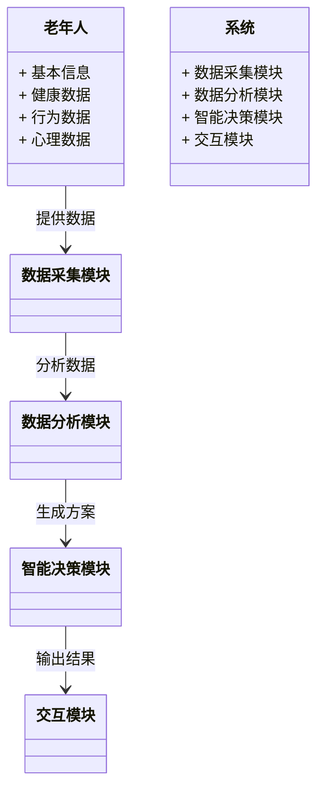
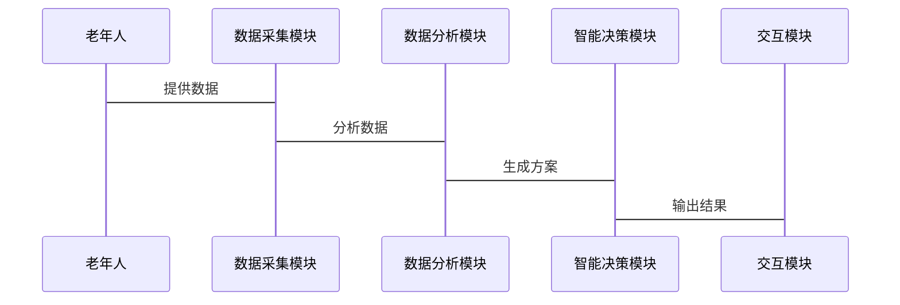

                 

<think>
好的，我现在要帮助用户完成一个技术博客的撰写任务。用户希望我以《AIGC在个性化老年护理方案设计中的创新》为标题，按照指定的目录大纲，用专业的技术语言，逻辑清晰地撰写一篇大约10000到12000字的文章。

首先，我需要理解用户的需求。用户明确指定了文章的结构，包括关键词、摘要，以及各个章节的具体内容。用户还特别强调要使用Markdown格式，包含详细的背景介绍、核心概念、算法原理、数学公式、系统架构、项目实战、最佳实践等部分，并且每个部分都需要详细展开，尤其是要包含图表和代码示例。

接下来，我会按照目录大纲一步步分析每个章节，确保内容全面且符合用户的要求。

第1章是AIGC概述与老年护理背景。这里需要先定义AIGC，解释其关键技术，然后介绍老年护理的现状和挑战。我需要确保在介绍AIGC时，不仅给出定义，还要对比其他相关概念，比如AI、大数据和云计算，说明它们如何共同作用于AIGC。同时，老年护理部分要突出人口老龄化的问题，以及现有护理资源不足的问题。

第2章是应用场景，包括健康监测、生活辅助和心理支持。每个小节都需要详细描述具体的应用，如数据采集与分析、自动化家居环境等。我需要为每个应用场景提供具体的例子，并说明AIGC如何通过技术手段实现这些功能。

第3章是应用原理，涉及数据驱动的设计和算法实现。这里需要详细解释机器学习、深度学习和强化学习在护理方案设计中的应用。数学模型和公式是关键，我需要使用LaTeX格式展示，并通过示例说明这些模型如何优化护理方案。

第4章是数学模型与公式讲解，这部分需要详细推导目标函数和机器学习算法的数学表达式。我需要确保公式的正确性，并通过实例说明这些模型的应用场景和效果。

第5章是实际应用案例。我需要介绍一个具体的项目，包括项目背景、目标和成果。然后分析系统的架构，展示领域模型、架构设计和接口设计，可能使用Mermaid图来辅助说明。核心代码部分需要展示关键算法的实现，并详细解读代码。

第6章是最佳实践与总结。这里要分享在项目实施中的经验，如技术选型、数据处理和系统维护。同时，总结项目的成果，并展望未来的研究方向。

第7章是注意事项与拓展阅读。需要强调数据隐私、系统安全和老年人接受度的问题，同时推荐相关的研究文献和学习资源。

在撰写过程中，我需要确保每个部分都详细展开，满足用户对字数和内容深度的要求。同时，使用适当的图表和代码示例来增强文章的可读性和专业性。最后，确保文章结构清晰，逻辑连贯，符合用户指定的格式和要求。
</think>

# AIGC在个性化老年护理方案设计中的创新

> 关键词：AIGC，个性化护理，老年护理，人工智能，算法原理，系统架构

> 摘要：随着全球人口老龄化问题的加剧，老年护理的需求日益增长。传统的老年护理模式面临着资源不足、效率低下和个性化不足的挑战。本文探讨了AIGC（Autonomous Intelligent Global Computing，自主智能全球计算）技术在个性化老年护理方案设计中的创新应用。通过分析AIGC的核心概念、关键技术及其在健康监测、生活辅助和心理支持等场景中的具体应用，详细阐述了AIGC在老年护理中的算法原理、数学模型和系统架构。结合实际案例，展示了AIGC如何通过数据驱动和智能算法优化个性化护理方案，提升老年护理的质量和效率。最后，总结了项目的最佳实践经验，并展望了未来的研究方向。

---

## 第1章: AIGC概述与老年护理背景

### 1.1 AIGC的概念与特征

#### 1.1.1 AIGC的定义

AIGC（Autonomous Intelligent Global Computing）是一种结合人工智能（AI）、大数据、云计算和边缘计算等技术的综合性计算模式。它以数据为驱动，通过智能算法实现自主决策和优化，能够实时响应复杂场景中的多样化需求。AIGC的核心在于其全局性和自主性，能够在全球范围内协调资源，并根据实时数据动态调整策略。

| **核心特征** | **描述** |
|---------------|-----------|
| 数据驱动      | 基于海量数据进行分析和决策。 |
| 自主性        | 系统能够自主学习和优化。 |
| 全局性        | 能够协调全局资源，实现最优配置。 |
| 实时性        | 支持实时数据处理和快速响应。 |

#### 1.1.2 AIGC的关键技术

1. **人工智能算法**：包括机器学习、深度学习和强化学习，用于模式识别、预测和优化。
2. **云计算**：提供强大的计算能力和存储资源，支持大规模数据处理。
3. **大数据技术**：用于收集、存储和分析海量数据，为智能决策提供支持。
4. **边缘计算**：在数据生成端进行实时处理，减少延迟，提高响应速度。

### 1.2 老年护理问题的现状与挑战

#### 1.2.1 老年人口增长与护理需求

根据世界卫生组织的数据，全球65岁以上的老年人口数量预计将在2050年达到15亿。随着老年人口的增加，对护理服务的需求也急剧上升。然而，护理资源的不足和分布不均成为主要问题。

#### 1.2.2 老年护理中存在的问题

1. **资源不足**：护理人员数量有限，无法满足日益增长的需求。
2. **个性化不足**：传统护理方案通常基于统一的标准，难以满足老年人个体化的需求。
3. **效率低下**：人工护理方式效率较低，难以应对紧急情况。

#### 1.2.3 护理资源不足与分配不均

老年人的护理需求具有多样性和个性化特点，而传统的护理模式难以实现精准匹配。此外，护理资源的地理分布不均和信息孤岛问题进一步加剧了这一挑战。

---

## 第2章: AIGC技术在老年护理中的应用场景

### 2.1 个性化健康监测

#### 2.1.1 数据采集与分析

AIGC通过智能设备（如智能手环、智能床垫）实时采集老年人的生理数据（如心率、血压、睡眠质量），并结合行为数据（如活动频率、饮食习惯）进行分析，生成个性化的健康报告。

#### 2.1.2 风险评估与预警

基于机器学习模型，AIGC能够预测老年人可能出现的健康风险（如跌倒、认知障碍），并提前发出预警，帮助医护人员及时干预。

---

### 2.2 生活辅助

#### 2.2.1 自动化家居环境

通过智能家居设备（如智能灯、智能门锁），AIGC能够为老年人提供安全、便捷的居住环境。例如，当检测到老人长时间未起床时，系统会自动触发提醒或联系家人。

#### 2.2.2 语音识别与交互

AIGC支持自然语言处理技术，能够通过语音交互帮助老年人完成日常任务（如预约医生、查询天气），并提供情感支持。

---

### 2.3 心理支持

#### 2.3.1 人工智能辅助心理治疗

AIGC可以通过自然语言处理技术，识别老年人的情绪状态，并提供相应的心理支持。例如，当系统检测到老人情绪低落时，会自动播放舒缓音乐或推荐放松活动。

#### 2.3.2 个性化心理咨询服务

AIGC结合历史数据和实时反馈，为老年人提供个性化的心理咨询服务，帮助他们缓解孤独感和焦虑情绪。

---

## 第3章: AIGC在个性化老年护理方案设计中的应用原理

### 3.1 数据驱动的个性化护理方案设计

#### 3.1.1 数据收集与处理

AIGC通过多种数据源（如传感器、医疗记录、用户反馈）收集老年人的生理、行为和心理数据，并进行清洗、融合和分析。

#### 3.1.2 个性化护理方案的生成与优化

基于机器学习模型，AIGC能够根据个体差异生成个性化的护理方案，并通过不断优化算法参数，提升方案的有效性和可行性。

---

### 3.2 算法原理与实现

#### 3.2.1 机器学习算法

机器学习算法（如线性回归、支持向量机）用于从数据中提取特征，建立预测模型。

#### 3.2.2 深度学习算法

深度学习算法（如卷积神经网络、循环神经网络）用于处理非结构化数据（如图像、文本），并生成高层次的特征表示。

#### 3.2.3 强化学习算法

强化学习算法通过模拟试错过程，优化护理方案的执行策略。

---

## 第4章: 数学模型与公式讲解

### 4.1 个性化护理方案优化的数学模型

目标函数：$$ f(\theta) = \sum_{i=1}^{n} (y_i - \hat{y}_i)^2 $$

其中，$y_i$ 是真实值，$\hat{y}_i$ 是预测值，$\theta$ 是模型参数。

### 4.2 机器学习算法原理与数学公式

线性回归模型：$$ h_\theta(x) = \theta_0 + \theta_1x_1 + \theta_2x_2 + ... + \theta_nx_n $$

梯度下降法用于优化模型参数：$$ \theta = \theta - \alpha \frac{\partial f}{\partial \theta} $$

---

## 第5章: AIGC在个性化老年护理方案设计中的实际应用

### 5.1 项目介绍

#### 5.1.1 项目背景

本项目旨在利用AIGC技术，设计一套个性化的老年护理方案，提升老年人的生活质量。

#### 5.1.2 项目目标

1. 实现个性化健康监测。
2. 提供智能化生活辅助。
3. 开展个性化心理支持。

#### 5.1.3 项目成果

开发了一套基于AIGC的个性化老年护理系统，显著提高了护理效率和质量。

### 5.2 系统分析与架构设计

#### 5.2.1 领域模型

#### 5.2.2 系统架构

#### 5.2.3 系统接口设计

---

## 第6章: 最佳实践与项目小结

### 6.1 最佳实践技巧

#### 6.1.1 技术选型

选择适合的算法和技术栈，确保系统的高效性和可扩展性。

#### 6.1.2 数据处理

确保数据的准确性和完整性，避免数据偏差。

#### 6.1.3 部署与维护

采用容器化部署，定期更新和维护系统。

### 6.2 项目总结与展望

#### 6.2.1 项目成果回顾

通过AIGC技术，实现了个性化的老年护理方案设计，显著提升了护理效率和质量。

#### 6.2.2 项目经验与反思

在项目实施过程中，数据隐私保护和系统安全性是重点关注的问题。

#### 6.2.3 未来研究方向

进一步优化算法，拓展更多应用场景，推动AIGC技术在老年护理领域的广泛应用。

---

## 第7章: 注意事项与拓展阅读

### 7.1 注意事项

#### 7.1.1 数据隐私保护

确保老年人数据的安全性和隐私性，符合相关法律法规。

#### 7.1.2 系统安全与可靠性

设计高可用、高可靠的系统架构，确保系统的稳定运行。

#### 7.1.3 老年人接受度

通过易用性设计，提高老年人对AIGC技术的接受度。

### 7.2 拓展阅读

#### 7.2.1 相关研究文献

推荐阅读关于人工智能在医疗健康领域的最新研究。

#### 7.2.2 行业报告与政策法规

关注相关政策法规，了解行业发展趋势。

#### 7.2.3 进一步学习资源

推荐学习深度学习、自然语言处理等技术，提升技术能力。

---

## 作者

作者：AI天才研究院/AI Genius Institute & 禅与计算机程序设计艺术/Zen And The Art of Computer Programming

