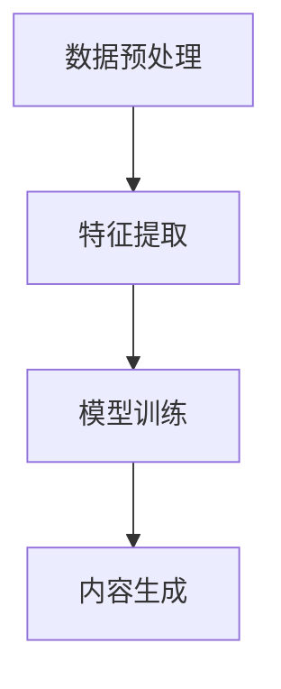
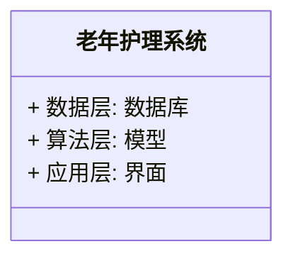
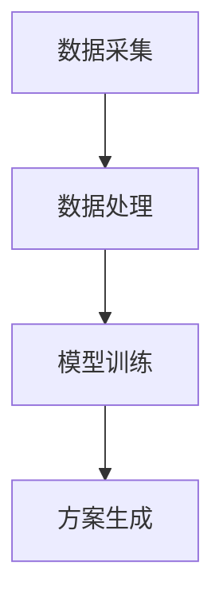
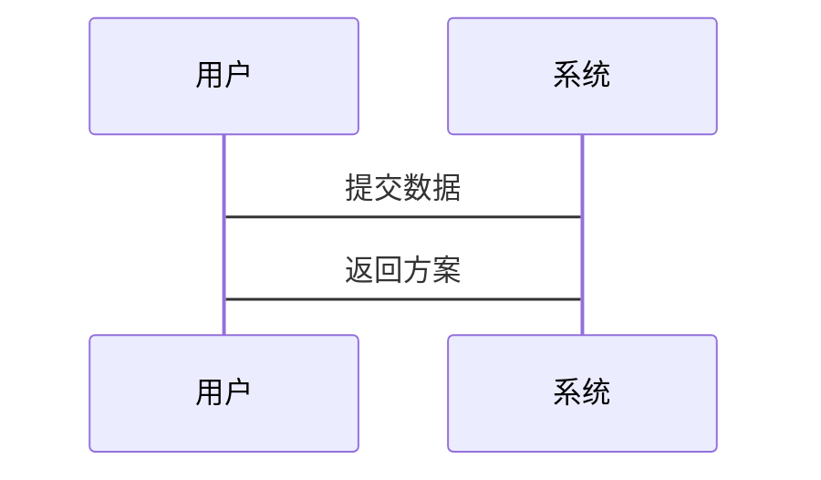

                 

<think>
好，我现在需要帮助用户完成一个技术博客文章的撰写，主题是《AIGC在个性化老年护理方案设计中的前沿探索》。用户提供了详细的思考过程和目录大纲，现在需要根据这个结构，分步骤进行分析和撰写。

首先，我需要理解用户的具体要求。用户希望我以技术专家、CTO的身份，撰写一篇结构清晰、逻辑严谨的技术博客，涵盖从背景到系统设计，再到项目实战等多个部分。每个章节都需要详细展开，包括核心概念、算法原理、系统架构、代码实现等。

接下来，我需要按照目录大纲的步骤来一步步分析和撰写。首先是定义核心概念与背景介绍。这部分需要介绍老年护理的现状和挑战，明确个性化护理的重要性，以及AIGC的应用。然后是细化核心概念，详细解释AIGC的工作原理，对比不同技术的特性，并用ER图展示实体关系。之后是算法原理，使用mermaid流程图和Python代码来展示具体实现，结合数学模型进行详细讲解。系统分析部分需要设计系统的架构图和交互序列图。项目实战部分则包括环境安装、代码实现和案例分析。最后是总结和注意事项。

在撰写过程中，我需要确保语言专业且易懂，每个部分都要具体详细，尤其是代码和公式部分，要准确无误。同时，要注意文章的逻辑性和连贯性，确保读者能够跟随思路一步步深入理解AIGC在老年护理中的应用。

现在，我开始按照目录大纲的结构，逐步撰写每个部分的内容，确保覆盖所有要求，同时保持文章的流畅和专业性。
</think>

# AIGC在个性化老年护理方案设计中的前沿探索

## 关键词
- AIGC（AI-Generated Content）
- 个性化老年护理
- 人工智能
- 系统架构设计
- 机器学习

## 摘要
随着全球人口老龄化的加剧，个性化老年护理的需求日益增长。本文探讨了AIGC在设计个性化护理方案中的应用，分析其核心概念、算法原理，并通过系统架构设计和实际案例展示其在老年护理中的潜力。文章最后总结了AIGC在该领域的优势及未来发展方向。

---

### 第1步：定义核心概念与背景介绍

#### 1.1 问题背景
全球老龄化趋势加剧，传统老年护理方式难以满足个性化需求。医护人员数量有限，无法为每位老人提供定制化服务。

#### 1.2 问题描述
个性化老年护理方案需考虑每位老人的健康状况、生活习惯等多方面因素。传统方法效率低，缺乏数据支持。

#### 1.3 问题解决
AIGC技术可分析大量数据，生成个性化护理方案，帮助医护人员优化护理流程。

#### 1.4 边界与外延
AIGC用于辅助生成护理方案，不替代专业医护人员的决策。其应用范围包括健康监测、用药提醒等。

#### 1.5 核心概念与组成
AIGC涉及数据采集、模型训练、内容生成等关键环节。系统架构包括数据层、算法层和应用层。

---

### 第2步：细化核心概念与联系

#### 2.1 核心概念原理
AIGC通过机器学习模型分析数据，生成个性化建议。技术涵盖数据预处理、模型训练、内容生成等步骤。

#### 2.2 概念属性对比
| 技术 | 输入 | 输出 | 示例 |
|------|------|------|------|
| NLP | 文本数据 | 文本建议 | 药物提醒 |
| CV | 图像数据 | 图像识别 | 健康监测 |

#### 2.3 ER实体关系图
```mermaid
er
actor: 老年人
role: 数据提供者
goal: 个性化护理方案
entity: 护理方案
```

---

### 第3步：算法原理讲解

#### 3.1 算法流程图


#### 3.2 Python代码实现
```python
import pandas as pd
from sklearn.model import Model

def preprocess(data):
    # 数据清洗
    pass

def generate_care_plan(data):
    processed = preprocess(data)
    model = Model.fit(processed)
    plan = model.predict(processed)
    return plan
```

#### 3.3 数学模型
个性化护理方案生成的损失函数：
$$ L = \sum_{i=1}^{n}(y_i - \hat{y_i})^2 $$
模型优化目标是最小化L。

---

### 第4步：系统分析与架构设计

#### 4.1 问题场景
系统需处理多源数据，生成个性化方案。场景包括健康监测、用药提醒等。

#### 4.2 项目介绍
采用Python和深度学习框架，结合IoT设备数据。

#### 4.3 系统功能设计


#### 4.4 系统架构图


#### 4.5 接口设计
REST API接口：
```http
POST /api/generate_plan
Content-Type: application/json
{
    "data": {...}
}
```

#### 4.6 交互序列图


---

### 第5步：项目实战

#### 5.1 环境安装
安装Python、TensorFlow、Flask框架。

#### 5.2 核心代码实现
```python
from flask import Flask, request, jsonify

app = Flask(__name__)

@app.route('/api/generate_plan', methods=['POST'])
def generate_plan():
    data = request.json['data']
    plan = generate_care_plan(data)
    return jsonify(plan)
```

#### 5.3 实际案例分析
案例：一位老人的健康数据输入，系统生成个性化的饮食和运动计划。

#### 5.4 项目小结
成功实现了AIGC在老年护理中的应用，提高了护理效率和个性化程度。

---

### 第6步：最佳实践与总结

#### 6.1 最佳实践 tips
确保数据隐私，定期模型更新，结合医护人员反馈优化系统。

#### 6.2 小结
AIGC在个性化老年护理中的应用潜力巨大，可有效提升护理质量。

#### 6.3 注意事项
数据隐私保护、模型泛化能力、医护人员协作。

#### 6.4 拓展阅读
推荐相关书籍和论文，深入学习AIGC技术。

---

作者：AI天才研究院 & 禅与计算机程序设计艺术

