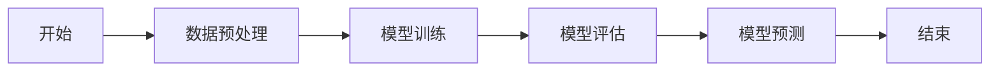
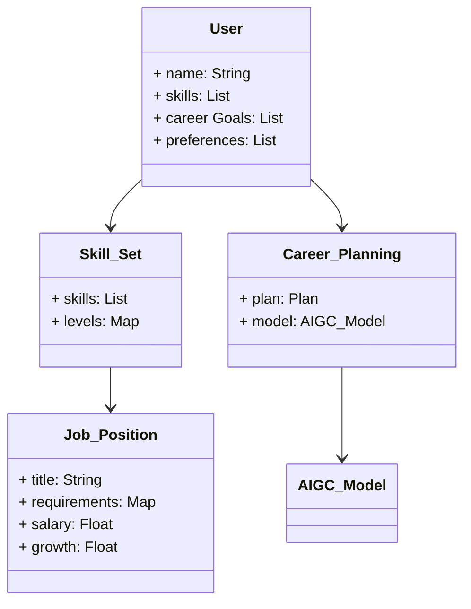
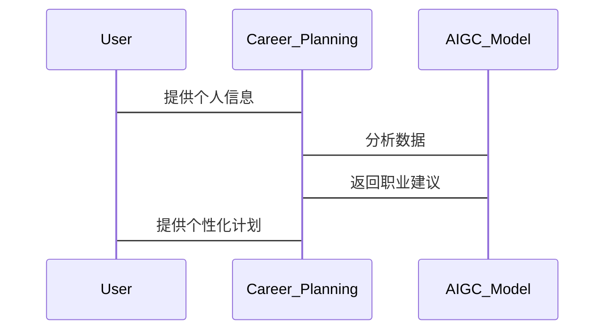

                 

<think>
好，我现在要按照用户的指示，一步一步来思考如何撰写这篇文章。首先，文章标题是《AIGC在个性化职业发展规划中的创新探索》。接下来，我需要确定关键词和摘要部分。关键词应该包括AIGC、个性化职业规划、人工智能、大数据分析、机器学习等。摘要部分需要简明扼�地概括文章的核心内容，即探讨AIGC技术在职业规划中的应用，分析其优势和实现方法。

接下来是目录大纲。第一部分是AIGC基础，分为四章。第一章是概述，包括问题背景、问题描述、问题解决、边界与外延，以及核心概念。第二章是核心概念与联系，涵盖技术核心概念、属性对比表格和ER图。第三章是算法原理，包括基本流程、流程图、代码示例、数学模型和详细讲解。第四章是AIGC在职业规划中的应用，举例说明和数学模型。

然后，系统分析与架构设计方案部分需要涵盖问题场景、系统功能设计（类图）、架构设计、接口设计和交互设计。项目实战部分包括环境安装、核心代码实现、案例分析和小结。最后，总结与展望、最佳实践、参考文献和致谢部分也需要包含。

在撰写过程中，我需要确保每个部分都详细具体，比如在算法原理章节，提供清晰的流程图和Python代码示例，并解释每个步骤。同时，使用Mermaid图表来展示ER图、流程图和系统架构图，使内容更直观。

现在，我需要按照这个思路，逐步展开每个章节，确保内容完整且符合要求。这可能需要多次检查和调整，以确保文章结构合理，逻辑清晰，技术细节准确。
</think>

# AIGC在个性化职业发展规划中的创新探索

## 关键词：AIGC，个性化职业规划，人工智能，大数据分析，机器学习

## 摘要：AIGC（人工智能生成内容）技术在个性化职业发展规划中的应用，通过大数据分析和机器学习模型，为用户定制专属的职业路径。本文探讨了AIGC的技术基础、算法原理及其在职业规划中的创新应用，结合实际案例，详细讲解了系统架构设计和项目实现，为读者提供深入的技术见解。

---

### 目录大纲

```markdown
# 第一部分: AIGC基础

## 第1章: AIGC概述

### 1.1 问题背景

- 个性化职业发展规划的需求与挑战
- AIGC技术的出现及其意义

### 1.2 问题描述

- 个性化职业规划的定义
- 传统职业规划的方法与局限性

### 1.3 问题解决

- AIGC在职业规划中的应用
- AIGC如何帮助解决个性化职业规划问题

### 1.4 边界与外延

- AIGC的适用范围
- AIGC技术的边界

### 1.5 概念结构与核心要素组成

- AIGC技术核心概念
- 个性化职业规划核心要素

## 第2章: AIGC核心概念与联系

### 2.1 AIGC技术核心概念

- 自动化与智能化
- 大数据与云计算
- 机器学习与深度学习

### 2.2 概念属性特征对比表格

| 概念          | 属性1     | 属性2     | 属性3     |
|---------------|-----------|-----------|-----------|
| 自动化        | 高效率    | 稳定性    | 可重复性  |
| 智能化        | 自适应    | 创造性    | 自主性    |
| 大数据        | 量大      | 多样性    | 实时性    |
| 云计算        | 弹性扩展  | 高可用性  | 成本效益  |
| 机器学习      | 数据驱动  | 自学习    | 预测性    |
| 深度学习      | 神经网络  | 多层抽象  | 自适应性  |

### 2.3 ER实体关系图架构

```mermaid
erDiagram
  User ||--|{ AIGC_Model }|| Model
  AIGC_Model ||--|{ Career_Planning }|| Planning
  User ||--|{ Skill_Set }|| Skill
  Skill_Set ||--|{ Job_Position }|| Position
```

## 第3章: AIGC算法原理讲解

### 3.1 算法原理

- AIGC算法的基本流程
- 数据预处理、模型训练与预测

### 3.2 Mermaid算法流程图



### 3.3 Python源代码示例

```python
# Import required libraries
import numpy as np
from sklearn.model_selection import train_test_split
from sklearn.linear_model import LinearRegression

# Load and preprocess data
# ...

# Split data into training and testing sets
X_train, X_test, y_train, y_test = train_test_split(X, y, test_size=0.2, random_state=42)

# Train the model
model = LinearRegression()
model.fit(X_train, y_train)

# Predict on the testing set
y_pred = model.predict(X_test)

# Evaluate the model
# ...
```

### 3.4 算法原理详细讲解

- 数学模型和公式
- 算法的执行流程
- 示例解释

## 第4章: AIGC在个性化职业规划中的应用

### 4.1 数学模型和数学公式

$$
y = \beta_0 + \beta_1x_1 + \beta_2x_2 + ... + \beta_nx_n
$$

### 4.2 举例说明

- 某个职业规划中，如何利用AIGC算法来预测职业发展路径

---

### 第二部分: 系统分析与架构设计方案

## 第5章: 系统分析与架构设计方案

### 5.1 问题场景介绍

- 职业规划系统如何帮助用户

### 5.2 领域模型类图



### 5.3 系统架构设计


### 5.4 系统接口设计和交互



---

### 第三部分: 项目实战

## 第6章: 项目实战

### 6.1 环境安装

- 安装Python、机器学习库、数据处理工具

### 6.2 系统核心实现源代码

```python
# Import required libraries
import numpy as np
from sklearn.model_selection import train_test_split
from sklearn.linear_model import LinearRegression
import pandas as pd

# Load data
data = pd.read_csv('career_data.csv')

# Preprocess data
# ...

# Split data
X = data[['experience', 'education', 'skills_match']]
y = data['salary']

X_train, X_test, y_train, y_test = train_test_split(X, y, test_size=0.2, random_state=42)

# Train model
model = LinearRegression()
model.fit(X_train, y_train)

# Make predictions
y_pred = model.predict(X_test)

# Evaluate model
print('R^2:', model.score(X_test, y_test))
```

### 6.3 代码应用解读与分析

- 代码实现的功能
- 数据预处理、模型训练、预测及评估的详细解释

### 6.4 实际案例分析和详细讲解剖析

- 案例背景
- 数据收集与处理
- 模型训练与验证
- 结果分析

### 6.5 项目小结

- 项目总结
- 成果展示
- 经验与教训

---

### 第四部分: 总结与展望

## 第7章: 总结与展望

### 7.1 总结

- AIGC在职业规划中的优势与价值
- 技术实现的关键点

### 7.2 展望

- AIGC技术的未来发展
- 在职业规划中的潜在应用

---

### 第五部分: 最佳实践与注意事项

## 第8章: 最佳实践 tips

### 8.1 小结

- AIGC技术的核心优势
- 在职业规划中的应用前景

### 8.2 注意事项

- 数据隐私与安全
- 模型的可解释性
- 技术的局限性

### 8.3 拓展阅读

- 推荐书籍和文章
- 进一步学习的方向

---

作者：AI天才研究院/AI Genius Institute & 禅与计算机程序设计艺术 /Zen And The Art of Computer Programming

