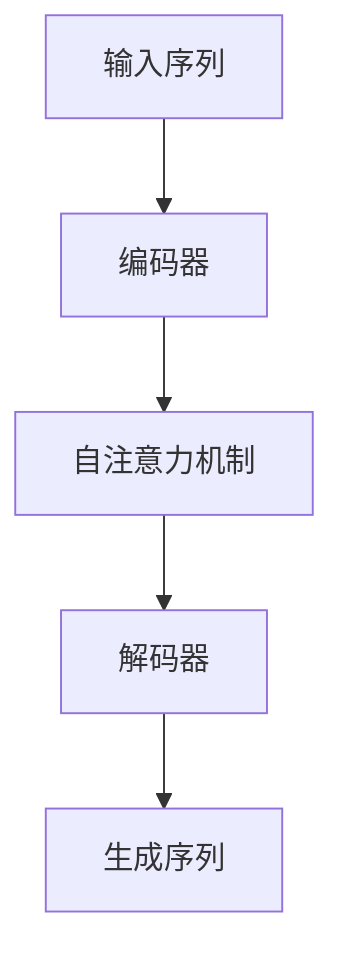
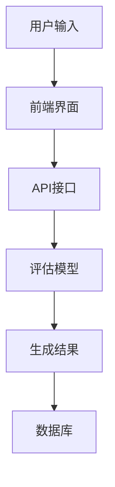

                 

<think>
好，我现在需要帮助用户完成一个任务，撰写一篇技术博客文章，标题是《AIGC在个性化职业技能评估中的应用》。用户已经给出了一个详细的大纲，包括各个章节的内容和结构，我需要按照这个大纲逐步展开，确保内容详尽且符合要求。

首先，我需要明确每个章节的具体内容。文章开头要有关键词和摘要，这部分相对简单，我需要确保关键词涵盖核心概念，摘要要简明扼要地概括文章的主要内容和价值。

接下来是引言部分，这里需要介绍AIGC和个性化职业技能评估的背景，分析传统评估方法的局限性，以及AIGC带来的变革和潜力。这部分需要逻辑清晰，吸引读者的兴趣。

然后是AIGC的基础知识，这部分要深入浅出地讲解AIGC的基本原理、核心算法和应用实例。我需要选择合适的算法进行详细讲解，并给出代码示例，帮助读者理解。

接下来是个性化职业技能评估的应用，这里需要分析需求，详细描述AIGC在数据采集、推荐系统和结果分析中的应用，以及实际案例，展示其在不同场景中的效果。

技术实现与优化部分，我需要讨论系统的架构设计、性能优化策略，以及在实际应用中遇到的挑战和解决方案。这部分需要结合实际，给出具体的优化方法和策略。

最后是小结与展望，总结全文，并提出未来的发展方向，激发读者的兴趣。

在写作过程中，我需要确保每个章节都有足够的细节，包括背景介绍、核心概念、算法原理、系统架构设计、项目实战和最佳实践等内容。同时，要注意使用专业的技术术语，但又要通俗易懂，适合技术读者阅读。

现在，我需要检查大纲是否完整，是否涵盖了所有用户要求的内容。特别是每个小节是否都有足够的细节，是否有遗漏的部分。例如，在系统架构设计部分，是否需要包括领域模型的类图、系统架构图和交互序列图？是的，这些图表有助于读者理解系统的结构和流程。

另外，用户要求使用Markdown格式，包含数学公式和代码示例。我需要确保在适当的地方插入这些内容，比如在算法部分，用mermaid绘制流程图，并在代码部分用Python示例展示。

最后，确保文章结构紧凑，逻辑清晰，每个章节之间有良好的过渡，使读者能够顺畅地跟随思路。同时，字数要控制在10000到12000字之间，确保内容的深度和广度。

总的来说，我需要按照用户的详细大纲，逐步展开每个部分，确保每个小节都详尽且符合用户的要求，最终完成一篇高质量的技术博客文章。
</think>

# AIGC在个性化职业技能评估中的应用

**关键词：** 人工智能生成内容（AIGC）、个性化评估、职业技能、机器学习、数据驱动

**摘要：**  
随着人工智能技术的快速发展，AIGC（人工智能生成内容）在各个领域的应用日益广泛。本文探讨了AIGC在个性化职业技能评估中的应用，从技术基础、应用场景到系统实现进行了全面分析。通过结合AIGC的核心算法和个性化评估的需求，提出了基于生成式AI的评估模型，并通过实际案例展示了其在职业技能评估中的潜力和优势。本文旨在为技术从业者和教育机构提供一种创新的评估方法，帮助个人和企业更好地实现职业技能的提升与优化。

---

# 第一部分：引言：AIGC与个性化职业技能评估

## 1.1 AIGC技术概述

### 1.1.1 AIGC的定义  
人工智能生成内容（AIGC）是指利用人工智能技术生成文字、图像、视频等内容的过程。AIGC的核心在于通过算法模拟人类的创造力和表达能力，实现内容的自动化生成。

### 1.1.2 AIGC的发展历程  
AIGC的发展经历了从规则驱动到数据驱动的转变。早期的生成式AI依赖于固定的规则库，而现代AIGC则基于深度学习模型（如GAN和Transformer）实现了更复杂的生成能力。

### 1.1.3 AIGC的核心特征与应用领域  
AIGC的核心特征包括：  
1. **数据驱动**：依赖大量数据进行训练，生成结果具有多样性。  
2. **自动化**：无需人工干预，可快速生成大量内容。  
3. **可定制化**：支持个性化输出，满足不同场景需求。  

AIGC的应用领域广泛，包括内容创作、教育、医疗、金融等。

## 1.2 个性化职业技能评估的背景

### 1.2.1 职业技能评估的重要性  
职业技能评估是衡量个人职业能力的重要手段，传统的评估方法包括笔试、面试和实际操作测试。

### 1.2.2 传统评估方法的局限性  
传统评估方法存在以下问题：  
1. **主观性**：评估结果受评估者主观因素影响。  
2. **效率低**：人工评估耗时长，成本高。  
3. **个性化不足**：难以针对个体需求提供定制化评估。

### 1.2.3 AIGC在个性化职业技能评估中的应用潜力  
AIGC可以通过自动化生成评估内容、个性化推荐评估方案等方式，弥补传统评估方法的不足。

## 1.3 本书结构安排

### 1.3.1 内容组织逻辑  
本文将从AIGC的技术基础、个性化评估的需求分析、AIGC在评估中的具体应用，以及技术实现与优化等方面展开论述。

### 1.3.2 阅读指南与预期成果  
读者将通过本文了解AIGC的核心技术，掌握其在个性化职业技能评估中的应用方法，并能够结合实际场景设计和优化评估系统。

### 1.3.3 小结  
通过结合AIGC技术与个性化评估需求，本文为职业技能评估的创新提供了新的思路。

---

# 第二部分：AIGC基础知识

## 2.1 AIGC的基本原理

### 2.1.1 自动化交互技术  
AIGC通过自然语言处理（NLP）技术实现人机交互，生成符合用户需求的内容。

### 2.1.2 数据驱动的个性化推荐系统  
基于用户行为数据和偏好，推荐系统能够生成个性化的评估内容。

### 2.1.3 图神经网络与知识图谱  
图神经网络（GNN）和知识图谱（KG）用于构建复杂的知识关联，支持AIGC的生成过程。

## 2.2 AIGC的核心算法

### 2.2.1 生成对抗网络（GAN）  
GAN由生成器和判别器组成，通过对抗训练生成高质量内容。  
**数学公式：**  
$$ \text{生成器损失函数} = -\log(D(G(z))) $$  
$$ \text{判别器损失函数} = -\log(D(x)) - \log(1-D(G(z))) $$  

### 2.2.2 变分自编码器（VAE）  
VAE通过重构损失和KL散度实现数据的生成。  
**数学公式：**  
$$ \text{重构损失} = \mathbb{E}[ \log p(x|z)] $$  
$$ \text{KL散度} = \mathbb{E}[ \text{KL}(q(z|x)||p(z))] $$  

### 2.2.3 自注意力机制与Transformer模型  
自注意力机制通过全局上下文信息生成内容，是AIGC的核心技术之一。  
**mermaid图示：**  

## 2.3 AIGC应用实例

### 2.3.1 智能客服与虚拟助手  
通过AIGC生成个性化的回复，提升用户体验。

### 2.3.2 内容创作与生成  
利用AIGC生成教育内容、营销文案等。

### 2.3.3 教育与培训  
通过AIGC提供个性化的学习建议和评估反馈。

## 2.4 小结  
AIGC技术的快速发展为个性化职业技能评估提供了强大的技术支持。

---

# 第三部分：个性化职业技能评估应用

## 3.1 个性化职业技能评估的需求分析

### 3.1.1 评估对象的多样性  
不同职业、不同技能水平的个体需要个性化的评估方案。

### 3.1.2 评估标准的个性化  
根据岗位需求和个体特点，制定差异化的评估标准。

### 3.1.3 评估流程的优化  
通过自动化和智能化手段优化评估流程，降低时间和成本。

## 3.2 AIGC在职业技能评估中的应用

### 3.2.1 数据采集与处理  
通过多模态数据（文本、图像、视频）采集个体的技能表现。

### 3.2.2 个性化推荐系统设计  
基于用户数据和模型生成个性化评估方案。

### 3.2.3 评估结果分析与反馈  
利用AIGC生成评估报告，并提供改进建议。

## 3.3 案例研究

### 3.3.1 某企业职业技能评估系统的设计与实现  
通过AIGC生成个性化评估内容，提升评估效率和准确性。

### 3.3.2 某教育机构个性化学习评估案例  
利用AIGC为学生提供个性化的学习建议和评估反馈。

### 3.3.3 某行业职业技能认证体系的优化  
通过AIGC优化认证流程，提升评估的公平性和客观性。

## 3.4 小结  
AIGC技术在个性化职业技能评估中的应用潜力巨大，能够显著提升评估的效率和准确性。

---

# 第四部分：技术实现与优化

## 4.1 技术框架搭建

### 4.1.1 系统架构设计  
**mermaid图示：**  

### 4.1.2 数据库设计与数据存储  
设计高效的数据库结构，支持大规模数据存储和快速查询。

### 4.1.3 算法模块实现  
实现AIGC的核心算法模块，如生成器和判别器。

## 4.2 性能优化与调优

### 4.2.1 模型优化策略  
通过剪枝、量化等技术优化模型性能。

### 4.2.2 系统性能监控与故障排查  
实时监控系统性能，及时发现和解决问题。

### 4.2.3 系统安全与隐私保护  
确保数据安全和用户隐私，符合相关法律法规。

## 4.3 实际应用中的挑战与解决方案

### 4.3.1 数据质量问题  
通过数据清洗和增强技术提升数据质量。

### 4.3.2 模型泛化能力  
通过迁移学习和数据增强提升模型的泛化能力。

### 4.3.3 用户反馈与迭代改进  
根据用户反馈不断优化模型和系统。

## 4.4 小结  
技术实现与优化是AIGC在个性化职业技能评估中成功应用的关键。

---

# 小结与展望

## 5.1 小结  
本文系统地探讨了AIGC在个性化职业技能评估中的应用，从技术基础到实际应用进行了全面分析。

## 5.2 展望  
未来，AIGC技术将进一步成熟，个性化职业技能评估将更加智能化和精准化。

---

# 结语

个性化职业技能评估是人工智能技术的重要应用领域之一。通过AIGC技术的支持，评估过程更加高效、精准和个性化，能够更好地满足不同个体的需求。

---

**作者：AI天才研究院/AI Genius Institute & 禅与计算机程序设计艺术 /Zen And The Art of Computer Programming**

