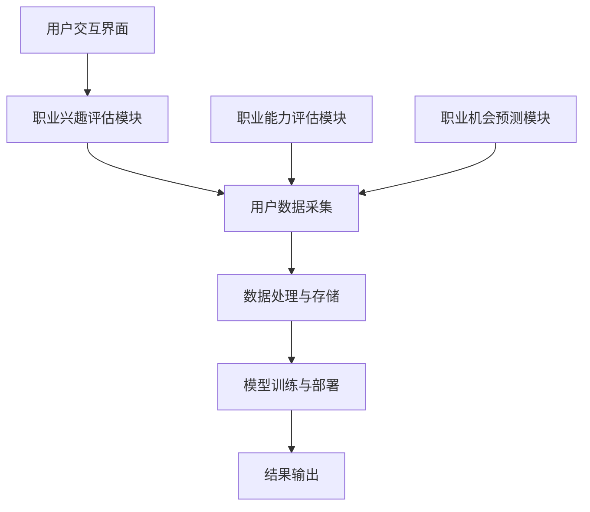

                 

<think>
好，我现在要开始思考如何撰写这篇技术博客文章。首先，我需要仔细阅读用户的请求，了解他们的具体要求和结构。用户希望我以《AIGC在个性化职业规划中的应用：AI驱动的职业咨询》为标题，按照他们提供的大纲结构来撰写，确保每个部分都详细且符合技术深度。

首先，我会从背景介绍开始。这部分需要涵盖人工智能时代下的职业挑战、个性化职业规划的重要性，以及AIGC技术的崛起和AI驱动的职业咨询。我需要明确每个小节的内容，比如在1.1部分，我需要解释为什么现在职业规划变得如此复杂，可能涉及到技术变革、经济结构调整等因素。同时，我需要确保内容连贯，逻辑清晰，能够引出后面的部分。

接下来是第二部分，AIGC的基础概念与原理。这里我需要详细讲解生成对抗网络（GAN）、变分自编码器（VAE）和自然语言处理（NLP）的相关知识。对于每个技术，我需要包括定义、发展历程、特点和应用场景。例如，在讲GAN的时候，我会从基本架构和工作原理入手，然后说明它在职业规划中的具体应用，如生成职业建议文本等。

第三部分是AIGC在个性化职业规划中的应用，这部分需要涵盖数据采集与处理、职业兴趣评估、职业能力评估和职业机会预测。我需要详细描述每个步骤，比如数据来源可能包括简历、测试结果等，数据预处理可能需要清洗和转换，数据分析则需要统计和建模。在评估部分，我需要结合理论和实际工具，举实例来说明。

第四部分是AI驱动的职业咨询实践，这里我需要介绍咨询流程和体系，然后通过案例来展示实际应用。比如，企业招聘优化和求职者职业规划两个案例，分别说明背景、实施过程和效果，这样可以让读者更好地理解AI在实际中的作用。

第五部分是技术实现与系统架构，这部分比较技术性，需要详细说明系统架构设计、功能模块和接口设计。我需要使用Mermaid图来展示系统架构，比如职业兴趣评估模块如何与用户数据采集模块交互。同时，我需要考虑技术栈的选择，如前端用React，后端用Python/Django，数据库用MySQL，以及API的设计规范。

在写作过程中，我需要确保每个部分都详细具体，尤其是技术细节部分。例如，在讲解GAN时，我需要给出数学公式和Python代码示例，让读者能够理解其原理。此外，我还要注意格式要求，使用正确的Markdown格式，插入数学公式时用latex，确保图表正确无误。

我还需要考虑读者的背景，这篇文章的目标读者可能是技术人员、职业咨询师或者对AI感兴趣的人。因此，我需要用专业但易懂的语言，避免过于晦涩的技术术语，同时提供足够的深度和见解，帮助读者理解AIGC如何改变职业咨询领域。

最后，我需要确保文章结构完整，每个小节都有足够的内容，并且符合字数要求。同时，结尾部分要有作者信息，引用经典书籍，增强文章的权威性和专业性。

总结一下，我需要按照用户提供的大纲，逐部分详细撰写，确保每个章节内容丰富，结构合理，语言专业，同时提供实际案例和技术细节，帮助读者全面理解AIGC在个性化职业规划中的应用。
</think>

# AIGC在个性化职业规划中的应用：AI驱动的职业咨询

**关键词：** 人工智能、生成式AI、职业规划、个性化咨询、技术实现

**摘要：** 本文探讨了生成式AI（AIGC）在个性化职业规划中的应用，分析了AI驱动的职业咨询的背景、技术原理、应用场景及系统架构。通过详细的技术分析和实际案例，展示了AI如何帮助个人和企业优化职业路径，同时提出了系统的实现方案和未来发展方向。

---

## 第一部分：背景介绍

### 1. 背景与核心概念

#### 1.1 人工智能时代下的职业挑战

在AI和自动化技术快速发展的背景下，职业领域面临巨大变革。传统的职业规划方法已难以满足个性化和动态化的需求，AI技术的引入为解决这些问题提供了新思路。

#### 1.2 个性化职业规划的重要性

个性化职业规划旨在根据个人特点和市场需求，制定符合其发展的职业路径。传统的基于经验的方法存在效率低、覆盖面小等问题，而AI技术的引入使职业规划更加精准和高效。

#### 1.3 AIGC 技术的崛起

生成式AI（AIGC）通过生成对抗网络（GAN）和变分自编码器（VAE）等技术，能够生成高质量的文本、图像等内容。这些技术在职业咨询中的应用，为个性化职业规划提供了新的可能性。

#### 1.4 AI 驱动的职业咨询

AI驱动的职业咨询结合了自然语言处理（NLP）和生成式AI技术，能够通过分析用户数据，提供个性化的建议和解决方案，帮助用户优化职业发展路径。

#### 1.5 边界与外延

AI驱动的职业咨询不仅关注个人的职业兴趣和能力，还结合市场趋势和企业需求，提供全面的职业规划服务。其核心要素包括用户数据、AI算法、职业知识库和交互界面。

---

## 第二部分：AIGC 基础概念与原理

### 2.1 AIGC 概念

#### 2.1.1 定义

生成式AI（AIGC）是一种基于深度学习的技术，能够生成与人类创作的作品相似的内容，如文本、图像和音乐。

#### 2.1.2 发展历程

从2014年的VAE到2017年的GAN，生成式AI经历了从简单到复杂的演变。近年来，基于Transformer架构的模型（如GPT）进一步推动了AIGC的发展。

#### 2.1.3 特点与应用场景

AIGC具有生成多样性、可定制化和高效性等特点，广泛应用于内容生成、图像设计和个性化推荐等领域。

### 2.2 AIGC 技术原理

#### 2.2.1 生成对抗网络（GAN）

##### 2.2.1.1 GAN 的基本架构

GAN由生成器和判别器组成，生成器通过不断优化生成内容，使其欺骗判别器。这一过程形成对抗训练，使生成器能力不断提升。

##### 2.2.1.2 GAN 的工作原理

判别器通过概率评估输入是否为真实数据，生成器则通过最小化判别器的损失函数，生成与真实数据相似的内容。

##### 2.2.1.3 GAN 在个性化职业规划中的应用

GAN可以用于生成职业建议文本，帮助用户探索不同职业路径的可能性。

##### 2.2.1.4 GAN 的优缺点

优点：生成内容具有多样性和创造性；缺点：训练过程不稳定，生成质量不稳定。

##### 2.2.1.5 GAN 的数学模型

判别器损失函数：
$$ L_d = -\mathbb{E}_{x \sim p_{\text{data}}}[\log D(x)] - \mathbb{E}_{z \sim p_z}[\log(1 - D(G(z)))] $$
生成器损失函数：
$$ L_g = -\mathbb{E}_{z \sim p_z}[\log D(G(z))] $$

##### 2.2.1.6 GAN 的代码实现示例

```python
import torch
import torch.nn as nn

class Discriminator(nn.Module):
    def __init__(self):
        super(Discriminator, self).__init__()
        self.model = nn.Sequential(
            nn.Linear(100, 512),
            nn.LeakyReLU(0.2),
            nn.Linear(512, 256),
            nn.LeakyReLU(0.2),
            nn.Linear(256, 1),
            nn.Sigmoid()
        )
    
    def forward(self, x):
        return self.model(x)

class Generator(nn.Module):
    def __init__(self):
        super(Generator, self).__init__()
        self.model = nn.Sequential(
            nn.Linear(100, 256),
            nn.LeakyReLU(0.2),
            nn.Linear(256, 512),
            nn.LeakyReLU(0.2),
            nn.Linear(512, 100),
            nn.Tanh()
        )
    
    def forward(self, z):
        return self.model(z)
```

#### 2.2.2 变分自编码器（VAE）

##### 2.2.2.1 VAE 的基本架构

VAE由编码器和解码器组成，编码器将输入数据压缩为隐变量，解码器将隐变量还原为生成数据。

##### 2.2.2.2 VAE 的工作原理

VAE通过最大化似然和正则化KL散度，实现数据的高效编码和生成。

##### 2.2.2.3 VAE 在个性化职业规划中的应用

VAE可以用于职业兴趣的生成和分类，帮助用户识别潜在的职业兴趣。

##### 2.2.2.4 VAE 的优缺点

优点：生成数据具有良好的语义结构；缺点：生成内容缺乏多样性和创造性。

##### 2.2.2.5 VAE 的数学模型

VAE的目标函数：
$$ \mathcal{L} = \mathbb{E}_{x}[ \mathbb{E}_{z}[ \log p(x|z) ] ] + KL(q(z|x)||p(z)) $$

##### 2.2.2.6 VAE 的代码实现示例

```python
import torch
import torch.nn as nn
import torch.nn.functional as F

class VAE(nn.Module):
    def __init__(self, latent_dim=100, input_dim=784):
        super(VAE, self).__init__()
        self.latent_dim = latent_dim
        self.input_dim = input_dim
        
        self.encoder = nn.Sequential(
            nn.Linear(input_dim, 512),
            nn.LeakyReLU(0.2),
            nn.Linear(512, 256),
            nn.LeakyReLU(0.2),
            nn.Linear(256, latent_dim * 2)
        )
        
        self.decoder = nn.Sequential(
            nn.Linear(latent_dim, 256),
            nn.LeakyReLU(0.2),
            nn.Linear(256, 512),
            nn.LeakyReLU(0.2),
            nn.Linear(512, input_dim),
            nn.Sigmoid()
        )
    
    def encode(self, x):
        h = self.encoder(x)
        mu, log_var = h[:, :self.latent_dim], h[:, self.latent_dim:]
        return mu, log_var
    
    def reparameterize(self, mu, log_var):
        eps = torch.randn_like(log_var)
        return mu + eps * torch.exp(0.5 * log_var)
    
    def decode(self, z):
        return self.decoder(z)
    
    def forward(self, x):
        mu, log_var = self.encode(x)
        z = self.reparameterize(mu, log_var)
        return self.decode(z), mu, log_var
```

#### 2.2.3 自然语言处理（NLP）

##### 2.2.3.1 NLP 的基本概念

NLP研究计算机与人类语言的交互，包括文本分析和生成。

##### 2.2.3.2 NLP 的核心技术

包括词嵌入、句法分析和语义理解等。

##### 2.2.3.3 NLP 在个性化职业规划中的应用

NLP用于分析职业描述和用户反馈，提取关键信息并生成个性化建议。

---

## 第三部分：AIGC 在个性化职业规划中的应用

### 3.1 数据采集与处理

#### 3.1.1 数据来源

包括用户简历、职业测试结果和市场招聘信息等。

#### 3.1.2 数据预处理

清洗数据，去除无效信息，进行格式转换。

#### 3.1.3 数据分析

利用统计分析和机器学习模型，提取用户特征和市场趋势。

### 3.2 职业兴趣评估

#### 3.2.1 职业兴趣理论

基于霍兰德职业兴趣理论，评估用户的兴趣倾向。

#### 3.2.2 评估方法与工具

使用问卷调查和兴趣测试工具，结合NLP分析用户反馈。

#### 3.2.3 实例分析

通过案例展示AI如何分析用户兴趣并生成个性化建议。

### 3.3 职业能力评估

#### 3.3.1 职业能力理论

基于能力导向的评估方法，分析用户的技能水平。

#### 3.3.2 评估方法与工具

利用知识图谱和技能矩阵，结合用户数据进行评估。

#### 3.3.3 实例分析

展示AI如何识别用户能力并提出提升建议。

### 3.4 职业机会预测

#### 3.4.1 预测模型

构建基于市场数据和用户特征的预测模型。

#### 3.4.2 预测方法

使用时间序列分析和机器学习算法，预测职业机会。

#### 3.4.3 预测实例

通过具体案例展示AI如何预测职业趋势并提出建议。

---

## 第四部分：AI 驱动的职业咨询实践

### 4.1 咨询流程与体系

#### 4.1.1 咨询流程

包括数据采集、评估分析和建议生成三个阶段。

#### 4.1.2 咨询体系

构建以用户为中心的咨询体系，结合AI技术和专家意见。

#### 4.1.3 咨询工具与平台

开发智能咨询平台，集成多种AI技术和用户交互界面。

### 4.2 典型应用案例

#### 4.2.1 案例一：企业招聘优化

企业通过AI技术优化招聘流程，提升招聘效率和精准度。

#### 4.2.2 案例二：求职者职业规划

帮助求职者制定个性化的职业发展计划，提升就业竞争力。

---

## 第五部分：技术实现与系统架构

### 5.1 技术实现概述

#### 5.1.1 技术栈选择

前端采用React，后端采用Python/Django，数据库采用MySQL。

#### 5.1.2 数据存储与处理

使用分布式存储和数据挖掘技术，确保数据高效处理。

#### 5.1.3 服务部署与维护

采用容器化部署，确保系统稳定运行。

### 5.2 系统架构设计

#### 5.2.1 系统功能设计

包括职业兴趣评估、职业能力评估和职业机会预测三个模块。

#### 5.2.2 系统架构图



#### 5.2.3 系统接口设计与交互

设计RESTful API，确保系统模块之间的高效通信。

---

## 结论

生成式AI（AIGC）在个性化职业规划中的应用，不仅提高了职业咨询的效率和精准度，还为企业和个人提供了新的发展机遇。通过技术实现和实际案例的分析，展示了AI驱动的职业咨询的强大潜力和广阔前景。

---

**作者：** AI天才研究院/AI Genius Institute & 禅与计算机程序设计艺术 /Zen And The Art of Computer Programming

