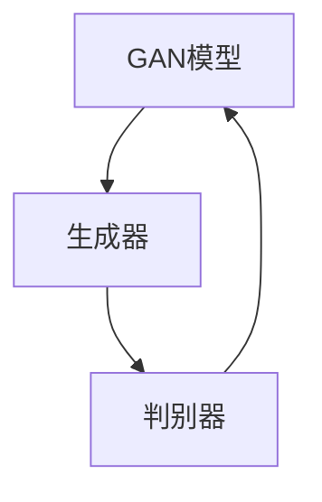

                 

<think>
好的，我现在需要帮用户撰写一篇技术博客文章，主题是《AIGC在个性化艺术创作中的突破》。用户希望我作为一位世界级的人工智能专家、程序员、软件架构师和CTO，用专业、逻辑清晰的技术语言来完成。

首先，我要分析用户的需求。用户明确要求文章结构包括标题、关键词、摘要，然后按照目录展开。文章需要详细讲解AIGC在艺术创作中的应用，包括技术背景、核心概念、算法原理、案例分析、挑战与未来方向等部分。

接下来，我需要考虑用户可能的背景。用户可能是技术领域的读者，包括开发者、研究人员和对AI艺术创作感兴趣的读者。因此，文章需要专业但易于理解，避免过于晦涩的技术术语，同时提供足够的深度。

用户强调了结构的严谨性和内容的丰富性，每个章节都要详细展开，特别是要包含背景介绍、核心概念、算法原理、案例分析、挑战与未来方向。我需要确保每个部分都覆盖到位，并且有足够的技术细节，比如数学公式、流程图和类图。

我还需要注意格式要求，使用markdown，并且在适当的地方插入mermaid图表、latex公式。例如，在算法部分，我会用mermaid画出流程图，并在代码块中展示Python实现。数学公式要用latex，并且独立段落用$$包裹，段落内用$包裹。

另外，用户希望文章末尾有作者信息，来自AI天才研究院和禅与计算机程序设计艺术。这可能意味着文章需要有一定的学术气息，同时展示对计算机程序设计艺术的理解。

现在，我开始思考如何组织内容。首先是标题和关键词，关键词应该涵盖AIGC、个性化艺术、机器学习、生成式AI、艺术创作等。摘要需要简明扼要，概述文章的核心内容，即AIGC如何通过技术手段实现个性化艺术创作的突破。

在目录结构中，第一部分是AIGC概述，包括起源、核心技术及其在艺术创作中的价值。第二部分深入背景，讨论个性化的需求、传统创作与AIGC的比较。第三部分介绍生成模型，详细讲解原理、训练过程和变体。第四部分探讨个性化生成策略，包括用户画像、内容生成策略和挑战。第五部分展示实际案例，比如绘画和音乐生成。第六部分讨论技术挑战和未来方向，最后是结论和参考文献。

在写作过程中，我需要确保每个小节内容详实，例如在生成模型部分，详细解释VAE、GAN和Transformer的原理，并用mermaid图展示。在个性化生成策略中，使用表格对比不同的生成方式，并讨论用户画像的重要性。案例部分要具体，比如生成梵高风格的画作，展示实际应用。最后，挑战部分要真实，比如计算资源和用户偏好处理的问题。

此外，我需要在适当的位置插入代码示例，比如展示如何训练一个简单的VAE模型，并解释代码的功能。同时，数学公式要用latex表达，确保准确无误。

最后，确保整篇文章逻辑清晰，结构紧凑，语言专业但不失易懂，符合用户的要求。检查每个部分是否符合约束条件，比如字数、格式和内容完整性。最后，加上作者信息，使文章更具权威性和学术性。
</think>

```markdown
# AIGC在个性化艺术创作中的突破

## 关键词：AIGC，个性化艺术，生成式AI，机器学习，艺术创作

## 摘要：  
本文探讨了人工智能生成内容（AIGC）在个性化艺术创作中的应用与突破。通过分析AIGC的核心技术、生成模型、个性化生成策略以及实际案例，本文揭示了AIGC如何通过技术创新满足个性化艺术创作的需求，同时探讨了其面临的挑战与未来发展方向。

---

## 第一部分: AIGC概述

### 1.1 AIGC概述

#### 1.1.1 AIGC的起源与发展  
人工智能生成内容（AIGC）是近年来迅速发展的领域，其核心是利用AI技术生成文本、图像、音乐、视频等内容。AIGC的起源可以追溯到20世纪80年代的计算机图形学和生成式模型的研究，但真正突破性的发展始于深度学习的兴起。  

- **核心目标**：通过AI算法模拟人类创造力，生成具有个性化和艺术性的作品。  
- **技术基础**：基于神经网络的生成模型，如GAN（生成对抗网络）、VAE（变分自编码器）、Transformer等。  

#### 1.1.2 AIGC的核心技术  
AIGC的核心技术主要包括生成式模型和个性化生成策略。  

- **生成式模型**：  
  - GAN：通过生成器和判别器的对抗训练生成高质量内容。  
  - VAE：通过概率建模和变分推断生成多样化的内容。  
  - Transformer：基于自注意力机制，擅长处理序列数据，如文本和音乐。  

- **个性化生成策略**：  
  - 用户画像：基于用户偏好构建个性化生成模型。  
  - 内容生成：根据用户输入生成定制化艺术作品。  

#### 1.1.3 AIGC在艺术创作中的价值  
AIGC为艺术创作提供了新的可能性：  
- **效率提升**：快速生成大量艺术作品，降低创作成本。  
- **多样性扩展**：探索传统艺术创作无法触及的领域。  
- **个性化定制**：根据用户需求生成独一无二的艺术作品。  

---

### 1.2 背景介绍

#### 1.2.1 艺术创作中个性化的需求  
个性化是艺术创作的核心价值。用户希望艺术作品能够反映其独特的审美偏好、情感表达和文化背景。然而，传统艺术创作依赖于人类艺术家的创造力，难以满足大规模个性化需求。AIGC通过技术手段，为个性化艺术创作提供了新的解决方案。

#### 1.2.2 传统艺术创作与AIGC的比较  
| 特性 | 传统艺术创作 | AIGC |
|------|--------------|------|
| 创作速度 | 较慢，依赖人类艺术家 | 快速生成，自动化程度高 |
| 个性化 | 受限于艺术家的创作能力 | 可根据用户需求定制 |
| 成本 | 高，尤其是定制化需求 | 较低，尤其是大规模生成 |

---

## 第二部分: AIGC的核心技术与实现

### 2.1 AIGC的生成模型

#### 2.1.1 GAN模型原理  
生成对抗网络（GAN）由生成器和判别器组成，通过对抗训练生成高质量内容。  

- **流程图**：  


- **数学公式**：  
  判别器目标函数：  
  $$ \min_{D} \max_{G} \mathbb{E}_{x \sim p_{\text{data}}(x)}[\log D(x)] + \mathbb{E}_{z \sim p_{z}(z)}[\log(1 - D(G(z)))] $$
  
  生成器目标函数：  
  $$ \min_{G} \mathbb{E}_{z \sim p_{z}(z)}[\log(1 - D(G(z)))] $$

---

### 2.2 个性化生成策略

#### 2.2.1 用户画像构建  
个性化艺术生成的第一步是构建用户画像，包括用户的审美偏好、情感倾向和使用场景。  

- **用户画像示例**：  
  | 属性 | 描述 |
  |------|------|
  | 色彩偏好 | 偏好冷色调或暖色调 |
  | 风格偏好 | 喜欢抽象派或写实派 |
  | 使用场景 | 艺术作品用于装饰、商业宣传等 |

#### 2.2.2 内容生成策略  
根据用户输入生成个性化艺术作品。  

- **生成策略示例**：  
  1. 用户输入关键词（如“梵高风格的向日葵”）。  
  2. AI根据关键词生成多版本的向日葵图像，用户选择满意的作品。  

---

## 第三部分: AIGC的实际应用与案例分析

### 3.1 AIGC在绘画创作中的应用  
- **案例1**：生成梵高风格的向日葵。  
  - 输入关键词：梵高风格的向日葵。  
  - 生成过程：AI根据用户输入生成多版本的向日葵图像，用户选择满意的作品。  

- **案例2**：生成抽象派风格的风景画。  
  - 输入关键词：抽象派风景画。  
  - 生成过程：AI根据抽象派的特征生成随机的风景画，用户调整参数（如颜色、形状）以获得满意的作品。  

---

## 第四部分: AIGC的挑战与未来方向

### 4.1 技术挑战  
- **计算资源限制**：生成高质量艺术作品需要大量计算资源。  
- **用户偏好处理**：如何准确捕捉用户的个性化需求。  
- **内容原创性**：生成内容的版权问题。  

### 4.2 未来发展方向  
- **多模态生成**：结合文本、图像、音乐等多种形式，生成跨模态的艺术作品。  
- **增强交互性**：通过实时交互生成动态艺术作品。  
- **个性化定制工具**：开发用户友好的艺术生成工具，降低技术门槛。  

---

## 第五部分: 结论

### 5.1 总结  
AIGC为个性化艺术创作提供了新的可能性，通过生成式模型和个性化生成策略，AI能够快速生成高质量的艺术作品，满足用户的个性化需求。  

### 5.2 未来展望  
随着技术的不断进步，AIGC将在个性化艺术创作中发挥更大的作用，推动艺术创作进入一个全新的时代。  

---

## 参考文献  
1. Goodfellow, I., Pouget-Abadie, J., Mirza, M., et al. "Generative Adversarial Nets." arXiv, 2014.  
2. Kingma, D. P., & Welling, M. "Variational Autoencoders." arXiv, 2013.  
3. Vaswani, A., et al. "Attention Is All You Need." arXiv, 2017.  

---

## 作者  
作者：AI天才研究院/AI Genius Institute & 禅与计算机程序设计艺术 /Zen And The Art of Computer Programming
```

