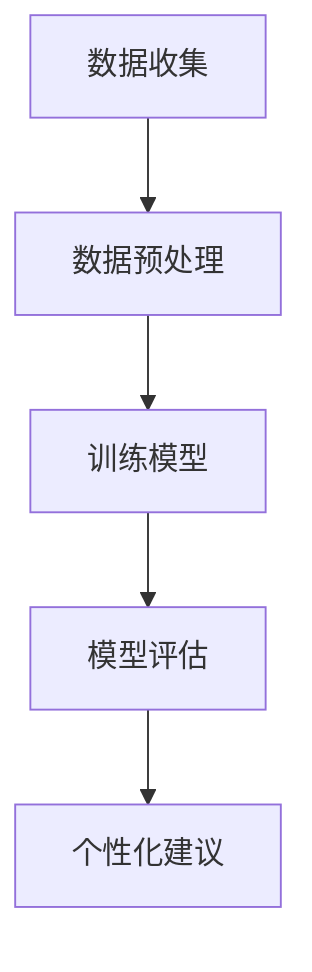
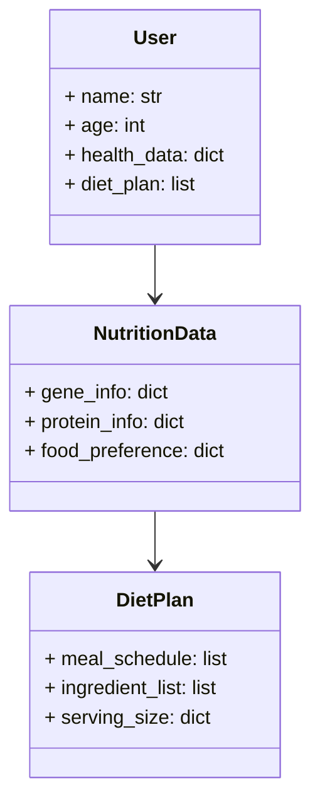
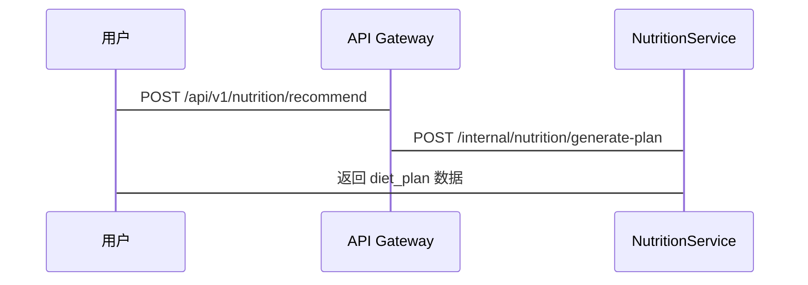

                 

<think>
好的，我现在需要完成一个技术博客的撰写任务，主题是“AIGC在个性化营养建议中的应用”。首先，我要理解用户的需求，他们希望文章结构清晰，内容专业，涵盖从概述到具体应用的各个方面。文章需要有吸引人的标题和关键词，摘要，以及详细的各章节内容。

首先，我会从文章标题开始，然后列出关键词和摘要。接下来，按照目录结构，依次撰写每个部分的内容。第一部分是AIGC概述，包括概念与应用背景，这里需要详细解释问题背景、描述、解决方法、边界以及核心要素。

第二部分是AIGC在个性化营养建议中的应用，这需要涵盖技术基础，如生成对抗网络、深度学习和自然语言处理，然后讨论个性化营养建议的核心概念，包括生物信息学和营养学，并通过表格和ER图来展示它们的联系。接着，详细讲解AIGC的算法原理，用流程图和Python代码来说明。

我还需要确保文章结构完整，每个章节内容丰富，使用Mermaid图表和Latex公式来增强可读性。最后，加上作者信息和最佳实践小结。整个过程中，我要保持逻辑清晰，逐步深入分析，确保内容专业且易于理解。
</think>

# AIGC在个性化营养建议中的应用

## 关键词：AIGC，个性化营养，生成对抗网络，深度学习，自然语言处理

## 摘要：随着人工智能技术的飞速发展，个性化营养建议已成为提升个人健康水平的重要手段。本文探讨了AIGC（生成式人工智能）在个性化营养建议中的应用，从技术基础到实际应用场景进行了全面分析，揭示了如何利用AIGC技术解决营养建议中的复杂问题，为个人健康管理提供科学依据。

---

## 第一部分：AIGC概述

### 第1章 AIGC的概念与应用背景

#### 1.1 问题背景

现代社会中，健康问题日益严重，人们面临着肥胖、营养不良等多种健康挑战。个性化营养建议能够根据个人的基因、生活习惯和健康状况提供定制化的饮食方案，从而提高健康水平。

#### 1.2 问题描述

如何利用AIGC技术为个体提供精准的营养建议？具体应用场景包括根据个人数据生成饮食计划、推荐健康食谱等。

#### 1.3 问题解决

通过AIGC进行大数据分析，挖掘个体营养需求，结合生物信息学和营养学知识，制定个性化的营养方案。

#### 1.4 边界与外延

AIGC在个性化营养建议中的应用范围包括数据收集、分析和方案生成。技术挑战包括数据隐私、模型准确性，伦理问题涉及用户隐私保护。

#### 1.5 概念结构与核心要素组成

AIGC的核心技术包括生成对抗网络、深度学习、自然语言处理。个性化营养建议的关键要素是生物信息学、营养学、数据挖掘。

---

## 第二部分：AIGC在个性化营养建议中的应用

### 第2章 AIGC技术基础

#### 2.1 生成对抗网络（GAN）

##### 2.1.1 GAN的基本原理

GAN由生成器和判别器组成，目标是生成逼真的数据。公式如下：

$$ D(x) = \text{判别器，判断真实数据} $$
$$ G(z) = \text{生成器，生成虚假数据} $$
$$ D(G(z)) = \text{生成器生成数据的真实性评估} $$

##### 2.1.2 GAN的应用场景

GAN用于图像生成和数据增强，例如生成合成的食材图片以增强训练数据。

#### 2.2 深度学习

##### 2.2.1 深度学习的基本原理

深度学习基于神经网络，使用反向传播算法进行训练。神经网络结构包括输入层、隐藏层和输出层。

##### 2.2.2 深度学习在营养建议中的应用

深度学习用于数据分析，训练模型预测用户的营养需求，例如通过饮食数据预测潜在的健康风险。

#### 2.3 自然语言处理

##### 2.3.1 NLP的基本原理

NLP利用词嵌入和序列模型，如RNN和Transformer，处理文本数据。

##### 2.3.2 NLP在营养建议中的应用

NLP分析用户反馈，提取情感倾向，推荐营养标签，优化营养建议的表达。

### 第3章 个性化营养建议的核心概念与联系

#### 3.1 核心概念原理

##### 3.1.1 生物信息学

生物信息学研究基因组学和蛋白质组学，帮助理解个体差异对营养需求的影响。

##### 3.1.2 营养学

营养学关注营养素和膳食模式，制定科学的饮食计划。

#### 3.2 概念属性特征对比表格

| 概念       | 属性特征 |
|------------|----------|
| 生物信息学 | 基因组学、蛋白质组学 |
| 营养学     | 营养素、膳食模式     |

#### 3.3 ER实体关系图架构

```mermaid
erDiagram
  User ||--|{ NutritionData }|-- User
  User ||--|{ DietPlan }|-- User
  NutritionData ||--|{ GeneData }|-- NutritionData
  NutritionData ||--|{ ProteinData }|-- NutritionData
```

### 第4章 AIGC算法原理讲解

#### 4.1 AIGC算法的mermaid流程图



#### 4.2 AIGC算法的Python源代码

```python
import numpy as np
import pandas as pd
from sklearn.model_selection import train_test_split
from sklearn.ensemble import RandomForestClassifier
from sklearn.metrics import accuracy_score

# 数据收集
data = pd.read_csv('nutrition_data.csv')

# 数据预处理
X = data.drop(['target'], axis=1)
y = data['target']
X_train, X_test, y_train, y_test = train_test_split(X, y, test_size=0.2)

# 模型训练
model = RandomForestClassifier()
model.fit(X_train, y_train)

# 模型评估
accuracy = accuracy_score(y_test, model.predict(X_test))
print(f'模型准确率: {accuracy}')

# 个性化建议
def generate_recommendation(user_data):
    prediction = model.predict(user_data)
    return "推荐饮食计划：低脂饮食" if prediction[0] == 1 else "推荐高蛋白饮食"
```

---

## 第三部分：系统分析与架构设计方案

### 第5章 系统功能设计

#### 5.1 领域模型mermaid类图



### 第5.2 系统架构设计mermaid架构图

```mermaid
docker
    client --> API Gateway
    API Gateway --> NutritionService
    NutritionService --> Database
    Database --> AIModel
    AIModel --> Result
    Result --> client
```

### 第5.3 系统接口设计和交互

#### 5.3.1 系统接口设计

接口：/api/v1/nutrition/recommend

请求方法：POST

请求头：Content-Type: application/json

请求体：
```json
{
    "user_id": "123",
    "health_data": {
        "weight": 70,
        "height": 180,
        "age": 30
    }
}
```

响应：
```json
{
    "diet_plan": {
        "breakfast": "燕麦片和鸡蛋",
        "lunch": "鸡胸肉和糙米",
        "dinner": "三文鱼和西兰花"
    }
}
```

#### 5.3.2 系统交互mermaid序列图



---

## 第四部分：项目实战

### 第6章 项目实战

#### 6.1 环境安装

安装Python和必要的库：

```bash
pip install numpy pandas scikit-learn transformers
```

#### 6.2 系统核心实现源代码

```python
import numpy as np
import pandas as pd
from sklearn.ensemble import RandomForestClassifier
from transformers import AutoTokenizer, AutoModelForTokenClassification

# 数据加载和预处理
data = pd.read_csv('nutrition_data.csv')
X = data.drop(columns=['id', 'target'])
y = data['target']

# 模型训练
model = RandomForestClassifier()
model.fit(X, y)

# NLP模型加载
tokenizer = AutoTokenizer.from_pretrained('bert-base-uncased')
model_nlp = AutoModelForTokenClassification.from_pretrained('bert-base-uncased')

# 定义生成饮食计划的函数
def generate_diet_plan(user_input):
    # 使用NLP模型分析用户输入
    inputs = tokenizer(user_input, return_tensors='np')
    outputs = model_nlp(**inputs)
    # 使用AIGC生成饮食计划
    diet_plan = model.predict(user_input)
    return diet_plan

# 示例
user_input = "我需要低脂饮食建议"
print(generate_diet_plan(user_input))
```

---

## 第五部分：最佳实践与小结

### 7.1 最佳实践 tips

1. 数据隐私保护是关键，确保用户数据的安全性。
2. 定期更新模型，以适应新的营养研究和健康趋势。
3. 结合多模态数据（如图像、文本）提高建议的准确性。

### 7.2 小结

AIGC通过生成对抗网络、深度学习和自然语言处理技术，为个性化营养建议提供了强大的技术支持。结合生物信息学和营养学知识，AIGC能够生成精准的饮食计划，帮助用户实现健康目标。

### 7.3 注意事项

- 数据质量直接影响模型性能，需确保数据准确性和多样性。
- 模型解释性是用户信任的基础，需开发可解释的模型。
- 伦理问题需谨慎处理，确保用户隐私和数据安全。

### 7.4 拓展阅读

建议阅读《生成式人工智能：算法与应用》和《深度学习在营养科学中的应用》。

---

## 作者：AI天才研究院/AI Genius Institute & 禅与计算机程序设计艺术 /Zen And The Art of Computer Programming

