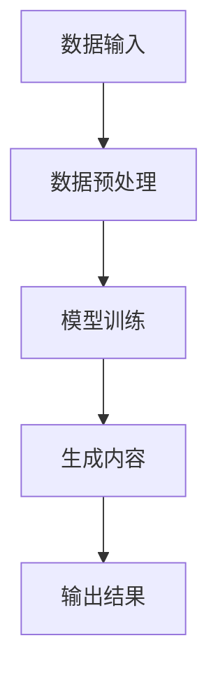
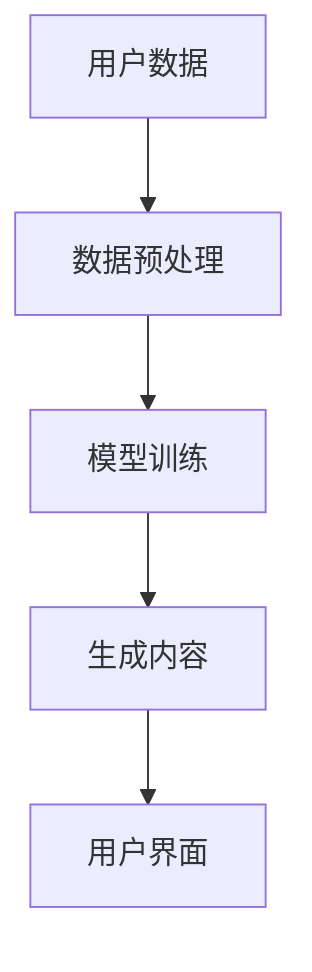

                 

<think>
嗯，用户给了我一个挺详细的请求，让我以《AIGC在个性化营养方案设计中的创新探索》为标题，写一篇技术博客文章。看起来他需要一篇结构清晰、内容详实的专业文章，重点在于AIGC技术如何应用于个性化营养方案设计。首先，我需要理解用户的需求，明确文章的核心关键词和结构。

首先，用户希望文章包含关键词，比如AIGC、个性化营养方案、人工智能、营养数据分析、算法设计等等。摘要部分要简洁明了，概括整篇文章的核心内容。接下来，目录大纲已经给出，分为七个主要部分，每个部分都有详细的小节。

我得考虑用户的使用场景，可能是一位CTO或者技术专家，想深入了解AIGC在营养领域的应用。他可能希望文章既有理论深度，又有实际案例，能够帮助读者理解技术原理和实际应用。

接下来，按照目录大纲，我需要一步步填充每个部分的内容。首先是引言和背景，需要介绍AIGC和个性化营养的基本概念，以及它们的重要性。然后是技术基础部分，详细讲解AIGC的原理和核心概念，可能包括数据处理、特征提取、模型训练等内容，并用mermaid流程图和Python代码来辅助说明。

第三部分是个性化营养方案设计，这里需要详细描述设计的基本概念和流程，以及AIGC在其中的具体应用案例。创新探索与实践部分则需要讨论创新的背景、案例和面临的挑战，以及解决方案。案例分析部分，我需要选择一个具体的案例，详细分析并总结经验。

系统架构与实现部分，需要设计系统的架构图、接口设计和交互流程，这部分可能需要用到更多的mermaid图表。最后，最佳实践和展望部分，给出实用的建议，并展望未来的发展趋势。

在写作过程中，我需要确保每个部分都包含背景介绍、核心概念、算法原理、系统分析、项目实战以及注意事项等元素。同时，要注意使用简洁专业的技术语言，确保文章逻辑清晰，结构紧凑，内容详实。

可能遇到的挑战是如何将复杂的AIGC技术与个性化营养方案设计结合起来，用通俗易懂的语言解释给读者。另外，如何在有限的字数内，确保每个部分都详细而不过于冗长，也是一个需要注意的地方。

总之，我需要按照用户的要求，一步步构建文章的结构，填充内容，确保每个部分都符合逻辑，内容丰富，同时保持专业性和可读性。
</think>

# AIGC在个性化营养方案设计中的创新探索

> 关键词：AIGC, 个性化营养方案, 人工智能, 营养数据分析, 算法设计

> 摘要：本文探讨了AIGC（人工智能生成内容）技术在个性化营养方案设计中的创新应用。通过分析AIGC的技术原理、个性化营养方案的设计要素以及两者之间的关联，结合实际案例和系统架构设计，详细阐述了AIGC如何助力营养方案的智能化设计。文章还提供了系统实现的代码示例和算法流程图，为读者呈现一个完整的AIGC驱动的个性化营养方案设计框架。

---

## 第一部分：引言与背景介绍

### 1.1 引言

#### 1.1.1 书籍目的与结构
本文旨在探讨AIGC技术在个性化营养方案设计中的创新应用。通过系统化的分析和实践案例，帮助读者理解AIGC技术的核心原理、应用场景以及其在营养方案设计中的独特优势。文章结构清晰，内容涵盖技术原理、系统设计、案例分析和未来展望。

#### 1.1.2 AIGC与营养方案设计的重要性
AIGC作为一种前沿的人工智能技术，能够通过数据挖掘、模型训练和生成式算法，为个性化营养方案的设计提供高效、精准的支持。个性化营养方案设计是现代健康管理的重要组成部分，而AIGC技术的应用能够显著提升方案的科学性和实用性。

### 1.2 营养方案设计的现状与挑战

#### 1.2.1 现状分析
目前，营养方案设计主要依赖于传统的营养学理论和经验丰富的营养师，存在效率低、个性化不足的问题。随着数据科学和人工智能技术的发展，个性化营养方案的设计逐渐向智能化方向迈进。

#### 1.2.2 挑战与问题
个性化营养方案的设计面临数据获取困难、模型复杂度高、用户需求多样化的挑战。传统的营养方案设计方法难以满足大规模用户的个性化需求。

#### 1.2.3 个性化营养方案的意义
个性化营养方案能够根据用户的健康状况、生活习惯和遗传特征，提供量身定制的营养建议，从而提升健康效果和用户体验。

### 1.3 AIGC技术概述

#### 1.3.1 AIGC技术定义
AIGC（人工智能生成内容）是指通过人工智能技术生成文本、图像、音频等内容的过程。其核心是利用机器学习模型对数据进行分析和生成。

#### 1.3.2 AIGC技术的发展历程
AIGC技术起源于自然语言处理领域，随着深度学习和大模型技术的发展，逐渐扩展到图像生成、音频生成等领域。

#### 1.3.3 AIGC技术的核心特点与应用场景
- **核心特点**：数据驱动、生成能力强、适应性高。
- **应用场景**：文本生成、图像生成、推荐系统、个性化内容推荐等。

---

## 第二部分：AIGC技术基础

### 2.1 AIGC技术原理

#### 2.1.1 AIGC技术的基本原理
AIGC技术基于生成式模型，通过训练大规模数据生成符合特定需求的内容。其核心算法包括变种自编码器（VAE）、生成对抗网络（GAN）和Transformer架构。

#### 2.1.2 AIGC技术的数学模型与公式

**生成对抗网络（GAN）的数学模型：**
$$\text{生成器} G \text{和判别器} D \text{的目标函数分别为：}$$
$$\mathcal{L}_G = \mathbb{E}_{z \sim p_z}[\log D(G(z))]$$
$$\mathcal{L}_D = \mathbb{E}_{x \sim p_{\text{data}}}[ \log D(x)] + \mathbb{E}_{z \sim p_z}[\log (1 - D(G(z)))]$$

#### 2.1.3 AIGC技术的mermaid流程图

### 2.2 AIGC技术核心概念

#### 2.2.1 数据处理与清洗
数据是AIGC技术的核心，数据预处理包括去重、标准化和特征提取。

#### 2.2.2 特征提取与选择
通过主成分分析（PCA）等方法提取关键特征，提升模型的生成效果。

#### 2.2.3 模型训练与评估
模型训练采用交叉验证和评估指标（如F1分数、准确率）进行优化。

---

## 第三部分：个性化营养方案设计

### 3.1 个性化营养方案设计的基本概念

#### 3.1.1 个性化营养方案的定义
个性化营养方案是根据用户的健康状况、基因特征和生活习惯，量身定制的营养建议。

#### 3.1.2 个性化营养方案的设计原则
- 数据驱动
- 个性化
- 实效性

#### 3.1.3 个性化营养方案的关键要素
- 用户健康数据
- 营养目标
- 食物推荐

---

## 第四部分：创新探索与实践

### 4.1 创新探索的背景与意义

#### 4.1.1 创新背景
随着AIGC技术的成熟，其在营养方案设计中的应用潜力逐渐显现。

#### 4.1.2 创新意义
AIGC技术能够显著提升营养方案的个性化和智能化水平。

### 4.2 创新实践案例

#### 4.2.1 案例概述
通过AIGC技术生成个性化的营养建议，帮助用户实现健康目标。

#### 4.2.2 实践细节
结合用户数据，生成个性化的饮食建议和运动计划。

### 4.3 创新应用挑战与解决方案

#### 4.3.1 挑战
数据隐私、模型泛化能力不足。

#### 4.3.2 解决方案
采用联邦学习和模型微调技术。

---

## 第五部分：案例分析

### 5.1 案例研究概述

#### 5.1.1 研究目标
通过AIGC技术优化营养方案设计流程。

#### 5.1.2 研究方法
结合用户数据和生成式模型进行方案设计。

### 5.2 案例分析细节

#### 5.2.1 数据收集
收集用户的基本信息和健康数据。

#### 5.2.2 模型训练
基于用户数据训练生成式模型。

### 5.3 案例经验总结

#### 5.3.1 经验总结
AIGC技术能够显著提升营养方案的个性化和实用性。

---

## 第六部分：系统架构与实现

### 6.1 系统架构设计

#### 6.1.1 系统功能模块
- 数据采集模块
- 模型训练模块
- 内容生成模块

#### 6.1.2 系统架构图

---

## 第七部分：最佳实践与展望

### 7.1 最佳实践建议

#### 7.1.1 数据质量管理
确保数据的准确性和完整性。

#### 7.1.2 模型优化
定期更新模型，提升生成效果。

### 7.2 注意事项与挑战

#### 7.2.1 数据隐私保护
确保用户数据的安全性。

#### 7.2.2 模型泛化能力
避免过拟合，提升模型的适应性。

### 7.3 未来发展趋势与展望

#### 7.3.1 技术融合
AIGC技术与其他AI技术的融合将进一步提升营养方案设计的智能化水平。

---

作者：AI天才研究院/AI Genius Institute & 禅与计算机程序设计艺术 /Zen And The Art of Computer Programming

