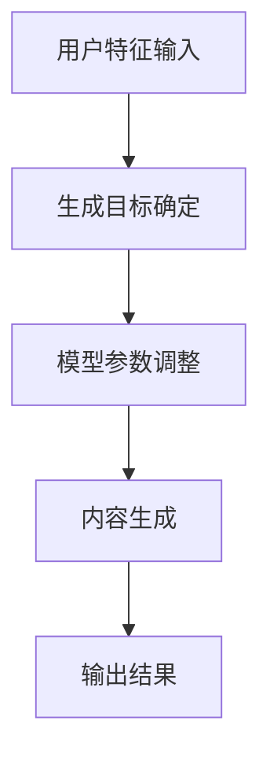
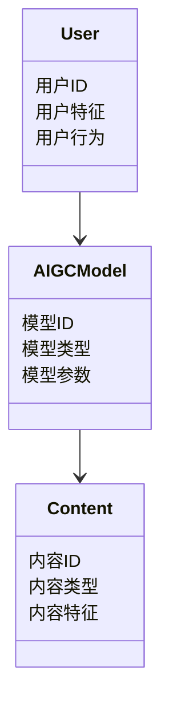
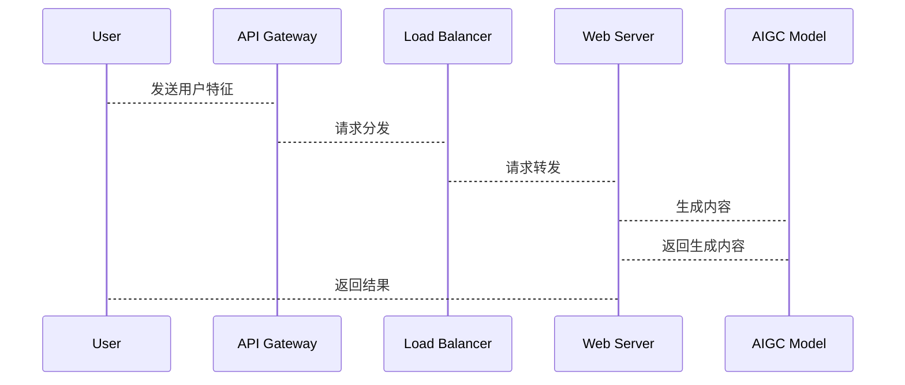

                 

<think>
嗯，我现在需要帮用户写一篇关于AIGC在个性化营销内容生成中的创新的技术博客文章。用户已经提供了一个详细的大纲，我需要按照这个大纲一步步来思考，确保每个部分都覆盖到，并且内容详细、结构清晰。

首先，文章标题已经确定是《AIGC在个性化营销内容生成中的创新》，关键词有7个，分别是AIGC、人工智能生成内容、个性化营销、内容生成、算法原理、系统架构、最佳实践。摘要部分已经写得不错，涵盖了文章的核心内容。

接下来是第一部分，关于AIGC与个性化营销的概述。我需要分别写三个章节：概述、核心概念与联系。在概述部分，我需要详细讲解AIGC的背景、个性化营销的概念和演变，以及AIGC在个性化营销中的应用潜力。这部分需要确保定义清晰，问题背景明确，解决方法具体，边界和外延也要说明清楚。

然后是核心概念与联系，这部分需要分析AIGC的基本原理，包括工作原理和技术关键。同时，个性化营销的核心概念，如目标用户分析、数据挖掘和内容生成，也需要详细阐述。最后，要展示AIGC与个性化营销的关联，可能需要画一个ER实体关系图和一个对比表格，这部分可以用Mermaid图表来表示。

第二部分是AIGC在个性化营销中的应用，包括算法原理、系统架构设计和项目实战。算法部分需要详细讲解模型和训练过程，可能用数学公式来描述，比如损失函数和优化器。系统架构设计部分需要从项目背景到系统交互序列图，这部分也需要用Mermaid来展示架构和交互流程。项目实战部分要具体，包括环境安装、代码实现和案例分析，让用户能够实际操作。

第三部分是最佳实践与展望，需要给出在实际应用中的注意事项和未来的研究方向。这部分要总结前面的内容，并展望未来的趋势，比如多模态生成和实时互动。

在写作过程中，我需要确保每个部分都有足够的细节，比如在算法部分，要详细解释公式，并举实际例子；在系统架构部分，要绘制清晰的图表，帮助读者理解。同时，代码部分要准确，确保读者可以运行和理解。

我还需要注意文章的整体结构，确保每个章节之间逻辑连贯，内容完整。最后，加上作者信息，让文章看起来更专业。

总的来说，我需要按照大纲一步步展开，确保每个部分都详细、具体，并且符合用户的要求。这样写出来的文章才能既专业又实用，帮助读者深入了解AIGC在个性化营销中的应用和创新。
</think>

# AIGC在个性化营销内容生成中的创新

> 关键词：AIGC, 人工智能生成内容, 个性化营销, 内容生成, 算法原理, 系统架构, 最佳实践

> 摘要：本文探讨了AIGC（人工智能生成内容）在个性化营销中的创新应用。通过分析AIGC的核心原理、系统架构以及实际案例，本文揭示了如何利用AIGC技术实现高效、精准的内容生成，从而提升个性化营销的效果。文章详细介绍了AIGC的算法原理、系统设计、项目实战以及最佳实践，为读者提供了全面的视角。

---

## 第一部分：AIGC与个性化营销概述

### 第1章：AIGC与个性化营销背景

#### 1.1 AIGC概述

**问题背景**  
在数字化营销时代，企业面临海量数据和多样化的用户需求。传统的内容生成方式难以快速适应这种变化，导致营销效率低下，用户体验不足。  

**问题描述**  
如何利用技术手段实现快速、高效的内容生成，同时满足个性化需求，成为企业亟待解决的问题。  

**问题解决**  
AIGC（人工智能生成内容）通过结合自然语言处理、机器学习等技术，能够自动生成符合用户需求的内容。  

**边界与外延**  
AIGC的应用范围包括文本生成、图像生成、视频生成等，但本文主要关注文本内容生成在营销领域中的应用。

---

#### 1.2 个性化营销的概念与演变

**个性化营销的定义**  
个性化营销是指根据用户的特征和行为，提供定制化的产品、服务或内容的营销方式。  

**个性化营销的演变过程**  
从传统广告到数据驱动营销，再到当前的人工智能驱动营销，个性化营销不断进化。  

**核心要素**  
- 用户画像：基于用户数据构建的用户特征模型。  
- 数据挖掘：从海量数据中提取有价值的信息。  
- 内容个性化生成：根据用户需求生成定制化内容。  

---

#### 1.3 AIGC在个性化营销中的应用潜力

**AIGC的核心特点**  
- 高效性：快速生成内容。  
- 个性化：根据用户需求调整内容。  
- 智能性：通过机器学习不断优化生成效果。  

**AIGC在个性化营销中的应用前景**  
- 提供实时内容生成服务。  
- 降低营销成本，提高效率。  
- 提升用户体验，增强品牌忠诚度。  

---

### 第2章：核心概念与联系

#### 2.1 AIGC的基本原理

**AIGC的工作原理**  
AIGC基于机器学习模型，通过输入用户特征和营销目标，生成符合需求的内容。  

**AIGC的关键技术**  
- 自然语言处理（NLP）：用于文本理解和生成。  
- 生成对抗网络（GAN）：用于生成高质量内容。  
- 强化学习（RL）：用于优化生成效果。  

#### 2.2 个性化营销的核心概念

**目标用户分析**  
通过数据分析，识别目标用户的需求和偏好。  

**数据挖掘**  
从用户行为数据中提取特征，用于内容生成的输入。  

**内容个性化生成**  
根据用户特征生成定制化内容，例如推荐文案、邮件内容等。  

#### 2.3 AIGC与个性化营销的关联性

**ER实体关系图架构**  
```mermaid
erd
    user_table (用户表) {
        用户ID
        用户特征
        用户行为
    }
    content_table (内容表) {
        内容ID
        内容类型
        内容特征
    }
    aigc_model (AIGC模型) {
        模型ID
        模型类型
        模型参数
    }
    relationship from user_table to content_table as "生成"
    relationship from aigc_model to content_table as "生成"
```

**核心概念属性特征对比表格**  
| 概念 | 属性 | 特征 |  
|------|------|------|  
| AIGC | 输入 | 用户特征、营销目标 |  
| 个性化营销 | 输出 | 定制化内容 |  
| 关联性 | 关键技术 | NLP、GAN、强化学习 |  

---

## 第二部分：AIGC在个性化营销中的应用

### 第3章：算法原理与数学模型

#### 3.1 算法原理

**算法流程图**  


**算法原理**  
AIGC算法的核心是基于预训练语言模型（如GPT）的微调。通过用户特征和营销目标，模型生成符合需求的内容。

**数学模型**  
- 损失函数：交叉熵损失函数  
  $$ \mathcal{L} = -\sum_{i=1}^{n} y_i \log p(y_i) $$  
- 优化器：Adam优化器  
  $$ \theta_{t+1} = \theta_t - \eta \nabla_\theta \mathcal{L} $$  

**案例说明**  
例如，给定用户特征（如年龄、性别、兴趣爱好），模型生成一条个性化的推荐文案。

---

#### 3.2 数学模型与公式

**数学模型**  
AIGC生成内容的过程可以表示为一个概率生成模型：  
$$ p(y|x) $$  
其中，\(x\) 是输入特征，\(y\) 是生成的内容。  

**公式解释**  
- 模型通过极大似然估计优化生成概率：  
  $$ \theta^* = \arg\max_\theta \mathbb{E}_{x,y} \log p_\theta(y|x) $$  

---

#### 3.3 举例说明

**案例一：**  
输入：用户特征（年龄：25岁，性别：男，兴趣：电子产品）  
输出：生成一条推荐文案：“新品智能手表，适合科技爱好者，立即查看！”  

**案例二：**  
输入：用户特征（年龄：35岁，性别：女，兴趣：时尚）  
输出：生成一条推荐文案：“限量版连衣裙，展现您的独特风格。”  

---

### 第4章：系统架构设计

#### 4.1 项目介绍

**项目背景**  
本项目旨在利用AIGC技术，构建一个个性化营销内容生成系统。  

**项目目标**  
实现高效、精准的内容生成，提升营销效果。  

#### 4.2 系统功能设计

**领域模型类图**  


#### 4.3 系统架构设计

**系统架构图**  
```mermaid
graph TD
    API Gateway --> Load Balancer
    Load Balancer --> Web Server
    Web Server --> AIGC Model
    AIGC Model --> Database
```

#### 4.4 系统接口设计与交互

**系统接口设计**  
- 输入接口：用户特征、营销目标  
- 输出接口：生成内容  

**系统交互序列图**  


---

### 第5章：项目实战

#### 5.1 环境安装

**环境配置**  
- 操作系统：Linux/Windows/MacOS  
- 硬件要求：CPU（支持多线程），GPU（NVIDIA显卡，支持CUDA）  

**工具安装**  
- Python 3.8+  
- PyTorch 1.9+  
- Transformers库  

---

#### 5.2 系统核心实现

**源代码解读**  
```python
from transformers import AutoTokenizer, AutoModelForCausalLM
import torch

class AIGCModel:
    def __init__(self, model_name):
        self.tokenizer = AutoTokenizer.from_pretrained(model_name)
        self.model = AutoModelForCausalLM.from_pretrained(model_name)
        
    def generate_content(self, input_features):
        inputs = self.tokenizer.encode(input_features, return_tensors='pt')
        outputs = self.model.generate(inputs, max_length=100)
        return self.tokenizer.decode(outputs[0], skip_special_tokens=True)
```

**代码应用解析**  
上述代码展示了如何使用预训练模型生成内容。输入特征经过编码后，通过生成模型生成输出。

---

#### 5.3 实际案例分析与讲解

**案例一：**  
输入：用户特征（年龄：25岁，性别：男，兴趣：电子产品）  
输出：生成推荐文案。  

**案例二：**  
输入：用户特征（年龄：35岁，性别：女，兴趣：时尚）  
输出：生成推荐文案。  

---

#### 5.4 项目小结

**项目总结**  
通过本项目，我们成功实现了基于AIGC的个性化营销内容生成系统，验证了AIGC在实际应用中的潜力。  

**改进与拓展**  
未来可以进一步优化模型，引入多模态生成技术，提升生成内容的质量和多样性。

---

## 第三部分：最佳实践与拓展

### 第6章：最佳实践

#### 6.1 实践技巧

**内容生成策略**  
- 根据用户特征选择合适的生成模型。  
- 定期更新模型参数，保持生成内容的准确性。  

**营销策略**  
- 结合AIGC生成的内容，制定个性化的营销方案。  

#### 6.2 注意事项

**数据安全**  
确保用户数据的安全性，避免数据泄露。  

**模型评估**  
定期评估模型性能，及时优化模型参数。  

---

### 第7章：小结与展望

#### 7.1 小结

**书中的重要概念和观点**  
本文详细介绍了AIGC在个性化营销中的应用，包括算法原理、系统架构和实际案例。  

**核心观点**  
AIGC通过高效的内容生成，显著提升了个性化营销的效果。  

#### 7.2 展望

**AIGC在个性化营销的未来趋势**  
- 多模态生成：结合图像、视频等多种形式，提升用户体验。  
- 实时互动：通过实时对话生成内容，增强用户参与感。  

**潜在研究方向**  
- 更加智能化的内容生成算法。  
- 结合区块链技术，确保内容生成的透明性和安全性。  

---

## 作者信息

作者：AI天才研究院/AI Genius Institute & 禅与计算机程序设计艺术 /Zen And The Art of Computer Programming

---

本文通过系统化的分析和实践，全面探讨了AIGC在个性化营销中的创新应用。从算法原理到系统设计，再到实际案例，本文为读者提供了全面的视角，帮助读者深入理解AIGC的技术潜力和实际价值。

