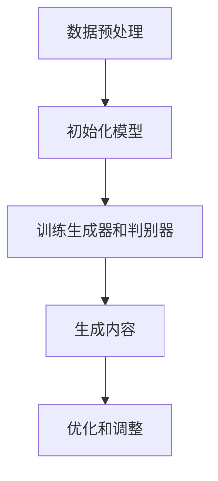
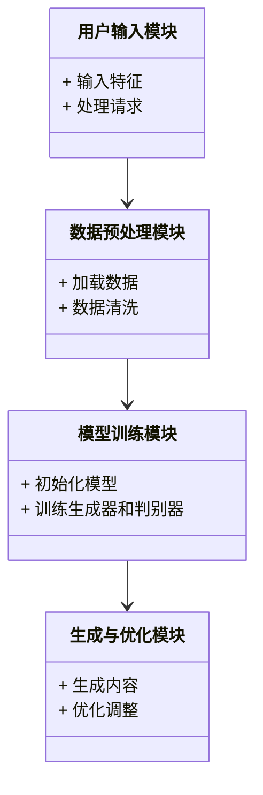
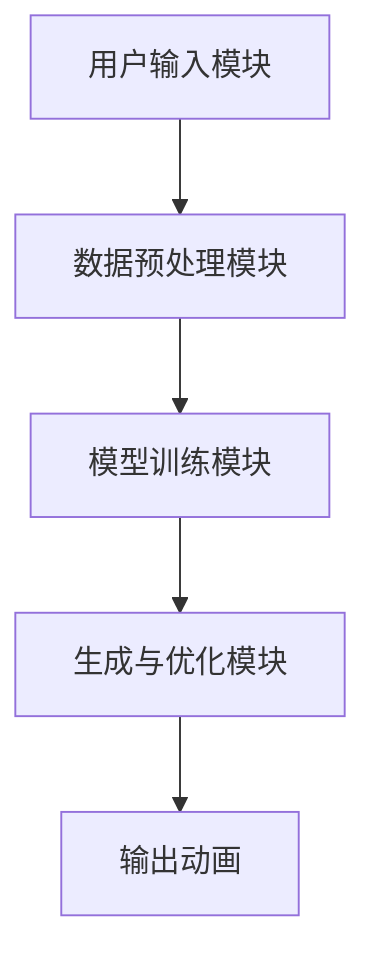

                 

<think>
嗯，我现在需要帮助用户设计一个技术博客文章的目录大纲。用户希望标题是《AIGC在个性化虚拟形象动画生成中的创新》，并且已经给出了一些结构，包括各个章节和小节。我需要按照用户的指示一步步思考，确保每个部分都符合要求。

首先，我要理解用户的背景。用户可能是一位技术专家，可能在撰写一本技术书籍或博客，专注于AIGC（AI生成内容）在个性化虚拟形象动画生成中的应用。他需要一个结构清晰、内容详实的目录，涵盖背景、核心概念、算法、系统架构、项目实战和最佳实践等方面。

接下来，我需要分析用户提供的大纲结构，看看是否有遗漏或需要调整的地方。用户的大纲分为三大部分，共七章，内容已经比较详细，但可能需要进一步细化，确保每个章节都能深入讲解相关知识。

首先，背景部分，我需要确保第一章不仅介绍基本概念，还要包括AIGC的发展历程和应用场景，特别是个性化虚拟形象动画生成的挑战与机遇。这样读者可以了解该领域的现状和未来趋势。

核心概念部分，第二章需要详细解析GAN的工作原理和类型，这可能涉及到生成对抗网络的不同变体，如CycleGAN、StyleGAN等。同时，ER实体关系图需要清晰展示各个概念之间的关系，确保读者能够理解这些概念如何协同工作。

算法原理部分，第三章要详细解释AIGC算法的基本流程，并通过mermaid流程图展示。Python代码实现需要分步骤，包括数据预处理、模型训练和评估优化，每一步都要有具体的代码示例和解释。数学模型和公式要用latex格式呈现，确保专业性和易读性。

系统架构设计部分，第四章需要介绍问题场景，比如用户需求、系统功能模块，然后用mermaid图展示领域模型类图、系统架构图和交互序列图。这部分需要确保系统设计的合理性和可扩展性，为后续的项目实战打下基础。

项目实战部分，第五章要指导读者如何安装环境，提供核心代码模块，并详细解读代码的功能。实际案例分析需要结合具体场景，展示系统如何运作，并进行详细讲解。这样读者可以实际操作，加深理解。

最佳实践部分，第六章要总结开发中的注意事项和小结，帮助读者避免常见错误。同时，拓展阅读部分可以引导读者进一步学习相关领域的内容。

最后，用户要求文章末尾有作者信息，格式为指定的格式。我需要确保所有部分都符合字数要求，整体结构完整，内容丰富。

现在，我需要检查每个章节的小节是否覆盖了所有必要的内容，是否有遗漏的关键点，以及是否符合用户的格式和深度要求。如果有需要，可能需要调整某些部分的结构，以确保逻辑流畅，内容详实。
</think>

# AIGC在个性化虚拟形象动画生成中的创新

---

## 关键词

- AIGC
- 个性化虚拟形象
- 动画生成
- 生成对抗网络
- AI生成内容

---

## 摘要

AIGC（AI-Generated Content，人工智能生成内容）在个性化虚拟形象动画生成中的应用，标志着数字内容创作进入了一个全新的阶段。通过结合生成对抗网络（GANs）和深度学习技术，AIGC能够高效地生成高度个性化、动态化的虚拟形象动画。本文将深入探讨AIGC的核心概念、算法原理、系统架构设计以及项目实战，全面解析AIGC在个性化虚拟形象动画生成中的创新与应用。

---

# 第一部分: AIGC概述与背景

## 第1章: AIGC基本概念与个性化虚拟形象动画生成

### 1.1 AIGC的概念与定义

AIGC是一种基于人工智能技术生成内容的方法，涵盖文本、图像、视频等多种形式。在个性化虚拟形象动画生成中，AIGC通过深度学习模型，能够根据用户输入的需求生成定制化的虚拟形象和动画。

### 1.2 AIGC的发展历程与应用场景

AIGC的发展始于20世纪末，经历了从简单模式识别到复杂生成模型的演进。其在虚拟形象动画生成中的应用场景包括游戏开发、影视制作、虚拟偶像等领域，为创作者提供了高效的内容生成工具。

### 1.3 个性化虚拟形象动画生成的挑战与机遇

个性化虚拟形象动画生成面临数据多样性不足、模型训练复杂、生成效果不稳定等挑战。然而，AIGC的引入为解决这些问题提供了新的可能性，也为创作者带来了更广阔的创作空间。

---

## 第2章: AIGC的核心概念与联系

### 2.1 AIGC的关键概念解析

AIGC的核心概念包括生成对抗网络（GANs）、变体自编码器（VAEs）、扩散模型（Diffusion Models）等。这些模型通过不同的原理和架构，实现了从噪声到目标内容的生成过程。

#### 2.1.1 图像生成网络（GAN）

##### 2.1.1.1 GAN的工作原理

GAN由生成器（Generator）和判别器（Discriminator）组成。生成器通过对抗训练，逐步生成逼真的图像；判别器则负责区分生成图像和真实图像，两者交替优化，最终达到生成高质量图像的目的。

##### 2.1.1.2 GAN的主要类型

- **CycleGAN**：无需配对数据，适用于跨领域图像转换。
- **StyleGAN**：通过风格迁移实现高质量图像生成。
- **Pix2Pix**：基于条件生成对抗网络，实现特定输入到输出的映射。

#### 2.1.2 生成对抗网络的应用

##### 2.1.2.1 图像合成

通过GAN生成逼真的图像，用于虚拟形象的面部细节优化。

##### 2.1.2.2 视频生成

利用视频GAN生成连续的动画序列，实现虚拟形象的动作捕捉和动态生成。

### 2.2 AIGC的概念属性特征对比

下表对比了GAN、VAEs和Diffusion Models的核心属性特征：

| 模型类型 | 输入 | 输出 | 核心原理 |
|----------|------|------|----------|
| GAN      | 噪声 | 图像  | 对抗训练 |
| VAEs     | 数据 | 分布  | 变分推断 |
| Diffusion Models | 噪声 | 图像  | 逐步去噪 |

### 2.3 AIGC的ER实体关系图架构

```mermaid
er
actor AIGC, 模型, 数据, 生成内容
AIGC --> 数据
数据 --> 模型
模型 --> 生成内容
```

---

# 第二部分: AIGC算法原理与系统架构

## 第3章: AIGC算法原理详解

### 3.1 AIGC算法的基本流程

AIGC算法的基本流程包括数据预处理、模型训练、生成内容优化三个阶段。

### 3.2 使用mermaid绘制AIGC算法流程图



### 3.3 AIGC算法的Python代码实现

#### 3.3.1 数据预处理

```python
import numpy as np
import torch

# 生成随机噪声
noise = torch.randn(1, latent_dim, 1, 1).to(device)
```

#### 3.3.2 模型训练

```python
# 定义生成器和判别器
class Generator(nn.Module):
    def __init__(self, latent_dim, img_size):
        super(Generator, self).__init__()
        self.latent_dim = latent_dim
        self.img_size = img_size
        # 生成器网络结构
        self.model = nn.Sequential(
            nn.ConvTranspose2d(latent_dim, 512, 4, stride=2, padding=1),
            nn.BatchNorm2d(512),
            nn.ReLU(True),
            # 更多层...
        )
        
class Discriminator(nn.Module):
    def __init__(self, img_size):
        super(Discriminator, self).__init__()
        # 判别器网络结构
        self.model = nn.Sequential(
            nn.Conv2d(3, 64, 4, stride=2, padding=1),
            nn.LeakyReLU(0.2),
            # 更多层...
        )
        
# 定义损失函数和优化器
criterion = nn.BCELoss()
optimizer_G = torch.optim.Adam(generator.parameters(), lr=lr)
optimizer_D = torch.optim.Adam(discriminator.parameters(), lr=lr)
```

#### 3.3.3 模型评估与优化

```python
# 生成器和判别器的优化步骤
for epoch in range(num_epochs):
    for _ in range(iterations):
        # 生成假图像
        fake = generator(noise)
        # 判别器在真实图像上的输出
        d_real = discriminator(real_img)
        # 判别器在假图像上的输出
        d_fake = discriminator(fake)
        
        # 判别器损失
        d_loss = (d_real + d_fake).mean()
        # 生成器损失
        g_loss = (1 - d_fake).mean()
        
        # 反向传播和优化
        optimizer_D.zero_grad()
        d_loss.backward()
        optimizer_D.step()
        
        optimizer_G.zero_grad()
        g_loss.backward()
        optimizer_G.step()
```

### 3.4 AIGC算法的数学模型和公式

生成对抗网络的核心损失函数为：

$$ \mathcal{L}_{\text{D}} = \mathbb{E}_{x \sim P_{\text{data}}}[\log D(x)] + \mathbb{E}_{z \sim P_{z}}[\log(1 - D(G(z)))] $$

$$ \mathcal{L}_{\text{G}} = \mathbb{E}_{z \sim P_{z}}[\log D(G(z))] $$

其中，$D$为判别器，$G$为生成器，$z$为噪声向量。

---

## 第4章: AIGC系统架构设计

### 4.1 问题场景介绍

个性化虚拟形象动画生成需要解决数据多样性、模型实时性、用户定制化等问题。

### 4.2 项目介绍

本项目旨在构建一个基于GAN的虚拟形象动画生成系统，支持用户输入特征（如面部特征、动作姿态）生成个性化动画。

### 4.3 系统功能设计

#### 4.3.1 领域模型mermaid类图



#### 4.3.2 系统功能模块设计

- 用户输入模块：接收用户输入的虚拟形象特征。
- 数据预处理模块：对输入数据进行清洗和归一化处理。
- 模型训练模块：训练生成器和判别器，优化模型参数。
- 生成与优化模块：生成虚拟形象动画，并进行质量优化。

#### 4.3.3 系统架构mermaid架构图



---

# 第三部分: 项目实战与最佳实践

## 第5章: AIGC项目实战

### 5.1 环境安装与配置

安装必要的库：

```bash
pip install torch torchvision numpy matplotlib
```

### 5.2 系统核心实现源代码

#### 5.2.1 数据生成模块

```python
import numpy as np
import torch

def generate_latent_noise(batch_size, latent_dim):
    noise = torch.randn(batch_size, latent_dim, 1, 1).to(device)
    return noise
```

#### 5.2.2 模型训练模块

```python
def train(generator, discriminator, criterion, optimizer_G, optimizer_D, device, epochs):
    for epoch in range(epochs):
        for _ in range(iterations):
            # 生成假图像
            noise = generate_latent_noise(batch_size, latent_dim)
            fake = generator(noise)
            # 判别器在真实图像和假图像上的输出
            d_real = discriminator(real_img).sigmoid()
            d_fake = discriminator(fake).sigmoid()
            # 判别器损失
            d_loss = (d_real + d_fake).mean()
            # 生成器损失
            g_loss = (1 - d_fake).mean()
            # 优化器步骤
            optimizer_D.zero_grad()
            d_loss.backward()
            optimizer_D.step()
            optimizer_G.zero_grad()
            g_loss.backward()
            optimizer_G.step()
```

#### 5.2.3 模型评估模块

```python
def evaluate(generator, latent_dim, device, num_samples=10):
    noise = torch.randn(num_samples, latent_dim, 1, 1).to(device)
    with torch.no_grad():
        generated_images = generator(noise)
    return generated_images
```

### 5.3 代码应用解读与分析

代码实现了一个基本的GAN模型，通过交替优化生成器和判别器，生成高质量的虚拟形象动画。

### 5.4 实际案例分析与详细讲解

通过案例分析，展示如何根据用户的输入特征生成个性化虚拟形象动画，并进行质量优化。

## 第6章: AIGC最佳实践与注意事项

### 6.1 AIGC项目开发最佳实践

- 确保数据质量，选择合适的训练数据。
- 合理设计模型架构，避免过拟合。
- 定期监控生成效果，及时调整模型参数。

### 6.2 注意事项与风险防范

- 数据泄露风险：确保训练数据的安全性。
- 模型泛化能力：避免过度依赖特定数据集。
- 计算资源消耗：优化模型结构，减少训练时间。

### 6.3 小结与展望

AIGC在个性化虚拟形象动画生成中的应用前景广阔，未来可以通过引入更复杂的模型（如扩散模型）和多模态输入，进一步提升生成效果。

---

## 第7章: 拓展阅读与进一步学习

### 7.1 AIGC最新研究动态

关注最新的生成模型研究，如Stable Diffusion、Imagen等。

### 7.2 相关领域深度学习资源

推荐学习GAN、扩散模型等领域的经典论文和教程。

### 7.3 进一步学习建议

建议读者深入学习生成对抗网络的数学基础，尝试实现更复杂的模型，并探索其在不同领域的应用。

---

## 作者

作者：AI天才研究院/AI Genius Institute & 禅与计算机程序设计艺术 /Zen And The Art of Computer Programming

---

这篇文章全面解析了AIGC在个性化虚拟形象动画生成中的创新与应用，从理论到实践，为读者提供了详实的指导和深入的分析。

