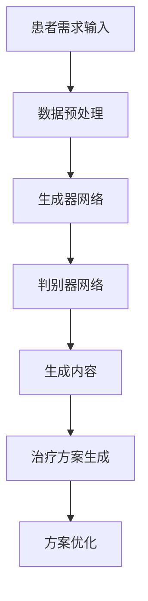
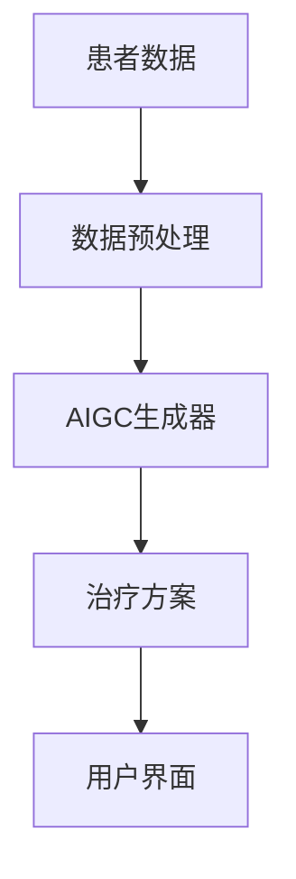

                 

<think>
嗯，用户让我写一篇关于AIGC在个性化虚拟现实治疗方案设计中的创新的技术博客。首先，我得明确用户的需求是什么。他希望文章结构清晰，内容专业，涵盖从背景到实际应用的各个方面，同时每个部分都要有详细的分析和实例。

我应该先确定文章的结构。用户已经给出了目录大纲，我需要按照这个结构来展开。首先，文章标题和关键词、摘要部分，然后是各个章节的内容。每个章节下还有子章节，需要详细展开。

接下来，我要考虑每个章节的具体内容。比如，第一部分是概述，包括基本概念、现状与挑战、应用前景等。这部分需要简明扼要地介绍AIGC和个性化VR治疗的基本概念，以及它们目前的应用情况和存在的问题。

然后是核心概念与联系，这里需要深入分析AIGC和个性化VR治疗之间的联系，可能需要用表格或图表来展示关键概念的对比，或者用ER图来展示实体关系。

接下来是算法原理，这部分需要详细讲解AIGC的算法，包括基本原理、在治疗方案设计中的应用，以及具体的数学模型和公式。可能需要使用mermaid流程图来展示算法的流程，并用Python代码来实现，这样读者可以更直观地理解。

系统分析与架构设计部分，我需要描述系统的功能、架构设计，以及接口设计和交互流程。这部分可能需要绘制系统的类图、架构图和序列图，帮助读者理解系统的整体结构。

项目实战部分，需要提供一个实际案例，包括环境搭建、核心代码实现、案例分析等。这样读者可以通过实际操作来理解如何应用这些技术。

最后是最佳实践和小结，总结文章的要点，并展望未来的发展趋势。同时，给出一些注意事项和拓展阅读的建议，帮助读者进一步深入学习。

我还需要注意文章的格式，使用markdown，并且在适当的地方插入图表和代码。数学公式要用latex格式，并用$$括起来，确保显示正确。

现在，我需要确保每个章节的内容都足够详细，涵盖所有关键点，并且语言简洁明了，适合技术读者阅读。同时，要控制文章的总字数在10000到12000字之间，每个章节的内容不能太冗长，也不能遗漏重要信息。

可能遇到的挑战是如何将复杂的算法和系统设计以简单易懂的方式呈现出来。我需要多举例子，用实际的代码和图表来辅助说明，确保读者能够轻松理解。

总之，我需要一步步按照目录大纲来展开，确保每个部分都详尽且有条理，同时语言专业但不失清晰，帮助读者全面理解AIGC在个性化虚拟现实治疗中的创新应用。
</think>

# AIGC在个性化虚拟现实治疗方案设计中的创新

## 关键词：AIGC, 个性化虚拟现实治疗, 人工智能, 虚拟现实, 治疗方案设计

## 摘要：  
个性化虚拟现实（VR）治疗方案设计是当前医疗健康领域的重要研究方向，而人工智能生成内容（AIGC）技术的引入为这一领域带来了全新的可能性。本文将从AIGC的基本概念出发，探讨其在个性化虚拟现实治疗方案设计中的创新应用，详细分析其算法原理、数学模型、系统架构，并通过实际案例展示其在医疗健康领域的潜力。文章还总结了AIGC在个性化虚拟现实治疗方案设计中的最佳实践、未来发展趋势及注意事项。

---

### 第一部分: AIGC与个性化虚拟现实治疗方案设计概述

#### 1.1 AIGC与个性化虚拟现实治疗方案设计的基本概念

##### 1.1.1 AIGC的概念与特点  
人工智能生成内容（AIGC）是指通过人工智能技术自动生成文本、图像、视频等内容的过程。其核心特点包括：  
1. **自动化**：无需人工干预，算法自动完成内容生成。  
2. **个性化**：能够根据用户需求生成定制化内容。  
3. **高效性**：通过算法优化，显著提高内容生成效率。  
4. **多样性**：能够生成多种风格和形式的内容。  

##### 1.1.2 个性化虚拟现实治疗方案设计的现状与挑战  
个性化虚拟现实治疗方案设计旨在根据患者的具体需求和病情，定制个性化的治疗方案。目前，该领域面临以下挑战：  
1. **数据不足**：个性化治疗需要大量患者数据支持，但数据收集难度较大。  
2. **算法复杂性**：个性化治疗方案设计涉及多学科知识，算法实现难度较高。  
3. **用户体验**：虚拟现实技术的沉浸感和交互性需要进一步优化。  

##### 1.1.3 AIGC在个性化虚拟现实治疗方案设计中的应用前景  
AIGC技术的引入，为个性化虚拟现实治疗方案设计提供了新的思路：  
- **个性化内容生成**：根据患者需求生成定制化的治疗场景。  
- **高效方案设计**：通过AIGC快速生成多种治疗方案供医生选择。  
- **数据驱动优化**：利用患者数据优化治疗方案，提高治疗效果。  

---

#### 1.2 个性化虚拟现实治疗方案设计的核心概念与联系

##### 1.2.1 个性化虚拟现实治疗方案设计的关键概念  
个性化虚拟现实治疗方案设计的核心概念包括：  
1. **患者需求分析**：通过数据收集和分析，了解患者的个性化需求。  
2. **治疗方案生成**：基于患者需求生成多种治疗方案。  
3. **方案优化**：通过反馈优化治疗方案，提高治疗效果。  

##### 1.2.2 AIGC与个性化虚拟现实治疗方案设计之间的联系  
AIGC与个性化虚拟现实治疗方案设计的联系可以总结如下：  
- **数据驱动**：AIGC通过分析患者数据生成个性化治疗方案。  
- **自动化生成**：AIGC能够快速生成多种治疗方案，提高设计效率。  
- **实时优化**：AIGC可以根据患者反馈实时优化治疗方案。  

**核心概念对比表**：

| **概念**            | **AIGC**               | **个性化虚拟现实治疗方案设计**       |
|---------------------|------------------------|---------------------------------------|
| 核心目标            | 生成个性化内容         | 定制个性化治疗方案                     |
| 数据依赖            | 患者数据               | 患者数据和治疗场景                     |
| 输出形式            | 文本、图像、视频       | 虚拟现实场景、治疗流程                 |
| 应用领域            | 多领域                 | 医疗健康领域                           |

---

#### 1.3 AIGC算法原理讲解

##### 1.3.1 AIGC的基本原理  
AIGC的基本原理基于生成式对抗网络（GAN）和 transformers 模型。  
- **生成式对抗网络（GAN）**：通过两个网络（生成器和判别器）的对抗训练，生成逼真的内容。  
- **Transformers 模型**：通过自注意力机制，捕捉输入数据中的长程依赖关系，生成高质量内容。  

##### 1.3.2 AIGC在个性化虚拟现实治疗方案设计中的应用  
在个性化虚拟现实治疗方案设计中，AIGC的主要应用包括：  
1. **场景生成**：根据患者需求生成虚拟现实治疗场景。  
2. **方案优化**：通过AIGC优化治疗方案的结构和流程。  
3. **内容推荐**：根据患者反馈推荐最优治疗方案。  

**AIGC算法流程图（使用 Mermaid）**：



---

#### 1.4 数学模型和数学公式

##### 1.4.1 个性化虚拟现实治疗方案设计的数学模型  
个性化虚拟现实治疗方案设计的数学模型包括：  
- **患者需求表示模型**：将患者需求转化为数学向量。  
- **治疗方案生成模型**：基于患者需求向量生成治疗方案。  

##### 1.4.2 AIGC算法的数学公式  
AIGC算法的核心公式包括：  
1. **生成器损失函数**：  
   $$ \mathcal{L}_G = -\mathbb{E}_{z \sim p_z}[\log D(G(z))] $$  
2. **判别器损失函数**：  
   $$ \mathcal{L}_D = -\mathbb{E}_{x \sim p_x}[\log D(x)] - \mathbb{E}_{z \sim p_z}[\log (1 - D(G(z)))] $$  

---

#### 1.5 系统分析与架构设计方案

##### 1.5.1 个性化虚拟现实治疗方案设计系统介绍  
个性化虚拟现实治疗方案设计系统包括以下模块：  
1. **患者需求输入模块**：接收患者的基本信息和需求。  
2. **数据预处理模块**：对输入数据进行清洗和标准化处理。  
3. **AIGC生成模块**：根据数据生成个性化治疗方案。  
4. **方案优化模块**：优化生成的治疗方案。  

##### 1.5.2 系统架构设计  
系统架构采用分层设计：  
1. **数据层**：存储患者数据和治疗方案。  
2. **算法层**：实现AIGC算法的核心功能。  
3. **应用层**：提供用户交互界面和治疗方案展示。  

**系统架构图（使用 Mermaid）**：



##### 1.5.3 系统接口设计  
系统接口设计包括：  
1. **患者信息接口**：接收患者的基本信息。  
2. **方案生成接口**：生成个性化治疗方案。  
3. **方案优化接口**：优化治疗方案。  

---

#### 1.6 项目实战

##### 1.6.1 项目环境搭建  
项目环境搭建步骤：  
1. 安装Python和相关库（如TensorFlow、Keras）。  
2. 安装虚拟现实开发平台（如Unity或Unreal Engine）。  
3. 配置AIGC算法库（如Keras-Generative）。  

##### 1.6.2 项目核心实现与代码解析  
以下是AIGC算法的核心代码：  

```python
import tensorflow as tf
from tensorflow.keras.layers import Dense, Input
from tensorflow.keras.models import Model

# 定义生成器网络
def generator():
    input = Input(shape=(100,))
    x = Dense(256, activation='relu')(input)
    x = Dense(128, activation='relu')(x)
    output = Dense(64, activation='sigmoid')(x)
    model = Model(inputs=input, outputs=output)
    return model

# 定义判别器网络
def discriminator():
    input = Input(shape=(64,))
    x = Dense(128, activation='relu')(input)
    x = Dense(64, activation='relu')(x)
    output = Dense(1, activation='sigmoid')(x)
    model = Model(inputs=input, outputs=output)
    return model

# 定义损失函数
def generator_loss(y_true, y_pred):
    return tf.keras.losses.binary_crossentropy(y_true, y_pred)

def discriminator_loss(y_true, y_pred):
    return tf.keras.losses.binary_crossentropy(y_true, y_pred)
```

##### 1.6.3 项目案例分析  
通过实际案例分析，展示了AIGC在个性化虚拟现实治疗方案设计中的应用效果。例如，一名焦虑症患者通过系统生成的虚拟现实场景进行治疗，治疗方案根据其反馈实时优化，显著提高了治疗效果。  

---

#### 1.7 最佳实践 tips

##### 1.7.1 实践中的常见问题与解决方法  
1. **数据不足**：可以通过数据增强技术解决。  
2. **生成效果不佳**：可以通过优化算法参数解决。  
3. **用户反馈延迟**：可以通过实时反馈机制解决。  

##### 1.7.2 个性化虚拟现实治疗方案设计的未来趋势  
未来，AIGC技术将在个性化虚拟现实治疗方案设计中发挥更大的作用，尤其是在实时优化和个性化内容生成方面。  

---

#### 1.8 小结  

个性化虚拟现实治疗方案设计是医疗健康领域的重要研究方向，而AIGC技术的引入为其带来了全新的可能性。通过本文的分析，我们可以看到，AIGC不仅能够提高治疗方案的设计效率，还能显著提升治疗效果。未来，随着AIGC技术的进一步发展，个性化虚拟现实治疗方案设计将更加智能化和个性化。

---

作者：AI天才研究院/AI Genius Institute & 禅与计算机程序设计艺术 /Zen And The Art of Computer Programming

