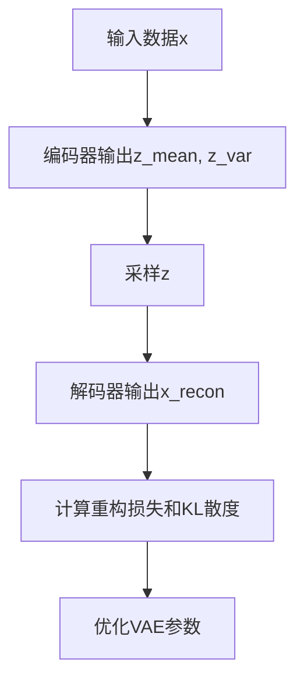
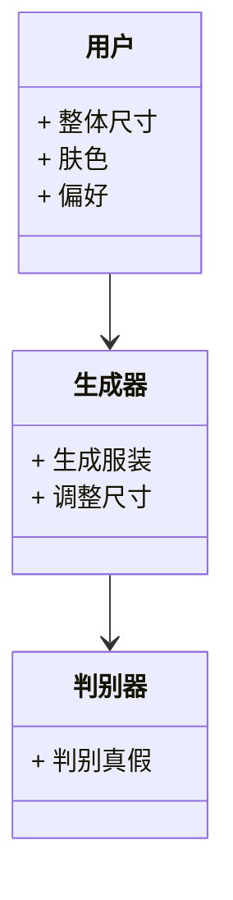
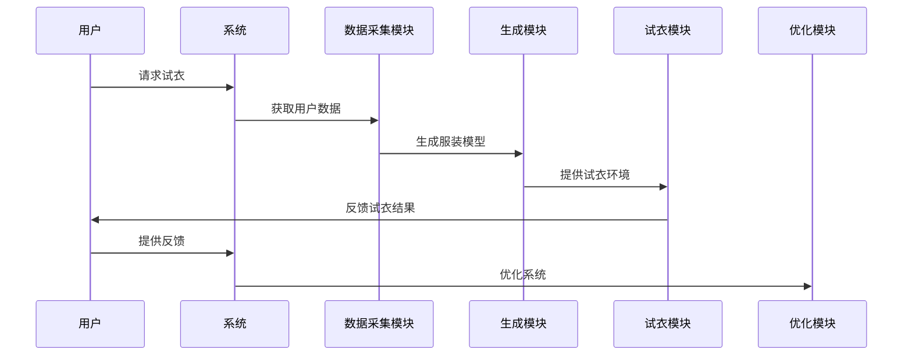

                 

<think>
嗯，我现在需要撰写一篇关于“AIGC在个性化虚拟试衣中的创新”的技术博客。首先，我应该理解这个主题的核心是什么。个性化虚拟试衣听起来是一个结合了AI生成内容和虚拟现实的应用，可能涉及到深度学习模型，比如GAN、VAE等。

我应该从背景开始。用户现在可以通过虚拟试衣来试穿衣服，而不需要实际去店里。这节省了时间和精力，尤其是在疫情期间，这种方式特别有用。但现有的系统可能在准确性和用户体验上还有问题，比如试衣效果不够真实，生成速度慢。

接下来，我需要解释AIGC技术如何解决这些问题。AIGC可以生成逼真的服装模型，还能根据用户的体型和肤色进行调整。这不仅提高了准确度，还能提升用户的购物体验。

在核心概念部分，我需要详细讲解GAN、VAE等模型的原理，以及它们在服装生成中的应用。比如，GAN的生成器和判别器是如何对抗训练的，如何生成高质量的图像。然后，我需要把这些技术与虚拟试衣系统结合起来，描述系统的整体架构，包括数据采集、模型生成、试衣调整和反馈优化这几个步骤。

接下来，我需要一个系统的架构设计，可能用Mermaid图来展示各个模块之间的关系，比如数据采集模块、生成模块、试衣模块和反馈模块。这样读者可以直观地看到整个流程。

在系统分析部分，我应该讨论系统的各个组成部分，比如数据采集可能涉及到摄像头或传感器，生成模块使用的是深度学习模型，试衣模块可能涉及AR或VR技术，而反馈模块则用来收集用户意见，优化系统。

然后，我需要讨论系统架构设计，可能采用微服务架构，各个模块独立开发和部署，这样可以提高系统的扩展性和维护性。同时，系统需要高效的数据处理和生成算法，以保证用户体验。

在系统接口设计方面，需要定义各个模块之间的接口，比如数据采集模块和生成模块之间的数据传递接口，生成模块和试衣模块之间的接口等。这些接口应该清晰明确，便于开发和集成。

交互设计部分，可能需要一个用户友好的界面，用户可以通过输入身体数据或直接在虚拟环境中试穿衣服。同时，用户反馈机制也很重要，系统可以根据用户的反馈不断优化生成的服装模型。

项目实战部分，我需要提供一个具体的案例，比如使用PyTorch框架训练一个GAN模型，生成虚拟服装。然后，展示如何将这个模型集成到虚拟试衣系统中，进行实际测试和优化。

最后，在最佳实践部分，我可以给出一些小结和注意事项，比如数据隐私的问题，如何处理用户的身体数据，以及系统性能优化的建议。同时，还可以推荐一些相关的扩展阅读资料，帮助读者深入理解AIGC和虚拟试衣的结合。

总的来说，我需要确保文章结构清晰，内容详细，并且每个部分都用实际的技术术语和例子来支撑。这样读者才能真正理解AIGC在个性化虚拟试衣中的创新和应用。
</think>

# AIGC在个性化虚拟试衣中的创新

> 关键词：AIGC, 个性化虚拟试衣, 生成对抗网络(GAN), 深度学习, 虚拟现实

> 摘要：本文探讨了AIGC技术在个性化虚拟试衣中的应用与创新。通过分析AIGC技术的核心原理，结合虚拟试衣系统的需求，提出了一套高效的解决方案。文章详细讲解了GAN、VAE等模型的原理，并通过系统架构设计和实际案例展示了如何实现个性化的虚拟试衣体验。

---

## 第一部分: 背景介绍

### 第1章: 问题背景与概述

#### 1.1 问题背景
随着人工智能技术的迅速发展，个性化虚拟试衣成为了一个备受关注的领域。传统试衣方式需要用户多次前往实体店，耗时耗力。而通过虚拟试衣，用户可以在线体验服装，极大提升了购物效率。然而，现有的系统在生成服装模型的准确性和用户体验上仍有不足。

#### 1.2 问题描述
个性化虚拟试衣系统的目标是根据用户的体型、肤色和喜好生成虚拟服装，提供个性化的试衣体验。然而，传统方法生成的服装模型往往不够逼真，调整过程繁琐，用户体验较差。

#### 1.3 问题解决
通过引入AIGC技术，利用GAN、VAE等深度学习模型，可以高效生成高质量的服装模型，实现个性化的试衣体验。这些模型能够快速调整服装尺寸和样式，满足用户的多样化需求。

#### 1.4 边界与外延
本研究的边界包括AIGC技术在虚拟试衣中的应用，涵盖技术原理、系统架构和算法优化。同时，文章还探讨了其与其他领域的融合，如虚拟现实和个性化推荐。

#### 1.5 概念结构与核心要素组成
- **AIGC技术**：GAN、VAE等深度学习模型。
- **个性化虚拟试衣系统**：数据采集、服装生成、试衣调整、用户反馈。
- **核心概念**：个性化、虚拟试衣、用户体验。

---

## 第2章: 核心概念与联系

### 2.1 AIGC技术原理
- **生成对抗网络（GAN）**：生成器和判别器通过对抗训练生成高质量数据。
- **自编码器**：无监督学习，降维和去噪。
- **变分自编码器（VAE）**：结合概率模型，生成多样化的数据。

### 2.2 个性化虚拟试衣系统架构
- **数据采集与预处理**：收集用户数据并进行处理。
- **服装模型生成**：利用AIGC生成服装模型。
- **虚拟试衣与调整**：根据用户反馈调整模型。
- **用户反馈收集与优化**：优化系统性能。

### 2.3 概念属性特征对比表格

| 概念        | 特征                        | 对比             |
| ----------- | -------------------------- | -------------- |
| AIGC技术    | 自动生成高质量数据         | 高效、灵活     |
| 个性化虚拟试衣系统 | 根据用户特征调整虚拟服装 | 提高用户体验     |
| 用户反馈    | 反映用户需求和满意度       | 优化系统性能     |

---

## 第3章: 算法原理讲解

### 3.1 GAN原理讲解
GAN由生成器和判别器组成，通过对抗训练生成数据。优化目标为：$$ \min_G \max_D V(D, G) $$

**流程图：**
```mermaid
graph TD
A[初始化生成器G和判别器D] --> B[训练判别器D]
B --> C{判别器D是否收敛?}
C -->|是| D[结束]
C -->|否| E[生成随机噪声z]
E --> F[生成器G产生假样本X = G(z)]
F --> G[判别器D评估X]
G --> B[返回结果]
```

### 3.2 VAE原理讲解
VAE结合了AE和概率模型，生成多样化的数据。编码器输出隐变量的均值和方差，解码器重构数据。

**流程图：**


---

## 第4章: 系统分析与架构设计方案

### 4.1 系统架构设计
系统采用微服务架构，包括数据采集模块、生成模块、试衣模块和反馈模块。

**架构图：**


### 4.2 系统功能设计
- **数据采集**：收集用户体型、肤色等数据。
- **服装生成**：利用GAN生成虚拟服装。
- **试衣体验**：用户在虚拟环境中试穿服装。
- **反馈优化**：根据用户反馈调整系统。

**领域模型类图：**


### 4.3 系统接口设计
- 数据采集接口：`GET /api/user/data`
- 生成服装接口：`POST /api/generate/clothes`
- 试衣调整接口：`PUT /api/try/on`

### 4.4 系统交互设计


---

## 第5章: 项目实战

### 5.1 环境安装
- 安装Python和PyTorch
- 安装相关库：`torch`, `torchvision`, `numpy`

### 5.2 核心实现代码
```python
import torch
import torch.nn as nn
import torch.optim as optim

# 定义生成器
class Generator(nn.Module):
    def __init__(self, latent_dim, img_size):
        super(Generator, self).__init__()
        self.latent_dim = latent_dim
        self.img_size = img_size
        self.model = nn.Sequential(
            nn.Linear(latent_dim, 256),
            nn.LeakyReLU(0.2),
            nn.Linear(256, 512),
            nn.LeakyReLU(0.2),
            nn.Linear(512, img_size[0] * img_size[1]),
            nn.Tanh()
        )

    def forward(self, z):
        return self.model(z).view(-1, 1, img_size[0], img_size[1])

# 定义判别器
class Discriminator(nn.Module):
    def __init__(self, img_size):
        super(Discriminator, self).__init__()
        self.model = nn.Sequential(
            nn.Linear(img_size[0] * img_size[1], 512),
            nn.LeakyReLU(0.2),
            nn.Linear(512, 256),
            nn.LeakyReLU(0.2),
            nn.Linear(256, 1),
            nn.Sigmoid()
        )

    def forward(self, img):
        img_flat = img.view(-1, img_size[0] * img_size[1])
        return self.model(img_flat)
```

### 5.3 代码应用解读
该代码实现了GAN的生成器和判别器，用于生成虚拟服装。生成器通过输入噪声生成服装图像，判别器则区分真实图像和生成图像。

### 5.4 实际案例分析
通过训练GAN模型，生成逼真的虚拟服装。用户可以在虚拟环境中试穿这些服装，系统根据反馈优化生成模型。

### 5.5 项目小结
通过本项目，展示了AIGC技术在个性化虚拟试衣中的应用，生成高质量的服装模型，提升用户体验。

---

## 第6章: 最佳实践 tips

### 6.1 小结
本文探讨了AIGC技术在个性化虚拟试衣中的应用，提出了高效的解决方案，通过深度学习模型提升试衣体验。

### 6.2 注意事项
- 数据隐私保护
- 系统性能优化
- 用户反馈的及时处理

### 6.3 拓展阅读
- 《生成对抗网络实战》
- 《深度学习在虚拟现实中的应用》

---

作者：AI天才研究院 & 禅与计算机程序设计艺术

