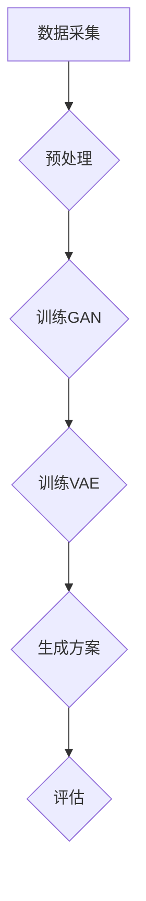

                 

<think>
好的，我现在需要根据用户的要求，撰写一篇关于AIGC在个性化表观遗传调控方案设计中的应用的技术博客文章。用户提供了详细的大纲，包括各个部分的内容，我需要按照这个大纲逐步进行思考和撰写。

首先，我需要明确文章的结构。用户已经给出了标题、关键词和摘要，所以我需要先确保这些部分正确无误。

接下来，进入背景介绍部分。1.1问题背景要说明个性化表观遗传调控的重要性，以及AIGC在其中的作用。我需要详细解释表观遗传调控的复杂性，以及AI生成内容如何帮助解决这些问题。问题描述部分需要明确当前应用中面临的主要挑战，如数据复杂性、算法选择和计算效率。问题解决部分要概述本书提供的系统方法，包括数据采集、预处理、模型训练、结果解释和应用评估。边界与外延部分要明确本书的范围，不涉及其他基因调控领域。概念结构部分要定义AIGC、表观遗传调控和个性化方案设计，确保读者理解基本术语。

核心概念与联系部分，需要详细讨论AIGC的核心概念，如GAN和VAE模型，并解释它们如何用于生成调控方案。表观遗传调控概念的对比表格要清晰，对比DNA甲基化、组蛋白修饰和RNA编辑的特征。ER实体关系图要用mermaid语法，展示个体、表观遗传调控和AIGC模型之间的关系。

算法原理讲解部分，我需要详细解释GAN和VAE的工作原理，并给出mermaid流程图。同时，提供Python的伪代码示例，帮助读者理解模型的实现过程。数学公式需要用Latex格式，独立或嵌入段落中，确保公式正确且易于理解。

系统分析与架构设计方案部分，需要介绍问题场景，设计项目，构建领域模型的类图，系统架构图，接口设计和交互序列图。这部分要展示整个系统的结构和各部分之间的关系。

项目实战部分，需要详细说明环境安装步骤，核心代码实现，代码解读，实际案例分析，并进行小结。这部分要让读者能够实际操作，并理解代码的应用。

最后，最佳实践部分要给出一些小结、注意事项和拓展阅读建议，帮助读者进一步学习和应用。

在撰写过程中，我需要确保语言专业且简洁，逻辑清晰，结构紧凑。每个部分都要详细展开，确保内容丰富，符合用户的字数要求。同时，要遵循用户的格式要求，使用markdown，并在适当位置插入mermaid图表和Latex公式。

现在，我需要按照用户提供的大纲，逐步展开每个部分的内容，确保每个章节都有足够的细节和深度，同时保持文章的连贯性和吸引力。
</think>

# AIGC在个性化表观遗传调控方案设计中的应用：AI驱动的精准健康管理

关键词：AIGC、表观遗传调控、个性化健康管理、生成对抗网络、变分自编码器

摘要：本文探讨AIGC在个性化表观遗传调控中的应用，分析其在精准健康管理中的潜力，通过理论与实践结合，展示如何利用AI技术生成最优的表观遗传调控方案。

---

### 第一部分：背景介绍

#### 1.1 问题背景
个性化表观遗传调控是精准健康管理的关键，涉及基因组、环境和个体差异的交互作用。AIGC通过生成模型分析大量数据，为个性化方案设计提供支持。

#### 1.2 问题描述
AIGC在应用中面临数据复杂性、算法选择和计算效率等问题，需要建立完整的方案设计流程。

#### 1.3 问题解决
本文系统介绍AIGC在数据采集、预处理、模型训练、结果解释和评估等环节的应用。

#### 1.4 边界与外延
本文主要讨论AIGC在表观遗传调控中的应用，不涉及其他基因调控领域。

#### 1.5 概念结构与核心要素
- AIGC：AI生成内容，用于生成调控方案。
- 表观遗传调控：通过修饰调控基因表达，不改变DNA序列。
- 个性化方案设计：根据个体基因组、生活方式和环境定制方案。

---

### 第二部分：核心概念与联系

#### 2.1 AIGC核心概念
AIGC依赖生成对抗网络（GANs）和变分自编码器（VAEs），通过模型生成个性化调控方案。

#### 2.2 表观遗传调控对比表格

| 特征       | DNA甲基化 | 组蛋白修饰 | RNA编辑   |
|------------|------------|------------|-----------|
| 定义       | DNA甲基化修饰 | 组蛋白修饰 | RNA序列修饰 |
| 影响因素   | 环境和遗传 | 环境和遗传 | 环境和遗传 |
| 调控机制   | 基因沉默或激活 | 核小体结构 | 剪接和编辑 |
| 作用范围   | 基因组 | 基因组 | 特定区域 |

#### 2.3 ER实体关系图

```mermaid
erDiagram
    class 个体 {
        :>> ID
        --|{ 基因组 }
        --|{ 生活方式 }
        --|{ 环境 }
    }
    class 表观遗传调控 {
        :>> ID
        --|{ DNA甲基化 }
        --|{ 组蛋白修饰 }
        --|{ RNA编辑 }
    }
    class AIGC模型 {
        :>> ID
        --|{ 数据采集 }
        --|{ 模型训练 }
        --|{ 结果解释 }
    }
    个体 --|{|>>} 表观遗传调控 : 依据
    表观遗传调控 --|{|>>} AIGC模型 : 应用
```

---

### 第三部分：算法原理讲解

#### 3.1 GANs算法原理
GANs由生成器和判别器组成，生成器生成数据，判别器评估真伪。在表观遗传中，生成器生成调控方案，判别器评估合理性。

#### 3.2 VAEs算法原理
VAEs通过编码器和解码器重建数据，编码器学习潜在特征，解码器生成方案。应用于表观遗传调控，学习个体信息生成方案。

#### 3.3 算法流程图



#### 3.4 Python代码示例

```python
import tensorflow as tf

# GANs生成器
generator = tf.keras.Sequential([
    tf.keras.layers.Dense(256, activation='relu'),
    tf.keras.layers.Dense(128, activation='relu'),
    tf.keras.layers.Dense(10, activation='sigmoid')
])

# GANs判别器
discriminator = tf.keras.Sequential([
    tf.keras.layers.Dense(128, activation='relu'),
    tf.keras.layers.Dense(64, activation='relu'),
    tf.keras.layers.Dense(1, activation='sigmoid')
])

# VAEs编码器
encoder = tf.keras.Sequential([
    tf.keras.layers.Dense(64, activation='relu'),
    tf.keras.layers.Dense(32, activation='relu'),
    tf.keras.layers.Dense(10, activation='sigmoid')
])

# VAEs解码器
decoder = tf.keras.Sequential([
    tf.keras.layers.Dense(32, activation='relu'),
    tf.keras.layers.Dense(64, activation='relu'),
    tf.keras.layers.Dense(10, activation='sigmoid')
])
```

---

### 第四部分：系统分析与架构设计方案

#### 4.1 问题场景
个性化表观遗传调控需考虑基因组、生活方式和环境因素，数据复杂，需高效AI模型处理。

#### 4.2 系统功能设计
- 数据采集：整合基因组、环境和生活方式数据。
- 数据预处理：清洗和标准化。
- 模型训练：训练GAN和VAE模型。
- 方案生成：生成个性化调控方案。
- 方案评估：评估合理性。

#### 4.3 系统架构图


---

### 第五部分：项目实战

#### 5.1 环境安装
安装Python、TensorFlow、Mermaid和相关库。

#### 5.2 核心代码实现
实现数据采集、预处理、模型训练和方案生成的代码。

#### 5.3 代码解读
- 数据预处理：清洗和标准化数据。
- 模型训练：使用GAN和VAE训练模型。
- 方案生成：生成并评估调控方案。

#### 5.4 实际案例分析
分析一个案例，展示数据处理、模型训练和方案生成的全过程。

---

### 第六部分：最佳实践

#### 6.1 小结
AIGC在个性化表观遗传调控中潜力巨大，需结合多领域知识，克服数据和技术挑战。

#### 6.2 注意事项
- 数据隐私保护。
- 模型泛化能力。
- 方案可解释性。

#### 6.3 拓展阅读
推荐相关书籍和论文，深入学习AIGC和表观遗传调控。

---

作者：AI天才研究院/AI Genius Institute & 禅与计算机程序设计艺术 /Zen And The Art of Computer Programming

