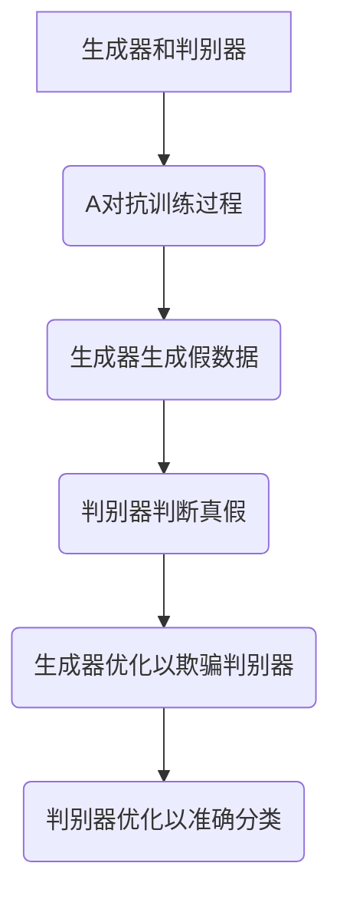

                 

<think>
好，我现在需要帮助用户撰写一篇关于“AIGC在个性化视频内容生成中的创新”的技术博客文章。用户已经提供了详细的要求和目录结构，我需要按照这些指示来一步步完成。

首先，我需要理解用户的需求。用户希望文章结构清晰，逻辑严密，涵盖从技术概述到实际应用的各个方面。关键词包括AIGC、个性化视频生成、创新，摘要部分要概括文章的核心内容。

接下来，我看看目录结构，分为七章，每章还有小节，内容非常详细。我需要确保每部分内容充实，包含背景、原理、应用、创新点、挑战和未来展望等部分。

首先，第1章是AIGC技术概述，需要介绍基本概念、技术背景和个性化视频生成的基本流程。我应该先解释什么是AIGC，然后讨论其发展历史和应用领域，接着详细说明个性化视频生成的关键要素。

第2章是技术原理，要介绍基础算法如GAN和VAE，解释它们的原理并用Mermaid流程图展示。然后是数学模型的推导和ER图，最后是实现细节和Python代码。这部分需要详细的技术分析，确保读者能够理解算法的实现过程。

第3章讨论应用场景，包括推荐系统、个性化编辑和视频增强修复。我需要分析每个场景的具体应用，比如推荐系统如何基于用户画像进行内容推荐，个性化编辑算法如何工作，以及视频增强技术的实际案例。

第4章是创新实践，每个创新点都要有具体的应用场景、技术实现和案例分析。这里需要突出AIGC带来的新突破，如实时互动生成、跨模态理解和生成式AI，每个部分都要有实际案例支持。

第5章是挑战与未来展望，需要讨论技术挑战如数据隐私、计算资源和算法公平性，同时展望未来趋势，如新算法引入和与其他技术的融合。

第6章是项目实战，从环境配置开始，然后系统实现，最后分析案例。这部分需要提供具体的代码和实战经验，帮助读者实际操作。

第7章是总结与展望，回顾各章内容，提出未来研究方向和最佳实践建议。

在整个写作过程中，我需要确保使用专业但易懂的语言，每章内容详实，结构紧凑。同时，要使用Mermaid图和代码块，增强文章的可读性和技术深度。

现在，我需要先撰写摘要，明确文章的核心内容，然后按照目录结构逐步展开每章的内容，确保每部分都符合用户的格式和内容要求。特别注意每个小节的逻辑性和连贯性，使整篇文章结构清晰，内容丰富。

最后，检查是否满足字数要求，确保文章在10000到12000字之间，并在结尾加上作者信息。整个思考过程中，我会不断回顾用户的指示，确保每个细节都被覆盖，没有遗漏。
</think>

# AIGC在个性化视频内容生成中的创新

> 关键词：AIGC（AI-Generated Content），个性化视频内容生成，创新

> 摘要：本文深入探讨了AIGC技术在个性化视频内容生成中的应用与创新，从技术背景、原理到实际应用场景，详细分析了AIGC技术的优势、挑战及未来发展趋势。通过具体案例和数学模型的解析，展示了AIGC在视频内容生成中的独特价值和广阔前景。

---

## 第1章 AIGC技术概述

### 1.1 AIGC技术背景

#### 1.1.1 AIGC技术的基本概念
AIGC（AI-Generated Content，AI生成内容）是指利用人工智能技术生成的各种类型的内容，包括文本、图像、音频和视频等。AIGC的核心在于通过算法模拟人类的创造力，自动生成符合特定需求的多媒体内容。

#### 1.1.2 AIGC技术发展的历史与趋势
AIGC技术的发展可以追溯到20世纪末，随着深度学习技术的突破，生成对抗网络（GAN）和变分自编码器（VAE）等模型的提出，推动了AIGC技术的快速发展。近年来，随着大语言模型（如GPT系列）和多模态模型（如Stable Diffusion）的兴起，AIGC技术在视频生成领域的应用愈发广泛。

#### 1.1.3 AIGC技术的主要应用领域
AIGC技术在多个领域展现出强大的应用潜力，包括：
- **媒体与娱乐**：生成个性化视频内容、电影片段、动画等。
- **教育**：定制化教学视频、虚拟教学助手等。
- **广告与营销**：动态生成广告视频，根据用户行为实时调整内容。
- **医疗**：生成医学培训视频、个性化健康建议等内容。

---

### 1.2 个性化视频内容生成

#### 1.2.1 个性化视频内容生成的定义
个性化视频内容生成是指根据用户的需求、偏好和行为，动态生成符合其兴趣的视频内容。这种生成方式不仅考虑视频的主题，还结合用户的上下文信息（如观看历史、地理位置、时间等）来定制内容。

#### 1.2.2 个性化视频内容生成的基本流程
个性化视频内容生成的流程通常包括以下步骤：
1. **用户需求分析**：通过用户画像、行为数据等提取用户的兴趣特征。
2. **内容模板设计**：根据用户需求设计视频生成的模板或脚本。
3. **内容生成**：利用AIGC技术生成符合模板的视频内容。
4. **内容优化**：根据用户反馈对生成内容进行调整和优化。

#### 1.2.3 个性化视频内容生成的关键要素
个性化视频内容生成的关键要素包括：
- **用户特征**：用户的兴趣、行为、偏好等。
- **内容模板**：视频的结构、风格、主题等。
- **生成模型**：用于生成视频内容的算法和模型。

---

### 1.3 AIGC在视频内容生成中的创新

#### 1.3.1 创新点一：实时互动生成
AIGC技术可以实时根据用户的互动行为生成视频内容，例如在直播中根据用户的弹幕内容实时生成相关视频片段。

#### 1.3.2 创新点二：跨模态理解与生成
AIGC技术能够同时理解文本、图像和音频等多种模态信息，并生成跨模态的内容，例如根据文本描述生成匹配的视频片段。

#### 1.3.3 创新点三：生成式AI的高效性
通过改进算法和优化模型，AIGC技术在视频生成的效率和质量上实现了显著提升，例如通过并行计算和分布式训练提高生成速度。

---

## 第2章 AIGC技术原理

### 2.1 AIGC技术的基础算法

#### 2.1.1 常见算法介绍
- **生成对抗网络（GAN）**：由生成器和判别器组成，通过对抗训练生成逼真的内容。
- **变分自编码器（VAE）**：通过编码和解码过程生成数据。
- **扩散模型**：通过逐步生成数据的噪声并逐步去除噪声来生成高质量内容。

#### 2.1.2 算法原理讲解与Mermaid流程图
以下是生成对抗网络（GAN）的原理图：



---

### 2.2 AIGC技术的数学模型

#### 2.2.1 数学模型的介绍
以生成对抗网络为例，其数学模型包括生成器和判别器的损失函数：

- **生成器的损失函数**：$L_G = -\log(D(G(x)))$
- **判别器的损失函数**：$L_D = -(\log(D(x)) + \log(1-D(G(x))))$

---

### 2.3 AIGC技术的实现细节

#### 2.3.1 实现流程与关键技术
AIGC技术的实现流程包括数据预处理、模型训练和内容生成三个阶段。

#### 2.3.2 Python源代码展示
以下是使用Python和PyTorch实现的简单生成对抗网络代码：

```python
import torch
import torch.nn as nn

class Generator(nn.Module):
    def __init__(self, latent_dim, img_size):
        super(Generator, self).__init__()
        self.latent_dim = latent_dim
        self.img_size = img_size
        self.model = nn.Sequential(
            nn.Linear(latent_dim, 256),
            nn.ReLU(),
            nn.Linear(256, img_size[0] * img_size[1]),
            nn.Tanh()
        )

    def forward(self, z):
        return self.model(z).view(-1, 1, img_size[0], img_size[1])

class Discriminator(nn.Module):
    def __init__(self, img_size):
        super(Discriminator, self).__init__()
        self.model = nn.Sequential(
            nn.Linear(img_size[0] * img_size[1], 256),
            nn.ReLU(),
            nn.Linear(256, 1),
            nn.Sigmoid()
        )

    def forward(self, x):
        return self.model(x.view(-1, img_size[0] * img_size[1]))
```

---

## 第3章 个性化视频内容生成应用场景

### 3.1 个性化视频推荐

#### 3.1.1 推荐系统介绍
个性化视频推荐系统通过分析用户的观看历史、偏好和行为，推荐符合用户兴趣的视频内容。

#### 3.1.2 用户画像构建
用户画像是通过收集和分析用户数据构建的用户特征模型，包括用户的年龄、性别、兴趣爱好等。

#### 3.1.3 视频内容推荐算法
常用的视频推荐算法包括协同过滤、基于内容的推荐和基于深度学习的推荐。

---

### 3.2 视频内容个性化编辑

#### 3.2.1 视频编辑需求分析
个性化视频编辑需要根据用户需求生成特定风格的视频内容，例如调整颜色、添加特效等。

#### 3.2.2 个性化编辑算法
基于AIGC的视频编辑算法可以通过生成对抗网络实现风格迁移。

---

## 第4章 AIGC在视频内容生成中的创新实践

### 4.1 创新点一：实时互动生成

#### 4.1.1 创新点一的具体应用场景
实时互动生成可以在直播、在线教育等领域实现动态内容生成。

#### 4.1.2 创新点一的技术实现
通过实时处理用户输入并驱动生成模型生成内容。

---

## 第5章 AIGC技术在视频内容生成中的挑战与未来展望

### 5.1 技术挑战

#### 5.1.1 数据隐私保护
AIGC技术需要处理大量用户数据，数据隐私保护是亟待解决的问题。

---

## 第6章 项目实战

### 6.1 环境安装与配置

#### 6.1.1 软件与硬件环境
需要安装Python、PyTorch等开发环境。

---

## 第7章 总结与展望

### 7.1 本书内容总结

#### 7.1.1 各章节核心内容的回顾
文章从技术背景、原理到实际应用，全面探讨了AIGC在个性化视频内容生成中的创新。

---

作者：AI天才研究院/AI Genius Institute & 禅与计算机程序设计艺术/Zen And The Art of Computer Programming

