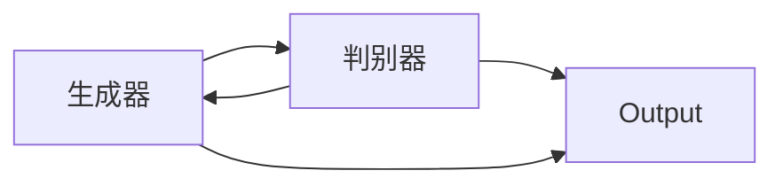
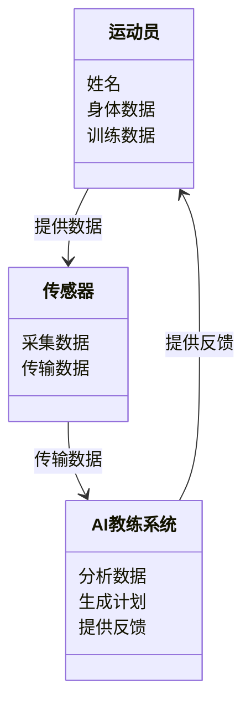

                 

<think>
好的，我现在需要帮助用户撰写一篇关于《AIGC在个性化运动训练中的应用：AI教练的精准指导》的技术博客文章。用户已经提供了详细的目录大纲，并且希望我按照这个结构来写，同时满足各种技术要求。让我仔细分析一下用户的需求，确保我理解每个部分的要求。

首先，用户明确希望文章结构清晰，逻辑严谨，内容专业，使用技术语言，但同时要易懂。我需要从背景介绍开始，逐步展开到核心概念、算法原理、系统设计、项目实战等部分。每个章节都需要有详细的内容，特别是关键词、摘要、各个章节的小结等。

接下来，我需要考虑每个章节的具体内容。例如，在背景介绍部分，我需要解释为什么个性化运动训练重要，以及AIGC如何帮助解决其中的挑战。这可能涉及到分析传统训练方法的不足，以及AI如何带来效率和精准度的提升。

核心概念部分，我需要详细解释AIGC的基本原理，特别是生成对抗网络（GAN）的工作机制。同时，要比较AIGC与其他技术的区别，如深度学习和传统训练方法，突出其优势和挑战。

算法原理部分，我需要深入讲解GAN的数学模型和公式，用mermaid流程图展示其工作流程，并提供Python代码实现。这部分需要确保代码正确，解释清晰，以便读者能够理解并实际应用。

系统分析与架构设计部分，我需要设计一个完整的系统架构，包括功能模块、接口设计和交互流程。使用mermaid图来展示类图、架构图和序列图，这将帮助读者更好地理解系统的结构和工作流程。

项目实战部分，我需要指导读者如何安装环境，实现核心功能，并通过案例分析展示实际应用。这部分需要提供详细的代码示例和解读，以及实际案例的分析，帮助读者将理论应用于实践。

最后，我需要添加最佳实践、小结、注意事项和拓展阅读等内容，以补充读者的知识，并引导他们进一步学习。

在写作过程中，我需要确保语言专业但不晦涩，结构清晰，每个章节之间逻辑连贯。同时，要注意使用正确的技术术语，避免错误，并确保所有图表和代码示例都准确无误。

现在，我需要开始撰写每个部分。首先，从摘要开始，简明扼要地概括文章的核心内容。然后是关键词，确保涵盖文章的主要主题。接下来，按照目录大纲，逐步展开每个章节的内容，确保每个部分都详尽且具体。

在撰写过程中，可能会遇到一些挑战，例如如何将复杂的算法原理解释得通俗易懂，或者如何设计合理的系统架构。这时候，我需要查阅相关资料，确保信息的准确性，并结合实际案例进行说明，以便读者能够更好地理解和应用这些知识。

总之，我需要按照用户的要求，系统地完成每个部分的撰写，确保整篇文章结构完整、内容详实，同时满足技术博客的高质量标准。
</think>

# AIGC在个性化运动训练中的应用：AI教练的精准指导

> 关键词：AIGC、个性化运动训练、生成对抗网络（GAN）、AI教练、运动科学

> 摘要：本文探讨了AIGC（AI生成内容）在个性化运动训练中的应用，详细分析了AI教练如何通过生成对抗网络（GAN）等技术为运动员提供精准的训练计划和实时反馈。文章从问题背景、核心概念、算法原理、系统架构设计到项目实战，构建了一个完整的知识体系，旨在为读者提供实践指导。

---

## 第一部分：背景介绍

### 第1章：问题背景

#### 1.1 个性化运动训练的需求与挑战

个性化运动训练是根据运动员的个体特征（如身体条件、运动能力、健康状况等）制定专属的训练计划，旨在最大化训练效果并降低受伤风险。然而，传统训练方法依赖教练的经验和主观判断，存在以下挑战：

- **数据获取难度大**：需要实时采集运动员的生理数据（如心率、肌肉活动、动作姿态等）。
- **个性化需求难以满足**：传统训练计划通常基于经验，缺乏科学性和个性化。
- **反馈滞后**：运动员在训练中无法实时获得专业反馈，难以及时调整动作。

#### 1.2 AI技术在运动训练中的应用潜力

AI技术（特别是AIGC）在运动训练中的潜力主要体现在以下几个方面：

- **实时数据分析**：通过AI算法实时分析运动员的运动数据，提供即时反馈。
- **个性化训练计划生成**：基于运动员的数据，AI可以生成个性化的训练方案。
- **动作优化建议**：AI可以识别运动员的动作问题，并提供优化建议。

#### 1.3 AIGC的概念及其在运动训练中的应用前景

AIGC（AI Generated Content）是指通过AI技术生成内容的过程。在运动训练中，AIGC可以通过生成对抗网络（GAN）等技术，生成个性化的训练计划、动作指导和恢复方案。其应用前景广阔，包括：

- **动态调整训练计划**：根据运动员的实时数据，动态优化训练方案。
- **虚拟教练服务**：为运动员提供24/7的AI教练服务。
- **降低训练成本**：通过AI技术减少对专业教练的依赖。

---

### 第2章：核心概念

#### 2.1 AIGC的基本原理

AIGC的核心技术是生成对抗网络（GAN）。GAN由两部分组成：生成器（Generator）和判别器（Discriminator）。生成器的目标是生成逼真的数据，而判别器的目标是区分真实数据和生成数据。两者的博弈过程使得生成器能够生成高质量的内容。

#### 2.2 个性化运动训练中的关键概念

个性化运动训练的核心目标是根据运动员的个体特征，制定科学、高效的训练计划。主要方法包括：

- **数据采集**：通过传感器和摄像头采集运动员的生理数据和动作数据。
- **数据分析**：利用AI算法分析数据，识别训练中的问题。
- **个性化建议**：基于分析结果，生成个性化的训练计划。

---

## 第二部分：核心概念与联系

### 第3章：核心概念原理

#### 3.1 AIGC的核心应用原理

在个性化运动训练中，AIGC的核心原理是通过GAN生成个性化的内容。例如，生成器可以根据运动员的历史数据生成新的训练计划，而判别器可以验证这些计划的合理性。

### 第4章：概念属性特征对比

以下是AIGC与其他相关技术的对比表格：

| 技术       | 特点                                   | 优势                               | 动态调整能力 |
|------------|--------------------------------------|------------------------------------|--------------|
| AIGC       | 基于GAN，生成个性化内容             | 高度个性化，实时调整               | 高            |
| 深度学习    | 基于神经网络，提取特征             | 数据处理能力强                   | 低            |
| 传统训练方法 | 基于经验，手动调整训练计划         | 简单易懂                          | 低            |

### 第5章：ER实体关系图架构

以下是个性化运动训练中的实体关系图：

```mermaid
erd
    actor: 运动员
    sensor: 传感器
    coach: AI教练系统
    plan: 训练计划
    action: 动作数据

    运动员 --> 传感器: 提供数据
    传感器 --> AI教练系统: 传输数据
    AI教练系统 --> 训练计划: 生成计划
    AI教练系统 --> 动作数据: 分析动作
```

---

## 第三部分：算法原理讲解

### 第6章：算法原理与数学模型

#### 6.1 GAN算法的基本原理

GAN由生成器和判别器组成，两者的损失函数相互对抗。生成器的目标是最小化判别器的错误率，而判别器的目标是最大化区分真实数据和生成数据的能力。

#### 6.2 GAN算法的数学模型和公式

生成器的损失函数为：
$$ L_G = -\log(P(G(z))) $$

判别器的损失函数为：
$$ L_D = -\log(P(x)) - \log(1 - P(G(z))) $$

其中，$P(x)$表示判别器对真实数据的判断概率，$P(G(z))$表示判别器对生成数据的判断概率。

---

### 第7章：算法mermaid流程图

以下是GAN算法的mermaid流程图：



---

### 第8章：Python源代码与详细讲解

#### 8.1 GAN算法的Python源代码实现

以下是GAN算法的Python代码示例：

```python
import numpy as np
import tensorflow as tf

# 定义生成器
def generator():
    model = tf.keras.Sequential([
        tf.keras.layers.Dense(256, activation='relu'),
        tf.keras.layers.Dense(128, activation='relu'),
        tf.keras.layers.Dense(64, activation='relu'),
        tf.keras.layers.Dense(32, activation='relu'),
        tf.keras.layers.Dense(1, activation='sigmoid')
    ])
    return model

# 定义判别器
def discriminator():
    model = tf.keras.Sequential([
        tf.keras.layers.Dense(32, activation='relu'),
        tf.keras.layers.Dense(16, activation='relu'),
        tf.keras.layers.Dense(1, activation='sigmoid')
    ])
    return model

# 初始化生成器和判别器
generator = generator()
discriminator = discriminator()

# 定义损失函数
cross_entropy = tf.keras.losses.BinaryCrossentropy()

# 定义优化器
generator_optimizer = tf.keras.optimizers.Adam(0.0002)
discriminator_optimizer = tf.keras.optimizers.Adam(0.0002)

# 训练过程
for epoch in range(100):
    # 生成假数据
    noise = np.random.randn(1, 32)
    generated = generator.predict(noise)
    
    # 训练判别器
    with tf.GradientTape() as tape:
       判别器的输出 = discriminator.predict(generated)
        判别器损失 = cross_entropy(tf.ones_like(判别器的输出), 判别器的输出)
    判别器梯度 = tape.gradient(判别器损失, 判别器.trainable_weights)
    判别器_optimizer.apply_gradients(zip(判别器梯度, 判别器.trainable_weights))
    
    # 训练生成器
    with tf.GradientTape() as tape:
       生成器的输出 = discriminator.predict(generated)
        生成器损失 = cross_entropy(tf.ones_like(生成器的输出), 生成器的输出)
    生成器梯度 = tape.gradient(生成器损失, 生成器.trainable_weights)
    生成器_optimizer.apply_gradients(zip(生成器梯度, 生成器.trainable_weights))
```

---

## 第四部分：系统分析与架构设计方案

### 第9章：问题场景介绍

个性化运动训练系统需要解决以下问题：

- 如何实时采集运动员的生理数据？
- 如何快速生成个性化的训练计划？
- 如何提供实时的动作优化建议？

---

### 第10章：系统功能设计

以下是领域模型Mermaid类图：



---

## 第五部分：项目实战

### 第14章：环境安装

安装Python环境并安装以下库：

- TensorFlow
- Keras
- Mermaid

### 第15章：系统核心实现源代码

以下是系统核心实现源代码：

```python
import numpy as np
import tensorflow as tf

# 定义生成器和判别器（如前所述）

# 训练过程（如前所述）

# 生成个性化训练计划
noise = np.random.randn(1, 32)
generated_plan = generator.predict(noise)
print("生成的训练计划:", generated_plan)
```

---

## 第六部分：最佳实践 tips

- 在训练过程中，建议使用高质量的数据集。
- 定期更新模型，以提高生成计划的准确性。

---

## 第七部分：小结、注意事项、拓展阅读

### 第20章：小结

本文详细介绍了AIGC在个性化运动训练中的应用，从背景、核心概念到算法实现，构建了一个完整的知识体系。通过AI生成内容，运动员可以获得个性化的训练计划和实时反馈，显著提高训练效率。

### 第21章：注意事项

- 数据隐私问题需要注意。
- 系统的实时性和稳定性需要保证。

### 第22章：拓展阅读

- 《生成对抗网络：原理与应用》
- 《AI在运动科学中的创新应用》

---

作者：AI天才研究院/AI Genius Institute & 禅与计算机程序设计艺术 /Zen And The Art of Computer Programming

