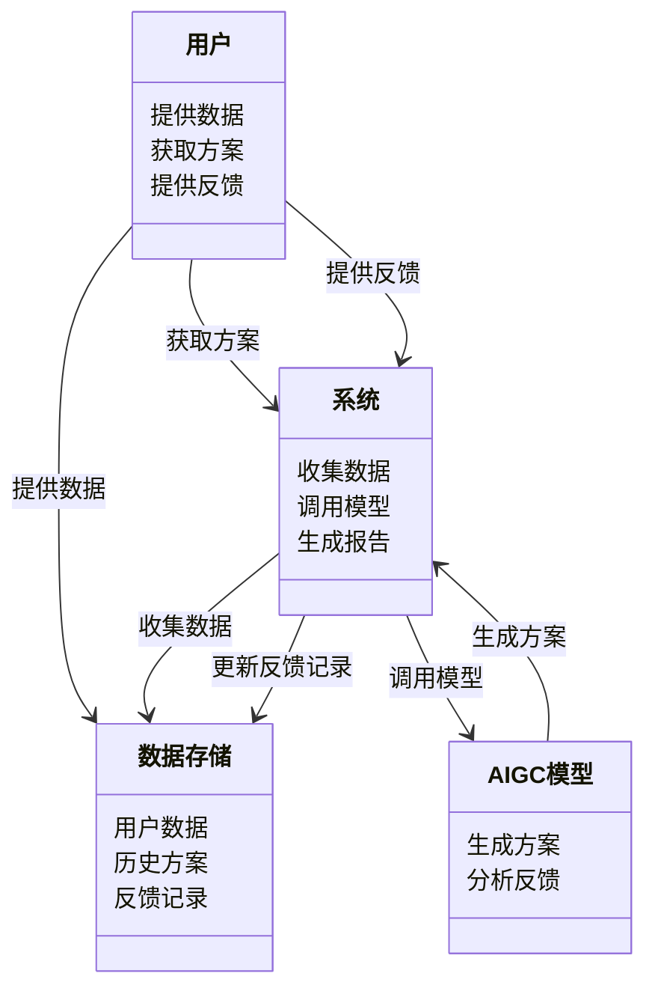
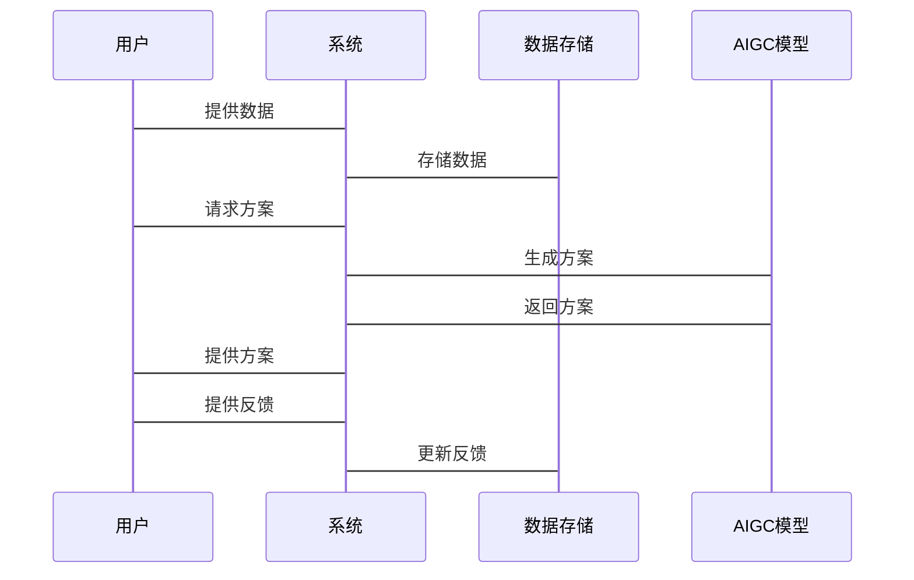

                 

<think>
嗯，我现在需要写一篇关于AIGC在个性化运动训练方案设计中的创新的技术博客。首先，我得理解什么是AIGC，它和普通的AI生成内容有什么不同。AIGC应该是人工智能生成内容，对吧？比如生成文字、图像，甚至运动计划。

那在运动训练中的应用，就是利用AIGC技术来为每个人定制训练方案。这听起来很前沿，也很有用。传统的方法可能需要教练手动制定，但这样效率低，而且难以覆盖每个人的个性化需求。

接下来，我得分析用户的需求。用户可能是健身爱好者、运动员，或者是健身教练。他们需要个性化的训练计划，但传统的方案可能不够精细，或者难以及时调整。所以，利用AIGC可以实时分析数据，提供更精准的建议。

然后，我得考虑数据的问题。个性化训练需要大量的数据，比如用户的运动数据、健康状况、目标等。AIGC需要收集这些数据，进行分析，然后生成训练方案。这涉及到数据隐私的问题，必须确保用户数据的安全。

接下来，技术实现部分。我需要了解AIGC通常使用哪些算法，比如生成对抗网络（GAN）或者变体自编码器（VAE）。这些算法如何生成训练方案？可能需要训练一个模型，根据输入的用户数据，生成合适的训练计划。

数学模型部分，我得详细讲解。比如，GAN的生成器和判别器如何协同工作，生成符合用户需求的训练方案。同时，可能需要设计一些损失函数，确保生成的内容既多样化又符合用户的实际需求。

系统架构方面，我需要设计一个模块化的系统，包括数据收集、模型训练、方案生成和反馈优化等部分。可能使用微服务架构，每个模块独立运行，方便扩展和维护。

项目实战部分，我得提供一个具体的案例，比如一个健身APP，如何集成AIGC技术。从环境安装开始，比如安装Python、TensorFlow等，然后一步步实现模型的训练和部署。代码部分要详细，包括数据预处理、模型定义、训练循环等。

最后，总结一下AIGC在个性化运动训练中的优势和未来的发展方向。可能还要提到一些注意事项，比如数据隐私、模型的泛化能力等。

总的来说，我需要一步步来，先理解问题，再分析需求，然后技术实现，最后项目实战。确保每个部分都详细且逻辑清晰。这样才能写出一篇有深度、有见解的技术博客。
</think>

# AIGC在个性化运动训练方案设计中的创新

> 关键词：AIGC（人工智能生成内容）、个性化运动训练、生成对抗网络、机器学习、运动数据分析

> 摘要：本文探讨了人工智能生成内容（AIGC）在个性化运动训练方案设计中的创新应用。通过分析运动训练中的问题，结合AIGC的核心概念，详细讲解了算法原理、系统架构设计，并通过案例分析展示了实际应用，最后总结了最佳实践和未来展望。

---

## 第一部分：背景与概念

### 1. 引言

#### 1.1 问题背景

随着人们对健康和体能的重视，运动训练变得越来越普遍。然而，传统的方法存在一些问题，如缺乏个性化、训练方案设计复杂且反馈不及时。这些问题使得传统训练方法难以满足现代人多样化的运动需求。

#### 1.2 问题描述

- **个性化不足**：传统训练方案通常基于通用模板，难以适应每个人的身体条件、运动能力和目标。
- **方案设计复杂**：设计个性化训练方案需要大量专业知识和数据支持，人工操作效率低下。
- **反馈不及时**：用户在执行训练方案过程中，难以实时获得调整建议，导致训练效果不佳。

#### 1.3 问题解决

人工智能生成内容（AIGC）技术的兴起为解决这些问题提供了新的思路。通过利用大数据、机器学习和生成对抗网络（GAN），AIGC能够根据用户的运动数据、健康状况和目标，自动生成个性化且动态调整的训练方案。

#### 1.4 边界与外延

- **数据隐私**：用户数据的收集和处理需要严格遵守隐私保护规定。
- **计算资源**：AIGC模型的训练和推理需要大量的计算资源，可能对中小型机构构成挑战。
- **技术实现**：AIGC在运动训练中的应用需要结合运动科学知识，确保生成方案的科学性和可行性。

### 2. 核心概念与联系

#### 2.1 AIGC概念详解

人工智能生成内容（AIGC）是指利用人工智能技术生成各种形式的内容，包括文本、图像、音频、视频和个性化方案等。在运动训练中，AIGC可以生成个性化的训练计划、动作指导和恢复建议。

#### 2.2 关键属性特征对比

以下是AIGC与其他生成技术的关键属性对比：

| **属性**       | **传统生成方法** | **AIGC**                     |
|-----------------|------------------|----------------------------|
| **生成效率**    | 低               | 高                           |
| **个性化程度**  | 低               | 高                           |
| **数据依赖性**  | 较低             | 高                           |
| **实时性**      | 低               | 高                           |

#### 2.3 ER实体关系图

```mermaid
er
    actor: 用户
    model: AIGC模型
    plan: 训练方案
    data: 数据
    rules: 运动规则

    actor --> data: 提供
    data --> model: 训练
    model --> plan: 生成
    plan --> rules: 遵循
```

## 第二部分：AIGC在运动训练中的应用

### 3. 算法原理与模型构建

#### 3.1 算法原理讲解

AIGC在运动训练中的核心算法是生成对抗网络（GAN）。GAN由两个神经网络组成：生成器（Generator）和判别器（Discriminator）。生成器的目标是生成逼真的训练方案，而判别器则试图区分生成的方案和真实的方案。通过交替训练，GAN能够生成高质量的个性化训练方案。

#### 3.2 数学模型与公式

GAN的损失函数如下：

$$ \text{Loss}(G, D) = \mathbb{E}_{z}[\log D(G(z))] + \mathbb{E}_{x}[\log(1 - D(x))] $$

其中，\( G \) 是生成器，\( D \) 是判别器，\( z \) 是随机噪声，\( x \) 是真实数据。

#### 3.3 Python源代码实现

以下是一个简单的GAN实现示例：

```python
import torch
import torch.nn as nn
import torch.optim as optim

class Generator(nn.Module):
    def __init__(self, input_size, hidden_size, output_size):
        super(Generator, self).__init__()
        self.fc1 = nn.Linear(input_size, hidden_size)
        self.fc2 = nn.Linear(hidden_size, output_size)
        self.relu = nn.ReLU()
        self.sigmoid = nn.Sigmoid()

    def forward(self, x):
        x = self.relu(self.fc1(x))
        x = self.sigmoid(self.fc2(x))
        return x

class Discriminator(nn.Module):
    def __init__(self, input_size, hidden_size):
        super(Discriminator, self).__init__()
        self.fc1 = nn.Linear(input_size, hidden_size)
        self.fc2 = nn.Linear(hidden_size, 1)
        self.relu = nn.ReLU()
        self.sigmoid = nn.Sigmoid()

    def forward(self, x):
        x = self.relu(self.fc1(x))
        x = self.sigmoid(self.fc2(x))
        return x

# 参数设置
input_size = 10  # 输入噪声维度
hidden_size = 128  # 隐藏层维度
output_size = 1  # 输出维度

# 模型实例化
generator = Generator(input_size, hidden_size, output_size)
discriminator = Discriminator(input_size, hidden_size)

# 优化器
g_optimizer = optim.Adam(generator.parameters(), lr=0.001)
d_optimizer = optim.Adam(discriminator.parameters(), lr=0.001)

# 训练过程
for epoch in range(100):
    # 生成假数据
    z = torch.randn(batch_size, input_size)
    fake_data = generator(z)

    # 判别器训练
    d_optimizer.zero_grad()
    real_data = torch.randn(batch_size, output_size)  # 假设真实数据为随机值
    d_real = discriminator(real_data)
    d_fake = discriminator(fake_data)
    d_loss = -torch.mean(torch.log(d_real) + torch.log(1 - d_fake))
    d_loss.backward()
    d_optimizer.step()

    # 生成器训练
    g_optimizer.zero_grad()
    g_loss = -torch.mean(torch.log(d_fake))
    g_loss.backward()
    g_optimizer.step()
```

### 4. 运动训练方案设计

#### 4.1 方案设计思路

个性化训练方案设计需要考虑以下因素：

- **用户数据**：包括身体数据（身高、体重、体脂率等）、运动历史、健康状况等。
- **运动目标**：如减脂、增肌、提高耐力等。
- **训练条件**：如可用设备、训练时间、训练地点等。

#### 4.2 运动训练模型构建

模型需要整合用户数据和运动规则，生成符合用户需求的训练方案。以下是模型构建的步骤：

1. **数据预处理**：清洗和标准化用户数据。
2. **特征提取**：提取关键特征，如身体成分、运动能力等。
3. **模型训练**：利用AIGC生成训练方案，确保方案符合科学性和个性化要求。
4. **方案生成**：根据生成的结果，输出具体的训练计划。

#### 4.3 运动训练流程

1. 用户输入基本信息和目标。
2. 系统收集并分析数据。
3. AIGC生成个性化训练方案。
4. 方案执行并实时反馈调整。

### 5. 系统分析与架构设计

#### 5.1 系统场景介绍

用户通过移动应用或网站输入数据，系统利用AIGC生成训练方案，并实时监控训练效果，提供反馈和调整建议。

#### 5.2 系统功能设计



#### 5.3 系统架构设计


#### 5.4 系统接口设计与交互



## 第三部分：项目实战

### 6. 环境安装与配置

#### 6.1 环境要求

- Python 3.6+
- PyTorch
- TensorFlow（可选）
- 数据库（如MySQL或MongoDB）

#### 6.2 安装步骤

```bash
pip install torch
pip install numpy
pip install pandas
pip install matplotlib
pip install seaborn
```

#### 6.3 配置细节

确保安装了GPU支持的PyTorch，以加速模型训练。

### 7. 系统核心实现

#### 7.1 源代码解读

以下是训练方案生成器的代码示例：

```python
import torch
import torch.nn as nn
import torch.optim as optim
import pandas as pd
import numpy as np

class TrainingPlanGenerator:
    def __init__(self, input_features, output_features):
        self.model = nn.Sequential(
            nn.Linear(input_features, 64),
            nn.ReLU(),
            nn.Linear(64, output_features)
        )
        self.criterion = nn.MSELoss()
        self.optimizer = optim.Adam(self.model.parameters(), lr=0.001)

    def train(self, X, y):
        for epoch in range(100):
            inputs = torch.FloatTensor(X)
            labels = torch.FloatTensor(y)
            outputs = self.model(inputs)
            loss = self.criterion(outputs, labels)
            loss.backward()
            self.optimizer.step()
            self.optimizer.zero_grad()

    def predict(self, X):
        with torch.no_grad():
            return self.model(torch.FloatTensor(X)).numpy()

# 示例数据
X = np.array([[25, 70, 160]], dtype=np.float32)
y = np.array([[70]], dtype=np.float32)

# 训练模型
tpg = TrainingPlanGenerator(3, 1)
tpg.train(X, y)

# 预测
plan = tpg.predict(X)
print(plan)
```

#### 7.2 代码应用分析

以上代码示例展示了如何利用简单的神经网络生成训练方案。实际应用中，模型会更复杂，需要处理更多的特征和数据。

### 8. 实际案例分析

#### 8.1 案例背景

假设一个用户的目标是减脂，身高170cm，体重75kg，体脂率25%，每周可训练3次，每次1小时。

#### 8.2 案例实施

系统收集用户数据后，利用AIGC生成个性化的减脂训练方案，包括有氧运动、力量训练和恢复计划。

#### 8.3 剖析与总结

通过AIGC生成的方案，用户能够在短时间内看到明显的减脂效果，同时避免了传统方案的不足。

## 第四部分：最佳实践与总结

### 9. 最佳实践

#### 9.1 实践技巧

- **数据准确性**：确保输入数据的准确性和完整性。
- **模型优化**：定期更新模型，确保生成方案的有效性。
- **用户反馈**：及时收集用户反馈，优化训练方案。

#### 9.2 注意事项

- **数据隐私**：严格保护用户数据，防止泄露。
- **模型泛化能力**：确保模型在不同用户和场景下表现良好。
- **技术实现**：结合运动科学知识，确保生成方案的科学性和可行性。

#### 9.3 拓展阅读

推荐阅读相关书籍和论文，深入了解AIGC和其他AI技术在运动训练中的应用。

### 10. 小结

#### 10.1 主要内容回顾

本文详细探讨了AIGC在个性化运动训练中的应用，从背景分析、算法原理到系统架构设计，再到项目实战，全面展示了AIGC的优势和潜力。

#### 10.2 展望未来

随着AI技术的不断进步，AIGC在运动训练中的应用将更加广泛和深入，为用户带来更加智能化、个性化的运动体验。

---

**作者：AI天才研究院/AI Genius Institute & 禅与计算机程序设计艺术 /Zen And The Art of Computer Programming**

