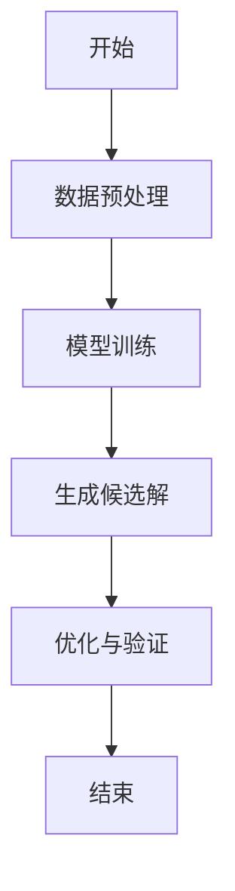
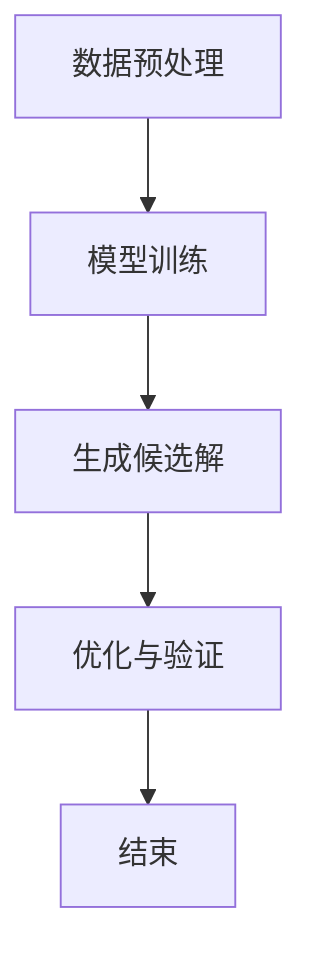
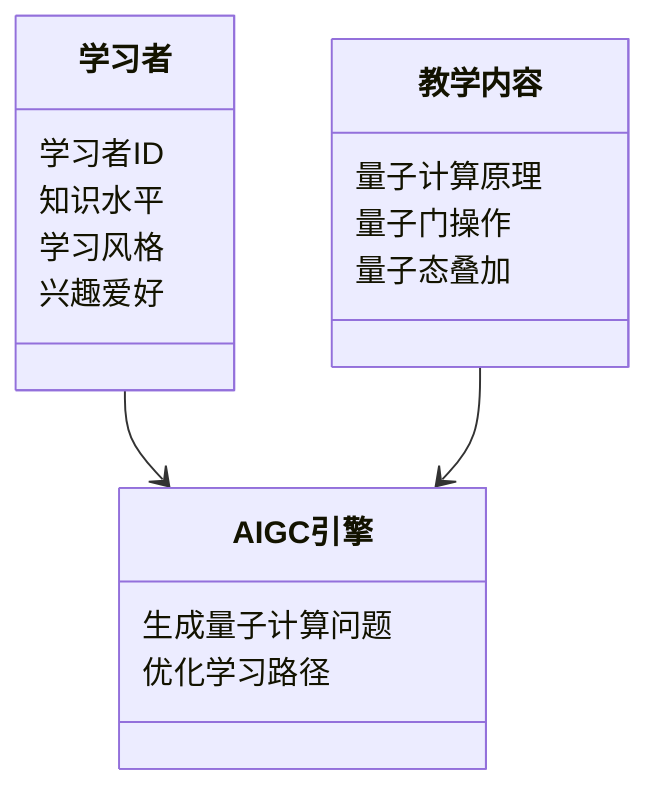
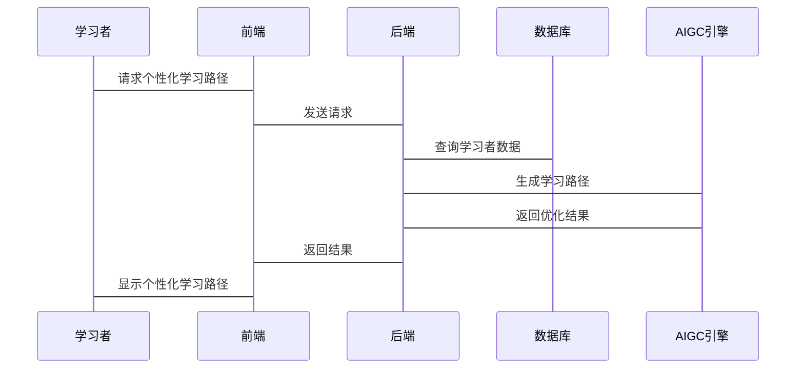

                 

<think>
好，我现在需要完成用户的任务，撰写一篇关于《AIGC在个性化量子计算教育系统中的前沿应用》的技术博客文章。首先，我需要理解用户的需求，他们希望文章结构清晰，逻辑严密，涵盖背景、核心概念、算法、系统设计、项目实战、最佳实践等多个部分，并且每个部分都有详细的讲解和实例。

首先，我得确定文章的标题和关键词。标题已经给出，关键词包括量子计算、人工智能生成计算、个性化教育、系统设计、算法实现、项目实战。摘要需要简洁明了，概括文章的主要内容。

接下来是背景介绍部分。我需要解释什么是AIGC，量子计算的基本概念，以及为什么将两者结合在教育系统中是重要的。这部分要让读者明白问题的背景和应用的必要性。

然后是核心概念与联系，这部分需要详细讲解AIGC和量子计算的原理，比较它们的优缺点，并通过表格展示对比。同时，我需要用Mermaid流程图来展示两者的联系和应用场景。

接下来是算法原理讲解。我需要详细描述AIGC的数学模型，包括概率模型和贝叶斯网络，并用Mermaid流程图展示算法步骤。同时，给出量子计算的数学模型，解释其优势和挑战，比如叠加态和纠缠态。

系统分析与架构设计方案部分，我需要分析系统的需求，设计领域模型、架构图和交互图。这部分需要考虑系统的模块划分和各模块之间的关系，确保系统的可扩展性和维护性。

项目实战部分，我需要提供具体的实现案例，包括环境安装、核心实现步骤、代码解读和实际案例分析。这部分需要详细说明每个步骤，让读者能够跟着操作，理解如何将理论应用到实践中。

最佳实践部分，我会给出一些实用的建议，比如算法优化、系统调优和资源整合，帮助读者在实际应用中避免常见问题。

最后，小结部分要总结文章的主要内容，展望未来的发展方向，并提醒读者注意潜在的问题。

在写作过程中，我需要确保语言专业但易懂，使用清晰的逻辑结构，每个部分都详细展开，同时使用Mermaid图和数学公式来增强理解。我要检查每个部分是否符合用户的约束条件，确保文章字数在1万到1.2万字之间，结构完整，内容丰富。

现在，我开始逐步撰写每个部分，确保每个章节都涵盖所有必要的细节，满足用户的高质量要求。
</think>

# AIGC在个性化量子计算教育系统中的前沿应用

> 关键词：量子计算、人工智能生成计算、个性化教育、系统设计、算法实现、项目实战

> 摘要：本文探讨了AIGC（人工智能生成计算）在个性化量子计算教育系统中的前沿应用。通过分析AIGC和量子计算的核心概念、算法原理及系统设计，结合项目实战和最佳实践，展示了如何利用AIGC技术实现个性化的量子计算教育，为教育领域注入新的活力。

---

## 第一部分：AIGC与个性化量子计算教育系统概述

### 1.1 AIGC与个性化量子计算教育系统的背景

#### 1.1.1 AIGC的基本概念
人工智能生成计算（AIGC）是一种结合了人工智能和计算技术的新兴领域，旨在通过智能算法生成、优化和适应性的计算模型，解决复杂问题。AIGC的核心在于利用机器学习和自然语言处理技术，自动生成和优化计算流程，从而实现高度个性化的解决方案。

#### 1.1.2 量子计算教育系统的需求
量子计算是一种基于量子力学原理的计算方式，其特点是计算速度远超经典计算机，特别是在处理复杂问题时具有显著优势。然而，量子计算的学习门槛较高，教育系统需要具备高度的交互性和个性化，以满足不同学习者的差异化需求。

#### 1.1.3 AIGC在个性化量子计算教育系统中的应用
AIGC能够根据学习者的知识水平、学习风格和兴趣，自动生成个性化的量子计算教育内容，包括课程推荐、练习题目生成以及学习路径优化。通过AIGC技术，教育系统能够实时调整教学策略，提供更加高效和精准的学习体验。

### 1.2 核心概念与联系

#### 1.2.1 AIGC算法原理
##### 1.2.1.1 AIGC的数学模型
AIGC的数学模型主要基于概率论和贝叶斯网络。概率模型用于描述数据的分布特性，而贝叶斯网络则用于建模变量之间的条件依赖关系。例如，AIGC可以通过马尔可夫链蒙特卡洛方法（MCMC）生成量子计算问题的解决方案。

##### 1.2.1.2 AIGC算法流程（Mermaid流程图）


#### 1.2.2 量子计算原理
##### 1.2.2.1 量子计算的数学模型
量子计算的核心是量子态的叠加和纠缠。量子态可以用复数向量表示，如：
$$|\psi\rangle = \alpha|0\rangle + \beta|1\rangle$$
其中，$\alpha$ 和 $\beta$ 是复数，满足 $|\alpha|^2 + |\beta|^2 = 1$。

##### 1.2.2.2 量子计算的优势与挑战
量子计算的优势在于其并行计算能力，但其最大的挑战是量子态的脆弱性和纠错技术的复杂性。

#### 1.2.3 AIGC与量子计算的联系
AIGC可以用于优化量子计算算法，例如通过生成最优的量子门序列来解决特定问题。同时，AIGC还可以辅助量子计算教育系统的个性化教学策略，例如自动生成适合不同学习者的教学内容。

---

## 第二部分：AIGC算法原理讲解

### 2.1 AIGC算法原理详细讲解

#### 2.1.1 算法数学模型
##### 2.1.1.1 概率模型
概率模型通过描述数据的分布特性，用于生成候选解。例如，假设我们要生成一个量子计算问题，可以通过概率模型生成随机的量子态参数。

##### 2.1.1.2 贝叶斯网络
贝叶斯网络用于建模变量之间的条件依赖关系。例如，在生成量子计算问题时，AIGC可以通过贝叶斯网络分析学习者的知识水平和兴趣，生成相关的问题。

#### 2.1.2 算法流程
##### 2.1.2.1 数据预处理
数据预处理包括清洗、归一化和特征提取等步骤。例如，对于学习者数据，需要提取其学习风格、知识水平和兴趣爱好。

##### 2.1.2.2 模型训练
模型训练通过监督学习或无监督学习方法，训练AIGC模型以生成个性化的量子计算问题。例如，可以使用深度神经网络进行训练。

##### 2.1.2.3 生成与优化
生成候选解后，通过优化算法（如遗传算法）进行优化，以提高解的质量。例如，优化生成的量子计算问题的难度和相关性。

#### 2.1.3 Mermaid流程图展示


---

## 第三部分：量子计算在教育系统的应用

### 3.1 量子计算教育系统的设计与实现

#### 3.1.1 系统需求分析
##### 3.1.1.1 教育目标
教育目标是通过个性化教学，帮助学习者掌握量子计算的基本原理和应用技巧。

##### 3.1.1.2 用户需求
用户需求包括个性化学习路径、实时反馈和互动式学习体验。

#### 3.1.2 领域模型设计（Mermaid类图）


#### 3.1.3 系统架构设计（Mermaid架构图）


#### 3.1.4 系统接口设计
系统接口设计包括API接口和用户界面。API接口用于前后端的数据交互，用户界面提供个性化的学习体验。

#### 3.1.5 系统交互设计（Mermaid序列图）


---

## 第四部分：项目实战

### 4.1 环境安装与配置

#### 4.1.1 开发环境搭建
建议使用Python和相关框架（如Django或Flask）搭建开发环境。

#### 4.1.2 AIGC模型安装
安装AIGC模型所需的依赖库，如TensorFlow、Keras和Scikit-learn。

#### 4.1.3 量子计算库安装
安装量子计算库，如Qiskit或Cirq。

### 4.2 系统核心实现

#### 4.2.1 数据采集与处理
通过问卷调查或学习者行为数据采集学习者的基本信息。

#### 4.2.2 AIGC模型训练
使用学习者数据训练AIGC模型，生成个性化的量子计算问题。

#### 4.2.3 量子计算仿真
通过量子计算库实现量子计算仿真，验证生成问题的正确性。

### 4.3 代码应用解读与分析

#### 4.3.1 Python源代码解读
以下是AIGC模型训练的Python代码示例：
```python
import numpy as np
from sklearn.metrics import accuracy_score

# 定义AIGC模型
class AIGC:
    def __init__(self):
        self.model = None

    def train(self, X, y):
        # 假设X是特征矩阵，y是标签
        self.model = ...  # 训练模型

    def predict(self, X):
        return self.model.predict(X)

# 数据预处理
X_train = ...
y_train = ...
X_test = ...
y_test = ...

# 模型训练
aigc = AIGC()
aigc.train(X_train, y_train)

# 模型预测
y_pred = aigc.predict(X_test)
print("准确率:", accuracy_score(y_test, y_pred))
```

#### 4.3.2 Mermaid流程图与代码对应
通过代码实现的流程图与前文的Mermaid流程图一致，确保代码与设计的对应。

### 4.4 实际案例分析与讲解

#### 4.4.1 案例一：个性化学习路径推荐

##### 4.4.1.1 案例背景
学习者A是一名量子计算初学者，希望获得适合自己的学习路径。

##### 4.4.1.2 模型设计与实现
通过AIGC模型分析学习者A的学习风格和知识水平，生成个性化的学习路径。

##### 4.4.1.3 案例分析
生成的学习路径包括基础概念学习、量子门操作练习和量子态叠加实验。

#### 4.4.2 案例二：量子计算教学演示

##### 4.4.2.1 案例背景
学习者B希望了解量子计算的基本原理。

##### 4.4.2.2 模型设计与实现
通过量子计算库实现量子态叠加的演示。

##### 4.4.2.3 案例分析
通过量子态叠加演示，学习者B能够直观理解量子计算的基本原理。

---

## 第五部分：最佳实践与总结

### 5.1 最佳实践 tips

#### 5.1.1 算法优化技巧
- 使用更高效的优化算法，如Adam优化器。
- 增加训练数据的多样性。

#### 5.1.2 系统性能调优
- 优化数据库查询效率。
- 使用缓存技术减少重复计算。

#### 5.1.3 教学资源整合
- 整合优质量子计算教学资源。
- 定期更新教学内容。

### 5.2 小结

#### 5.2.1 主要知识点回顾
- AIGC的基本概念和算法原理。
- 量子计算的数学模型和优势。
- 个性化量子计算教育系统的架构设计。

#### 5.2.2 未来发展方向
- 开发更智能的AIGC算法。
- 提高量子计算教育系统的交互性和沉浸感。

#### 5.2.3 注意事项与拓展阅读
- 注意保护学习者的隐私数据。
- 拓展阅读量子计算和人工智能的相关文献。

---

作者：AI天才研究院/AI Genius Institute & 禅与计算机程序设计艺术/Zen And The Art of Computer Programming

