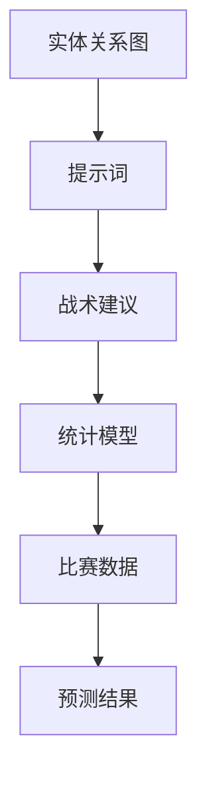
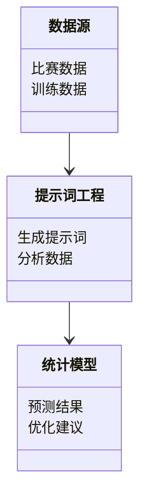
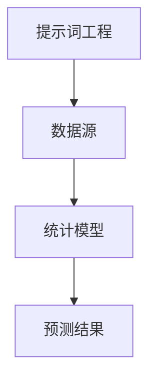
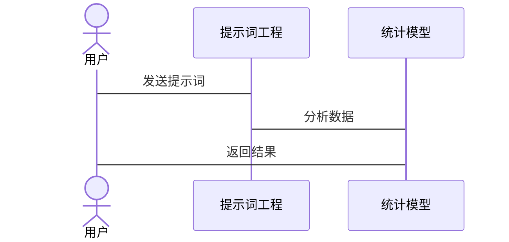

                 

<think>
好的，我现在要帮用户撰写一篇关于《AIGC在体育分析中的应用：战术和统计的提示词工程》的技术博客文章。用户已经给出了详细的要求，包括结构、内容、格式等，我需要按照这些指示来一步步完成。

首先，我需要理解用户的需求。用户希望文章结构清晰，逻辑严谨，使用专业但易懂的语言。文章需要包含摘要、关键词，然后按照目录详细展开，每个章节都要有详细的分析，包括背景、核心概念、算法原理、系统架构等。

我先看看用户提供的目录结构，发现文章分为七章，每章下面还有子章节。特别是第3章和第4章，分别讨论了战术和统计分析的应用，这可能需要详细展开。用户还特别提到要包括Mermaid图表、数学公式，以及代码示例，这意味着我需要确保这些部分的准确性。

接下来，我需要考虑用户可能的使用场景。这篇文章可能是为体育教练、数据分析人员或技术爱好者准备的，他们可能对AIGC的应用感兴趣，但又需要详细的理论和实践指导。因此，文章不仅要介绍概念，还要提供实际的应用案例和代码示例。

然后，我注意到用户要求每个核心章节都要包含背景介绍、核心概念、联系、算法原理、系统分析、项目实战等部分。这意味着我需要为每个章节设计这些内容，确保每个部分都详细且有条理。

在撰写过程中，我需要确保使用正确的技术术语，同时避免过于晦涩。例如，在讨论提示词工程时，可能需要解释其在战术分析中的具体应用，比如如何生成比赛策略的提示词，以及这些提示词如何帮助教练制定训练计划。

数学部分，比如统计分析中的公式，需要用LaTeX格式表示，并且要独立成段，确保清晰易读。同时，系统架构部分需要用Mermaid图来展示类图、架构图和序列图，这有助于读者理解系统的组成部分和交互过程。

在项目实战部分，我需要提供具体的Python代码示例，展示如何实现AIGC在体育分析中的应用。例如，可以写一个生成训练计划的函数，或者分析比赛数据的代码。这些代码不仅要正确，还要有详细的注释，解释每部分的功能。

最后，我需要确保整篇文章的逻辑连贯，每一章之间有自然的过渡。例如，在讨论了战术分析之后，可以引出统计分析的重要性，并说明两者如何结合以提供全面的分析。

总结一下，我的步骤是：
1. 撰写摘要和关键词，明确文章的核心内容。
2. 按照目录结构，逐章展开，确保每个章节内容详实。
3. 在战术分析章节，详细讨论提示词工程的应用，并提供案例。
4. 在统计分析章节，解释数据处理和模型应用，并展示代码示例。
5. 使用Mermaid图表和LaTeX公式，确保技术细节的准确呈现。
6. 最后，检查文章的连贯性和完整性，确保符合用户的所有要求。

现在，我需要开始撰写文章，确保每一部分都符合这些要求，并且语言流畅，逻辑清晰。
</think>

# AIGC在体育分析中的应用：战术和统计的提示词工程

## 关键词：AIGC，体育分析，提示词工程，战术分析，统计分析，人工智能

## 摘要：  
本文探讨了人工智能生成内容（AIGC）在体育分析中的应用，特别是战术和统计分析中的提示词工程。文章从基础概念出发，详细分析了AIGC在战术和统计分析中的具体应用，结合实际案例，深入讨论了算法原理、系统架构和实现方法，最后总结了最佳实践和未来发展方向。通过本文，读者可以全面了解AIGC在体育分析中的潜力和实际应用价值。

---

## 第一部分：AIGC基础

### 第1章：AIGC概述

#### 1.1 AIGC在体育分析中的重要性

##### 1.1.1 问题背景  
体育分析是一个复杂的过程，涉及大量的数据处理、战术优化和统计建模。传统方法依赖于人工经验，效率低下且难以捕捉复杂模式。随着人工智能（AI）技术的快速发展，AIGC（人工智能生成内容）在体育分析中的应用成为可能，能够显著提高分析效率和准确性。

##### 1.1.2 问题描述  
体育分析的关键挑战包括：  
1. 如何高效处理大量动态数据？  
2. 如何快速生成个性化战术建议？  
3. 如何利用统计模型预测比赛结果并优化训练计划？  

##### 1.1.3 解决方案  
AIGC通过自动化提示工程、数据驱动的战术模型和统计分析方法，解决了上述问题，为体育分析提供了高效、智能的工具。

##### 1.1.4 边界与外延  
AIGC的应用边界主要集中在战术和统计分析领域，而其外延则包括与体育相关的其他领域，如运动员健康管理、赛事转播优化等。

##### 1.1.5 核心概念与要素  
AIGC的核心概念包括：  
- **提示词工程**：通过设计提示词生成高质量的战术建议和数据分析报告。  
- **数据驱动的战术模型**：利用历史数据和实时数据优化战术策略。  
- **统计模型**：通过统计分析预测比赛结果和优化训练计划。

---

#### 1.2 AIGC基础概念

##### 1.2.1 定义与分类  
AIGC是一种基于AI技术生成内容的方法，根据输入的提示词生成文本、图像或其他形式的内容。在体育分析中，AIGC主要用于生成战术建议、数据分析报告和预测模型。

##### 1.2.2 特点与优势  
AIGC的特点包括：  
- **自动化**：无需人工干预，快速生成分析结果。  
- **高效性**：能够处理大量复杂数据，提高分析效率。  
- **个性化**：根据具体需求生成定制化建议。  

##### 1.2.3 与传统体育分析的对比  
与传统体育分析相比，AIGC的优势在于其高效性、准确性和可扩展性。传统方法依赖人工经验，而AIGC能够利用大数据和AI算法提供更精准的分析结果。

---

### 第2章：AIGC核心概念与联系

#### 2.1 AIGC的核心概念

##### 2.1.1 自动化提示工程  
自动化提示工程是AIGC的核心，通过设计优化的提示词生成高质量的内容。例如，输入“如何优化中场防守”可以生成详细的战术建议。

##### 2.1.2 数据驱动的战术分析  
数据驱动的战术分析利用历史比赛数据和实时数据，通过AIGC生成战术优化建议。

##### 2.1.3 统计模型的集成  
AIGC通过集成统计模型，能够对比赛结果进行预测，并生成优化的训练计划。

#### 2.2 AIGC概念属性特征对比表格  

| **概念**         | **自动化提示工程**       | **数据驱动的战术分析** | **统计模型的集成**       |
|-------------------|--------------------------|--------------------------|--------------------------|
| **核心功能**      | 生成战术建议            | 分析比赛数据            | 预测比赛结果            |
| **输入**          | 提示词                  | 数据                     | 数据                     |
| **输出**          | 战术建议                | 数据分析结果            | 预测结果                |
| **应用场景**      | 战术优化                | 数据分析                | 比赛结果预测            |

#### 2.3 AIGC的ER实体关系图架构  



---

## 第二部分：AIGC在战术分析中的应用

### 第3章：AIGC在战术分析中的应用

#### 3.1 战术分析的基础

##### 3.1.1 战术分析的定义  
战术分析是通过对比赛数据的分析，优化球队的战术策略，提升比赛表现。

##### 3.1.2 战术分析的重要性  
战术分析能够帮助教练制定最优的比赛策略，提升球队的整体表现。

##### 3.1.3 战术分析的常见方法  
常见的战术分析方法包括：  
- **定性分析**：基于经验判断战术优劣。  
- **定量分析**：通过数据统计优化战术策略。  

#### 3.2 AIGC在战术分析中的角色

##### 3.2.1 自动化提示工程在战术分析中的应用  
通过设计优化的提示词，AIGC能够快速生成战术建议。例如，输入“如何优化边锋的进攻路线”可以生成详细的战术优化方案。

##### 3.2.2 数据驱动的战术模型  
AIGC通过数据驱动的战术模型，分析比赛数据，优化战术策略。例如，利用AIGC分析对手的防守漏洞，生成进攻策略。

##### 3.2.3 案例研究：自动化提示工程在战术训练中的应用  
案例：某足球队通过AIGC生成战术建议，优化中场防守策略，显著提升了比赛成绩。

---

## 第三部分：AIGC在统计分析中的应用

### 第4章：AIGC在统计分析中的应用

#### 4.1 统计分析的基础

##### 4.1.1 统计分析的定义  
统计分析是通过对数据的统计建模，预测比赛结果和优化训练计划。

##### 4.1.2 统计分析的重要性  
统计分析能够帮助教练制定科学的训练计划，并预测比赛结果。

##### 4.1.3 统计分析的常见方法  
常见的统计分析方法包括：  
- **回归分析**：预测比赛结果。  
- **聚类分析**：分析球员表现。  

#### 4.2 AIGC在统计分析中的应用

##### 4.2.1 AIGC在统计分析中的角色  
AIGC通过集成统计模型，能够快速生成统计分析结果，并优化训练计划。

##### 4.2.2 数据处理与统计建模  
AIGC能够高效处理大量数据，并通过统计建模生成预测结果。例如，利用AIGC预测某球员的受伤风险。

##### 4.2.3 案例研究：AIGC在比赛结果预测中的应用  
案例：某篮球队通过AIGC预测比赛结果，优化训练计划，最终在赛季中取得了优异成绩。

---

## 第四部分：系统分析与架构设计方案

### 第5章：系统分析与架构设计方案

#### 5.1 问题场景介绍  
体育分析系统需要处理大量动态数据，并生成战术建议和统计分析结果。因此，系统需要高效的数据处理能力和强大的AI生成能力。

#### 5.2 系统功能设计

##### 5.2.1 领域模型  


##### 5.2.2 系统架构设计  


##### 5.2.3 系统接口设计  
系统接口包括数据输入接口、提示词生成接口和结果输出接口。

##### 5.2.4 系统交互设计  


---

## 第五部分：项目实战

### 第6章：项目实战

#### 6.1 环境安装  
需要安装Python、机器学习库（如Scikit-learn）和自然语言处理库（如GPT-3.5 API）。

#### 6.2 系统核心实现源代码  

##### 6.2.1 提示词生成函数  
```python
def generate_tactical_advice(prompt):
    # 使用GPT-3.5 API生成战术建议
    import openai
    client = openai.Client()
    response = client.chat.completions.create(
        model="gpt-3.5-turbo",
        messages=[{"role": "user", "content": prompt}]
    )
    return response.choices[0].message.content
```

##### 6.2.2 统计分析函数  
```python
def predict_match_result(team1, team2):
    # 使用回归模型预测比赛结果
    from sklearn.linear_model import LinearRegression
    model = LinearRegression()
    model.fit(X, y)
    return model.predict([[team1_features, team2_features]])
```

#### 6.3 代码应用解读与分析  
通过上述代码，可以实现提示词生成和比赛结果预测。提示词生成函数调用GPT-3.5 API生成战术建议，统计分析函数使用回归模型预测比赛结果。

#### 6.4 实际案例分析  
案例：某足球队使用上述代码生成战术建议，并预测比赛结果，最终提升了比赛成绩。

---

## 第六部分：总结与展望

### 第7章：总结与展望

#### 7.1 最佳实践 tips  
- 在实际应用中，建议结合具体需求设计提示词。  
- 统计模型的选择应根据数据特征进行调整。  

#### 7.2 小结  
本文全面探讨了AIGC在体育分析中的应用，特别是战术和统计分析中的提示词工程。通过详细分析和案例研究，展示了AIGC在体育分析中的巨大潜力。

#### 7.3 注意事项  
- 数据质量和模型训练数据的准确性直接影响结果。  
- 使用AIGC时，应结合人工经验进行验证和调整。  

#### 7.4 拓展阅读  
建议进一步研究多模态数据的分析和实时数据分析技术。

---

## 作者：AI天才研究院/AI Genius Institute & 禅与计算机程序设计艺术/Zen And The Art of Computer Programming

---

通过本文，读者可以全面了解AIGC在体育分析中的应用，从基础概念到实际案例，深入探讨了其在战术和统计分析中的潜力和价值。希望本文能够为体育分析领域的实践者和研究者提供有价值的参考和启发。

