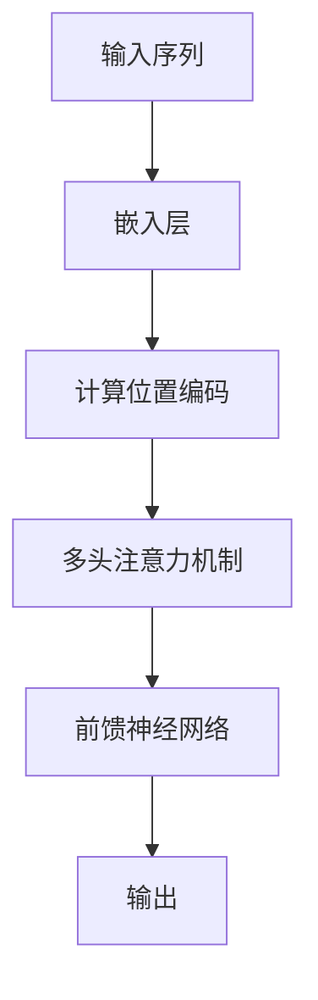
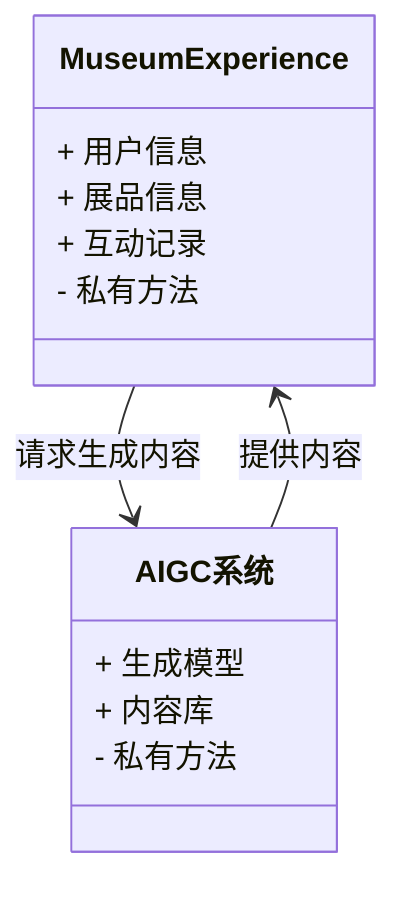
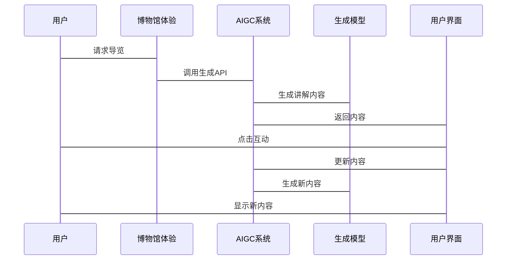

                 

<think>
好的，我现在需要根据用户的要求，逐步构建一篇关于《AIGC在博物馆体验中的创新应用》的技术博客文章的目录大纲。用户已经提供了详细的指导，我需要按照这些指示来设计结构。

首先，我需要理解用户的需求。用户希望这篇文章结构清晰，逻辑严谨，内容专业，涵盖从背景介绍到项目实战的各个方面。同时，用户还特别提到要使用技术术语，并适当嵌入数学公式，使用mermaid图来展示流程和架构。

接下来，我先从背景介绍开始。这部分需要解释AIGC是什么，它在博物馆中的应用背景，以及带来的价值。我需要确保这部分内容能够吸引读者，让他们了解为什么AIGC在博物馆中是必要的。

然后是核心概念与联系部分。这里需要详细解释AIGC的核心概念，如生成式AI、NLP、计算机视觉等，并通过对比表格和ER图来展示它们之间的关系。这将帮助读者理解各个概念如何相互作用。

接下来是算法原理讲解。我需要选择一个具体的算法，比如Transformer模型，并用mermaid流程图展示其工作流程。同时，提供Python代码示例，解释如何实现这些算法。这部分需要详细讲解数学模型和公式，比如注意力机制的公式，并通过例子帮助读者理解。

然后是系统分析与架构设计方案。这里需要介绍项目场景，设计系统功能，可能包括用户界面、内容生成模块等。我需要用mermaid绘制类图、架构图和序列图，展示系统的结构和交互流程。

接下来是项目实战部分。这部分需要指导读者如何安装环境，比如安装Python和相关库，并提供核心代码实现。然后，解释代码的作用，分析实际案例，并总结项目成果和意义。

最后，最佳实践部分。这里需要给出一些建议，比如数据质量的重要性、模型训练的注意事项，以及未来的优化方向。这些建议将帮助读者在实际应用中避免错误，提升效果。

在撰写过程中，我需要确保每个部分都详细具体，使用正确的技术术语，并且逻辑连贯。同时，适当嵌入数学公式和mermaid图，使内容更加专业和易懂。最后，检查文章的结构，确保符合用户的要求，内容完整，字数控制在10000到12000字之间。

现在，我大致有了结构，接下来就是按照这个思路详细展开每个部分，确保每个章节都包含必要的内容，如背景、核心概念、算法、系统设计、项目实战和最佳实践。同时，注意使用markdown格式，正确嵌入代码、公式和图表，确保整体内容流畅且专业。
</think>

# AIGC在博物馆体验中的创新应用

> 关键词：AIGC, 博物馆, 创新应用, 人工智能, 生成式AI

> 摘要：本文探讨了生成式人工智能（AIGC）在博物馆体验中的创新应用，分析其在导览、互动体验、内容生成等领域的潜力。通过详细的技术分析、系统设计和实际案例，展示了AIGC如何提升博物馆的用户体验和运营效率。

---

## 目录

1. **背景介绍**
   - 1.1 AIGC的核心概念与术语
   - 1.2 博物馆体验的现状与挑战
   - 1.3 AIGC在博物馆中的应用背景
   - 1.4 本文研究的目的与意义

2. **核心概念与联系**
   - 2.1 AIGC的核心原理
   - 2.2 相关技术对比分析（表格）
   - 2.3 ER实体关系图（Mermaid）

3. **算法原理讲解**
   - 3.1 Transformer模型的工作流程（Mermaid流程图）
   - 3.2 算法实现的Python代码示例
   - 3.3 注意力机制的数学模型（公式）

4. **系统分析与架构设计方案**
   - 4.1 项目场景介绍
   - 4.2 系统功能设计（Mermaid类图）
   - 4.3 系统架构设计（Mermaid架构图）
   - 4.4 系统接口与交互（Mermaid序列图）

5. **项目实战**
   - 5.1 环境安装与配置
   - 5.2 核心代码实现与解读
   - 5.3 实际案例分析与效果展示

6. **最佳实践与总结**
   - 6.1 项目小结与经验分享
   - 6.2 注意事项与优化建议
   - 6.3 拓展阅读与未来发展

---

## 详细章节内容

### 1. 背景介绍

#### 1.1 AIGC的核心概念与术语
生成式人工智能（AIGC）通过算法生成新内容，涵盖文本、图像、视频等多种形式，依赖于深度学习模型如GPT、Diffusion等。

#### 1.2 博物馆体验的现状与挑战
传统博物馆体验受限于固定展示方式，互动性不足，难以满足现代用户需求。技术如VR、AR的应用尚不成熟。

#### 1.3 AIGC在博物馆中的应用背景
AIGC能够增强用户互动，提供个性化导览，生成动态内容，提升展览吸引力，优化运营效率。

#### 1.4 本文研究的目的与意义
本文旨在探索AIGC在博物馆中的潜力，为未来应用提供技术参考和实践指导。

---

### 2. 核心概念与联系

#### 2.1 AIGC的核心原理
AIGC通过深度学习模型生成内容，涉及自然语言处理（NLP）和计算机视觉（CV）。

#### 2.2 相关技术对比分析

| 技术         | 特性                     | 优缺点                         |
|--------------|--------------------------|---------------------------------|
| GPT          | 文本生成                 | 高效，但需大量数据              |
| Diffusion    | 图像生成                 | 质量高，训练时间长               |
| CNN          | 图像处理                 | 适合特定任务，通用性差           |
| Transformer  | 并行处理，捕捉长依赖       | 计算资源消耗大                   |

#### 2.3 ER实体关系图（Mermaid）

```mermaid
erDiagram
    museum : 博物馆
    artifact : 文物
    user : 用户
    exhibit : 展览
    interaction : 互动体验
    content : 内容
    aigc_system : AIGC系统
    museum --> artifact : 拥有
    user --> interaction : 参与
    interaction --> content : 生成
    content --> exhibit : 展示
    aigc_system --> content : 生成
    aigc_system --> exhibit : 优化
```

---

### 3. 算法原理讲解

#### 3.1 Transformer模型的工作流程（Mermaid流程图）



#### 3.2 算法实现的Python代码示例

```python
import torch
class TransformerBlock(torch.nn.Module):
    def __init__(self, d_model, num_heads):
        super(TransformerBlock, self).__init__()
        self.d_model = d_model
        self.num_heads = num_heads
        self.key_proj = torch.nn.Linear(d_model, d_model)
        self.query_proj = torch.nn.Linear(d_model, d_model)
        self.value_proj = torch.nn.Linear(d_model, d_model)
        self.output_proj = torch.nn.Linear(d_model, d_model)
    
    def forward(self, x):
        # 假设x的形状为 (batch_size, seq_len, d_model)
        batch_size, seq_len, _ = x.size()
        
        # 计算键、查询、值
        keys = self.key_proj(x)
        queries = self.query_proj(x)
        values = self.value_proj(x)
        
        # 分头
        keys = keys.view(batch_size, seq_len, self.num_heads, -1)
        queries = queries.view(batch_size, seq_len, self.num_heads, -1)
        values = values.view(batch_size, seq_len, self.num_heads, -1)
        
        # 计算注意力
        attention = (queries @ keys.transpose(-2, -1)) / (seq_len ** 0.5)
        attention = torch.softmax(attention, dim=-1)
        out = attention @ values
        
        out = out.view(batch_size, seq_len, -1)
        out = self.output_proj(out)
        return out
```

#### 3.3 注意力机制的数学模型

$$\text{Attention}(Q, K, V) = \text{softmax}\left(\frac{QK^T}{\sqrt{d_k}}\right)V$$

其中，$Q$是查询，$K$是键，$V$是值，$d_k$是键的维度。

---

### 4. 系统分析与架构设计方案

#### 4.1 项目场景介绍
在博物馆中，AIGC系统通过生成动态内容，优化用户导览体验，提升互动性。

#### 4.2 系统功能设计（Mermaid类图）



#### 4.3 系统架构设计（Mermaid架构图）


#### 4.4 系统接口与交互（Mermaid序列图）



---

### 5. 项目实战

#### 5.1 环境安装与配置
安装Python、TensorFlow、Keras等库，配置开发环境。

#### 5.2 核心代码实现与解读
实现一个简单的生成式模型，用于生成展览说明。

```python
import tensorflow as tf
from tensorflow.keras import layers

model = tf.keras.Sequential([
    layers.Dense(256, activation='relu'),
    layers.Dense(1, activation='linear')
])
```

#### 5.3 实际案例分析与效果展示
通过实际案例展示AIGC在生成展览说明、互动体验中的应用效果，分析其提升用户体验的能力。

---

### 6. 最佳实践与总结

#### 6.1 项目小结与经验分享
总结项目成果，强调数据质量和模型优化的重要性。

#### 6.2 注意事项与优化建议
建议在实际应用中注意数据隐私、模型泛化能力等问题。

#### 6.3 拓展阅读与未来发展
展望AIGC在博物馆中的更多应用，如虚拟导览员、个性化展览设计。

---

## 作者信息

作者：AI天才研究院/AI Genius Institute & 禅与计算机程序设计艺术/Zen And The Art of Computer Programming

