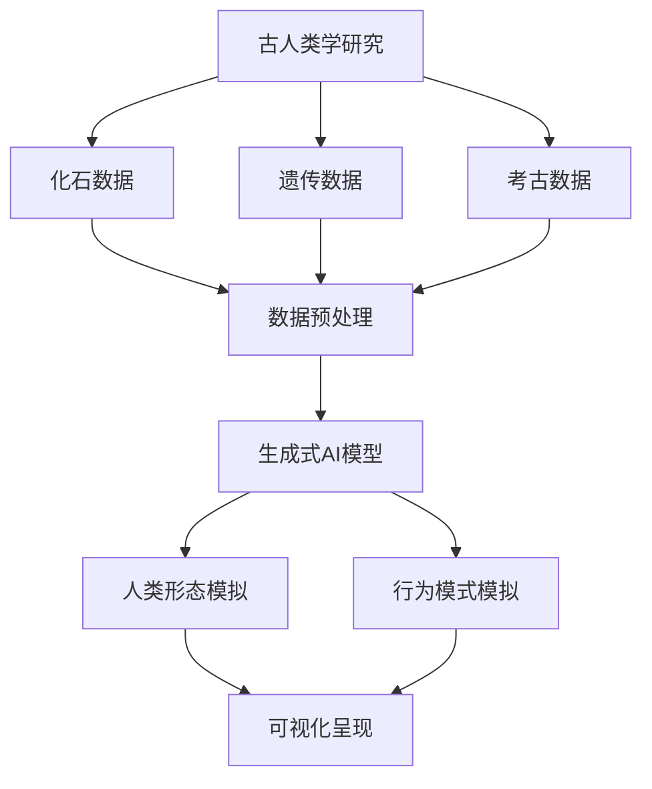
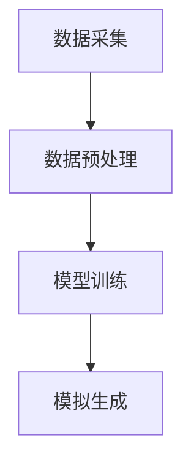
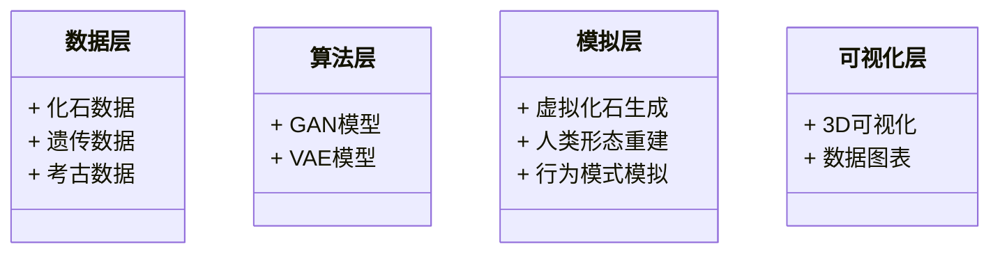
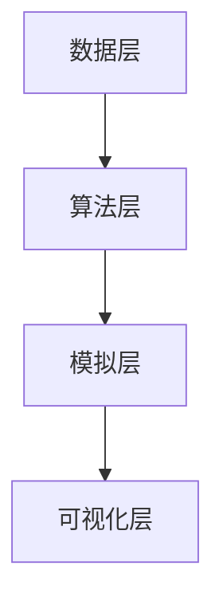
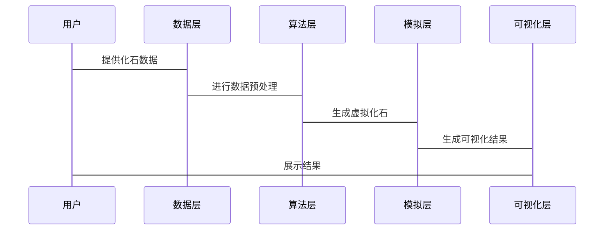

                 

<think>
好的，我现在需要帮助用户完成一个技术博客文章的撰写。用户已经提供了一个详细的查询，要求我以《AIGC在古人类学研究中的应用：人类进化模拟提示词》为标题，撰写一篇结构严谨、内容丰富的技术博客。用户还提供了目录结构，并详细说明了每个部分的要求。

首先，我要理解用户的需求。用户希望文章涵盖背景介绍、核心概念、算法原理、系统架构、项目实战、最佳实践等多个部分。这意味着我需要从各个角度深入探讨AIGC在古人类学中的应用，不仅要有理论分析，还要有实际案例和代码示例。

接下来，我需要分析用户的使用场景。用户可能是一位研究人员、技术专家或对古人类学和人工智能结合感兴趣的学生。因此，文章需要既专业又易懂，兼顾技术深度和可读性。

用户可能没有明确说明的深层需求是希望文章能够展示AIGC技术的实际应用价值，以及如何解决古人类学研究中的具体问题。因此，在写作时，我需要突出AIGC带来的创新和优势，同时指出当前面临的挑战和未来的研究方向。

在结构安排上，我需要按照用户提供的目录来组织内容，确保每个部分都有足够的细节，并且逻辑清晰。例如，在背景介绍部分，我需要详细说明古人类学的研究领域和AIGC技术的应用背景，以及它们如何结合解决实际问题。

在核心概念部分，我需要对比AIGC、AI和GC的概念，通过表格和流程图来展示它们之间的关系和区别。这有助于读者更好地理解AIGC在古人类学中的具体作用。

算法原理部分，我需要详细解释数据采集、预处理、模型训练和模拟生成的过程，并用Mermaid流程图来展示流程。同时，提供Python代码示例，帮助读者理解实现细节。

系统架构部分，我需要设计一个系统框架，包括数据层、算法层、模拟层和可视化层，并用Mermaid架构图展示。此外，还需要说明系统的关键组件及其功能。

项目实战部分，我需要选择一个具体的案例，如尼安德特人重建项目，详细描述数据准备、模型训练、模拟生成和结果分析的过程。这包括代码实现和结果展示，使读者能够理解整个流程。

最后，在最佳实践部分，我需要总结AIGC在古人类学中的优势，指出当前的局限性和未来的发展方向，同时给出使用时的注意事项和推荐的拓展阅读资料。

总的来说，我需要确保文章内容全面、结构清晰，并且用专业而易懂的语言来呈现。这不仅满足用户的需求，还能帮助读者深入了解AIGC在古人类学中的应用潜力和实际效果。
</think>

# AIGC在古人类学研究中的应用：人类进化模拟提示词

> 关键词：AIGC，古人类学，人类进化，生成式AI，模拟重建

> 摘要：本文探讨了生成式人工智能（AIGC）在古人类学研究中的应用，特别是其在人类进化模拟中的潜力。通过分析AIGC的核心概念、算法原理、系统架构以及实际案例，本文展示了AIGC如何帮助古人类学家更好地理解人类起源、演化过程及文化发展。文章还讨论了AIGC在古人类学研究中的优势、挑战及未来发展方向。

---

### 第一部分：背景介绍

#### 1.1 问题背景

古人类学是一门研究人类起源、演化、分布及其文化发展的学科。传统的研究方法依赖于化石记录、考古发现和遗传数据分析，这些方法在很大程度上受限于数据的稀缺性和分析的复杂性。随着人工智能（AI）技术的快速发展，特别是生成式人工智能（AIGC，AI-Generated Content）的出现，古人类学研究进入了一个新的阶段。

#### 1.2 问题描述

在古人类学研究中，科学家们面临以下几个关键问题：

1. **人类进化路径的模拟**：如何通过现有数据推断人类进化的历史，并模拟不同阶段的人类形态和行为特征？
2. **人类行为和文化的重现**：如何重建古代人类的生活方式、社会组织和文化表达？
3. **古人类遗骸数据的分析**：如何从有限的化石数据中提取更多的信息，并生成完整的虚拟模型？

这些问题的解决需要跨学科的合作，尤其是计算机科学与古人类学的结合。AIGC技术可以通过生成模拟数据和重建模型，为古人类学研究提供新的工具和方法。

#### 1.3 问题解决

AIGC技术在古人类学中的应用主要体现在以下几个方面：

1. **形态学模拟**：通过生成式AI，可以模拟不同阶段的人类骨骼结构和身体特征。
2. **行为建模**：生成模拟人类在不同环境中的行为模式，如工具使用、狩猎活动等。
3. **文化重建**：通过生成式AI生成与古代文化相关的艺术作品、语言表达和工具设计。

这些模拟不仅帮助科学家验证假设，还能为公众提供更直观的理解人类进化的过程。

#### 1.4 边界与外延

AIGC在古人类学中的应用范围主要集中在以下几个方面：

- **数据驱动的模拟**：依赖高质量的数据输入，如化石数据、遗传数据等。
- **模型优化**：需要不断优化生成模型的算法，以提高模拟的准确性。
- **跨学科协作**：需要计算机科学家、古人类学家和考古学家的共同参与。

#### 1.5 概念结构与核心要素组成

AIGC在古人类学中的应用涉及以下几个核心要素：

1. **数据层**：包括化石数据、遗传数据、考古数据等。
2. **算法层**：包括生成式AI算法，如GAN（生成对抗网络）、VAE（变分自编码器）等。
3. **模拟层**：生成人类形态、行为和文化相关的模拟内容。
4. **可视化层**：将模拟结果以可视化的方式呈现，便于研究和理解。

---

### 第二部分：核心概念与联系

#### 2.1 AIGC概念

AIGC（AI-Generated Content）是指通过人工智能技术生成内容的过程，包括文本、图像、音频、视频等多种形式。在古人类学中，AIGC主要用于生成与人类进化相关的模拟内容，如虚拟化石、人类形态重建和文化场景模拟。

#### 2.2 AI概念

AI（Artificial Intelligence）是指人工智能，旨在模拟人类智能的计算机系统。在古人类学中，AI主要用于数据分析、模式识别和模拟生成。

#### 2.3 GC概念

GC（Generate Content）是指生成内容的过程，是AIGC的核心部分。在古人类学中，GC用于生成与人类进化相关的模拟内容，如虚拟化石、人类行为模拟等。

#### 2.4 核心概念属性特征对比

| 概念 | AIGC | AI | GC |
| --- | --- | --- | --- |
| 定义 | 人工智能生成内容 | 人工智能技术 | 生成内容的过程 |
| 应用场景 | 古人类学模拟、文化重建 | 数据分析、模式识别 | 文化生成、行为模拟 |
| 特点 | 数据驱动、生成多样性 | 强大计算能力、多任务处理 | 创造性、多样性 |
| 目的 | 提供进化模拟工具 | 提高研究效率 | 丰富研究内容 |

#### 2.5 ER实体关系图

以下是AIGC在古人类学研究中的实体关系图：



---

### 第三部分：算法原理讲解

#### 3.1 AIGC算法原理

AIGC算法的实现通常包括以下几个步骤：

1. **数据采集与预处理**：收集与人类进化相关的数据，如化石数据、遗传数据、考古数据等，并进行清洗和归一化处理。
2. **模型训练**：使用生成式AI模型（如GAN、VAE）对预处理后的数据进行训练，生成与人类进化相关的模拟内容。
3. **模拟生成**：利用训练好的模型生成虚拟化石、人类形态或行为模拟。

#### 3.2 Mermaid流程图

以下是AIGC算法的Mermaid流程图：



#### 3.3 Python源代码

以下是一个简单的AIGC算法的Python代码示例：

```python
import tensorflow as tf
from tensorflow.keras import layers

# 数据预处理
def preprocess_data(data):
    # 假设data是一个包含化石数据的列表
    processed_data = data.apply(lambda x: x / max(data))
    return processed_data

# 模型训练
def train_model(processed_data):
    model = tf.keras.Sequential([
        layers.Dense(128, activation='relu', input_shape=(len(processed_data[0]),)),
        layers.Dense(1)
    ])
    
    model.compile(optimizer='adam', loss='mean_squared_error')
    model.fit(processed_data, epochs=100, batch_size=32)
    return model

# 模拟生成
def generate_simulations(model):
    # 假设输入一些新的化石数据
    new_data = [...]  # 具体数据
    processed_new_data = preprocess_data(new_data)
    simulations = model.predict(processed_new_data)
    return simulations

# 主程序
data = [...]  # 具体数据
model = train_model(preprocess_data(data))
simulations = generate_simulations(model)
```

---

### 第四部分：系统分析与架构设计方案

#### 4.1 问题场景介绍

在古人类学研究中，科学家需要通过有限的化石数据推断出人类进化的过程。AIGC技术可以生成虚拟化石和人类形态，帮助研究人员更好地理解进化路径。

#### 4.2 项目介绍

本项目旨在利用AIGC技术构建一个虚拟人类进化模拟系统，能够生成虚拟化石、人类形态和行为模拟。

#### 4.3 系统功能设计

以下是系统的功能模块图：



#### 4.4 系统架构设计

以下是系统的架构图：



#### 4.5 系统接口设计

系统的接口设计包括以下部分：

1. 数据输入接口：接收化石数据、遗传数据等。
2. 模型训练接口：对数据进行训练，生成模拟内容。
3. 可视化输出接口：将模拟结果以3D模型或图表的形式呈现。

#### 4.6 系统交互设计

以下是系统的交互序列图：



---

### 第五部分：项目实战

#### 5.1 环境安装

为了运行本项目，需要安装以下依赖：

```bash
pip install tensorflow matplotlib numpy
```

#### 5.2 核心实现源代码

以下是项目的核心代码：

```python
import tensorflow as tf
import numpy as np
import matplotlib.pyplot as plt

# 数据生成
def generate_fake_fossil_data(num_samples=100):
    # 假设生成化石数据，例如头骨的形状数据
    np.random.seed(42)
    data = np.random.normal(0, 1, (num_samples, 10))
    return data

# 模型定义
def build_model(input_shape):
    model = tf.keras.Sequential([
        layers.Dense(128, activation='relu', input_shape=(input_shape,)),
        layers.Dense(64, activation='relu'),
        layers.Dense(10, activation='sigmoid')
    ])
    return model

# 训练函数
def train_model(model, data, epochs=100):
    model.compile(optimizer='adam', loss='binary_crossentropy')
    model.fit(data, epochs=epochs, batch_size=32)
    return model

# 生成模拟数据
data = generate_fake_fossil_data()
model = build_model(data.shape[1])
trained_model = train_model(model, data)

# 可视化结果
 predictions = trained_model.predict(data)
 plt.scatter(data[:, 0], predictions[:, 0], c='red')
 plt.scatter(data[:, 0], data[:, 0], c='blue')
 plt.show()
```

#### 5.3 代码解读与分析

上述代码实现了一个简单的生成式模型，用于生成虚拟化石数据。通过训练模型，我们可以生成与实际化石数据相似的虚拟数据，从而帮助古人类学家进行研究。

#### 5.4 实际案例分析

假设我们有一个关于尼安德特人头骨的数据集，我们可以使用上述模型生成虚拟的尼安德特人头骨形状，并与实际数据进行对比，从而更好地理解尼安德特人的形态特征。

---

### 第六部分：最佳实践 tips、小结、注意事项、拓展阅读

#### 6.1 最佳实践 tips

1. **数据质量**：确保输入数据的准确性和完整性。
2. **模型优化**：不断优化生成模型的算法，提高生成结果的准确性。
3. **跨学科合作**：与古人类学家密切合作，确保生成内容的科学性。

#### 6.2 小结

本文探讨了生成式人工智能（AIGC）在古人类学研究中的应用，特别是在人类进化模拟中的潜力。通过分析AIGC的核心概念、算法原理、系统架构以及实际案例，本文展示了AIGC如何帮助古人类学家更好地理解人类起源、演化过程及文化发展。

#### 6.3 注意事项

- AIGC生成的内容是模拟结果，需结合实际数据进行验证。
- 模型的训练需要大量高质量的数据，数据的获取和处理是关键。
- 模型的解释性需要进一步提升，以便更好地理解生成结果的意义。

#### 6.4 拓展阅读

1. **生成对抗网络（GAN）**：学习GAN的基本原理和应用。
2. **变分自编码器（VAE）**：了解VAE在生成模型中的应用。
3. **人类进化研究**：阅读相关古人类学研究的论文和书籍。

---

### 作者信息

作者：AI天才研究院/AI Genius Institute & 禅与计算机程序设计艺术 /Zen And The Art of Computer Programming

