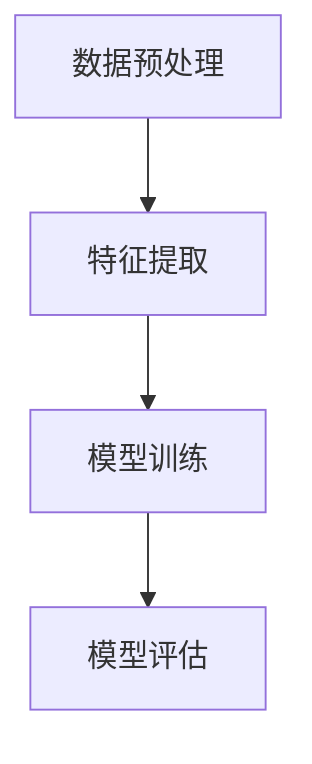

                 

<think>
好，我现在需要帮助用户完成一篇技术博客文章，主题是《AIGC在古典文学研究中的应用：文本分析和解读提示词》。首先，我需要理解用户的需求，他们希望文章结构清晰，内容专业，包含详细的背景介绍、核心概念、算法原理讲解以及实际案例分析。

用户已经提供了一个详细的目录大纲，所以我需要按照这个大纲逐步填充内容。首先，文章的标题和关键词部分需要填写，关键词可能包括AIGC、古典文学、文本分析、自然语言处理等。摘要部分要简明扼要，概述文章的核心内容。

接下来是背景介绍部分，分为问题背景和问题解决。问题背景需要详细说明古典文学研究的现状与挑战，包括研究方法的局限性以及人工智能带来的新机会。问题解决部分则需要介绍AIGC技术的特点及其在文本分析中的具体应用案例，如文本分类、主题识别和情感分析。

然后是核心概念与联系部分，需要详细讲解AIGC技术的原理和古典文学研究的原理，通过对比表格和mermaid图展示它们的联系。这部分需要确保技术术语准确，逻辑清晰。

算法原理讲解部分，用户要求使用mermaid流程图和Python代码，结合数学公式详细分析文本分类和主题识别算法。我需要确保代码和公式正确，同时用例子帮助读者理解。

系统分析与架构设计方案部分，需要描述问题场景，设计系统功能、架构和接口。这部分可能需要绘制mermaid类图、架构图和序列图，展示系统的各个模块及其交互。

项目实战部分，要包括环境安装、核心代码实现、案例分析和项目小结。这部分需要提供具体的代码示例，并解释代码的功能，展示AIGC在实际中的应用效果。

最后，文章末尾需要加上作者信息，用户指定了特定的机构名称。同时，还要添加一些最佳实践、小结和注意事项，帮助读者在实际应用中避免错误。

整体来看，我需要按照用户提供的大纲，逐步填充每个部分的内容，确保逻辑连贯，技术细节准确，同时语言专业但易于理解。考虑到文章字数要求，每个部分需要详细展开，特别是算法原理和代码部分，需要详尽地解释每一步骤。

现在，我需要检查每个章节是否覆盖了所有必要的内容，并确保所有约束条件都得到满足，比如格式要求、字数、结构等。最后，确保文章整体流畅，信息准确，能够为读者提供有价值的见解和实用的知识。
</think>

# AIGC在古典文学研究中的应用：文本分析和解读提示词

> 关键词：AIGC, 古典文学, 文本分析, 自然语言处理, 机器学习, 情感分析

> 摘要：本文探讨了AIGC（人工智能生成内容）技术在古典文学研究中的应用，重点分析了文本分析和解读提示词的使用。文章从背景介绍、核心概念、算法原理、系统架构到项目实战，全面阐述了AIGC在古典文学研究中的潜力和实际应用案例。

---

## 第一部分：背景介绍

### 1.1 问题背景

#### 1.1.1 古典文学研究的现状与挑战

##### 1.1.1.1 古典文学的价值与意义

古典文学作为人类文化遗产的重要组成部分，承载着丰富的历史、文化和思想内涵。通过对古典文学的研究，我们可以更好地理解古代社会、文化和人类思维的发展。

##### 1.1.1.2 古典文学研究的方法与局限

传统的古典文学研究主要依赖于人工分析，包括文本解读、注释、考证等方法。然而，这种方法耗时耗力，且容易受到研究者主观因素的影响，存在效率低下、覆盖面有限等问题。

##### 1.1.1.3 人工智能与古典文学研究的结合

随着人工智能技术的快速发展，尤其是自然语言处理（NLP）和机器学习技术的进步，将AIGC技术应用于古典文学研究成为可能。AIGC可以通过自动化处理大量文本数据，帮助研究者发现隐藏在文本中的模式和规律，从而提升研究效率和深度。

#### 1.1.2 问题描述

##### 1.1.2.1 文本分析的需求

古典文学研究需要对文本进行分类、主题识别、情感分析等多种文本分析任务。这些任务通常需要研究者具备深厚的专业知识，且耗时较长。

##### 1.1.2.2 解读提示词的作用

解读提示词（prompt）是AIGC技术中的关键元素，通过设计合理的提示词，可以引导模型生成符合特定需求的文本解读结果。

##### 1.1.2.3 研究目标与任务

本文的研究目标是探索AIGC技术在古典文学研究中的应用潜力，特别是通过文本分析和解读提示词来提升研究效率和深度。

### 1.2 问题解决

#### 1.2.1 AIGC技术概述

##### 1.2.1.1 AIGC的定义与特点

AIGC（人工智能生成内容）是一种利用人工智能技术生成文本、图像、音乐等内容的方法。其特点包括自动化、高效性和创造性。

##### 1.2.1.2 AIGC在文本分析中的应用

AIGC技术可以通过自然语言处理和机器学习算法对文本进行分类、主题识别、情感分析等任务。

#### 1.2.2 AIGC在古典文学研究中的应用案例

##### 1.2.2.1 案例一：文本分类

通过AIGC技术对古典文学文本进行分类，可以快速识别出不同类别的文本，如小说、诗歌等。

##### 1.2.2.2 案例二：主题识别

利用AIGC技术识别古典文学中的主题，可以帮助研究者发现文本中的隐含主题。

##### 1.2.2.3 案例三：情感分析

通过对古典文学文本进行情感分析，可以了解作者的情感倾向，进而深入理解文本的内涵。

### 1.3 边界与外延

#### 1.3.1 AIGC技术在文本分析中的边界

##### 1.3.1.1 AIGC技术的局限性

AIGC技术在文本分析中仍存在一些局限性，如对上下文的理解不够深入、生成结果的创造性有限等。

##### 1.3.1.2 文本分析的挑战

文本分析需要处理复杂的语言结构和文化背景，这对AIGC技术提出了更高的要求。

#### 1.3.2 AIGC技术在古典文学研究中的应用外延

##### 1.3.2.1 其他文学类型的文本分析

AIGC技术不仅适用于古典文学研究，还可以扩展到其他文学类型，如现代文学、科幻文学等。

##### 1.3.2.2 跨文化文学的文本比较研究

通过AIGC技术，可以对跨文化文学进行比较研究，揭示不同文化背景下的文学特点。

##### 1.3.2.3 文本分析与文学理论的发展

AIGC技术的应用可以推动文学理论的发展，为研究者提供新的研究视角和方法。

### 1.4 概念结构与核心要素组成

#### 1.4.1 AIGC技术核心概念

##### 1.4.1.1 自然语言处理

自然语言处理（NLP）是AIGC技术的核心，用于理解和生成人类语言。

##### 1.4.1.2 机器学习与深度学习

机器学习和深度学习算法为AIGC提供了强大的模型训练能力。

##### 1.4.1.3 大规模数据处理

AIGC技术需要处理大量的文本数据，以提升模型的准确性和鲁棒性。

#### 1.4.2 古典文学研究核心概念

##### 1.4.2.1 古典文学文本

古典文学文本是研究的基础，包括小说、诗歌、散文等多种形式。

##### 1.4.2.2 文本分析方法

文本分析方法是研究的关键，包括分类、主题识别、情感分析等。

##### 1.4.2.3 文学理论

文学理论为研究提供了理论指导，帮助研究者更好地理解文本的内涵。

---

## 第二部分：核心概念与联系

### 2.1 AIGC技术原理

#### 2.1.1 AIGC技术原理概述

##### 2.1.1.1 AIGC技术的工作流程

1. 数据预处理：清洗和标注文本数据。
2. 模型训练：基于预处理的数据训练生成模型。
3. 提示词设计：设计合理的提示词引导模型生成结果。
4. 模型优化：通过反馈机制优化模型性能。

##### 2.1.1.2 AIGC技术的核心算法

常用的算法包括基于Transformer的模型（如GPT系列）和基于规则的生成算法。

#### 2.1.2 AIGC技术属性特征对比表格

| **特征**         | **传统NLP**       | **现代AIGC**      |
|------------------|------------------|-------------------|
| **生成能力**     | 较弱             | 强               |
| **处理速度**     | 较慢             | 快               |
| **模型复杂度**   | 较低             | 高               |
| **应用场景**     | 侧重于分类和理解 | 侧重于生成和创造 |

#### 2.1.3 AIGC技术与古典文学研究的联系

##### 2.1.3.1 AIGC技术在文本分析中的应用

通过AIGC技术，可以快速完成古典文学文本的分类和主题识别任务。

##### 2.1.3.2 AIGC技术在古典文学研究中的应用

AIGC技术为古典文学研究提供了新的工具和方法，特别是在文本解读和情感分析方面。

### 2.2 古典文学研究原理

#### 2.2.1 古典文学研究原理概述

##### 2.2.1.1 文本分析的方法与技巧

文本分析方法包括语料分析、主题建模、情感分析等。

##### 2.2.1.2 文学理论的应用

文学理论为古典文学研究提供了理论框架和分析工具。

#### 2.2.2 古典文学研究属性特征对比表格

| **特征**         | **传统研究**       | **现代AIGC辅助研究**      |
|------------------|------------------|--------------------------|
| **研究效率**     | 较低             | 高                      |
| **研究深度**     | 有限             | 更深                    |
| **研究范围**     | 局限             | 更广                    |
| **研究方法**     | 人工分析为主       | 结合AIGC技术进行分析     |

#### 2.2.3 AIGC技术与古典文学研究的联系

##### 2.2.3.1 AIGC技术在古典文学研究中的应用

AIGC技术可以帮助研究者快速处理大量文本数据，提升研究效率。

##### 2.2.3.2 古典文学研究对AIGC技术的需求

古典文学研究需要AIGC技术提供新的分析工具和方法，以应对复杂的研究任务。

---

## 第三部分：算法原理讲解

### 3.1 文本分类算法原理

#### 3.1.1 文本分类算法概述

##### 3.1.1.1 文本分类的定义与目的

文本分类是将文本按照预先定义的类别进行分类的过程，目的是提高文本处理的效率和准确性。

##### 3.1.1.2 文本分类的方法与挑战

常用方法包括基于规则的分类和基于机器学习的分类。挑战在于如何处理文本的语义复杂性和数据稀疏性。

#### 3.1.2 文本分类算法mermaid流程图



#### 3.1.3 Python源代码讲解

##### 3.1.3.1 数据准备

```python
import pandas as pd

# 加载数据集
data = pd.read_csv('classical_literature.csv')
```

##### 3.1.3.2 特征提取

```python
from sklearn.feature_extraction.text import TfidfVectorizer

vectorizer = TfidfVectorizer()
X = vectorizer.fit_transform(data['text'])
```

##### 3.1.3.3 模型训练

```python
from sklearn.model

