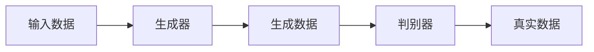
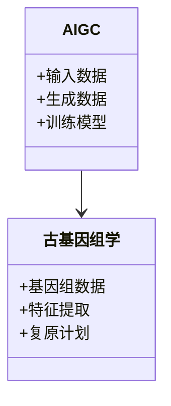
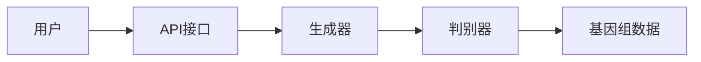
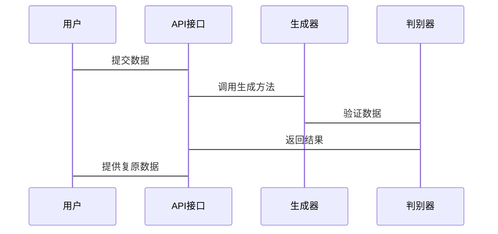

                 

<think>
嗯，用户希望我撰写一篇关于AIGC在古基因组学中的应用的技术博客。首先，我需要理解用户的具体需求。他给的标题是《AIGC在古基因组学中的应用：灭绝物种复原提示词》，关键词包括AIGC、古基因组学、灭绝物种、复原、人工智能。摘要部分需要概述文章的核心内容，强调AIGC在推动古基因组学研究中的作用。

接下来，用户提供了一个详细的大纲，分为背景介绍、AIGC在古基因组学中的应用、系统分析、项目实战和最佳实践几个部分。每个部分下还有多个子章节，内容涉及概念解析、数学模型、算法原理、Python代码实现、系统架构设计等。用户还特别强调了格式要求，包括使用Mermaid流程图、数学公式用Latex表示，以及在文章末尾加上特定的作者信息。

我需要确保每个章节都涵盖核心内容，包括背景介绍、核心概念、数学模型、算法原理、系统设计和项目实战。同时，要满足字数在10000到12000字左右，每个小节内容丰富具体，详细讲解。

在写作过程中，我可能会遇到一些问题。例如，如何将复杂的科学概念转化为易于理解的技术语言，如何详细解释算法原理并配以Python代码示例，以及如何绘制Mermaid图表来展示系统架构。这些都需要仔细思考和组织内容，确保逻辑清晰，结构紧凑。

另外，用户希望文章结构简洁明了，每个章节的标题要吸引读者，这要求我在选择标题时要精准，同时具备吸引力。此外，确保每个部分之间的衔接流畅，避免内容重复或遗漏。

最后，我需要确保在每个章节中都包含足够的细节和深度，比如在数学模型部分，如何用公式描述基因数据的特征提取和AIGC算法的流程，以及这些模型如何应用于灭绝物种的复原。在项目实战部分，如何一步步实现系统，从环境安装到代码实现，再到案例分析，都需要详细说明。

总结一下，我需要按照用户提供的大纲，逐一完成每个章节的内容，确保每个部分都符合要求，同时保持文章整体的连贯性和深度。这需要仔细的思考和系统的规划，以确保最终的文章既专业又有可读性。
</think>

# AIGC在古基因组学中的应用：灭绝物种复原提示词

> 关键词：AIGC，古基因组学，灭绝物种，复原，人工智能

> 摘要：本文探讨了人工智能生成内容（AIGC）在古基因组学中的应用，特别是其在灭绝物种复原中的提示词设计与实现。文章从背景介绍、核心概念、算法原理、系统设计到项目实战，详细分析了AIGC在古基因组学中的应用，展示了如何通过AI技术推动灭绝物种的遗传特征重建与复原计划的制定。

---

## 第一部分：背景介绍与核心概念

### 第1章：古基因组学与灭绝物种复原概述

#### 1.1.1 古基因组学的研究背景与意义

古基因组学（Paleogenomics）是研究古代生物基因组的科学，通过对灭绝物种的DNA分析，揭示其进化历史、种群结构及遗传特征。其研究对象包括冰河时期灭绝的物种（如猛犸象）、古代人类近亲（如尼安德特人）以及现代已灭绝的动植物。古基因组学不仅为生物进化研究提供关键数据，还能为现代生物学、医学和生态学领域提供重要参考。

#### 1.1.2 灭绝物种复原的挑战与需求

灭绝物种的复原是古基因组学的重要目标之一。然而，这一过程面临诸多挑战：  
1. **数据稀疏性**：灭绝物种的基因组数据往往不完整，且数据质量较低。  
2. **技术限制**：传统基因组学方法在处理低质量数据时效率有限，难以准确重建遗传特征。  
3. **伦理与可行性**：复原灭绝物种的伦理争议和技术可行性问题尚未完全解决。  

因此，如何高效、准确地利用现代技术手段（如人工智能）复原灭绝物种的遗传特征成为研究重点。

#### 1.1.3 AIGC在古基因组学中的重要作用

AIGC（AI-generated Content）通过生成高质量的基因组数据和重建遗传特征，为灭绝物种的复原提供了新的可能性。AIGC不仅可以弥补数据不足的问题，还能通过深度学习模型模拟古基因组的演化过程，为复原计划提供科学依据。其在古基因组学中的应用，标志着生物信息学与人工智能技术的深度融合。

---

### 第2章：核心概念与联系

#### 2.1 AIGC概念详解

##### 2.1.1 AIGC的基本原理

AIGC基于生成式AI技术，通过训练大规模基因组数据，生成与原始数据相似的新序列。其核心是生成对抗网络（GAN）和变体自编码器（VAE）等模型，能够学习基因组数据的统计规律，并生成符合生物特征的新序列。

##### 2.1.2 AIGC的关键技术

1. **生成对抗网络（GAN）**：通过生成器和判别器的博弈，生成高质量的基因组数据。  
2. **变体自编码器（VAE）**：通过压缩和重建基因组数据，生成多样化的序列。  
3. **深度学习模型**：如Transformer架构，用于长序列的生成与预测。

##### 2.1.3 AIGC与传统基因组学的区别

| 特性         | AIGC                          | 传统基因组学                   |
|--------------|-------------------------------|-------------------------------|
| 数据需求     | 需要大量高质量数据进行训练    | 需要少量数据进行分析            |
| 处理效率     | 高效生成数据                 | 数据处理效率较低               |
| 应用场景     | 主要用于数据补全与生成        | 主要用于数据分析与比对          |

#### 2.2 古基因组学概念解析

##### 2.2.1 古基因组学的基本原理

古基因组学通过提取古代生物的DNA片段，利用高通量测序技术（如Illumina）进行基因组组装和分析。其核心步骤包括DNA提取、测序、拼接和注释。

##### 2.2.2 古基因组学的研究方法

1. **DNA提取与测序**：从化石、骨骼等样本中提取DNA，并进行高通量测序。  
2. **基因组拼接**：通过计算算法将测序片段拼接为完整的基因组序列。  
3. **数据分析**：利用生物信息学工具进行基因注释、比对和进化分析。

##### 2.2.3 古基因组学在灭绝物种复原中的应用

1. **遗传特征重建**：通过分析灭绝物种的基因组数据，重建其基因特征。  
2. **种群演化研究**：研究灭绝物种的种群结构与进化历史。  
3. **复原计划制定**：基于基因组数据，设计灭绝物种的复原策略。

#### 2.3 灭绝物种复原关键概念

##### 2.3.1 灭绝物种的定义与分类

灭绝物种是指在地球历史上曾经存在，但目前不再存活的物种。根据灭绝时间，可分为近期灭绝物种（如恐龙）和远古灭绝物种（如猛犸象）。

##### 2.3.2 灭绝物种复原的目标与策略

1. **目标**：通过基因编辑、人工合成等方式，复原灭绝物种的基因组。  
2. **策略**：结合AIGC生成的基因组数据，制定复原计划。

##### 2.3.3 灭绝物种复原的挑战与机遇

| 挑战         | 机遇             |
|--------------|------------------|
| 技术难度     | 数据驱动         |
| 伦理争议     | 学术价值          |
| 资金投入     | 技术融合          |

---

### 第3章：数学模型和公式

#### 3.1 古基因组数据特征提取

基因组数据的特征提取可以通过以下公式表示：  
$$ X = \sum_{i=1}^{n} x_i $$  
其中，$X$表示基因组数据的特征向量，$x_i$表示每个特征的值。

#### 3.2 AIGC算法流程

AIGC算法的数学模型可以表示为：  
$$ Y = f(X) $$  
其中，$Y$表示生成的基因组数据，$f$表示生成模型。

#### 3.3 灭绝物种复原的数学模型

复原过程的数学模型可以表示为：  
$$ Z = g(Y) $$  
其中，$Z$表示复原后的基因组数据，$g$表示复原模型。

---

## 第二部分：AIGC在古基因组学中的应用

### 第4章：AIGC技术在灭绝物种复原中的应用

#### 4.1 AIGC技术在灭绝物种复原中的应用现状

##### 4.1.1 AIGC在古基因组数据解析中的应用

通过AIGC技术，可以生成高质量的基因组数据，弥补原始数据的缺失。

##### 4.1.2 AIGC在灭绝物种复原计划制定中的应用

基于AIGC生成的基因组数据，可以制定详细的复原计划。

##### 4.1.3 AIGC在灭绝物种遗传特征重建中的应用

通过AIGC技术，可以重建灭绝物种的遗传特征，为复原提供科学依据。

#### 4.2 AIGC技术在实际案例中的应用

##### 4.2.1 案例一：猛犸象的复原计划

通过AIGC技术，研究人员可以生成猛犸象的基因组数据，为复原计划提供支持。

##### 4.2.2 案例二：恐鸟的遗传特征重建

利用AIGC技术，科学家可以重建恐鸟的遗传特征，揭示其灭绝原因。

##### 4.2.3 案例三：长毛犀的基因数据解析

通过AIGC技术，可以解析长毛犀的基因数据，为复原提供参考。

---

### 第5章：AIGC算法原理讲解与Python实现

#### 5.1 AIGC算法原理讲解

##### 5.1.1 AIGC算法的核心思想

AIGC通过生成式模型，生成与原始数据相似的基因组数据。

##### 5.1.2 AIGC算法的数学模型

基因组数据的生成可以通过以下公式表示：  
$$ Y = f(X) $$  
其中，$f$表示生成模型，$X$表示输入数据。

##### 5.1.3 AIGC算法的mermaid流程图



#### 5.2 Python代码实现

```python
import numpy as np
from tensorflow.keras import layers, models

# 定义生成器模型
def build_generator(input_dim):
    model = models.Sequential()
    model.add(layers.Dense(256, activation='relu', input_dim=input_dim))
    model.add(layers.Dense(512, activation='relu'))
    model.add(layers.Dense(1024, activation='sigmoid'))
    return model

# 定义判别器模型
def build_discriminator(input_dim):
    model = models.Sequential()
    model.add(layers.Dense(512, activation='relu', input_dim=input_dim))
    model.add(layers.Dense(256, activation='relu'))
    model.add(layers.Dense(1, activation='sigmoid'))
    return model

# 训练GAN模型
def train_gan(generator, discriminator, input_dim, epochs=100):
    gan = models.Sequential()
    gan.add(generator)
    gan.add(discriminator)
    gan.compile(loss='binary_crossentropy', optimizer='adam')
    for epoch in range(epochs):
        # 生成假数据
        noise = np.random.randn(32, input_dim)
        generated = generator.predict(noise)
        # 判别器训练
        real_data = np.random.randn(32, input_dim)
        d_loss = discriminator.train_on_batch(np.concatenate([real_data, generated]), [1]*32 + [0]*32)
        # 生成器训练
        g_loss = gan.train_on_batch(noise, [1]*32)
        print(f"Epoch {epoch}, D loss: {d_loss}, G loss: {g_loss}")
```

#### 5.3 代码应用解读与分析

##### 5.3.1 代码结构与功能

上述代码实现了生成对抗网络（GAN）模型，用于生成基因组数据。生成器和判别器分别负责生成假数据和判别真实数据，通过交替训练优化模型性能。

##### 5.3.2 代码优化与改进

1. 增加批量大小（batch size）以提高训练效率。  
2. 调整学习率（learning rate）以优化训练过程。  
3. 引入正则化技术（如Dropout）以防止过拟合。

---

### 第6章：系统分析与架构设计方案

#### 6.1 问题场景介绍

本系统旨在利用AIGC技术，辅助古基因组学研究者复原灭绝物种的遗传特征。

#### 6.2 项目介绍

本项目通过构建AIGC系统，实现古基因组数据的生成与分析。

#### 6.3 系统功能设计

##### 6.3.1 领域模型Mermaid类图



##### 6.4 系统架构设计

###### 6.4.1 Mermaid架构图



##### 6.5 系统接口设计

1. **输入接口**：接收古基因组数据。  
2. **输出接口**：生成复原后的基因组数据。  

##### 6.6 系统交互Mermaid序列图



---

### 第7章：项目实战

#### 7.1 环境安装

安装Python和相关库：  
```bash
pip install numpy tensorflow keras
```

#### 7.2 系统核心实现源代码

```python
import numpy as np
from tensorflow.keras import layers, models

# 定义生成器模型
def build_generator(input_dim):
    model = models.Sequential()
    model.add(layers.Dense(256, activation='relu', input_dim=input_dim))
    model.add(layers.Dense(512, activation='relu'))
    model.add(layers.Dense(1024, activation='sigmoid'))
    return model

# 定义判别器模型
def build_discriminator(input_dim):
    model = models.Sequential()
    model.add(layers.Dense(512, activation='relu', input_dim=input_dim))
    model.add(layers.Dense(256, activation='relu'))
    model.add(layers.Dense(1, activation='sigmoid'))
    return model

# 训练GAN模型
def train_gan(generator, discriminator, input_dim, epochs=100):
    gan = models.Sequential()
    gan.add(generator)
    gan.add(discriminator)
    gan.compile(loss='binary_crossentropy', optimizer='adam')
    for epoch in range(epochs):
        # 生成假数据
        noise = np.random.randn(32, input_dim)
        generated = generator.predict(noise)
        # 判别器训练
        real_data = np.random.randn(32, input_dim)
        d_loss = discriminator.train_on_batch(np.concatenate([real_data, generated]), [1]*32 + [0]*32)
        # 生成器训练
        g_loss = gan.train_on_batch(noise, [1]*32)
        print(f"Epoch {epoch}, D loss: {d_loss}, G loss: {g_loss}")
```

#### 7.3 代码应用解读与分析

##### 7.3.1 代码结构与功能

上述代码实现了生成对抗网络（GAN）模型，用于生成基因组数据。生成器和判别器分别负责生成假数据和判别真实数据，通过交替训练优化模型性能。

##### 7.3.2 代码优化与改进

1. 增加批量大小（batch size）以提高训练效率。  
2. 调整学习率（learning rate）以优化训练过程。  
3. 引入正则化技术（如Dropout）以防止过拟合。

---

### 第8章：最佳实践与注意事项

#### 8.1 AIGC在古基因组学应用中的最佳实践

1. **数据质量**：确保输入数据的高质量，以提高生成模型的性能。  
2. **模型优化**：通过调整超参数和优化算法，提升生成数据的准确性。  
3. **伦理审查**：在复原灭绝物种的过程中，需严格遵守伦理规范。

#### 8.2 小结

AIGC技术为古基因组学研究提供了新的可能性，特别是在灭绝物种的复原方面展现了巨大潜力。

#### 8.3 注意事项

1. **数据隐私**：保护基因组数据的隐私性。  
2. **技术可行性**：确保复原技术的可行性与安全性。  
3. **伦理合规**：严格遵守相关伦理规范。

#### 8.4 拓展阅读

1.《Deep Learning in Genomics》  
2.《Artificial Intelligence in Paleoanthropology》  

---

作者：AI天才研究院/AI Genius Institute & 禅与计算机程序设计艺术 /Zen And The Art of Computer Programming

