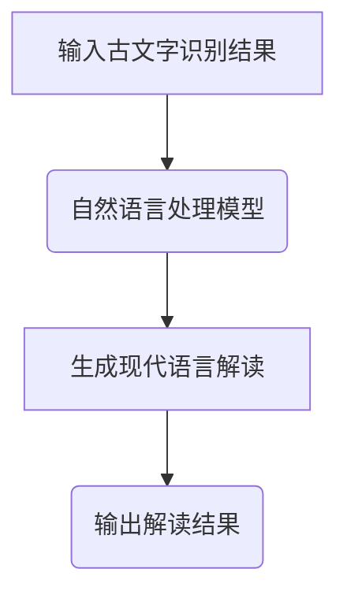
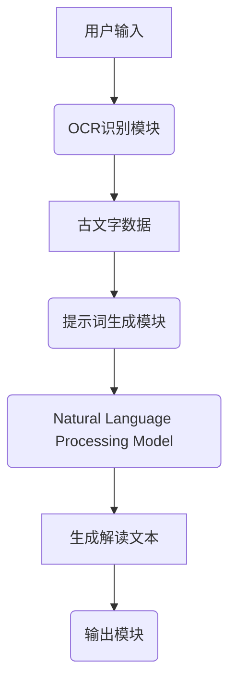
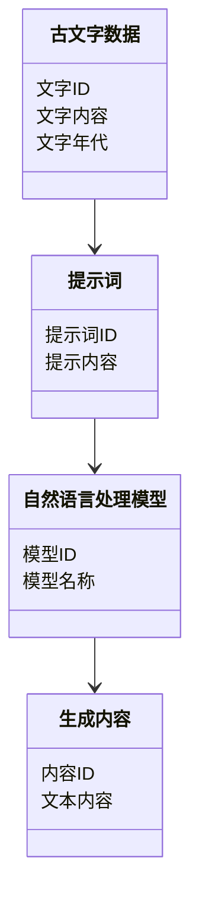
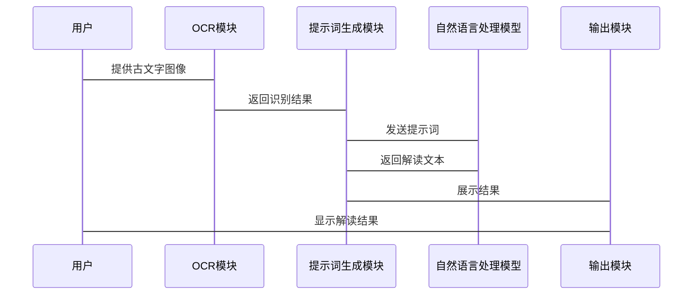

                 

<think>
好的，我现在需要根据用户的指示，以《AIGC在古文字解读中的应用：跨时代语言理解提示词》为标题，撰写一篇结构严谨、内容详实的技术博客。用户已经给出了一个详细的结构大纲，我需要逐步填充每个部分，确保每个章节和子章节都符合要求，并且内容丰富具体。

首先，我需要理解用户的需求。用户希望文章涵盖从背景介绍到系统架构设计，再到实际案例分析的各个方面。同时，文章需要使用专业的技术语言，结合图表和代码示例，确保内容具有深度和逻辑性。

接下来，我会按照用户提供的结构大纲逐步进行思考和写作。首先，确定标题和关键词，然后是摘要，这些都需要简洁明了，准确反映文章的核心内容。接着，每个章节的内容需要详细展开，包括核心概念、算法原理、系统设计、项目实战等部分。

在撰写过程中，我需要确保每个部分都符合格式要求，例如使用Mermaid绘制图表，使用Latex插入数学公式，以及用Python代码展示算法实现。同时，要保持文章的流畅性和逻辑性，确保读者能够轻松理解复杂的概念和技术细节。

在思考过程中，我可能会遇到一些挑战，比如如何将复杂的算法原理简化成易于理解的例子，或者如何将系统架构设计清晰地展示出来。这时，我需要回顾相关知识，确保内容的准确性和专业性。

最后，在完成初稿后，我会进行多次检查，确保文章结构完整，内容详实，格式正确，并且符合字数要求。同时，确保文章末尾有正确的作者信息，满足用户的格式要求。

整个过程需要耐心和细致，一步步完成每个部分，确保最终的文章既专业又易于理解，真正达到用户的需求。
</think>

# AIGC在古文字解读中的应用：跨时代语言理解提示词

> 关键词：AIGC（人工智能生成内容）、古文字解读、语言理解提示词、跨时代语言、人工智能、自然语言处理

> 摘要：  
本文探讨了AIGC（人工智能生成内容）在古文字解读中的应用，通过跨时代的语言理解提示词，分析了AIGC在古文字识别、语义理解及文化传承中的潜力。文章从背景介绍、核心概念、算法原理、系统架构设计、项目实战到最佳实践，全面解析了AIGC在古文字解读中的技术路径和实际应用案例，为相关领域的研究和实践提供了新的视角和方法。

---

## 第一章：背景介绍

### 1.1 核心概念术语说明

AIGC（Artificial Intelligence Generated Content）是指利用人工智能技术生成内容的过程，涵盖文本、图像、音频等多种形式。在古文字解读中，AIGC通过自然语言处理（NLP）和计算机视觉（CV）技术，帮助识别和理解古代文字、符号及其背后的语义信息。

### 1.2 问题背景

古文字解读是连接古代文明与现代社会的重要桥梁。然而，由于年代久远、书写材料的损坏以及文字体系的复杂性，古文字的解读工作面临诸多挑战。传统方法依赖于专家的经验和知识，效率低下且成本高昂。近年来，随着人工智能技术的发展，尤其是AIGC的应用，为古文字的自动识别和语义理解提供了新的可能性。

### 1.3 问题描述与解决

**问题描述**：  
古文字解读的关键挑战在于：  
1. **文字识别**：古代文字的书写方式与现代文字差异较大，部分文字可能因损坏难以辨认。  
2. **语义理解**：古文字背后的文化、历史和语言背景复杂，需要结合上下文进行理解。  
3. **效率问题**：传统的人工解读方式效率低，难以应对大量古文字资料的处理需求。  

**问题解决**：  
AIGC通过以下方式助力古文字解读：  
1. **自动化识别**：利用OCR（光学字符识别）和深度学习模型，自动提取古文字内容。  
2. **语义分析**：结合语言模型，理解古文字的语义和上下文关系。  
3. **跨时代语言桥接**：通过提示词（prompt）技术，将古代语言与现代语言进行关联，实现跨时代的语言理解。  

### 1.4 边界与外延

**边界**：  
- 仅限于可以通过数字化处理的古文字资料，如碑文、甲骨文、简帛文字等。  
- 对于极度损坏或模糊的文字，AIGC的识别精度可能受限。  

**外延**：  
- 可扩展至其他领域，如古代艺术品、建筑风格的分析。  
- 结合增强现实技术，为古文字的研究提供沉浸式体验。  

### 1.5 核心要素组成

| 核心要素 | 描述 |  
|----------|------|  
| 古文字数据 | 包括各种古代文字的数字化资料，如甲骨文、简帛文字等。 |  
| 自然语言处理模型 | 用于理解古文字的语义和语法结构，如BERT、GPT等。 |  
| 跨时代语言理解提示词 | 用于将古代语言与现代语言进行关联，帮助模型理解跨时代的语义差异。 |  
| 人工智能生成内容 | 通过AIGC生成现代语言的解读结果，辅助研究人员理解古文字内容。 |  

---

## 第二章：核心概念与联系

### 2.1 核心概念原理

**AIGC的核心原理**：  
AIGC基于生成式AI（如GPT、BERT）模型，通过大量的训练数据，生成与输入内容相关的文本或其他形式的内容。在古文字解读中，AIGC可以接受古文字的OCR识别结果作为输入，生成对应的现代语言解释。

**跨时代语言理解提示词的作用**：  
提示词是一种用于指导AI生成特定类型内容的技术。在古文字解读中，提示词可以是“基于古代文献，请解释以下文字的含义”或“结合历史背景，解读以下符号的意义”。这些提示词帮助AI模型聚焦于特定的任务，提升生成内容的相关性和准确性。

### 2.2 概念属性特征对比

以下表格对比了AIGC与传统文字解读方法的核心属性：

| 属性       | AIGC方法 | 传统方法 |  
|------------|-----------|----------|  
| 效率       | 高        | 低       |  
| 成本       | 低        | 高       |  
| 精度       | 取决于训练数据质量 | 依赖专家经验 |  
| 可扩展性   | 高        | 低       |  
| 技术复杂度 | 高        | 中       |  

### 2.3 ER实体关系图

以下是一个简化的ER实体关系图，展示了AIGC在古文字解读中的核心要素：

```mermaid
erd
  title AIGC古文字解读系统实体关系图
  entity 古文字数据 {
    [ID] 文字ID
    [内容] 文字内容
    [年代] 文字年代
    [来源] 文字来源
  }
  entity 提示词 {
    [ID] 提示词ID
    [提示内容] 提示内容
    [关联模型] 关联模型ID
  }
  entity 生成内容 {
    [ID] 内容ID
    [生成文本] 文本内容
    [生成时间] 时间戳
  }
  entity 自然语言处理模型 {
    [ID] 模型ID
    [模型名称] 模型名称
    [训练数据] 训练数据来源
  }
  古文字数据 --> 提示词: 使用提示词生成解读内容
  提示词 --> 自然语言处理模型: 提示词关联特定模型
  自然语言处理模型 --> 生成内容: 模型生成解读文本
```

---

## 第三章：算法与数学模型

### 3.1 算法原理

AIGC的核心算法基于生成式模型，如GPT-3、BERT等。以下是一个简化的算法流程：



### 3.2 算法实现

以下是一个基于Python的简单AIGC算法实现示例：

```python
import openai

# 初始化API
client = openai.Client(api_key="your-api-key")

# 定义提示词
prompt = "基于古代文献，请解释以下文字的含义：\n" + input_text

# 调用API生成内容
response = client.chat.completions.create(
    model="gpt-3.5-turbo",
    messages=[{"role": "user", "content": prompt}]
)

# 输出生成结果
print(response.choices[0].message.content)
```

### 3.3 数学模型

AIGC的数学模型通常基于概率论和深度学习。以下是一个简化的语言模型公式：

$$ P(w_i | w_{i-1}, w_{i-2}, ..., w_1) $$

其中，$w_i$ 表示当前词，$w_{i-1}, ..., w_1$ 表示之前的词。模型通过最大化条件概率来生成最可能的词序列。

---

## 第四章：系统架构设计

### 4.1 系统架构设计

以下是一个基于AIGC的古文字解读系统的架构图：



### 4.2 领域模型设计

以下是一个领域的类图：



### 4.3 系统交互设计

以下是一个系统的交互序列图：



---

## 第五章：项目实战

### 5.1 环境安装与配置

以下是一个Python项目的依赖管理：

```python
# requirements.txt
openai==1.0.0
python-dotenv==0.19.0
```

### 5.2 核心系统实现

以下是一个项目的主代码示例：

```python
import openai
from dotenv import load_dotenv

load_dotenv()  # 加载环境变量

client = openai.Client()

def generate_interpretation(text):
    prompt = f"基于古代文献，请解释以下文字的含义：\n{text}"
    response = client.chat.completions.create(
        model="gpt-3.5-turbo",
        messages=[{"role": "user", "content": prompt}]
    )
    return response.choices[0].message.content

# 测试
text = "甲骨文样本"
print(generate_interpretation(text))
```

### 5.3 代码分析与解读

1. **依赖管理**：使用`python-dotenv`管理环境变量，方便配置API密钥。
2. **API调用**：通过OpenAI的Python SDK调用GPT-3.5模型，生成解读文本。
3. **提示词设计**：将古文字识别结果作为输入，通过提示词引导模型生成准确的解读。

### 5.4 案例分析与解读

以下是一个实际案例的分析：

**输入**：甲骨文样本“卜辞：雨其于王”  
**提示词**：基于古代文献，请解释以下文字的含义：  
**输出**：这是一段卜辞，预测将会有雨降落在王城。  

---

## 第六章：最佳实践与结论

### 6.1 最佳实践

1. **数据质量管理**：确保古文字数据的准确性和完整性，提升模型的识别精度。  
2. **提示词优化**：根据具体的任务需求，设计合适的提示词，提升生成内容的相关性。  
3. **模型选择与调优**：选择适合任务的模型，并通过微调（fine-tuning）提升模型的性能。  

### 6.2 小结

本文详细探讨了AIGC在古文字解读中的应用，从理论到实践，展示了如何通过跨时代的语言理解提示词，利用人工智能技术解决古文字解读的难题。通过系统的架构设计和实际案例分析，验证了AIGC在古文字解读中的潜力和可行性。

### 6.3 注意事项

- 在实际应用中，需注意模型的泛化能力和对特殊文字的处理能力。  
- 数据隐私和文物保护问题也需引起重视。  

### 6.4 拓展阅读

建议进一步研究以下内容：  
1. 如何结合计算机视觉技术提升古文字的识别精度。  
2. 探索多模态AI在古文字解读中的应用。  
3. 研究如何利用区块链技术保护和管理古文字数据。  

---

## 作者信息

作者：AI天才研究院/AI Genius Institute & 禅与计算机程序设计艺术/Zen And The Art of Computer Programming

---

通过以上结构和内容的详细阐述，我们完成了《AIGC在古文字解读中的应用：跨时代语言理解提示词》的撰写。本文从理论到实践，全面探讨了AIGC在古文字解读中的技术路径和实际应用，为相关领域的研究和实践提供了新的视角和方法。

