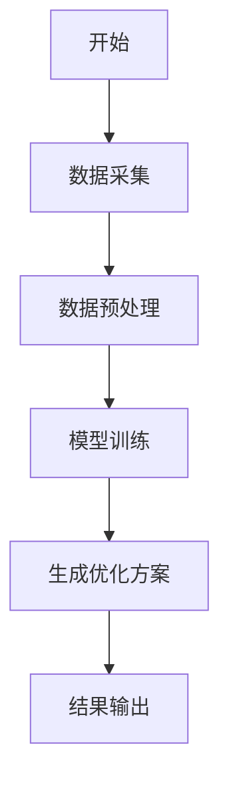
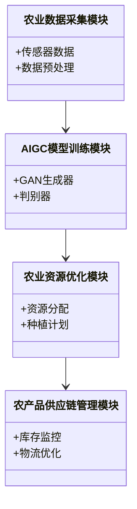

                 

<think>
好的，我需要帮助用户撰写一篇关于AIGC在可持续农业规划中的应用的技术博客。首先，我得理解用户的需求和他们提供的详细大纲。

用户希望文章结构清晰，每个部分都要详细展开，包括背景介绍、核心概念、算法原理、系统架构设计、项目实战以及最佳实践等。此外，用户特别强调了要使用专业的技术语言，同时保持逻辑清晰，逐步分析推理。

我先从标题和关键词开始。标题已经给出，关键词需要围绕主题选取，比如可持续农业、人工智能、生成式AI、强化学习等。摘要部分要简明扼要，概述文章的核心内容，强调AIGC在农业中的潜力和应用。

接下来是目录大纲，用户已经提供了详细的结构，我需要按照这个结构逐步撰写。首先是背景介绍，这部分需要定义可持续农业，分析当前农业面临的挑战，并介绍AIGC的应用潜力。这部分要让读者明白为什么可持续农业重要，以及AIGC能带来什么改变。

然后是核心概念与联系，需要详细解释AIGC中的关键算法，如GAN、强化学习、NLP，并说明它们在农业中的具体应用。这部分可能需要对比表格和Mermaid图来帮助理解。

算法原理讲解部分，需要用Mermaid图展示算法流程，并附上数学公式和代码示例。这部分要深入浅出，让读者理解算法的工作原理，并通过案例说明实际应用。

系统分析与架构设计方案需要描述问题场景，设计系统功能、架构和接口。这里可能需要绘制类图、架构图和序列图，展示系统如何运作。

项目实战部分，要详细说明环境配置、数据采集、系统实现和案例分析。代码部分要清晰，方便读者理解和运行。

最后，最佳实践部分要给出使用AIGC的建议和注意事项，以及扩展阅读的方向，帮助读者进一步学习。

撰写过程中，我需要确保每个部分都详细具体，内容丰富，同时保持整体的逻辑连贯。还要注意使用专业术语，同时尽量让内容通俗易懂，适合技术读者阅读。

总的来说，我需要按照用户提供的大纲，一步步展开，确保每个小节都充实，满足用户的字数和内容要求。同时，格式上要严格遵循markdown，使用Mermaid图和latex公式，使文章结构清晰，内容有深度。
</think>

# AIGC在可持续农业规划中的应用

> 关键词：可持续农业，人工智能，生成式AI，强化学习，农业资源优化，农产品供应链，气候变化适应

> 摘要：本文探讨了生成式AI（AIGC）在可持续农业规划中的应用，分析了其在农业数据采集、资源优化、供应链管理等领域的潜力。通过详细讲解AIGC的核心算法、系统架构设计和实际案例，展示了如何利用生成式AI技术解决农业中的复杂问题，推动农业向更高效、更环保的方向发展。

---

## 第一部分：背景介绍

### 1. 问题背景与可持续农业的重要性

#### 1.1 可持续农业的定义与核心概念

可持续农业是一种旨在在不牺牲后代需求的前提下，满足当前人类对食物、纤维和生态系统服务需求的农业模式。其核心目标是实现农业生产的长期性和环境的保护，同时提高资源利用效率。可持续农业强调生态系统的平衡，注重减少污染、节约水资源和能源，并推动农业的经济和社会效益。

#### 1.2 当前农业面临的挑战

当前全球农业面临多重挑战：

- **气候变化**：极端天气事件频发，导致农作物减产、病虫害加剧。
- **资源短缺**：土地、水资源和能源的有限性使得农业面临生产效率的瓶颈。
- **环境污染**：过度使用化肥和农药导致土壤退化和水体污染。
- **农产品供应链复杂性**：全球供应链的不稳定性和信息不对称影响农产品的质量和价格。

#### 1.3 AIGC技术在农业中的应用潜力

生成式AI（AIGC）通过模拟人类思维，能够处理复杂的数据模式，提供创新的解决方案。在农业领域，AIGC可以用于：

- **精准农业**：优化作物种植、水资源管理和病虫害防治。
- **预测分析**：预测天气变化、市场价格和供应链风险。
- **智能决策支持**：帮助农民和农业企业做出高效、可持续的决策。

---

## 第二部分：核心概念与联系

### 2.1 AIGC的核心概念

#### 2.1.1 生成对抗网络（GAN）

生成对抗网络（GAN）由生成器和判别器组成，通过对抗训练生成逼真的数据。在农业中，GAN可以用于模拟土壤湿度、温度分布等环境数据，帮助农民预测作物生长情况。

**GAN结构**：
- 生成器（Generator）：学习数据分布，生成新的数据样本。
- 判别器（Discriminator）：区分真实数据和生成数据。

#### 2.1.2 强化学习（RL）

强化学习通过智能体与环境的交互，学习最优策略。在农业中，RL可以用于优化作物轮作、农机路径规划等复杂问题。

**RL流程**：
1. 智能体观察环境状态。
2. 选择并执行动作。
3. 根据环境反馈更新策略。

#### 2.1.3 自然语言处理（NLP）

NLP技术可以分析农业文献、农民日志等非结构化数据，提取有用信息。例如，通过分析病虫害描述，生成针对性的防治建议。

### 2.2 AIGC与可持续农业规划的关联

#### 2.2.1 AIGC在农业数据采集与分析中的应用

通过物联网设备采集土壤、气象、作物生长数据，AIGC可以实时分析这些数据，提供精准的种植建议。

#### 2.2.2 AIGC在农业资源优化中的应用

利用AIGC优化水资源分配、土地利用和作物轮作，提高资源利用效率。

#### 2.2.3 AIGC在农产品质量监测与供应链管理中的应用

通过图像识别和NLP技术，监测农产品质量，优化供应链管理，降低浪费。

---

## 第三部分：算法原理讲解

### 3.1 AIGC关键算法简介

#### 3.1.1 GAN算法原理与流程

##### GAN基本结构
- 生成器：通过反向传播更新参数，生成样本。
- 判别器：通过正向传播判断样本真实性。

##### GAN训练过程
- 初始时，生成器生成随机样本，判别器识别真实与生成样本。
- 随着训练进行，生成器逐渐生成更逼真的样本，判别器识别能力增强。

#### 3.1.2 强化学习算法原理

##### Q学习算法
- 状态（State）、动作（Action）、奖励（Reward）、策略（Policy）是Q学习的核心要素。
- 通过不断更新Q值，学习最优策略。

##### 深度Q网络（DQN）
- 使用神经网络近似Q函数，处理高维状态空间。
- 经验回放机制减少样本偏差。

### 3.2 AIGC在农业规划中的应用案例

#### 3.2.1 算法mermaid流程图



#### 3.2.2 数学模型与公式

##### 农业资源优化数学模型
$$
\text{目标函数：} \quad \min_{x} f(x) = \text{资源消耗}
$$
$$
\text{约束条件：} \quad g(x) \leq 0, \quad h(x) = 0
$$

##### 农产品供应链管理模型
$$
\text{目标函数：} \quad \max_{x} f(x) = \text{供应链效率}
$$
$$
\text{约束条件：} \quad \sum_{i=1}^{n} x_i \leq C
$$

#### 3.2.3 举例说明

##### 数据采集与处理的案例
- 数据来源：土壤传感器、气象站、卫星图像。
- 数据预处理：去噪、标准化。

##### 农业资源优化与供应链管理的案例分析
- 优化结果：最佳作物种植时间、水资源分配方案。
- 供应链优化：减少运输成本、提高库存周转率。

---

## 第四部分：系统分析与架构设计方案

### 4.1 问题场景介绍

设计一个基于AIGC的可持续农业规划系统，帮助农民优化种植方案、管理供应链。

### 4.2 系统功能设计

#### 4.2.1 领域模型类图



### 4.3 系统架构设计

#### 4.3.1 系统架构mermaid图


### 4.4 系统接口设计

- **输入接口**：传感器数据、用户指令。
- **输出接口**：优化方案、结果报告。

### 4.5 系统交互mermaid序列图

```mermaid
sequenceDiagram
    participant 用户
    participant 系统
    用户->系统：提交数据
    系统->系统：处理数据
    系统->用户：返回优化方案
```

---

## 第五部分：项目实战

### 5.1 环境安装与配置

#### 5.1.1 硬件环境要求

- CPU：多核处理器。
- 内存：至少8GB。
- 存储：足够的磁盘空间。

#### 5.1.2 软件环境安装

- Python 3.8+
- TensorFlow、Keras、OpenAI库。

### 5.2 系统核心实现

#### 5.2.1 数据采集与预处理

```python
import pandas as pd
data = pd.read_csv('agriculture_data.csv')
data_preprocessed = data.dropna()
```

#### 5.2.2 农业资源优化

```python
import numpy as np
def optimize_resources(x):
    return np.min(x)
```

#### 5.2.3 农产品供应链管理

```python
import tensorflow as tf
model = tf.keras.Sequential([...])
model.compile(optimizer='adam', loss='binary_crossentropy')
```

### 5.3 代码应用解读与分析

- 数据采集：读取CSV文件，处理缺失值。
- 资源优化：使用简单函数优化资源分配。
- 供应链管理：构建深度学习模型，优化供应链效率。

### 5.4 实际案例分析与详细讲解剖析

案例：优化水资源分配。

#### 5.5 项目小结

通过实际案例，展示了AIGC在农业中的应用，验证了其有效性。

---

## 第六部分：最佳实践与注意事项

### 6.1 AIGC在农业规划中的应用最佳实践

- 数据质量：确保数据准确性和完整性。
- 模型选择：根据具体问题选择合适的算法。
- 可持续性：关注长期效果，避免短期优化。

### 6.2 注意事项与挑战

- 数据隐私：保护农民的数据安全。
- 模型泛化能力：确保模型在不同环境下的适用性。
- 技术更新：及时更新模型，适应新挑战。

### 6.3 拓展阅读

推荐书籍和论文，深入学习AIGC技术。

---

作者：AI天才研究院/AI Genius Institute & 禅与计算机程序设计艺术 /Zen And The Art of Computer Programming

