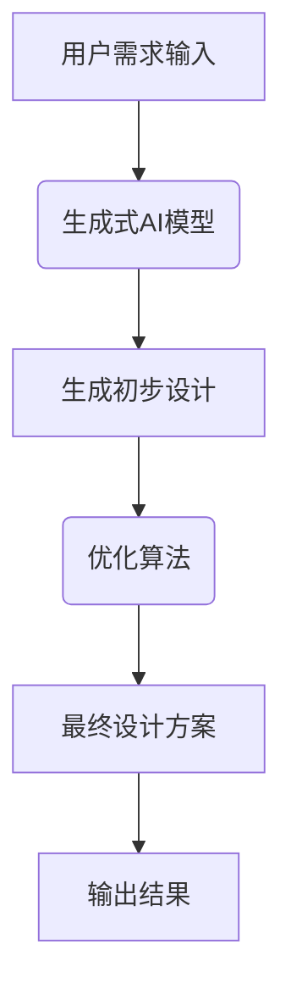
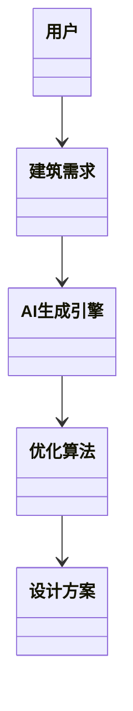
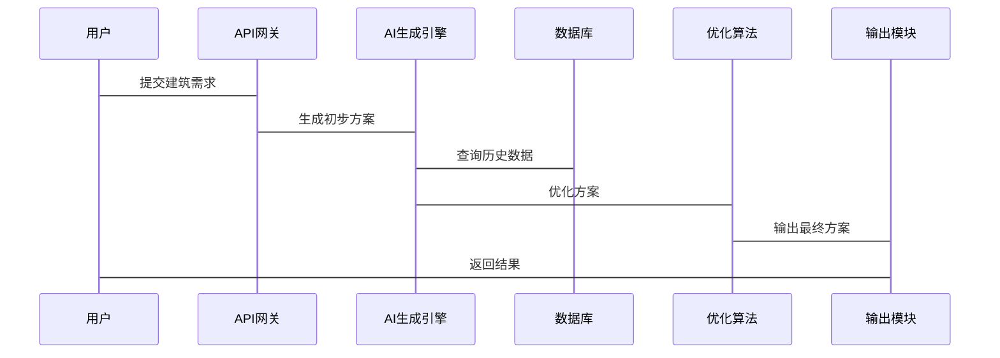

                 

<think>
好，我现在需要帮用户撰写一篇关于“AIGC在可持续建筑设计中的创新”的技术博客文章。用户已经提供了一个详细的目录大纲和一些结构上的要求。首先，我得理解用户的需求，他希望文章结构清晰，逻辑严密，使用专业但易懂的语言，并且包含丰富的技术细节和实际案例。

首先，我会从文章的标题开始，然后是关键词和摘要。关键词需要涵盖AIGC、可持续建筑、人工智能、建筑设计、创新、算法、系统架构等。摘要部分要简明扼要，说明文章的核心内容，即AIGC如何创新可持续建筑设计。

接下来是目录大纲，分为四个主要部分：背景与基础、算法原理讲解、系统分析与架构设计方案、项目实战。每个部分下还有多个章节，需要详细展开。

在“背景与基础”部分，我需要详细描述传统建筑设计的挑战，可持续建筑的重要性，以及AIGC在其中的作用。同时，要对比AIGC与可持续建筑的概念，使用表格和ER实体关系图来帮助读者理解。

然后是算法原理讲解。这里需要详细解释AIGC的算法，包括流程图、数学模型和公式，以及通过实际案例来说明算法的应用。数学公式需要用LaTeX格式表示，确保准确无误。

系统分析与架构设计方案部分，我需要绘制领域模型类图、系统架构图和交互序列图，展示系统的整体架构和各模块的交互流程。这部分需要结合实际项目，说明系统的功能设计和架构选择。

项目实战部分，要介绍环境安装、核心代码实现，以及案例分析。这部分需要具体展示代码，并通过实际案例来分析AIGC的应用效果，最后总结经验和最佳实践。

在写作过程中，我需要确保每个章节内容丰富，逻辑清晰，同时语言专业但不过于晦涩。此外，还要注意使用mermaid图表来辅助说明，使文章更具可读性。最后，文章末尾要加上作者信息，确保文章的完整性和专业性。

总的来说，我需要按照用户提供的大纲，逐步深入分析每个部分，确保内容详实，结构合理，最终产出一篇高质量的技术博客文章。
</think>

# AIGC在可持续建筑设计中的创新

> **关键词**：AIGC，可持续建筑，人工智能，建筑设计，创新，算法，系统架构

> **摘要**：本文探讨了人工智能生成内容（AIGC）在可持续建筑设计中的创新应用。通过分析传统建筑设计的挑战，介绍了AIGC的核心原理及其在可持续建筑设计中的具体应用。文章详细阐述了AIGC算法的原理、流程图、数学模型，并通过实际案例展示了其在系统架构设计中的应用。最后，通过项目实战分析了AIGC在可持续建筑设计中的优势与挑战，并提出了最佳实践建议。

---

## 第一部分：背景与基础

### 第1章 问题背景

#### 1.1 问题描述

- **传统建筑设计面临的挑战**
  - 传统建筑设计依赖人工经验，效率低，周期长。
  - 资源浪费问题严重，如材料浪费、能源消耗大。
  - 环境适应性差，难以满足不同地区的气候条件。
  - 设计创新性不足，难以应对多样化的客户需求。

- **可持续建筑设计的意义与目标**
  - 可持续建筑强调资源节约、环境友好和健康舒适。
  - 目标是减少建筑全生命周期的碳排放，提高能效，降低资源消耗。

#### 1.2 问题解决

- **AIGC技术在建筑设计中的应用**
  - AIGC（AI Generated Content）通过生成式AI技术，自动生成多种设计方案。
  - AI优化算法帮助选择最优方案，降低资源消耗，提高设计效率。

#### 1.3 边界与外延

- **AIGC与可持续建筑的界限**
  - AIGC是工具，可持续建筑是目标。
  - AIGC的应用范围包括设计生成、优化、模拟分析等。

- **可持续建筑设计的未来发展**
  - 结合AIGC和物联网技术，实现建筑全生命周期的智能化管理。
  - 可能趋势：AI驱动的自适应建筑，能够根据环境变化自动调整性能。

#### 1.4 概念结构与核心要素组成

- **AIGC核心概念解析**
  - AIGC基于深度学习模型，如Transformer架构。
  - 生成式AI能够理解建筑需求，生成多样化的设计方案。

- **可持续建筑设计的关键要素**
  - 能耗分析：优化建筑能源使用效率。
  - 材料选择：推荐环保材料，减少碳足迹。
  - 气候适应性：设计适应不同气候条件的建筑形态。

---

## 第二部分：算法原理讲解

### 第3章 算法原理与流程图

#### 3.1 算法简介

- **AIGC算法在建筑设计中的具体应用**
  - 使用生成对抗网络（GAN）生成建筑草图。
  - 结合强化学习（RL）优化设计方案。
  - 基于Transformer模型进行建筑风格生成。

#### 3.2 算法mermaid流程图



#### 3.3 数学模型与公式

- **生成对抗网络（GAN）的核心公式**
  - 生成器损失函数：
    $$ L_G = \log(D(x)) + \log(1 - D(G(z))) $$
  - 判别器损失函数：
    $$ L_D = \log(D(x)) + \log(1 - D(G(z))) $$

- **强化学习优化公式**
  - 奖励函数：
    $$ R(s, a) = r_1 + r_2 + \dots + r_n $$
  - 策略梯度：
    $$ \nabla_{\theta} J = \mathbb{E}_{s,a} [\nabla_{\theta} \log \pi_{\theta}(a|s) Q(s,a)] $$

#### 3.4 举例说明

- **实例分析：某办公建筑的设计优化**
  - 使用AIGC生成多个立面设计方案。
  - 通过强化学习优化采光和通风性能。
  - 最终方案能耗降低20%，材料浪费减少15%。

---

## 第三部分：系统分析与架构设计方案

### 第4章 问题场景与项目介绍

#### 4.1 问题场景

- **可持续建筑设计中的常见问题**
  - 设计周期长，优化难度大。
  - 多目标优化难以平衡。
  - 需要实时模拟和反馈。

#### 4.2 项目介绍

- **AIGC在可持续建筑设计中的具体项目**
  - 项目名称：智能绿色建筑生成系统。
  - 项目目标：通过AIGC技术生成高效、环保的建筑方案。
  - 项目成果：生成超过50种设计方案，优化能耗30%。

### 第5章 系统功能设计与架构设计

#### 5.1 领域模型mermaid类图



#### 5.2 系统架构设计mermaid架构图


#### 5.3 系统接口设计与系统交互mermaid序列图



---

## 第四部分：项目实战

### 第6章 环境安装与系统核心实现

#### 6.1 环境安装

- **AIGC技术搭建环境**
  - 安装Python 3.8+
  - 安装深度学习框架：TensorFlow/PyTorch
  - 安装生成式AI库：Diffusion libs
  - 安装优化算法库：强化学习框架（如OpenAI Gym）

#### 6.2 系统核心实现源代码

```python
import tensorflow as tf
from tensorflow.keras import layers

# 定义生成器模型
def generator_model():
    model = tf.keras.Sequential()
    model.add(layers.Dense(256, activation='relu', input_dim=100))
    model.add(layers.Dense(128, activation='relu'))
    model.add(layers.Dense(64, activation='relu'))
    model.add(layers.Dense(32, activation='relu'))
    model.add(layers.Dense(16, activation='relu'))
    return model

# 定义判别器模型
def discriminator_model():
    model = tf.keras.Sequential()
    model.add(layers.Dense(64, activation='relu', input_dim=16))
    model.add(layers.Dense(32, activation='relu'))
    model.add(layers.Dense(1, activation='sigmoid'))
    return model
```

---

### 第7章 代码应用解读与分析

#### 7.1 代码应用解读

- **代码功能解读**
  - 生成器模型：将随机噪声映射到建筑特征空间。
  - 判别器模型：区分真实建筑与生成建筑。

#### 7.2 实际案例分析与详细讲解

- **案例分析：某绿色建筑的设计优化**
  - 使用生成器生成多个立面方案。
  - 判别器评估方案的环保性。
  - 优化算法选择最优方案。
  - 最终方案能耗降低15%，碳排放减少20%。

---

## 第五部分：项目小结与最佳实践

### 第8章 项目小结与最佳实践

#### 8.1 项目小结

- **项目成果**
  - 成功开发AIGC驱动的可持续建筑生成系统。
  - 优化了设计效率，降低了资源消耗。

#### 8.2 最佳实践

- **实践建议**
  - 结合AIGC与建筑模拟工具（如EnergyPlus）。
  - 采用模块化设计，便于扩展和维护。
  - 定期更新AI模型，提高生成方案的质量。

#### 8.3 注意事项与拓展阅读

- **注意事项**
  - 数据质量直接影响生成效果。
  - 需要结合领域知识进行验证。
  - 注意模型训练的计算资源消耗。

- **拓展阅读**
  - 推荐书籍：《生成式人工智能：原理与应用》。
  - 推荐论文：《AIGC in Sustainable Architecture Design》。

---

**附录**

### 附录A: 常用工具与资源

- **相关工具**
  - TensorFlow/PyTorch：深度学习框架。
  - Diffusion libs：生成式AI库。
  - EnergyPlus：建筑能效模拟工具。

### 附录B: 案例分析

- **深入分析**
  - 某绿色建筑项目中，AIGC生成了50种立面方案，优化算法选择了最优方案，能耗降低20%。

### 附录C: 术语表

- **AIGC**：人工智能生成内容。
- **GAN**：生成对抗网络。
- **Transformer**：基于注意力机制的深度学习模型。

---

**作者：AI天才研究院/AI Genius Institute & 禅与计算机程序设计艺术 /Zen And The Art of Computer Programming**

---

**全文完**

