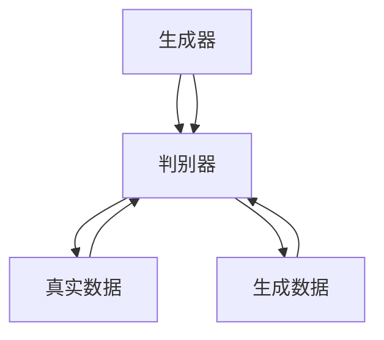

                 

<think>
好的，我现在要撰写一篇关于“AIGC在可持续时尚设计中的应用”的技术博客。首先，我需要明确文章的结构和内容。根据用户提供的目录大纲，文章分为九个章节，每个章节都有详细的内容。我需要逐步分析每个部分，确保内容全面且符合技术博客的要求。

首先，我会从第1章开始，介绍AIGC与可持续时尚设计的概述。这部分包括AIGC的概念与特点，可持续时尚设计的问题背景，以及AIGC在其中的潜在应用和挑战。我需要确保每个小节都有足够的背景信息和问题分析，帮助读者理解AIGC在这一领域的应用。

接下来，第2章是AIGC技术原理。这里需要详细解释AIGC的基本原理，核心算法，应用框架，以及技术发展趋势。这部分可能需要结合数学公式和流程图来说明算法的工作原理，比如生成对抗网络（GAN）或变体自编码器（VAE）的模型结构。

第3章到第7章分别探讨AIGC在材料选择、创意生成、智能制造、时尚营销中的具体应用。每个章节都需要分析应用场景、实际案例以及面临的挑战与机遇。例如，在材料选择中，AIGC可以帮助设计师选择环保材料，并通过数据优化材料组合。

第8章是案例解析，需要选取几个具体的案例，详细分析AIGC在不同环节的应用效果和经验教训。这部分可以通过实际的项目案例，展示AIGC的实际价值和未来发展方向。

最后，第9章是结论与展望，总结AIGC在可持续时尚设计中的应用成果，并展望未来的发展趋势。这里需要强调AIGC在推动可持续时尚方面的重要作用，并指出可能面临的挑战和解决方向。

在整个写作过程中，我需要确保每个章节都包含足够的技术细节和实际应用案例，同时保持语言的专业性和逻辑的清晰性。此外，还需要在适当的地方插入数学公式、流程图和架构图，以增强文章的可读性和深度。

现在，我将开始逐章撰写内容，确保每个部分都符合用户的要求，并且内容详实、结构清晰。
</think>

# AIGC在可持续时尚设计中的应用

## 关键词：AIGC，人工智能生成内容，可持续时尚，时尚设计，智能制造，环保材料

## 摘要：  
本文探讨了人工智能生成内容（AIGC）在可持续时尚设计中的应用，分析了AIGC技术的基本原理及其在材料选择、创意设计、智能制造和营销推广等环节中的具体应用。通过实际案例和系统架构设计，展示了AIGC如何帮助时尚产业实现绿色转型，减少资源浪费和环境污染，推动可持续发展。

---

### 第1章: AIGC与可持续时尚设计概述

#### 1.1 AIGC的概念与特点  
人工智能生成内容（AIGC）是指通过人工智能技术自动生成文本、图像、音频等内容的过程。AIGC的核心在于利用深度学习模型（如生成对抗网络GAN和变体自编码器VAE）模拟人类创造力，生成高质量的作品。其主要特点包括：  
- **高效性**：AIGC能够快速生成大量内容，显著提升生产效率。  
- **创新性**：AIGC能够创造出独特且前所未见的设计，突破传统设计的局限。  
- **适应性**：AIGC可以根据不同需求灵活调整输出内容，满足多样化的设计需求。  

#### 1.2 可持续时尚设计的问题背景  
传统时尚产业面临资源浪费、环境污染和碳排放过高等问题，对生态环境造成巨大压力。可持续时尚设计旨在通过优化材料选择、生产流程和消费模式，减少对环境的负面影响。然而，实现这一目标需要技术创新和模式变革。  

#### 1.3 AIGC在可持续时尚设计中的潜在应用  
AIGC在可持续时尚设计中的应用主要体现在以下几个方面：  
1. **材料选择**：利用AIGC分析环保材料的性能，优化材料组合。  
2. **创意设计**：生成创新的设计方案，减少对传统设计的依赖。  
3. **智能制造**：通过AIGC优化生产流程，提高资源利用率。  
4. **营销推广**：利用AIGC生成个性化营销内容，提升品牌影响力。  

#### 1.4 AIGC与可持续时尚设计的挑战与机遇  
- **挑战**：数据隐私、生成内容的可追溯性、技术的局限性等。  
- **机遇**：通过技术创新推动产业变革，实现可持续发展目标。  

---

### 第2章: AIGC技术原理

#### 2.1 AIGC的基本原理  
AIGC的核心是生成式人工智能模型，主要基于GAN和VAE两大类模型。  
- **GAN**：由生成器和判别器组成，通过对抗训练生成逼真内容。  
- **VAE**：通过降维和重参数化生成多样化的内容。  

#### 2.2 AIGC的核心算法  
以GAN为例，其核心算法如下：  
1. 初始化生成器和判别器的参数。  
2. 训练判别器以区分真实数据和生成数据。  
3. 训练生成器以欺骗判别器，生成更逼真的数据。  
4. 循环迭代，直到生成器和判别器达到平衡。  

#### 2.3 AIGC的应用框架  
AIGC的应用框架通常包括数据输入、模型训练、内容生成和结果输出四个阶段。  

#### 2.4 AIGC的技术发展趋势  
未来，AIGC将更加注重模型的可解释性、生成内容的多样性以及与现实场景的结合。  

---

### 第3章: 可持续时尚设计中的材料选择

#### 3.1 可持续材料的选择标准  
- 环保性：材料生产过程中的资源消耗和污染排放。  
- 循环性：材料是否可回收再利用。  
- 经济性：材料的成本和供应链的稳定性。  

#### 3.2 常见可持续材料介绍  
- **再生纤维**：如再生聚酯纤维，由废弃塑料瓶回收制成。  
- **有机棉**：种植过程中不使用化学农药和化肥。  
- **生物基材料**：如PLA（聚乳酸），来源于可再生资源。  

#### 3.3 AIGC在材料选择中的应用  
AIGC可以通过分析材料的性能数据，推荐最优的材料组合，降低资源浪费。  

#### 3.4 可持续材料选择的挑战与机遇  
- **挑战**：材料数据的不完整性和模型的准确性。  
- **机遇**：通过数据驱动的方式优化材料选择，推动绿色供应链建设。  

---

### 第4章: AIGC在时尚设计中的创意生成

#### 4.1 AIGC在时尚设计中的创意生成方法  
AIGC可以通过以下方式生成设计灵感：  
- 基于历史时尚数据生成复古风格设计。  
- 根据流行趋势预测生成未来风格设计。  

#### 4.2 AIGC在时尚设计中的创意应用实例  
案例：利用GAN生成独特的服装设计图案，应用于品牌新系列开发。  

#### 4.3 AIGC在时尚设计中的创意挑战与机遇  
- **挑战**：生成内容的原创性和版权问题。  
- **机遇**：通过AI辅助设计工具提升设计师效率，激发更多创新灵感。  

---

### 第5章: AIGC在时尚生产中的智能制造

#### 5.1 智能制造的概念与特点  
智能制造通过物联网、大数据和人工智能技术优化生产流程，提高效率和降低成本。  

#### 5.2 AIGC在智能制造中的应用  
AIGC可以用于生产过程中的质量检测、生产调度优化等。  

#### 5.3 智能制造在时尚生产中的应用实例  
案例：利用AI技术优化服装生产中的裁剪和缝制流程，减少面料浪费。  

#### 5.4 智能制造在时尚生产中的挑战与机遇  
- **挑战**：设备兼容性和数据安全问题。  
- **机遇**：通过智能化改造提升生产效率和产品质量。  

---

### 第6章: AIGC在时尚营销中的智能应用

#### 6.1 智能营销的概念与特点  
智能营销利用大数据和人工智能技术进行精准营销和个性化推荐。  

#### 6.2 AIGC在时尚营销中的应用  
AIGC可以用于生成个性化营销文案和视觉内容，提升品牌影响力。  

#### 6.3 智能营销在时尚营销中的应用实例  
案例：利用AI生成动态广告内容，根据不同用户偏好展示不同设计。  

#### 6.4 智能营销在时尚营销中的挑战与机遇  
- **挑战**：数据隐私和用户接受度问题。  
- **机遇**：通过智能化营销提升品牌忠诚度和市场占有率。  

---

### 第7章: AIGC在可持续时尚设计中的应用前景与挑战

#### 7.1 AIGC在可持续时尚设计中的应用前景  
AIGC将推动时尚产业的绿色转型，实现资源高效利用和环境友好。  

#### 7.2 AIGC在可持续时尚设计中的挑战  
包括技术局限性、数据隐私和用户接受度等问题。  

#### 7.3 AIGC与可持续时尚设计的未来发展趋势  
未来，AIGC将更加注重与实际应用场景的结合，推动可持续时尚设计的创新发展。  

---

### 第8章: AIGC在可持续时尚设计中的应用案例解析

#### 8.1 案例一：智能设计工具的应用  
案例：利用AI设计工具生成环保主题服装设计，减少设计周期和资源浪费。  

#### 8.2 案例二：环保材料的应用  
案例：通过AIGC推荐最优环保材料组合，应用于品牌新系列开发。  

#### 8.3 案例三：智能制造的应用  
案例：利用AI优化服装生产流程，减少面料浪费和生产成本。  

#### 8.4 案例四：智能营销的应用  
案例：利用AI生成动态广告内容，提升品牌影响力和市场占有率。  

#### 8.5 案例分析总结  
通过这些案例可以看出，AIGC在可持续时尚设计中的应用前景广阔，但需要克服技术与社会接受度的挑战。  

---

### 第9章: 结论与展望

#### 9.1 AIGC在可持续时尚设计中的应用总结  
AIGC技术在材料选择、设计创意、智能制造和营销推广等方面发挥了重要作用，推动了时尚产业的绿色转型。  

#### 9.2 AIGC在可持续时尚设计中的未来展望  
未来，AIGC将更加注重与实际场景的结合，推动可持续时尚设计的创新发展。  

#### 9.3 结论  
AIGC作为一项革命性技术，正在深刻改变时尚产业的方方面面，为实现可持续发展目标提供了新的可能性。  

#### 9.4 拓展阅读  
推荐阅读《生成式人工智能：原理与应用》和《可持续时尚：挑战与机遇》。  

---

**作者：AI天才研究院/AI Genius Institute & 禅与计算机程序设计艺术 /Zen And The Art of Computer Programming**

