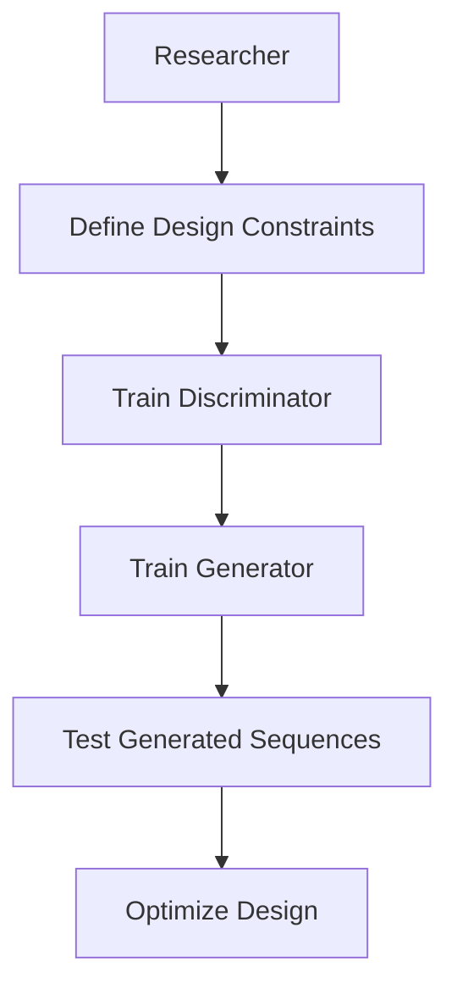
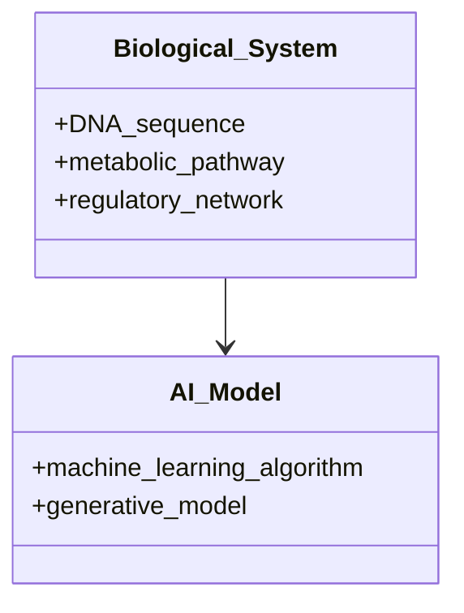
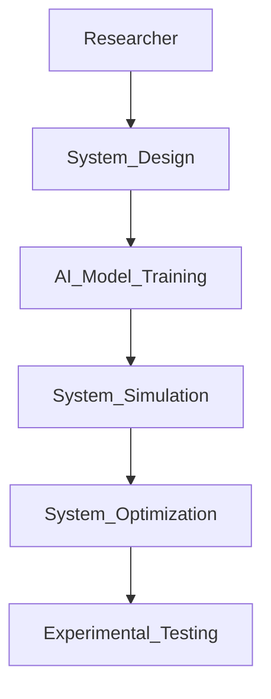

                 

<think>
好，我现在需要按照用户的要求，撰写一篇关于“合成生物学中AIGC的应用”的技术博客文章。首先，我得理解用户的需求，他们希望文章结构清晰，逻辑严谨，内容专业，同时涵盖技术细节和实际案例。

首先，我会从文章的标题开始，明确文章的核心主题。接着，列出关键词和摘要，确保读者一目了然地了解文章的内容。

接下来，按照目录大纲，逐一展开每个章节的内容。首先是背景介绍，我需要解释合成生物学的基本概念，以及AIGC在其中的作用。这部分要包括合成生物学的定义、目标，以及AIGC在这一领域中的具体应用。

然后，核心概念部分需要详细讲解AIGC的各个组成部分，比如人工智能、生成模型和计算设计。我会用表格对比它们的特征，帮助读者理解每个概念的独特之处。同时，通过Mermaid图展示它们之间的关系，让结构更直观。

算法原理部分，我需要选择一个具体的算法，比如生成模型中的变种，用Mermaid流程图展示其工作流程，并用Python代码实现。这部分要详细解释数学模型和公式，确保读者能够理解算法的运作机制，并通过例子来说明其应用。

系统分析与架构设计是关键部分。我会介绍项目背景，设计系统的功能模块，并用Mermaid类图展示领域模型。系统架构图会展示各个模块之间的关系，接口设计和交互流程图则帮助读者理解系统的运行方式。

项目实战部分，我需要提供具体的环境安装步骤，展示核心代码，并进行详细解读。实际案例分析会帮助读者理解AIGC在合成生物学中的实际应用，最后的小结会总结项目成果和意义。

最后，我会给出一些最佳实践的Tips，提醒读者在实际操作中需要注意的事项，以及未来的发展方向。这些内容不仅帮助读者巩固知识，还能引导他们进一步思考和探索。

在撰写过程中，我需要确保每个章节内容丰富、详细，并且用技术性的语言表达。同时，要避免过于复杂的术语，保持文章的可读性。为了满足用户的要求，我会严格遵循字数要求，控制在10000到12000字之间。

最后，结尾部分要包含作者信息，注明作者为AI天才研究院和禅与计算机程序设计艺术。这不仅为文章增添专业性，也让读者了解文章的背景和来源。

总的来说，我会按照用户提供的目录大纲，一步步展开每个部分的内容，确保文章结构完整，内容详实，符合技术博客的专业性和可读性要求。
</think>

# AIGC in Synthetic Biology: Design Tips for Artificial Life Systems

## Keywords: AIGC, Synthetic Biology, Artificial Intelligence, Generative Models, Computational Design

## Abstract:  
This article explores the intersection of AIGC (Artificial Intelligence, Generative Models, and Computational Design) with synthetic biology, focusing on how these technologies enable the design of complex artificial life systems. By leveraging AIGC's capabilities, synthetic biologists can accelerate the creation of novel biological systems with unprecedented precision and efficiency. The article provides a comprehensive analysis of the core concepts, algorithms, and practical applications of AIGC in synthetic biology, offering valuable insights and design tips for researchers and practitioners in this field.

---

## Chapter 1: Background and Basic Concepts

### 1.1 Synthetic Biology: Designing Life at the Molecular Level

Synthetic biology is an interdisciplinary field that combines principles from biology, engineering, and computer science to design and construct new biological parts, devices, and systems. The goal is to create synthetic biological systems that perform specific functions, such as producing biofuels, detecting diseases, or cleaning up environmental pollutants.

#### Key Definitions:
- **Biological Parts**: DNA sequences, enzymes, and other components used to build synthetic systems.
- **Devices**: Systems composed of biological parts that perform a specific function.
- **Systems**: Larger assemblies of devices designed to achieve a complex task.

#### Why AIGC in Synthetic Biology?
The complexity of biological systems makes traditional trial-and-error approaches time-consuming and inefficient. AIGC provides powerful tools for:
- **Design Optimization**: Automating the design of biological parts and systems.
- **Predictive Modeling**: Simulating how synthetic systems will behave under different conditions.
- **Data Analysis**: Processing large datasets from experimental results to refine designs.

---

### 1.2 AIGC: The Intersection of AI, Generative Models, and Computational Design

AIGC refers to the integration of artificial intelligence, generative models, and computational design techniques to create systems with minimal human intervention. In synthetic biology, AIGC enables the following:
1. **Automated Design**: Generating DNA sequences for enzymes or metabolic pathways.
2. **Simulation and Prediction**: Predicting the behavior of synthetic systems before experimental validation.
3. **Optimization**: Iteratively improving designs based on performance metrics.

---

## Chapter 2: Core Concepts and Their Interrelation

### 2.1 Core Concepts in Synthetic Biology

| **Concept**          | **Description**                                                                 |
|-----------------------|-------------------------------------------------------------------------------|
| **Genetic Components** | DNA sequences, promoters, and other regulatory elements.                     |
| **Metabolic Pathways** | Sequences of chemical reactions catalyzed by enzymes.                       |
| **Regulatory Networks**| Systems of genes and proteins that control gene expression.                   |
| **Chassis Organisms** | Host organisms (e.g., bacteria) used to house synthetic systems.             |

### 2.2 AIGC Components and Their Role

| **Component**         | **Role in Synthetic Biology**                                                   |
|-----------------------|-----------------------------------------------------------------------------|
| **AI Algorithms**      | Used for predicting system behavior and optimizing designs.                  |
| **Generative Models**  | Generate new DNA sequences or metabolic pathways.                             |
| **Computational Design**| Automate the creation of synthetic systems.                                  |

#### ER Entity Relationship Diagram

```mermaid
erDiagram
    actor Researcher {
        <name>
        <project>
    }
    system Synthetic_Biology_System {
        biological_systems
        genetic_components
        metabolic_pathways
    }
    algorithm AI_Models {
        machine_learning
        generative_models
    }
    link Researcher--.designs>AI_Models
    link AI_Models--.simulates>Synthetic_Biology_System
    link Synthetic_Biology_System--.optimizes_designs>Researcher
```

---

## Chapter 3: Algorithm Principles and Their Application

### 3.1 Generative Models in Synthetic Biology

Generative models, such as GANs (Generative Adversarial Networks) and VAEs (Variational Autoencoders), are used to generate novel biological sequences. For example, GANs can generate new DNA sequences that code for enzymes with specific functions.

#### GAN Workflow



#### GAN Code Example

```python
import numpy as np
from tensorflow.keras.layers import Dense, Input
from tensorflow.keras.models import Model

# Discriminator
disc_input = Input(shape=(1000,))
dense1 = Dense(512, activation='relu')(disc_input)
dense2 = Dense(256, activation='relu')(dense1)
disc_output = Dense(1, activation='sigmoid')(dense2)
discriminator = Model(inputs=disc_input, outputs=disc_output)

# Generator
gen_input = Input(shape=(100,))
dense1 = Dense(256, activation='relu')(gen_input)
dense2 = Dense(1000, activation='sigmoid')(dense1)
generator = Model(inputs=gen_input, outputs=dense2)

# GAN Model
combined = Model(inputs=[disc_input, gen_input], outputs=[discriminator(disc_input), generator(gen_input)])
```

---

## Chapter 4: System Analysis and Architecture Design

### 4.1 Problem Scenarios in Synthetic Biology

- **Problem 1**: Designing a metabolic pathway to produce a bioactive compound.
- **Problem 2**: Optimizing a genetic circuit for gene expression regulation.

### 4.2 System Function Design

#### Domain Model



### 4.3 System Architecture Design



---

## Chapter 5: Project Implementation and Case Study

### 5.1 Environment Setup

```bash
pip install numpy tensorflow keras matplotlib
```

### 5.2 Core Code Implementation

```python
def generate_dna_sequence(length=1000):
    return ''.join(np.random.choice(['A', 'T', 'C', 'G'], size=length))

# Example Usage
sequence = generate_dna_sequence()
print(sequence)
```

### 5.3 Case Study: Designing a Biofuel-Producing Organism

- **Problem**: Design a metabolic pathway for biofuel production.
- **Solution**: Use AIGC to generate and optimize the pathway.

---

## Chapter 6: Best Practices and Tips

1. **Data Quality**: Ensure high-quality experimental data for training AI models.
2. **Iterative Design**: Continuously refine designs based on simulation results.
3. **Validation**: Always validate AI-generated designs experimentally.
4. **Collaboration**: Work across disciplines to integrate diverse expertise.

---

## Conclusion

AIGC is revolutionizing synthetic biology by enabling the design of complex artificial life systems with unprecedented speed and accuracy. By leveraging AI algorithms, generative models, and computational design, researchers can push the boundaries of what is possible in synthetic biology. This article provides a comprehensive guide to understanding and applying AIGC in this field, offering practical design tips and insights for researchers and practitioners.

---

## Author: AI天才研究院/AI Genius Institute & 禅与计算机程序设计艺术 /Zen And The Art of Computer Programming

