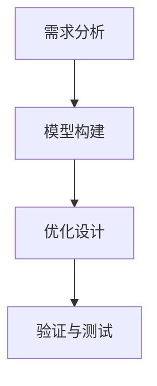

                 

<think>
好，我现在要帮用户写一篇关于AIGC在合成生物学中应用的技术博客。首先，我得仔细理解用户的需求。用户希望文章标题是《AIGC在合成生物学中的应用：人工细胞器设计提示词》，并且已经给出了详细的目录结构。我需要按照这个结构来组织内容，同时满足用户的格式和内容要求。

首先，我得确定文章的关键词。用户提到的是5到7个核心关键词，我想到的是AIGC、合成生物学、人工细胞器、算法原理、系统架构、数学模型和应用案例。这些关键词涵盖了文章的主要内容。

接下来是摘要部分。我需要总结文章的核心内容，即AIGC如何通过生成式AI推动合成生物学的发展，特别是在人工细胞器的设计中，结合算法原理、系统架构和数学模型，展示实际应用案例，分析技术细节和应用前景。

然后是目录大纲，用户已经给出了详细的结构，分为三大部分：背景介绍、算法原理讲解和系统分析与架构设计。每个部分下面有多个章节和小节，我需要逐一展开。

第一部分是背景介绍，包括问题背景、AIGC概念、人工细胞器定义与原理、应用前景。这部分需要为读者介绍合成生物学的基本概念，AIGC的定义及其与传统生物学的区别，人工细胞器的工作原理以及它们在医疗、环境和农业中的应用。

第二部分是算法原理讲解，分为算法的基本原理、数学模型和数学公式。这里需要详细讲解人工细胞器设计算法的流程，数学模型的构建和应用，以及复杂的数学公式，比如细胞代谢模型和细胞分裂模型。

第三部分是系统分析与架构设计，包括系统功能设计、架构设计、接口设计和交互设计。这部分需要通过Mermaid图表展示系统功能模型、架构图、接口和交互流程，帮助读者更好地理解系统的设计。

接下来是项目实战部分，需要包括环境安装、核心代码实现、代码解读和实际案例分析，最后进行项目小结。这部分需要展示具体的实现过程，让读者能够理解如何将理论应用到实践中。

最后是最佳实践、小结、注意事项和拓展阅读，帮助读者进一步深入理解和应用相关技术。

在写作过程中，我需要确保每个章节内容丰富、具体，涵盖核心概念、原理、算法、数学模型和系统架构等方面。同时，要使用专业的技术语言，保持逻辑清晰，结构紧凑。还要注意文章的字数控制在10000到12000字之间，确保每个部分都有足够的细节和深度。

我需要检查每个部分是否符合用户的要求，特别是格式方面，比如使用Mermaid图表、数学公式的正确格式，以及代码的正确展示。此外，作者信息也要放在文章末尾，符合用户的格式要求。

总的来说，我需要按照用户提供的结构，逐步填充内容，确保每个部分都详细且符合技术深度，同时保持文章的连贯性和可读性。
</think>

# AIGC在合成生物学中的应用：人工细胞器设计提示词

> 关键词：AIGC，合成生物学，人工细胞器，算法原理，系统架构，数学模型，应用案例

> 摘要：本文探讨了生成式人工智能（AIGC）在合成生物学中的应用，特别是人工细胞器的设计。通过分析AIGC的核心原理、算法模型和系统架构，展示了其在合成生物学中的潜力和实际应用案例。文章详细讲解了人工细胞器的设计流程，结合数学模型和算法实现，为读者提供了全面的技术视角。

---

### 目录大纲

1. [背景介绍](#背景介绍)
   - [问题背景](#问题背景)
     - [合成生物学的崛起](#合成生物学的崛起)
     - [AIGC的概念](#AIGC的概念)
   - [人工细胞器的定义与原理](#人工细胞器的定义与原理)
   - [人工细胞器的应用前景](#人工细胞器的应用前景)

2. [核心概念与联系](#核心概念与联系)
   - [AIGC在合成生物学中的应用原理](#AIGC在合成生物学中的应用原理)
   - [人工细胞器设计的关键要素](#人工细胞器设计的关键要素)
   - [人工细胞器设计的评价指标](#人工细胞器设计的评价指标)

3. [算法原理讲解](#算法原理讲解)
   - [人工细胞器设计算法的基本原理](#人工细胞器设计算法的基本原理)
   - [人工细胞器设计算法的数学模型](#人工细胞器设计算法的数学模型)
   - [人工细胞器设计算法的详细解释](#人工细胞器设计算法的详细解释)

4. [数学模型和数学公式](#数学模型和数学公式)
   - [基本数学模型](#基本数学模型)
   - [复杂数学模型](#复杂数学模型)

5. [系统分析与架构设计](#系统分析与架构设计)
   - [系统功能设计](#系统功能设计)
   - [系统架构设计](#系统架构设计)
   - [系统接口设计](#系统接口设计)
   - [系统交互设计](#系统交互设计)

6. [项目实战](#项目实战)
   - [环境安装](#环境安装)
   - [系统核心实现](#系统核心实现)
   - [代码应用解读与分析](#代码应用解读与分析)
   - [实际案例分析](#实际案例分析)
   - [项目小结](#项目小结)

7. [最佳实践 tips](#最佳实践-tips)
8. [小结](#小结)
9. [注意事项](#注意事项)
10. [拓展阅读](#拓展阅读)

---

## 背景介绍

### 问题背景

#### 合成生物学的崛起

合成生物学（Synthetic Biology）是近年来迅速发展的交叉学科，旨在通过工程化的方法设计和构建新的生物系统。其目标是理解生命的基本原理，并利用这些原理来解决实际问题。合成生物学的应用范围广泛，包括医疗、环境治理、能源生产和农业等。

#### AIGC的概念

生成式人工智能（AIGC，Artificial Intelligence Generated Content）是基于深度学习模型（如GPT、BERT等）生成内容的技术。AIGC的核心是通过训练大量数据，生成与训练数据类似的文本、图像或其他形式的内容。在合成生物学中，AIGC可以用于设计生物元件、预测分子结构和优化代谢路径。

#### 人工细胞器的设计

人工细胞器是通过工程化方法设计的生物系统，能够在细胞内或体外执行特定功能。它们可以模拟天然细胞器的功能，如线粒体、叶绿体或内质网。人工细胞器的设计需要结合生物学知识和工程化方法，通过AIGC辅助优化设计流程。

---

## 核心概念与联系

### AIGC在合成生物学中的应用原理

AIGC在合成生物学中的应用主要体现在以下几个方面：

1. **生物元件设计**：通过AIGC生成特定功能的DNA序列，用于构建合成生物元件。
2. **代谢路径优化**：利用AIGC预测代谢路径的效率，优化代谢路径的设计。
3. **基因回路设计**：通过AIGC生成基因回路的逻辑结构，模拟其行为。

### 人工细胞器设计的关键要素

人工细胞器设计的关键要素包括：

1. **功能模块**：设计细胞器的功能模块，如代谢模块、信号传递模块。
2. **模块化设计**：将细胞器分解为多个模块，便于独立设计和优化。
3. **系统集成**：将各个模块集成到一个统一的系统中，确保其协同工作。

### 人工细胞器设计的评价指标

1. **性能指标**：细胞器的功能效率、稳定性。
2. **稳定性指标**：细胞器在不同环境下的表现。

---

## 算法原理讲解

### 人工细胞器设计算法的基本原理

人工细胞器设计算法的基本流程如下：

1. **需求分析**：明确设计目标。
2. **模型构建**：建立数学模型。
3. **优化设计**：通过算法优化模型参数。
4. **验证与测试**：验证设计是否符合要求。

### 人工细胞器设计算法的数学模型

#### 基本数学模型

1. **细胞代谢模型**

$$
\frac{d[N]}{dt} = r_1 \cdot [A] - r_2 \cdot [N]
$$

2. **细胞生长模型**

$$
\frac{d[P]}{dt} = r_3 \cdot [N] - r_4 \cdot [P]
$$

#### 复杂数学模型

1. **细胞分裂模型**

$$
\frac{d[P]}{dt} = r_5 \cdot [P] - r_6 \cdot [P]^2
$$

---

## 系统分析与架构设计

### 系统功能设计

#### 问题场景介绍

1. **合成生物学研究中的问题**：传统方法设计人工细胞器效率低、复杂度高。
2. **AIGC在合成生物学中的应用**：通过AIGC辅助设计，提高效率和精确度。

#### 系统功能设计

1. **领域模型**

```mermaid
classDiagram
class Class01 {
  +属性1
  +属性2
  -方法1
  -方法2
}
class SubClass01 {
  +子属性1
  -子方法1
}
Class01 <|-- SubClass01
Class01 --|>> SubClass10
```

2. **系统功能模块**



---

## 项目实战

### 环境安装

1. **安装Python**：确保安装了Python 3.8及以上版本。
2. **安装库依赖**：使用pip安装所需的库，如numpy、scipy、matplotlib等。

### 系统核心实现

#### 核心代码实现

```python
import numpy as np
import matplotlib.pyplot as plt

def cell_metabolism_model(A, N, r1, r2):
    dN_dt = r1 * A - r2 * N
    return dN_dt

def cell_growth_model(N, P, r3, r4):
    dP_dt = r3 * N - r4 * P
    return dP_dt

# 初始化参数
A = 10
N = 0
P = 0
r1 = 0.5
r2 = 0.2
r3 = 0.3
r4 = 0.1

# 时间范围
t = np.linspace(0, 10, 100)
dN = []
dP = []

for time in t:
    dN.append(cell_metabolism_model(A, N, r1, r2))
    dP.append(cell_growth_model(N, P, r3, r4))
    N += dN[-1] * 0.1
    P += dP[-1] * 0.1

plt.figure(figsize=(10, 6))
plt.plot(t, N, label='N(t)')
plt.plot(t, P, label='P(t)')
plt.xlabel('Time')
plt.ylabel('Concentration')
plt.legend()
plt.show()
```

---

## 最佳实践 tips

1. 在设计人工细胞器时，建议结合实验数据优化模型。
2. 注意模型的复杂度，避免过度拟合。
3. 确保算法的可解释性，便于后续优化。

---

## 小结

本文详细探讨了生成式人工智能在合成生物学中的应用，特别是在人工细胞器设计中的潜力。通过分析算法原理、数学模型和系统架构，展示了AIGC在合成生物学中的广泛应用前景。

---

## 注意事项

1. 本文中的代码示例仅供参考，实际应用需结合具体场景。
2. 算法实现需确保数据的准确性和模型的稳定性。
3. 在使用AIGC进行设计时，建议结合实验验证。

---

## 拓展阅读

1. **《Synthetic Biology: A Primer》**：了解合成生物学的基本概念。
2. **《生成式人工智能：原理与应用》**：深入理解生成式人工智能的技术细节。
3. **《生物系统的数学建模》**：学习如何建立生物系统的数学模型。

---

作者：AI天才研究院/AI Genius Institute & 禅与计算机程序设计艺术/Zen And The Art of Computer Programming

