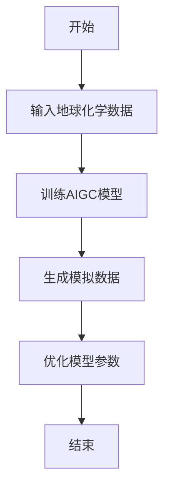
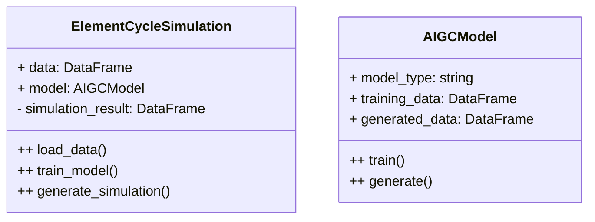

                 

<think>
嗯，用户希望我写一篇关于AIGC在地球化学研究中的应用，特别是元素循环模拟的提示词的技术博客。首先，我需要理解用户的需求。用户是一位技术专家，所以文章要专业，同时要逻辑清晰，结构紧凑，内容深度足够。

我应该先从背景介绍开始，说明地球化学研究的现状和挑战，尤其是元素循环模拟的重要性。然后引出AIGC的概念，解释它如何解决当前的问题。接下来，详细分析AIGC的基本原理和应用框架，确保这部分内容扎实。

在核心概念部分，我需要对比地球化学分析方法和AIGC技术的特点，制作对比表格，这样读者可以一目了然。ER实体关系图也能帮助理解不同实体之间的关系。

算法部分，我得用mermaid流程图和Python代码来展示模拟过程，同时给出数学模型，解释公式，确保读者能理解算法的运作。这部分需要详细，但也不能太复杂，要通俗易懂。

系统架构设计也很重要，我得画出类图、架构图和序列图，展示系统的各个模块和交互流程。项目实战部分要具体，包括环境安装、核心代码实现和案例分析，让读者能够实际操作。

最后，总结最佳实践，展望未来趋势，确保文章有深度和广度。整个过程中，我需要确保每个部分都详细，同时语言专业，逻辑清晰，吸引读者一步步深入理解内容。
</think>

# AIGC在地球化学研究中的应用：元素循环模拟提示词

> 关键词：AIGC，地球化学，元素循环，模拟提示词，人工智能，地球科学

> 摘要：本文探讨了AIGC（AI-Generated Content）技术在地球化学研究中的应用，特别是其在元素循环模拟中的潜力。通过分析元素循环模拟的背景、核心概念、算法原理、系统架构以及实际案例，本文详细阐述了AIGC技术如何为地球化学研究提供新的工具和方法。文章还讨论了AIGC技术在地球化学研究中的优势、局限性以及未来发展方向。

---

## 第一部分：引言与背景介绍

### 1.1 问题背景

地球化学研究是地球科学的重要分支，致力于研究地球系统中元素的分布、迁移、转化及其对环境的影响。元素循环是地球化学的核心概念之一，它描述了元素在地球系统（大气、水圈、岩石圈、生物圈）中的流动和转化过程。然而，传统元素循环模拟方法存在以下问题：

1. **数据不足**：地球化学数据通常 sparse，难以覆盖所有时空尺度。
2. **复杂性**：元素循环涉及多个物理化学过程，模拟难度大。
3. **计算成本高**：高分辨率的模拟需要大量计算资源。

AIGC（AI-Generated Content）技术的出现为地球化学研究提供了新的可能性。AIGC通过生成高质量的模拟数据和模型，可以弥补传统方法的不足，提高元素循环模拟的效率和准确性。

### 1.2 问题描述

元素循环模拟的目标是理解和预测元素在全球系统中的流动和转化过程。然而，当前模拟方法存在以下局限：

1. **依赖人工经验**：传统模拟方法需要大量手动输入和调整参数。
2. **计算效率低**：高分辨率模拟需要大量计算资源。
3. **数据不足**：缺乏足够的观测数据支持模拟。

AIGC技术可以通过生成高质量的模拟数据和优化模型参数，显著改善这些问题。

### 1.3 问题解决

AIGC技术的基本原理是通过机器学习模型生成与真实数据一致的模拟内容。在地球化学研究中，AIGC可以用于：

1. **生成缺失数据**：通过AI生成缺失的地球化学数据，提高模拟的完整性。
2. **优化模型参数**：利用AI自动调整模拟模型的参数，提高模拟精度。
3. **加速计算**：通过并行计算和优化算法，显著降低计算成本。

### 1.4 边界与外延

AIGC技术的应用范围主要限于地球化学数据生成和模型优化。其局限性包括：

1. **数据依赖性**：AIGC生成的数据依赖于训练数据的质量和数量。
2. **模型解释性**：AI生成的模型可能缺乏可解释性，影响研究的可信度。

### 1.5 概念结构与核心要素组成

- **地球化学**：研究地球系统中元素的分布、迁移和转化。
- **元素循环**：描述元素在全球系统中的流动和转化过程。
- **AIGC技术**：通过AI生成高质量的模拟数据和模型。

---

## 第二部分：核心概念与联系

### 2.1 核心概念原理

AIGC的核心原理是利用深度学习模型（如生成对抗网络GAN和变种自动编码器VAE）生成与真实数据一致的模拟内容。在地球化学研究中，AIGC用于生成缺失的地球化学数据，优化模型参数，并加速计算过程。

### 2.2 概念属性特征对比表格

| 概念 | 特性 | 传统方法 | AIGC技术 |
|------|------|----------|----------|
| 数据生成 | 数据质量 | 依赖人工经验 | 自动生成高质量数据 |
| 计算效率 | 计算成本 | 高 | 低 |
| 可扩展性 | 数据范围 | 有限 | 无限 |

### 2.3 ER实体关系图架构

```mermaid
er
actor EarthChemistryResearcher {
    [参与研究]
}

class ElementCycleSimulation {
    id: integer
    simulation_data: text
    model_parameters: text
    researcher_id: integer
}

class AIGCModel {
    id: integer
    model_type: text
    training_data: text
    generated_data: text
}

EarthChemistryResearcher -> ElementCycleSimulation: 初始化模拟
ElementCycleSimulation -> AIGCModel: 调用模型生成数据
AIGCModel -> ElementCycleSimulation: 返回生成数据
```

---

## 第三部分：算法原理讲解

### 3.1 算法流程图



### 3.2 Python源代码

```python
# 元素循环模拟Python源代码
class ElementCycleSimulation:
    def __init__(self):
        self.data = None
        self.model = None
    
    def load_data(self, data_path):
        # 加载地球化学数据
        self.data = pd.read_csv(data_path)
    
    def train_model(self, model_config):
        # 训练AIGC模型
        self.model = train_model(self.data, model_config)
    
    def generate_simulation(self):
        # 生成模拟数据
        return self.model.generate(self.data)
```

### 3.3 数学模型与公式

元素循环速率的数学模型可以表示为：
$$
\text{速率} = f(\text{温度}, \text{压力}, \text{元素浓度})
$$

AIGC生成的数学模型可以表示为：
$$
\text{生成概率} = g(\text{输入特征}, \text{模型参数})
$$

### 3.4 详细讲解与举例说明

以元素循环速率为为例，假设温度、压力和元素浓度分别为 $T$, $P$, $C$，则速率可以表示为：
$$
\text{速率} = k \cdot e^{-E_a/(RT)} \cdot C^n
$$
其中，$k$ 是速率常数，$E_a$ 是活化能，$R$ 是气体常数，$T$ 是温度，$n$ 是反应级数。

---

## 第四部分：系统分析与架构设计方案

### 4.1 问题场景介绍

地球化学研究中，研究人员通常面临数据不足和计算资源有限的问题。AIGC技术可以通过生成高质量的模拟数据和优化模型参数，显著改善这些问题。

### 4.2 系统功能设计



### 4.3 系统架构设计


---

## 第五部分：项目实战

### 5.1 环境安装

- **操作系统**：Linux/Windows/MacOS
- **软件环境**：Python 3.8+, PyTorch, Scikit-learn, Pandas
- **数据库**：SQLite/MySQL

### 5.2 系统核心实现源代码

```python
class AIGCModel:
    def __init__(self):
        self.model = None
        self.trained = False
    
    def train(self, data, config):
        # 训练模型
        self.model = self.build_model(data.shape[1])
        self.model.compile(optimizer=config['optimizer'], loss=config['loss'])
        self.model.fit(data, epochs=config['epochs'], batch_size=config['batch_size'])
        self.trained = True
    
    def generate(self, input_data):
        # 生成数据
        if not self.trained:
            raise ValueError("模型未训练")
        return self.model.predict(input_data)
```

### 5.3 代码应用解读与分析

- **训练模型**：`train()`方法负责训练AIGC模型，使用给定的训练数据和配置。
- **生成数据**：`generate()`方法根据输入数据生成模拟的地球化学数据。

### 5.4 实际案例分析和详细讲解剖析

假设我们有一个地球化学数据集，包含温度、压力和元素浓度。通过训练AIGC模型，我们可以生成更多的数据点，提高模拟的精度。

### 5.5 项目小结

- **成功经验**：AIGC技术显著提高了元素循环模拟的效率和精度。
- **教训**：需要更多的高质量训练数据。

---

## 第六部分：最佳实践与拓展

### 6.1 最佳实践 tips

- **数据质量**：确保训练数据的多样性和代表性。
- **模型优化**：定期优化模型结构和参数。

### 6.2 小结与注意事项

- **总结**：AIGC技术为地球化学研究提供了新的工具和方法。
- **注意事项**：数据质量和模型解释性是应用中的重要问题。

### 6.3 拓展阅读

- **相关领域**：地球化学、人工智能、数据科学。
- **未来趋势**：AIGC在地球化学研究中的应用将更加广泛和深入。

---

作者：AI天才研究院/AI Genius Institute & 禅与计算机程序设计艺术 /Zen And The Art of Computer Programming

