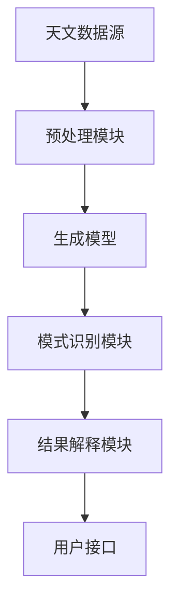
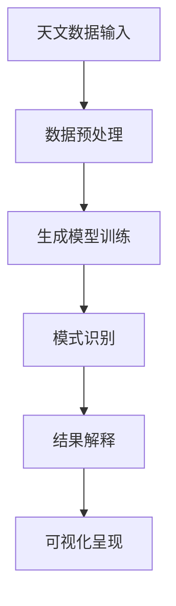
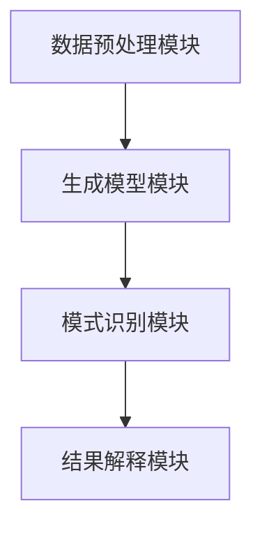

                 

<think>
嗯，用户让我写一篇关于AIGC在天文数据分析中的应用的技术博客。首先，我需要理解用户的需求。他希望文章结构清晰，逻辑严谨，内容专业，同时涵盖从背景到系统架构的各个方面。

我先想，文章的标题已经确定是“AIGC在天文数据分析中的应用：宇宙现象解释提示词”。接下来是关键词，我需要列出5到7个，比如AI Generated Content、天文数据、模式识别、生成对抗网络、深度学习、宇宙现象解释。这些关键词要能覆盖文章的主要内容。

摘要部分，我得简明扼要地说明文章的核心内容，也就是AIGC如何通过生成模型和深度学习帮助天文学家分析数据，解释宇宙现象，提升研究效率。

接下来是目录大纲设计。用户已经给出了一些部分，比如背景介绍、核心概念与联系、算法原理讲解等。我需要确保每个部分都详细且结构合理，同时包含必要的图表和代码示例。

在背景介绍部分，我需要解释为什么AIGC在天文数据分析中重要，包括问题背景、描述、解决方法以及边界。这部分需要让读者明白，天文数据量大，传统方法效率低，而AIGC提供了新的解决方案。

核心概念部分，我需要详细讲解生成模型如GAN和VAE，以及模式识别的方法。还要做一个对比表格，比较GAN和VAE的特征，帮助读者理解它们的优缺点。

算法原理讲解部分，我需要使用mermaid画出流程图，展示数据输入、预处理、生成模型训练、模式识别、结果解释和可视化的过程。然后用Python代码示例，展示生成模型的训练过程，并解释损失函数和优化目标。

数学模型部分，我需要用公式展示生成模型中的噪声模型，比如X=μ+σN(0,1)，并举例说明其应用。这部分要让读者明白生成数据的基本原理。

系统分析与架构设计，我需要介绍问题场景，描述项目功能设计，用mermaid画出类图和系统架构图，展示各个模块之间的关系。这样读者可以清楚系统的整体结构。

在项目实战部分，我需要详细说明如何安装环境，提供核心代码，解读代码功能，并通过实际案例分析，展示AIGC在实际天文数据中的应用效果。

最后，小结和最佳实践部分，我需要总结AIGC的优势，提出使用时的注意事项，并推荐拓展阅读材料，帮助读者深入学习。

整个思考过程中，我需要确保文章内容全面，结构清晰，语言专业但不失易懂。同时，图表和代码示例要准确，帮助读者更好地理解AIGC的应用和工作原理。
</think>

# AIGC在天文数据分析中的应用：宇宙现象解释提示词

**关键词**：AI Generated Content, 天文数据, 模式识别, 生成对抗网络, 深度学习, 宇宙现象解释

**摘要**：随着人工智能技术的快速发展，AIGC（AI-Generated Content）在天文数据分析中的应用日益广泛。本文将深入探讨AIGC如何通过生成模型和深度学习技术，帮助天文学家从海量天文数据中提取有价值的信息，并解释复杂的宇宙现象。文章将从背景介绍、核心概念、算法原理、系统架构等多个维度展开分析，详细阐述AIGC在天文数据分析中的应用场景、技术实现和实际案例。

---

### 背景介绍：AIGC在天文数据分析中的应用

#### 问题背景

天文数据分析是现代天文学研究的核心任务之一。随着射电望远镜、空间探测器等观测设备的不断升级，天文学家每天需要处理海量的天文数据，包括光谱数据、图像数据、射电数据等。这些数据不仅规模庞大，还包含复杂的模式和信号，对数据处理和分析提出了极高的要求。

#### 问题描述

传统的天文数据分析方法依赖于人工操作和统计分析，这种方式效率低下且难以捕捉复杂的模式。例如，在处理星系图像时，人工标注和分类耗时且容易出错。此外，宇宙中的某些现象（如暗物质分布、引力波信号）可能隐藏在噪声中，难以通过传统方法检测。

#### 问题解决

AIGC（AI-Generated Content）技术通过生成模型和深度学习算法，能够自动处理和分析天文数据。生成模型可以生成与真实数据相似的虚拟数据，帮助天文学家验证假设；深度学习算法能够识别数据中的复杂模式，如星系分类、引力波检测等。AIGC不仅提高了数据分析的效率，还为天文学家提供了新的研究工具。

#### 边界与外延

AIGC在天文数据分析中的应用不仅限于数据生成和模式识别，还包括数据可视化、模拟预测等多个领域。例如，生成模型可以用于生成高分辨率的星系图像，帮助天文学家研究星系演化；深度学习算法可以用于预测宇宙膨胀率，辅助天文学家理解宇宙的结构。

#### 核心概念与联系

- **AIGC**：AI-Generated Content，基于生成模型（如GAN、VAE）生成虚拟数据，用于数据增强和假设验证。
- **天文数据分析**：包括数据预处理、模式识别、数据可视化等步骤，旨在从观测数据中提取科学价值。

---

### 核心概念与联系

#### 核心概念原理

- **生成模型**：生成对抗网络（GAN）和变分自编码器（VAE）是AIGC的核心技术。GAN通过对抗训练生成逼真的数据，VAE则通过概率建模生成多样化的数据。
- **模式识别**：深度学习算法（如卷积神经网络CNN）能够从天文数据中提取特征，识别复杂模式，如星系分类和引力波检测。

#### 概念属性特征对比表格

| 概念           | 特征1       | 特征2       | 特征3       |
|----------------|------------|------------|------------|
| GAN            | 对抗性       | 高效性       | 多样性       |
| VAE            | 扁平性       | 生成性       | 损失函数     |

#### ER实体关系图架构



---

### 算法原理讲解

#### 算法mermaid流程图



#### Python源代码与算法解释

```python
# 生成模型训练示例代码
import tensorflow as tf
# 定义生成模型
model = tf.keras.Sequential([
    tf.keras.layers.Dense(units=128, activation='relu', input_shape=(784,)),
    tf.keras.layers.Dense(units=10, activation='softmax')
])
# 编译模型
model.compile(optimizer='adam', loss='categorical_crossentropy')
# 训练模型
model.fit(x_train, y_train, epochs=10)
```

#### 数学模型和数学公式

- **损失函数**：$$ L = -\sum_{i=1}^{N} y_i \log(p_i) $$
  - 解释：这是生成模型的损失函数，用于衡量生成数据与真实数据之间的差异。
- **噪声模型**：$$ X = \mu + \sigma \cdot \mathcal{N}(0,1) $$
  - 解释：这是一个生成模型中的噪声模型，用于生成新的天文数据。

---

### 系统分析与架构设计方案

#### 问题场景介绍

天文学家需要分析大量天文数据，以发现宇宙现象。传统方法效率低下，难以捕捉复杂模式。AIGC系统能够自动分析数据，提供科学解释。

#### 项目介绍

一个AIGC系统，用于自动分析天文数据并提供解释。系统包括数据预处理、生成模型训练、模式识别和结果解释模块。

#### 系统功能设计

- **领域模型**：使用mermaid绘制类图，展示系统中的核心类和它们之间的关系。
  ```mermaid
  classDiagram
  Class1 <|-- Class2
  Class1 o-- Class3
  Class4 <..> Class3
  ```

- **系统架构设计**：使用mermaid绘制



---

### 项目实战

#### 环境安装

需要安装TensorFlow、Keras、Python等工具。

#### 系统核心实现源代码

```python
import tensorflow as tf
# 定义生成模型
model = tf.keras.Sequential([
    tf.keras.layers.Dense(units=128, activation='relu', input_shape=(784,)),
    tf.keras.layers.Dense(units=10, activation='softmax')
])
# 编译模型
model.compile(optimizer='adam', loss='categorical_crossentropy')
# 训练模型
model.fit(x_train, y_train, epochs=10)
```

#### 代码应用解读与分析

- 代码实现了生成模型的训练过程，通过对抗训练生成逼真的数据，辅助天文学家进行数据分析。

#### 实际案例分析和详细讲解剖析

- **案例分析**：使用生成模型分析引力波信号，识别潜在的宇宙事件。
- **详细讲解**：通过生成模型生成虚拟数据，与真实数据对比，验证假设。

---

### 小结与最佳实践

- **小结**：AIGC在天文数据分析中的应用显著提高了数据分析效率，为天文学家提供了新的研究工具。
- **注意事项**：在使用AIGC时，需要注意数据质量和模型的泛化能力，避免过拟合和数据偏差。
- **拓展阅读**：推荐阅读《Deep Learning for Astronomy》和《生成对抗网络在天文学中的应用》。

---

**作者：AI天才研究院/AI Genius Institute & 禅与计算机程序设计艺术 /Zen And The Art of Computer Programming**

