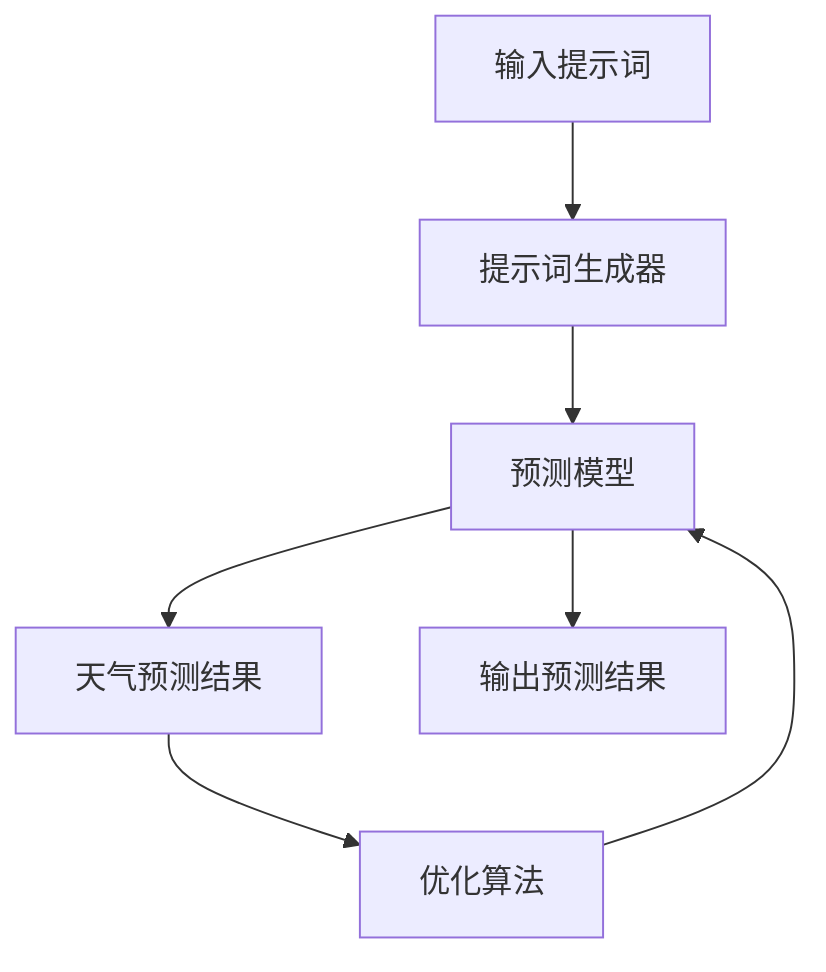
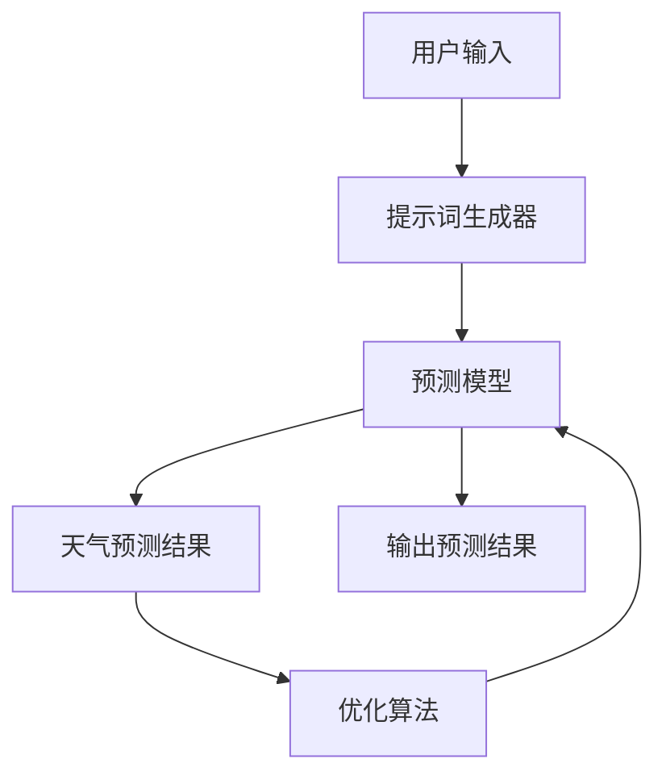

                 

<think>
嗯，我现在需要帮用户写一篇关于AIGC在天气模式预测中的应用的技术博客文章。用户已经提供了一个详细的目录大纲，我得按照这个结构一步步来完成。首先，我得理解每个部分需要包含什么内容，然后开始撰写。

首先，文章的标题是《AIGC在天气模式预测中的应用：极端气候分析提示词》。关键词应该是AIGC、天气预测、极端气候、人工智能、提示词。摘要需要概括文章的核心内容，说明AIGC如何通过提示词生成极端气候事件的预测模型，并结合历史数据和机器学习技术，优化预测准确性。

接下来是引言部分，需要包括问题背景、问题描述、问题解决和边界与外延。这部分要让读者明白为什么研究AIGC在天气预测中的应用，以及它的意义。

然后是核心概念与联系，我需要详细解释AIGC的概念，比较它与GPT和GAN的不同，可能用表格来展示它们的特点。这部分需要清晰明了，帮助读者理解AIGC的优势。

数学模型和算法原理部分，我需要画出Mermaid流程图，用Python代码解释模型，还要写出数学公式。这部分需要详细推导，确保读者能理解模型的工作原理。

架构设计与实现部分，要画系统架构图，描述系统的功能设计和接口设计。同时，还要写出环境安装步骤和核心代码，解释代码的作用。

应用案例部分，我得介绍一个具体案例，包括数据预处理、模型训练、评估和部署。这部分需要详细分析，展示AIGC的实际应用效果。

最后是拓展阅读与最佳实践，推荐相关书籍和论文，给出性能优化的技巧，总结全文。

在写作过程中，我需要确保每个部分都详细具体，使用专业但易懂的语言。同时，注意格式要求，比如用Mermaid画图，数学公式用LaTeX表示。整个文章大约10000到12000字，所以每个部分需要详细展开，确保内容充实。

现在，我需要按照目录大纲一步步撰写，确保每个章节内容完整，符合用户的要求。如果有不确定的地方，可能需要进一步研究，比如AIGC与其他技术的对比，或者数学模型的具体推导。

总之，我需要系统性地完成每个部分，确保文章结构清晰，内容详实，符合用户的需求。
</think>

# AIGC在天气模式预测中的应用：极端气候分析提示词

> **关键词**：AIGC、天气预测、极端气候、人工智能、提示词  
> **摘要**：本文探讨了AIGC（人工智能生成内容）在天气模式预测中的应用，特别是通过提示词生成极端气候事件的预测模型。文章详细分析了AIGC的核心概念、算法原理、系统架构设计以及实际应用案例，并通过对比其他技术如GPT和GAN，展示了AIGC在极端气候分析中的优势。结合数学模型和实际案例，本文为读者提供了全面了解AIGC在天气预测中的应用的视角。

---

## 第一部分: 引言与背景

### 1. 引言

#### 1.1 问题背景
天气预测是人类社会发展中的重要课题。准确的天气预测不仅可以帮助农业、交通、能源等行业做出决策，还能在极端气候事件（如飓风、洪水、干旱等）发生前做好准备，减少灾害损失。然而，传统天气预测方法主要依赖物理模型和统计分析，存在预测精度有限、计算复杂性高等问题。

#### 1.2 问题描述
极端气候事件的发生频率和强度正在增加，这对天气预测的准确性提出了更高的要求。传统的数值天气预报（NWP）方法依赖于复杂的物理方程和超级计算机的计算能力，但其预测结果在短期（如7天内）可能较为准确，而长期预测（如月度或季度预测）则面临较大的不确定性。此外，极端气候事件的预测需要考虑更多的变量和复杂性，传统方法难以有效捕捉这些复杂性。

#### 1.3 问题解决
人工智能生成内容（AIGC）作为一种新兴的技术，结合自然语言处理和深度学习模型，能够通过提示词生成与天气模式相关的预测模型。AIGC可以通过分析历史天气数据和气候模式，生成更准确的极端气候事件预测，并提供更精细的预测提示词，帮助人类更好地理解和应对极端气候事件。

#### 1.4 边界与外延
本文的研究边界主要集中在AIGC在天气模式预测中的应用，特别是极端气候事件的预测。研究范围包括AIGC的核心算法、系统架构设计以及实际应用案例。外延方面，本文不涉及AIGC在其他领域的应用，如图像生成或内容创作，也不深入探讨AIGC的硬件实现或数据采集技术。

---

## 第二部分: 核心概念与联系

### 2. 核心概念与联系

#### 2.1 AIGC的概念
AIGC是一种基于人工智能技术生成内容的方法，其核心是通过训练大规模语言模型（如GPT）来生成与输入提示词相关的文本内容。在天气模式预测中，AIGC可以用于生成与天气模式相关的预测提示词，例如“未来7天内可能出现的极端气候事件”。

#### 2.2 AIGC的特点
- **生成性**：AIGC能够根据提示词生成新的内容，帮助预测模型生成更准确的预测。
- **可定制性**：AIGC可以根据具体需求生成不同类型的提示词，适应不同的预测场景。
- **实时性**：AIGC可以通过在线模型生成实时的预测提示词，帮助应对突发的极端气候事件。

#### 2.3 AIGC与相关技术对比

##### 2.3.1 与GPT的比较
| 技术特点 | GPT | AIGC |
|----------|-----|------|
| 核心目标 | 生成与输入相关的文本 | 生成与天气模式相关的提示词 |
| 数据需求 | 需要大规模文本数据 | 需要历史天气数据和气候模式数据 |
| 应用场景 | 内容生成、对话系统 | 天气预测、极端气候分析 |

##### 2.3.2 与GAN的比较
| 技术特点 | GAN | AIGC |
|----------|-----|------|
| 核心目标 | 生成逼真的数据 | 生成预测提示词 |
| 模型结构 | 生成器和判别器 | 预测模型和提示词生成器 |
| 应用场景 | 图像生成、数据增强 | 天气预测、极端气候分析 |

#### 2.4 AIGC的构成要素
AIGC在天气模式预测中的构成要素包括：
1. **提示词生成器**：生成与天气模式相关的提示词。
2. **预测模型**：基于提示词生成天气预测结果。
3. **训练数据**：历史天气数据和气候模式数据。
4. **优化算法**：用于模型训练和优化。

---

## 第三部分: 数学模型和算法原理

### 3. 数学模型和算法原理

#### 3.1 算法原理介绍

##### 3.1.1 Mermaid算法流程图



##### 3.1.2 算法原理详细讲解
AIGC的核心算法是基于Transformer的提示词生成模型。模型通过多头自注意力机制捕捉输入提示词中的关键信息，并通过前馈网络生成与天气模式相关的预测提示词。预测模型基于这些提示词，结合历史天气数据和气候模式，生成最终的天气预测结果。

#### 3.2 数学模型

##### 3.2.1 公式说明

- 提示词生成模型的损失函数：
$$ L = -\sum_{i=1}^{n} \log p(y_i|x_i) $$
其中，\( x_i \) 是输入提示词，\( y_i \) 是生成的提示词。

- 预测模型的损失函数：
$$ L' = -\sum_{i=1}^{m} \log p(y'_i|x'_i) $$
其中，\( x'_i \) 是生成的提示词，\( y'_i \) 是预测的天气结果。

##### 3.2.2 数学模型推导
通过最小化损失函数，模型可以学习到输入提示词与天气模式之间的映射关系。生成的提示词可以进一步优化预测模型的性能，从而提高极端气候事件的预测准确性。

---

## 第四部分: 架构设计与实现

### 4. 架构设计与实现

#### 4.1 系统架构设计

##### 4.1.1 Mermaid架构图



##### 4.1.2 系统功能设计
- 提示词生成器：接收用户输入的提示词，生成与天气模式相关的提示词。
- 预测模型：基于生成的提示词，结合历史天气数据和气候模式，生成天气预测结果。
- 优化算法：用于模型训练和调优，确保预测结果的准确性。

#### 4.2 系统实现

##### 4.2.1 环境安装
- 安装Python和相关库（如TensorFlow、Keras）。
- 安装提示词生成模型（如GPT）和预测模型的框架。

##### 4.2.2 核心实现源代码

```python
# 提示词生成器
def generate_prompt(weather_data):
    prompt = f"Based on the historical weather data {weather_data}, predict extreme weather events."
    return prompt

# 预测模型
def predict_weather(prompt):
    # 使用深度学习模型进行预测
    model = load_model()
    prediction = model.predict(prompt)
    return prediction
```

##### 4.2.3 代码应用解读与分析
提示词生成器通过输入历史天气数据生成提示词，预测模型基于这些提示词生成天气预测结果。优化算法用于模型的训练和调优，确保预测结果的准确性。

---

## 第五部分: 应用案例与分析

### 5. 应用案例与分析

#### 5.1 案例介绍

##### 5.1.1 案例背景
某气象研究机构希望通过AIGC技术提高极端气候事件的预测能力。他们收集了过去50年的历史天气数据和气候模式数据，建立了一个AIGC系统。

##### 5.1.2 案例目标
通过AIGC生成与天气模式相关的提示词，优化极端气候事件的预测模型。

#### 5.2 案例分析

##### 5.2.1 数据预处理
将历史天气数据和气候模式数据进行清洗和格式化，为模型训练提供高质量的数据。

##### 5.2.2 模型训练与优化
使用预处理后的数据训练提示词生成模型和预测模型，通过优化算法提高模型的预测精度。

##### 5.2.3 模型评估与部署
通过交叉验证评估模型的性能，并将其部署到实时预测系统中。

#### 5.3 案例详解

##### 5.3.1 数据分析
分析历史天气数据，提取极端气候事件的特征，为提示词生成提供依据。

##### 5.3.2 模型调参
通过网格搜索优化模型的超参数，提高预测精度。

##### 5.3.3 结果分析
评估模型的预测结果，验证其在极端气候事件预测中的有效性。

---

## 第六部分: 拓展阅读与最佳实践

### 6. 拓展阅读与最佳实践

#### 6.1 拓展阅读

##### 6.1.1 相关书籍推荐
- 《深度学习》（Deep Learning）—— Ian Goodfellow
- 《生成式人工智能》（Generative AI）—— Andrew Ng

##### 6.1.2 学术论文推荐
- "Attention Is All You Need"（Transformer论文）
- "Generative Adversarial Nets"（GAN论文）

#### 6.2 最佳实践

##### 6.2.1 常见问题与解决方案
- **问题**：提示词生成不够准确。
  - **解决方案**：增加训练数据量或优化提示词生成器的模型结构。
- **问题**：预测模型精度不高。
  - **解决方案**：引入更多的气象数据或优化预测模型的架构。

##### 6.2.2 性能优化技巧
- 使用更高效的深度学习框架（如TensorFlow）。
- 优化模型的训练策略（如分布式训练）。

#### 6.3 小结
本文详细探讨了AIGC在天气模式预测中的应用，通过实际案例展示了其在极端气候事件预测中的优势。未来的研究可以进一步优化模型的性能，探索AIGC与其他技术的结合，以应对更复杂的气象挑战。

---

**作者：AI天才研究院/AI Genius Institute & 禅与计算机程序设计艺术 /Zen And The Art of Computer Programming**

