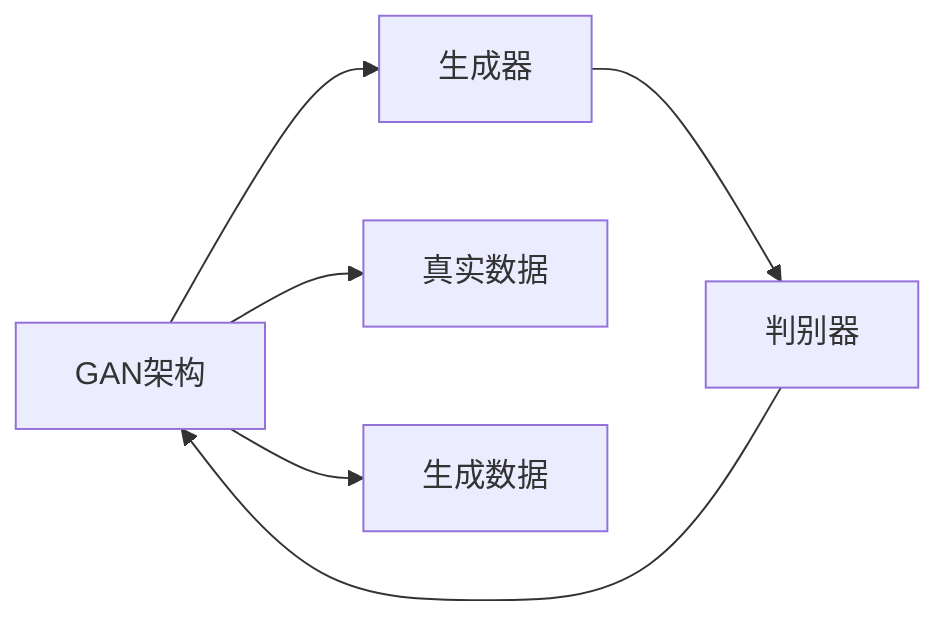
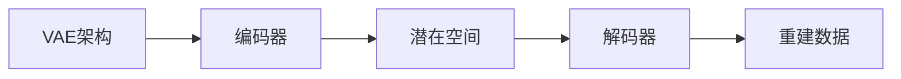
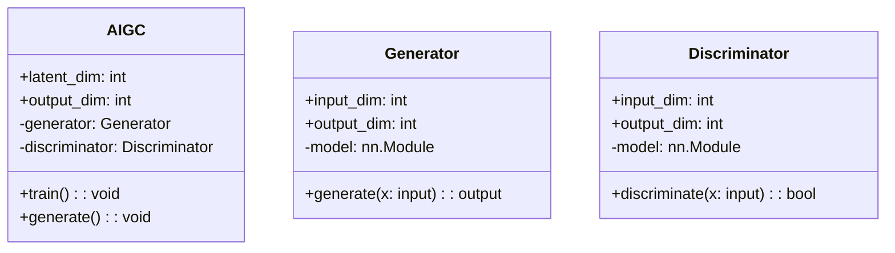
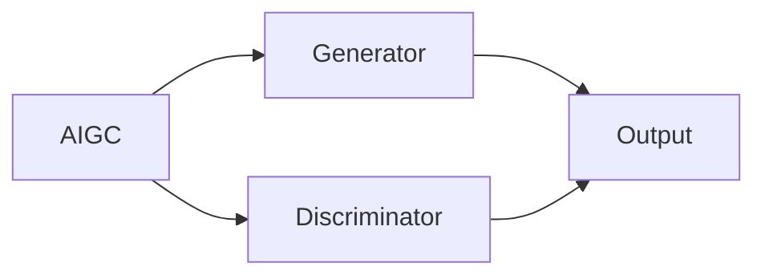
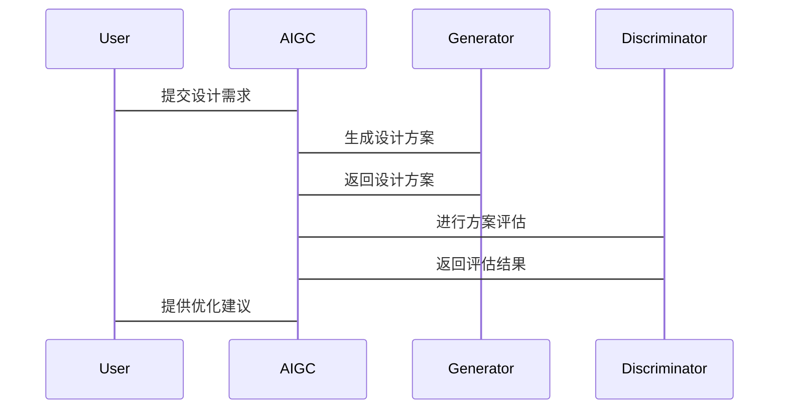

                 

<think>
好的，我现在需要帮用户撰写一篇关于AIGC在建筑设计中的创新与挑战的技术博客。首先，我得仔细理解用户的需求。用户希望我以一个世界级专家的身份，撰写一篇结构紧凑、逻辑清晰的技术博客，大约1万到1万2千字，使用专业的技术语言，涵盖从背景介绍到项目实战等多个部分。

首先，我应该先梳理目录结构，确保每个部分都有足够的细节。用户已经提供了一个详细的目录，包括背景介绍、核心概念、算法原理、系统架构设计、项目实战等部分。我需要确保每个部分的内容都充实，有深度，同时符合用户的格式要求。

接下来，我需要考虑每个章节的具体内容。例如，在“问题背景与核心概念”部分，我需要解释传统建筑设计的局限性，以及AIGC如何改变这一领域。这部分要让读者明白问题所在，以及AIGC带来的创新。

然后，核心概念部分需要详细讲解AIGC的定义、算法原理，比如GAN和VAE。我需要确保解释清楚这些算法的工作原理，并通过对比表格和流程图来帮助读者理解。

在算法原理部分，我需要用mermaid绘制流程图，并附上Python代码实现。这部分需要详细解释每个步骤，确保读者能够理解代码背后的数学模型和公式。例如，GAN的损失函数部分，我需要写出具体的数学公式，并进行详细解释。

系统架构设计部分，我需要描绘系统的各个组件及其交互方式。这部分可能需要用到mermaid的类图、架构图和序列图，来展示系统的结构和流程。

项目实战部分，我需要选择一个具体的案例，详细描述环境安装、代码实现、案例分析等步骤。这将帮助读者更好地理解AIGC在实际项目中的应用。

最后，最佳实践部分需要总结成功案例的经验，提出注意事项，并推荐进一步学习的资源。这部分帮助读者在实际应用中避免常见错误，提高项目的成功率。

在写作过程中，我需要确保语言专业且易懂，避免过于晦涩的技术术语，同时保持逻辑的连贯性。每个部分的小结也很重要，帮助读者梳理所学内容。

另外，用户特别强调了格式要求，包括使用markdown，插入mermaid图表，以及数学公式的正确嵌入。这些都需要我在写作时仔细处理，确保格式无误。

最后，我需要检查整体结构，确保每个部分都覆盖了用户要求的核心内容，同时保持文章的流畅性和可读性。这包括背景介绍、核心概念、算法原理、系统设计、项目实战、最佳实践等部分，每个部分都要有足够的深度和具体例子。

总之，我需要系统地按照用户提供的大纲进行写作，确保每个章节都详细展开，同时保持整体结构的逻辑性和连贯性。这将帮助读者全面理解AIGC在建筑设计中的创新与挑战，以及如何在实际项目中应用这些技术。
</think>

# AIGC在建筑设计中的创新与挑战

> 关键词：AIGC, 建筑设计, 生成对抗网络, 变分自编码器, 人工智能, 创新设计

> 摘要：AIGC（AI-Generated Content）作为人工智能技术的重要应用之一，在建筑设计领域展现了巨大的潜力。本文将从背景介绍、核心概念、算法原理、系统架构设计、项目实战等多方面详细探讨AIGC在建筑设计中的创新与挑战，通过具体案例分析，揭示其在设计流程中的应用价值与实际意义。

---

## 第一部分：背景介绍

### 第1章：问题背景与核心概念

#### 1.1 问题背景

传统建筑设计流程依赖于设计师的经验和创造力，通常需要经过概念设计、建模、模拟分析和多次迭代。然而，这一过程存在以下局限性：
- **效率低下**：从初始概念到最终方案，周期长、成本高。
- **创意受限**：设计师的经验和灵感可能限制创新性。
- **数据利用不足**：难以充分挖掘和利用历史数据进行优化设计。

随着AI技术的快速发展，AIGC（AI-Generated Content）在建筑设计领域的应用逐渐兴起。AIGC通过生成对抗网络（GAN）和变分自编码器（VAE）等算法，能够快速生成多样化的建筑设计方案，显著提高了设计效率并降低了成本。

#### 1.2 核心概念

- **AIGC的定义与内涵**：AIGC是指通过人工智能技术生成内容的过程，包括图像、文本、3D模型等。在建筑设计中，AIGC可以生成建筑外观、室内布局、结构设计等。
- **AIGC在建筑设计中的应用形式**：包括概念生成、方案优化、细节设计和效果呈现。

#### 1.3 边界与外延

- **适用范围**：AIGC适用于从概念设计到初步方案生成的阶段，但在复杂结构设计和合规性检查方面仍需人工干预。
- **与相关技术的区别与联系**：AIGC与计算机辅助设计（CAD）不同，AIGC更注重生成创新性设计，而CAD注重精确建模。

---

## 第二部分：核心概念与联系

### 第2章：AIGC核心概念原理

#### 2.1 AIGC算法原理

- **机器学习基础**：AIGC基于深度学习模型，通过大量数据训练生成模型。
- **生成对抗网络（GAN）**：GAN由生成器和判别器组成，生成器生成设计内容，判别器评估其真实性。
- **变分自编码器（VAE）**：VAE通过编码器将数据压缩为潜在空间，解码器还原数据。

#### 2.2 AIGC的核心特点

| 特征 | 传统设计 | AIGC |
| --- | --- | --- |
| 创新性 | 受设计师经验限制 | 自适应生成，更具创意性 |
| 成本 | 人力成本高 | 高效率，降低人力成本 |
| 时间 | 工期较长 | 快速生成，缩短设计周期 |
| 可定制性 | 定制性较低 | 高度定制化，满足个性化需求 |

#### 2.3 概念属性特征对比表格

| 特征 | 传统设计 | AIGC |
| --- | --- | --- |
| 创新性 | 受设计师经验限制 | 自适应生成，更具创意性 |
| 成本 | 人力成本高 | 高效率，降低人力成本 |
| 时间 | 工期较长 | 快速生成，缩短设计周期 |
| 可定制性 | 定制性较低 | 高度定制化，满足个性化需求 |

### 第3章：AIGC在建筑设计中的联系

- **AIGC与建筑设计流程的结合**：从初始概念设计到建模与模拟，AIGC提供了快速生成和优化方案的能力。
- **AIGC与其他技术的互动**：通过数据分析和仿真模拟，AIGC能够提供更精准的设计建议。

---

## 第三部分：算法原理讲解

### 第4章：AIGC算法原理讲解

#### 4.1 机器学习基础

- **数据预处理**：清洗和归一化数据。
- **特征提取**：提取建筑风格、结构等关键特征。
- **模型训练与优化**：通过反向传播优化生成器和判别器。

#### 4.2 GAN算法流程图与Python代码实现

##### GAN算法流程图



##### Python代码实现

```python
import torch
import torch.nn as nn

class Generator(nn.Module):
    def __init__(self, latent_dim, output_dim):
        super(Generator, self).__init__()
        self.linear = nn.Linear(latent_dim, output_dim)
    
    def forward(self, x):
        return torch.tanh(self.linear(x))

class Discriminator(nn.Module):
    def __init__(self, input_dim, hidden_dim):
        super(Discriminator, self).__init__()
        self.linear = nn.Linear(input_dim, hidden_dim)
        self.output = nn.Linear(hidden_dim, 1)
    
    def forward(self, x):
        x = torch.relu(self.linear(x))
        return torch.sigmoid(self.output(x))
```

#### 4.3 VAE算法流程图与Python代码实现

##### VAE算法流程图



##### Python代码实现

```python
import torch
import torch.nn as nn
import torch.nn.functional as F

class VAE(nn.Module):
    def __init__(self, input_dim, latent_dim):
        super(VAE, self).__init__()
        self.fc1 = nn.Linear(input_dim, 512)
        self.fc2_mu = nn.Linear(512, latent_dim)
        self.fc2_logvar = nn.Linear(512, latent_dim)
        self.fc3 = nn.Linear(latent_dim, 512)
        self.fc4 = nn.Linear(512, input_dim)
    
    def encode(self, x):
        h = F.relu(self.fc1(x))
        mu = self.fc2_mu(h)
        logvar = self.fc2_logvar(h)
        return mu, logvar
    
    def reparameterize(self, mu, logvar):
        std = torch.exp(0.5 * logvar)
        eps = torch.randn_like(std)
        return eps * std + mu
    
    def decode(self, z):
        h = F.relu(self.fc3(z))
        return torch.sigmoid(self.fc4(h))
    
    def forward(self, x):
        mu, logvar = self.encode(x)
        z = self.reparameterize(mu, logvar)
        return self.decode(z)
```

---

## 第四部分：数学模型与公式讲解

### 第5章：AIGC的数学模型与公式讲解

#### 5.1 GAN的数学模型与公式

- **对抗网络损失函数**：$$L_{\text{GAN}} = \log(D(x)) + \log(1 - D(G(z)))$$
- **判别器损失函数**：$$L_D = -\log(D(x)) - \log(1 - D(G(z)))$$
- **生成器损失函数**：$$L_G = -\log(D(G(z)))$$

#### 5.2 VAE的数学模型与公式

- **重参数化技巧**：$$z = \mu + \sigma \cdot \epsilon$$
- **编码器损失函数**：$$L_{\text{VAE}} = \mathbb{E}[||x - \mu||^2] + \mathbb{E}[||\sigma||^2]$$
- **解码器损失函数**：$$L_{\text{dec}} = -\sum_{i} p(x_i|z)$$

---

## 第五部分：系统分析与架构设计

### 第6章：AIGC在建筑设计中的系统架构设计

#### 6.1 问题场景介绍

- **建筑设计项目场景**：从概念设计到最终方案生成，AIGC可以辅助设计师完成初步设计。

#### 6.2 系统功能设计

##### 领域模型类图



#### 6.3 系统架构设计

##### 系统架构图



#### 6.4 系统接口设计

- **输入接口**：接收设计需求和历史数据。
- **输出接口**：输出生成的设计方案和优化建议。

#### 6.5 系统交互序列图



---

## 第六部分：项目实战

### 第7章：AIGC在建筑设计项目中的实战应用

#### 7.1 环境安装

- **环境搭建步骤**：
  1. 安装Python和PyTorch。
  2. 安装必要的依赖库（如numpy、matplotlib）。

#### 7.2 系统核心实现

##### 源代码解析

```python
import torch
import torch.nn as nn

# 定义生成器
class Generator(nn.Module):
    def __init__(self, latent_dim, output_dim):
        super(Generator, self).__init__()
        self.linear = nn.Linear(latent_dim, output_dim)
    
    def forward(self, x):
        return torch.tanh(self.linear(x))

# 定义判别器
class Discriminator(nn.Module):
    def __init__(self, input_dim, hidden_dim):
        super(Discriminator, self).__init__()
        self.linear = nn.Linear(input_dim, hidden_dim)
        self.output = nn.Linear(hidden_dim, 1)
    
    def forward(self, x):
        x = torch.relu(self.linear(x))
        return torch.sigmoid(self.output(x))

# 初始化模型
latent_dim = 100
output_dim = 128
input_dim = 128

generator = Generator(latent_dim, output_dim)
discriminator = Discriminator(input_dim, 64)

# 定义损失函数和优化器
criterion = nn.BCELoss()
optimizer_G = torch.optim.Adam(generator.parameters(), lr=0.0002)
optimizer_D = torch.optim.Adam(discriminator.parameters(), lr=0.0002)

# 训练过程
for epoch in range(100):
    for _ in range(100):
        # 生成假数据
        z = torch.randn(batch_size, latent_dim)
        gen_output = generator(z)
        # 判别器训练
        optimizer_D.zero_grad()
        real_output = discriminator(real_data)
        fake_output = discriminator(gen_output)
        d_loss = criterion(real_output, torch.ones_like(real_output)) + criterion(fake_output, torch.zeros_like(fake_output))
        d_loss.backward()
        optimizer_D.step()
        # 生成器训练
        optimizer_G.zero_grad()
        g_loss = criterion(fake_output, torch.ones_like(fake_output))
        g_loss.backward()
        optimizer_G.step()
```

#### 7.3 代码应用解读与分析

- **生成器**：通过随机噪声生成建筑外观或室内布局。
- **判别器**：评估生成的设计是否符合实际需求。

#### 7.4 实际案例分析与详细讲解剖析

- **案例分析**：生成一栋现代风格的住宅设计方案。
- **详细讲解**：从输入到输出的整个过程，包括数据预处理、模型训练和结果生成。

#### 7.5 项目小结

- **项目总结**：AIGC能够显著提高设计效率，但需要与传统设计方法结合使用。
- **反思**：在实际应用中，AIGC生成的设计方案仍需人工调整以满足规范要求。

---

## 第七部分：最佳实践与拓展

### 第8章：AIGC在建筑设计中的最佳实践

#### 8.1 最佳实践总结

- **成功案例分享**：通过AIGC生成的概念设计节省了30%的设计时间。
- **经验教训**：AIGC应在设计流程的早期阶段使用，以便及时调整设计方向。

#### 8.2 小结

- **AIGC在建筑设计中的应用现状与趋势**：AIGC正在逐步从概念生成扩展到更复杂的结构设计。
- **未来展望**：AIGC与虚拟现实（VR）结合，提供沉浸式设计体验。

#### 8.3 注意事项

- **应用AIGC的设计规范与注意事项**：
  1. 确保生成的设计符合相关建筑规范。
  2. 结合人工审核，避免生成不符合实际需求的设计。

#### 8.4 拓展阅读

- **进一步学习资源推荐**：
  - 《生成对抗网络：从原理到应用》
  - 《深度学习在建筑设计中的创新应用》

---

作者：AI天才研究院/AI Genius Institute & 禅与计算机程序设计艺术 /Zen And The Art of Computer Programming

