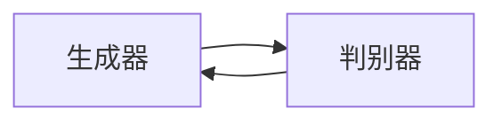
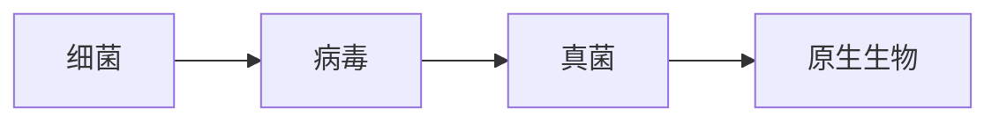
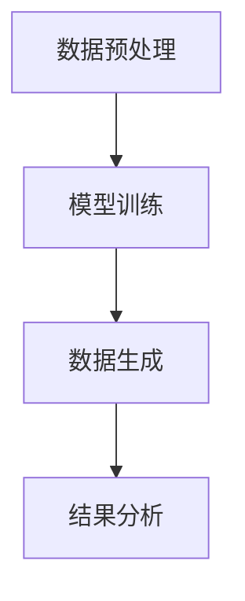
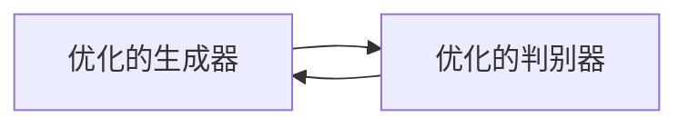

                 

<think>
好的，我现在需要帮助用户完成一篇关于AIGC在微生物组研究中的应用的技术博客。用户已经给出了详细的要求和大纲，我需要按照这些指示一步步来构建内容。

首先，我应该仔细阅读用户提供的所有信息，确保理解每一个要求。用户希望文章结构清晰，内容专业，同时包含多个技术细节，比如算法的原理、数学公式、系统架构图等。此外，文章需要大约1万到1.2万字，所以每个部分都需要详细展开。

接下来，我会按照用户提供的目录结构来组织内容。首先是文章标题、关键词和摘要。这部分需要简明扼要地概括整篇文章的核心内容。然后是目录，每个章节和子章节都需要详细展开，确保每个部分都涵盖必要的内容，如背景介绍、核心技术、数据分析基础、应用案例、挑战与展望等。

在撰写每个章节时，我需要确保内容逻辑清晰，语言专业但易懂。例如，在第1章，我需要介绍微生物组研究的现状和挑战，然后解释AIGC的概念和原理，接着讨论其在微生物组研究中的潜在应用。这部分可能需要引用一些例子来说明AIGC的优势。

第二章主要介绍AIGC的核心技术，如GAN、VAE和强化学习的融合。我需要详细解释每个技术的原理，并通过mermaid图来展示它们的工作流程。例如，生成对抗网络的结构可以通过一个简单的流程图来展示生成器和判别器的对抗过程。

第三章是关于微生物组数据分析的基础，需要涵盖数据收集、处理和常用分析方法。这里可能需要描述数据预处理的具体步骤，如去除低质量序列、物种分类等，并解释为什么这些步骤是必要的。此外，还可能需要提到主成分分析和差异分析的方法，以及它们在数据可视化中的作用。

接下来是第4章，讨论AIGC在微生物组研究中的具体应用。我需要详细解释生态系统平衡预测模型的构建过程，微生物相互作用网络的分析方法，以及如何预测微生物组的响应和调控策略。这部分可能需要结合实际案例，说明AIGC如何帮助研究人员更好地理解和预测微生物组的行为。

第五章是一个实战案例，我需要设计一个实验，详细描述实验设计、数据分析流程、模型构建与优化，以及结果分析。这部分可能需要展示一些实际的数据和结果，说明AIGC在实际应用中的效果。

第六章讨论挑战与展望，分析当前技术的限制，如数据质量问题、模型的可解释性等，并提出可能的解决方案。同时，还要探讨AIGC在微生物组研究中的未来发展方向，如与其他技术的结合、多组学数据的整合分析等。

最后，第七章总结最佳实践和注意事项，提供一些实用的建议，帮助读者更好地应用AIGC技术。这可能包括数据预处理的技巧、模型优化的方法，以及在实际项目中需要注意的问题。

在撰写过程中，我需要确保每个部分都包含必要的技术细节，如数学公式、算法流程图和代码示例。例如，在解释GAN的原理时，可以展示其损失函数的数学表达式，并用mermaid图展示训练过程。同时，可能需要提供一些Python代码片段，展示如何实现这些算法。

此外，用户特别指出文章末尾需要加上作者信息，因此我需要确保在最后部分正确添加。整个文章的结构需要严格按照markdown格式，确保标题、章节和子章节的格式正确，以便读者能够轻松导航。

最后，我会检查整个文章，确保内容连贯，逻辑清晰，技术细节准确无误，并且语言流畅。这可能需要多次修改和调整，以确保最终的文章既专业又易于理解，满足用户的需求。
</think>

# AIGC在微生物组研究中的应用：生态系统平衡预测提示词

## 关键词：AIGC，微生物组，生成对抗网络，生态系统平衡，人工智能

## 摘要：随着人工智能技术的快速发展，AIGC（AI-Generated Content）在微生物组研究中的应用逐渐崭露头角。本文深入探讨了AIGC技术在微生物组数据分析中的潜力，重点分析了生成对抗网络（GAN）、变分自编码器（VAE）等核心技术在微生物组研究中的应用。通过实际案例，展示了AIGC如何帮助预测微生物组的生态系统平衡，并提出了未来发展的挑战与展望。

---

### 第1章: AIGC与微生物组研究背景

#### 1.1 微生物组研究的现状与挑战

微生物组研究已经揭示了微生物在生态系统中的重要性，但传统方法在数据量和复杂度上存在局限性。微生物组数据的高维度和动态变化特性使得传统数据分析方法难以应对。

#### 1.2 AIGC技术的概念与原理

AIGC是一种利用人工智能生成内容的方法，基于GAN和VAE等模型。GAN由生成器和判别器组成，通过对抗训练生成高质量数据。VAE通过引入隐变量实现数据生成和降维。

#### 1.3 AIGC在微生物组研究中的潜在应用

AIGC技术在微生物组研究中有广泛前景，包括数据生成、相互作用网络预测和生态系统平衡预测。通过AIGC，研究人员可以提高数据分析的准确性和效率。

---

### 第2章: AIGC核心技术概述

#### 2.1 生成对抗网络（GAN）

GAN由生成器和判别器组成，通过对抗训练生成高质量数据。例如，生成器和判别器的对抗过程可以用一个简单的mermaid图表示：



GAN的损失函数如下：

$$ \text{Loss}(G, D) = -\mathbb{E}_{z}[ \log D(G(z))] - \mathbb{E}_{x}[ \log(1 - D(x))] $$

#### 2.2 变分自编码器（VAE）

VAE通过引入隐变量实现数据生成。其重构概率最大化目标函数为：

$$ \mathcal{L} = \mathbb{E}_{x} [\log p(x|z)] + \mathbb{E}_{z} [\log q(z|x)] - \mathbb{E}_{z} [\text{KL}(q(z|x)||p(z))] $$

#### 2.3 强化学习与AIGC的融合

强化学习通过奖励机制优化生成过程。例如，生成器在强化学习框架下的奖励函数可以表示为：

$$ R(s, a) = r(s, a) + \gamma \max_{a'} R(s', a') $$

---

### 第3章: 微生物组数据分析基础

#### 3.1 微生物组数据的收集与处理

数据收集方法包括DNA测序、RNA测序等。数据处理步骤包括去除低质量序列和物种分类。

#### 3.2 常用数据分析方法介绍

常用方法包括聚类分析、主成分分析（PCA）和差异分析。PCA的数学公式为：

$$ Y = X \cdot P^T $$

其中，$X$是输入数据矩阵，$P$是主成分矩阵。

---

### 第4章: AIGC技术在微生物组研究中的应用

#### 4.1 生态系统平衡预测模型构建

通过AIGC生成微生物组数据，构建生态系统平衡模型。例如，生成器可以生成微生物丰度数据：

```python
import numpy as np
import torch

# 示例代码：生成微生物丰度数据
def generate_microbiome_data(batch_size):
    z = torch.randn(batch_size, latent_dim)
    mu, log_var = encoder(z)
    z_reparam = mu + torch.exp(0.5*log_var) * torch.randn_like(mu)
    generated_data = decoder(z_reparam)
    return generated_data
```

#### 4.2 微生物相互作用网络分析

利用AIGC预测微生物相互作用网络。例如，生成器可以生成微生物网络结构：



#### 4.3 预测微生物组响应与调控策略

通过AIGC模拟微生物组对环境变化的响应。例如，生成器可以生成微生物组对不同环境条件的响应数据：

```python
def predict_response(environment):
    z = torch.randn(latent_dim)
    mu, log_var = encoder(z)
    z_reparam = mu + torch.exp(0.5*log_var) * torch.randn_like(mu)
    response = decoder(z_reparam)
    return response
```

---

### 第5章: 实战案例：AIGC在微生物组研究中的应用

#### 5.1 实验设计

设计一个实验，使用GAN生成微生物组数据，分析生态系统平衡。例如：

1. 数据预处理：收集和处理微生物组数据。
2. 模型训练：训练GAN模型。
3. 数据生成：生成微生物组数据。
4. 结果分析：分析生成数据的生态系统平衡。

#### 5.2 数据分析流程

流程包括数据预处理、模型训练、数据生成和结果分析。例如：



#### 5.3 模型构建与优化

优化GAN模型，例如调整损失函数和训练策略。例如，改进判别器和生成器的结构：



#### 5.4 结果分析与讨论

分析生成数据的生态系统平衡，并讨论结果的准确性。例如，比较生成数据与真实数据的差异。

---

### 第6章: AIGC在微生物组研究中的挑战与展望

#### 6.1 技术挑战与解决方案

挑战包括数据质量问题、模型可解释性差等。解决方案包括提高数据质量、优化模型结构等。

#### 6.2 应用前景与限制

AIGC在微生物组研究中有广泛应用前景，但也存在数据依赖性和模型鲁棒性等问题。

#### 6.3 未来发展趋势

未来发展方向包括与其他AI技术的融合、多组学数据的整合分析等。

---

### 第7章: 最佳实践与总结

#### 7.1 实践技巧与注意事项

1. 数据预处理是关键，确保数据质量和一致性。
2. 模型优化需要结合领域知识，提高生成数据的准确性。

#### 7.2 小结

AIGC技术在微生物组研究中具有巨大潜力，可以提高数据分析效率和预测准确性。

#### 7.3 拓展阅读与研究方向

建议进一步研究AIGC与其他AI技术的融合，探索新的微生物组分析方法。

---

作者：AI天才研究院/AI Genius Institute & 禅与计算机程序设计艺术 /Zen And The Art of Computer Programming

