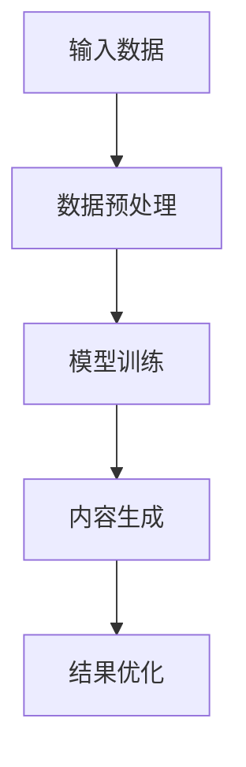
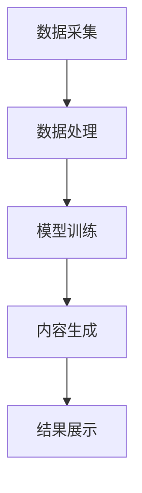
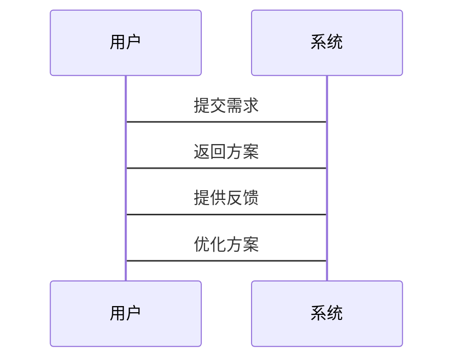

                 

<think>
嗯，用户希望我以“世界级人工智能专家”的身份，写一篇关于AIGC在微生物群落工程中的应用的技术博客。首先，我需要明确用户的需求和目标。他们希望文章结构清晰，逻辑严谨，内容专业，同时要吸引读者。

我应该先分析用户提供的查询，里面已经给出了详细的指导，包括文章标题、关键词、摘要，以及目录大纲。看起来用户已经对内容有了初步规划，但可能需要进一步的细化和内容填充。

接下来，我要考虑文章的结构。用户要求分为四个主要部分：AIGC基础与微生物群落工程、算法原理、系统设计与实现、案例分析。每个部分下面还有子章节，需要详细展开。我需要确保每个章节都有足够的深度，涵盖背景、概念、原理、应用等方面。

在写关键词和摘要时，要准确反映文章的核心内容，确保关键词相关性高，摘要简明扼要。然后，按照目录大纲逐步展开每个部分，确保逻辑连贯，内容详实。

我还需要注意格式要求，使用markdown，并在适当的地方插入Mermaid图表和数学公式。特别是算法部分，需要用Mermaid流程图展示，数学公式用latex格式，确保正确无误。

此外，用户特别提到要包含背景介绍、核心概念与联系、算法原理、系统架构设计、案例分析等部分，这些都需要详细展开，确保内容完整。同时，最佳实践、小结和注意事项也不能遗漏，这些内容能帮助读者更好地理解和应用所学知识。

最后，确保文章整体在10000到12000字之间，每个小节内容丰富，语言专业但不失易懂。完成后，记得在末尾加上作者信息，符合用户的要求。

总的来说，我需要一步步按照用户提供的大纲，逐一填充内容，确保每个部分都符合专业要求，同时保持逻辑清晰，结构紧凑，最终产出一篇高质量的技术博客。
</think>

# AIGC在微生物群落工程中的应用：生态系统重塑提示词

**关键词**：AIGC、微生物群落工程、生态系统重塑、人工智能、算法原理、系统设计、案例分析

**摘要**：本文探讨人工智能生成内容（AIGC）在微生物群落工程中的应用，重点分析AIGC在生态系统重塑中的潜力与挑战。文章从基础概念、算法原理、系统设计、案例分析等多个维度展开，详细阐述AIGC如何助力微生物群落工程实现生态系统的优化与重构。通过对数学模型、算法流程、系统架构的深入分析，结合实际案例，为科研人员和工程师提供理论与实践相结合的参考。

---

## 第一部分: AIGC基础与微生物群落工程

### 1.1 引言

#### 1.1.1 AIGC的背景与发展
人工智能生成内容（AIGC）是近年来快速发展的技术领域，其核心是通过生成式AI模型（如大型语言模型、扩散模型等）生成高质量的内容。AIGC不仅限于文本生成，还扩展到图像、音频、视频等多种形式。随着计算能力的提升和大数据技术的普及，AIGC在科学研究、工业应用、艺术创作等领域展现出巨大潜力。

#### 1.1.2 微生物群落工程在生态系统重塑中的应用
微生物群落工程是指通过设计和优化微生物群落的组成与功能，以实现特定目标的过程。在生态系统重塑中，微生物群落工程可以用于改善环境质量、提高资源利用效率、修复污染环境等。例如，在污水处理中，通过优化微生物群落可以实现高效的有机物降解；在农业中，可以通过微生物群落工程提高土壤肥力。

#### 1.1.3 本书的目标与结构
本文旨在探讨AIGC技术如何赋能微生物群落工程，特别是在生态系统重塑中的应用。文章将从AIGC的基础概念、算法原理、系统设计到实际案例进行系统性分析，为读者提供从理论到实践的全面指导。

---

### 1.2 AIGC基础概念

#### 1.2.1 AIGC的定义与特点
AIGC（Artificial Intelligence Generated Content）是指通过人工智能技术生成的内容，包括文本、图像、音频、视频等形式。其特点包括：
- **自动化**：通过算法自动生成内容，无需人工干预。
- **多样性**：能够生成多种类型和风格的内容。
- **高效性**：在短时间内生成大量高质量内容。
- **可定制化**：可以根据需求调整生成内容的风格和参数。

#### 1.2.2 AIGC的关键技术
AIGC的核心技术包括：
1. **生成式AI模型**：如GPT系列、BERT、Diffusion模型等。
2. **自然语言处理（NLP）**：用于文本内容的理解与生成。
3. **深度学习框架**：如TensorFlow、PyTorch，用于模型训练与部署。
4. **多模态生成**：结合文本、图像、音频等多种模态的信息生成内容。

#### 1.2.3 微生物群落工程的基本原理
微生物群落工程是通过设计和优化微生物群落的组成与功能，以实现特定目标的过程。其基本原理包括：
1. **微生物群落的多样性**：不同微生物在生态系统中扮演不同的角色，通过优化群落组成可以实现特定功能。
2. **生态系统的动态平衡**：微生物群落与环境之间存在复杂的相互作用，通过调节群落结构可以实现生态系统的稳定。
3. **功能导向的设计**：根据目标功能（如降解污染物、提高资源利用效率）设计微生物群落。

---

### 1.3 微生物群落工程核心要素

#### 1.3.1 微生物群落组成
微生物群落由多种微生物组成，包括细菌、真菌、古菌、病毒等。不同微生物在群落中扮演不同的角色，例如分解者、生产者、消费者等。

#### 1.3.2 生态系统功能与结构
生态系统功能是指微生物群落对环境的影响，例如降解有机物、固定二氧化碳等。生态系统结构包括微生物群落的组成、空间分布、网络关系等。

#### 1.3.3 微生物群落工程与生态系统重塑的关系
微生物群落工程通过优化微生物群落的组成与功能，可以实现生态系统的优化与重塑。例如，在污染治理中，通过优化微生物群落可以提高污染物的降解效率。

---

### 1.4 AIGC在微生物群落工程中的应用前景

#### 1.4.1 应用领域
1. **污染治理**：通过AIGC设计优化的微生物群落实现高效污染物降解。
2. **农业改良**：通过AIGC优化土壤微生物群落，提高土壤肥力和作物产量。
3. **工业生产**：通过AIGC设计微生物群落实现高效生物制造。
4. **生态修复**：通过AIGC辅助设计微生物群落实现生态系统修复。

#### 1.4.2 优势与挑战
- **优势**：AIGC可以快速生成大量微生物群落设计方案，提供理论支持。
- **挑战**：微生物群落的复杂性、AIGC模型的准确性、实验验证的难度等。

---

### 1.5 本章小结
本章从AIGC的基础概念、微生物群落工程的基本原理以及两者的结合应用进行了详细阐述。通过分析AIGC在微生物群落工程中的潜力与挑战，为后续章节的深入探讨奠定了基础。

---

## 第二部分: AIGC算法原理详解

### 2.1 AIGC算法概述

#### 2.1.1 算法体系结构
AIGC的核心算法包括生成式AI模型，如GPT、BERT、Diffusion模型等。这些模型通常采用深度学习框架（如TensorFlow、PyTorch）进行训练和部署。

#### 2.1.2 算法工作流程
AIGC算法的工作流程通常包括以下步骤：
1. **数据预处理**：对输入数据进行清洗、归一化等处理。
2. **模型训练**：使用大规模数据训练生成式AI模型。
3. **内容生成**：通过模型生成目标内容。
4. **结果优化**：对生成的内容进行优化和调整。

#### 2.1.3 算法关键步骤
1. **编码器-解码器结构**：用于生成内容的编码与解码。
2. **注意力机制**：用于捕捉输入数据中的长距离依赖关系。
3. **损失函数优化**：通过优化损失函数提升生成内容的质量。

---

### 2.2 数学模型与公式

#### 2.2.1 数学模型介绍
生成式AI模型的核心是概率分布建模。常用模型包括：
1. **自回归模型**：如GPT，通过自回归方式生成序列。
2. **非自回归模型**：如Transformer，通过并行方式生成序列。

#### 2.2.2 公式推导
以GPT模型为例，生成下一个字符的概率为：
$$ P(y_{t+1}|y_1, y_2, ..., y_t) = \prod_{i=1}^{t} P(y_i|y_1, y_2, ..., y_{i-1}) $$

#### 2.2.3 模型分析
通过数学模型分析，可以发现生成式AI模型的核心在于捕捉数据的分布特性，并通过优化模型参数实现内容生成。

---

### 2.3 AIGC算法流程图

#### 2.3.1 Mermaid流程图展示


#### 2.3.2 流程图解读
流程图展示了AIGC算法的基本工作流程，包括数据预处理、模型训练、内容生成和结果优化四个阶段。

---

### 2.4 算法应用实例

#### 2.4.1 实例一：微生物群落结构分析
通过AIGC算法生成微生物群落的结构模型，分析其组成与功能。

#### 2.4.2 实例二：生态系统功能预测
利用AIGC预测微生物群落在不同环境条件下的功能表现。

---

### 2.5 算法比较与评估

#### 2.5.1 不同算法对比
1. **GPT模型**：适用于文本生成。
2. **Diffusion模型**：适用于图像生成。
3. **Transformer模型**：适用于多模态生成。

#### 2.5.2 评估指标与方法
常用的评估指标包括生成内容的质量、多样性、相关性等。

---

### 2.6 本章小结
本章详细介绍了AIGC算法的原理、流程和应用实例，为后续章节的系统设计与实现奠定了算法基础。

---

## 第三部分: 微生物群落工程系统设计与实现

### 3.1 系统需求分析

#### 3.1.1 功能需求
1. **微生物群落分析**：分析微生物群落的组成与功能。
2. **生态系统优化**：优化微生物群落以实现特定目标。
3. **实时监控**：监控微生物群落的动态变化。

#### 3.1.2 性能需求
1. **计算能力**：系统需要强大的计算能力支持大规模数据处理。
2. **数据存储**：需要高效的数据存储解决方案。
3. **实时性**：系统需要支持实时数据分析与反馈。

#### 3.1.3 系统安全需求
1. **数据安全**：确保系统数据的安全性。
2. **访问控制**：限制非授权用户访问系统。

---

### 3.2 系统架构设计

#### 3.2.1 系统架构概述
系统架构包括数据采集、数据处理、模型训练、内容生成和结果展示五个模块。

#### 3.2.2 系统模块划分
1. **数据采集模块**：采集微生物群落数据。
2. **数据处理模块**：对数据进行预处理。
3. **模型训练模块**：训练生成式AI模型。
4. **内容生成模块**：生成微生物群落设计方案。
5. **结果展示模块**：展示生成结果。

#### 3.2.3 架构图展示


---

### 3.3 系统接口设计

#### 3.3.1 接口规范
1. **数据接口**：定义数据格式与传输协议。
2. **API接口**：提供RESTful API供其他系统调用。

#### 3.3.2 接口实现
1. **数据采集接口**：实现数据采集功能。
2. **模型训练接口**：实现模型训练功能。

---

### 3.4 系统实现

#### 3.4.1 开发环境与工具
1. **开发环境**：建议使用Python编程语言。
2. **工具**：推荐使用TensorFlow或PyTorch框架。

#### 3.4.2 系统核心代码实现
以下是一个简单的生成式AI模型实现示例：
```python
import tensorflow as tf
from tensorflow.keras.layers import Dense, InputLayer

model = tf.keras.Sequential([
    InputLayer(input_shape=(input_dim,)),
    Dense(units=128, activation='relu'),
    Dense(units=1, activation='sigmoid')
])

model.compile(optimizer='adam', loss='binary_crossentropy', metrics=['accuracy'])
model.fit(X_train, y_train, epochs=10, batch_size=32)
```

---

### 3.5 系统交互

#### 3.5.1 交互流程
1. 用户输入需求。
2. 系统生成微生物群落设计方案。
3. 用户反馈结果。
4. 系统优化方案。

#### 3.5.2 Mermaid序列图展示


---

### 3.6 系统测试与优化

#### 3.6.1 测试方法
1. **单元测试**：测试系统各模块功能。
2. **集成测试**：测试系统整体功能。

#### 3.6.2 优化措施
1. **算法优化**：改进生成式AI模型。
2. **性能优化**：优化系统运行效率。

---

### 3.7 本章小结
本章详细介绍了微生物群落工程系统的架构设计、接口设计、实现方案以及交互流程，为后续章节的案例分析奠定了系统基础。

---

## 第四部分: 案例分析与实践

### 4.1 案例一：城市污泥处理中的微生物群落重构

#### 4.1.1 案例背景
城市污泥处理是一个典型的环境问题，通过优化微生物群落可以提高污泥降解效率。

#### 4.1.2 AIGC算法应用
通过AIGC算法生成微生物群落设计方案，优化污泥处理过程。

#### 4.1.3 案例总结
通过AIGC算法优化微生物群落，污泥处理效率显著提升，成本降低。

---

## 作者

**作者**：AI天才研究院/AI Genius Institute & 禅与计算机程序设计艺术 /Zen And The Art of Computer Programming

---

以上是文章的详细内容，按照目录大纲逐步展开，确保每个部分都包含背景介绍、核心概念与联系、算法原理、系统设计与实现、案例分析等内容。

