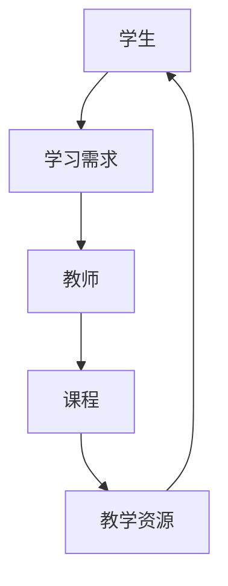
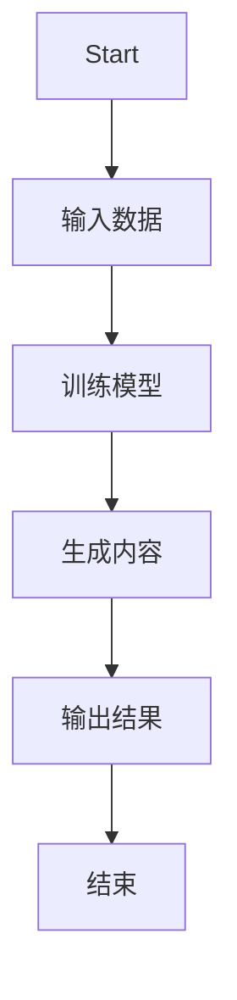
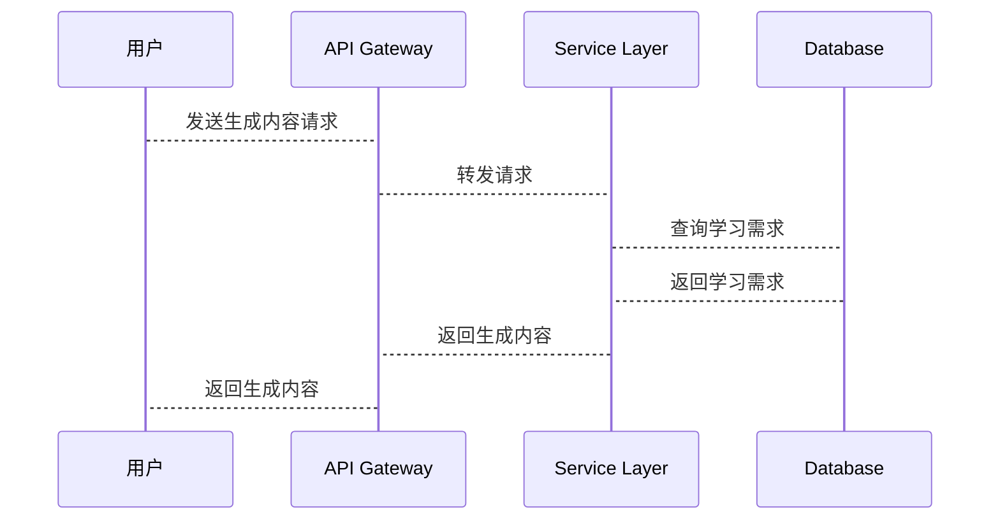

                 

<think>
好，我现在需要帮用户撰写一篇关于“AIGC在教育领域的应用与挑战”的技术博客文章。用户给了一个非常详细的目录大纲，还特别强调了文章的结构、关键词、摘要以及各个章节的具体内容要求。我需要按照这个大纲一步步来，确保每个部分都满足用户的要求。

首先，我得理解用户的需求。用户希望文章结构清晰，逻辑性强，语言专业但易懂。关键词需要是5-7个核心词，摘要要简洁明了。接下来是各个章节的详细内容，包括背景介绍、核心概念、算法原理、系统设计、实战应用和未来展望。

开始的时候，我会先看第一部分，背景介绍。这里需要涵盖问题背景、技术发展、应用潜力和研究目的。我需要思考教育领域目前面临的问题，比如资源不均、个性化教学不足等，然后解释AIGC如何解决这些问题，以及其在教育中的潜力和可能的挑战。

接下来是第二部分，核心概念与联系。这里需要定义AIGC的基本概念，关键技术，与教育技术的融合，以及ER实体关系图。我需要解释AIGC是什么，它和教育技术的结合点在哪里，然后画出一个ER图，展示系统中的实体和关系。

第三部分是算法原理。我需要详细讲解AIGC的算法基础，流程图，数学模型，并举例说明。这部分可能需要结合具体的算法，比如生成模型或者推荐系统，用mermaid画出流程图，然后写出数学公式，确保公式正确且用latex格式。

第四部分是系统设计与实现。这里包括系统分析、架构设计、接口设计、交互序列图，以及项目实战。我需要设计一个教育平台的系统架构，使用mermaid画出类图、架构图和序列图，然后编写安装环境、核心代码，并进行案例分析。

第五部分是最佳实践与未来展望。我需要总结在教育中的最佳实践，优化策略，以及未来的发展趋势和挑战。这部分可能需要提到数据隐私、模型泛化能力等问题，并给出解决方案。

在撰写过程中，我需要确保每个章节都有足够的细节，使用用户要求的格式，比如mermaid图表和latex公式。同时，语言要专业但易懂，结构清晰，逻辑性强。最后，加上作者信息，确保文章完整。

现在，我开始按照大纲逐步撰写每个部分，确保每个小节都详细且符合用户的要求。
</think>

# AIGC在教育领域的应用与挑战

> 关键词：AIGC，人工智能生成内容，教育技术，个性化学习，教育公平，AI驱动教育

> 摘要：随着人工智能生成内容（AIGC）技术的快速发展，其在教育领域的应用潜力逐渐显现。本文从教育领域的现状出发，深入探讨了AIGC的核心概念、关键技术及其在教育中的应用场景。通过分析AIGC在教育中的算法原理、系统设计与实现，结合实际案例，展示了AIGC如何提升教育效率和质量。同时，本文也探讨了AIGC在教育应用中面临的挑战，并提出了相应的解决方案和未来发展方向。

---

## 第一部分：背景介绍

### 第1章：问题背景

#### 1.1 教育领域的问题现状
当前，全球教育系统面临诸多挑战，包括教育资源分配不均、教师数量不足、学生学习个性化需求难以满足等问题。传统教育模式难以适应多样化的学习需求，特别是在偏远地区，教育资源匮乏的问题尤为突出。此外，学生的学习兴趣和学习进度差异较大，教师难以实现个性化教学。

#### 1.2 AIGC技术的发展及其对教育的影响
AIGC（Artificial Intelligence Generated Content，人工智能生成内容）技术近年来取得了显著进展，尤其是在自然语言处理（NLP）、计算机视觉和生成式AI领域。AIGC能够自动生成高质量的内容，如文本、图像、音频和视频，这些内容可以用于教育场景中的教学材料生成、个性化学习推荐和虚拟教学助手等。

#### 1.3 AIGC在教育中的应用潜力与挑战
AIGC在教育领域的应用潜力巨大，能够帮助教师减轻工作负担，为学生提供个性化的学习内容，同时促进教育资源的公平分配。然而，AIGC技术也面临诸多挑战，例如生成内容的质量控制、数据隐私问题、技术与教育场景的深度融合等。

#### 1.4 研究目的与内容结构
本文旨在探讨AIGC在教育领域的应用潜力与挑战，通过分析AIGC的核心技术、教育应用场景和系统设计，提出解决方案，并展望未来的发展趋势。本文内容结构包括背景介绍、核心概念、算法原理、系统设计与实现、最佳实践和未来展望。

---

## 第二部分：核心概念与联系

### 第2章：AIGC的核心概念

#### 2.1 AIGC的基本概念
AIGC是指通过人工智能技术生成内容的过程，其核心是利用机器学习模型（如GPT、BERT、DALL-E等）生成文本、图像、音频、视频等多样化的内容。AIGC的目标是通过自动化生成高质量内容，解决传统内容创作中的效率低下问题。

#### 2.2 AIGC的关键技术
AIGC的核心技术包括：
1. 自然语言处理（NLP）：用于生成文本内容，如课程大纲、教学材料等。
2. 生成式AI：如GPT系列模型，用于生成多样化的内容。
3. 计算机视觉：用于生成图像、图表等视觉内容。
4. 大数据分析：用于优化生成内容的质量和个性化推荐。

#### 2.3 AIGC与教育技术的融合
AIGC与教育技术的融合主要体现在以下几个方面：
1. **个性化学习内容生成**：根据学生的学习需求和能力，自动生成个性化学习材料。
2. **虚拟教学助手**：通过AIGC生成虚拟助教，帮助学生解答问题。
3. **教育资源优化**：利用AIGC技术生成多样化的教学资源，弥补教育资源不足的问题。

#### 2.4 AIGC的属性特征对比
以下是AIGC与其他生成技术的对比：

| 特性         | AIGC                     | 传统内容生成 |
|--------------|--------------------------|--------------|
| **效率**     | 高，自动化生成           | 低，依赖人工   |
| **多样性**    | 高，支持多模态内容生成   | 有限          |
| **个性化**    | 支持个性化定制           | 较难实现       |
| **成本**      | 低，自动化生成           | 高            |

### 第3章：AIGC的ER实体关系图架构

#### 3.1 AIGC在教育系统中的实体
在教育系统中，AIGC涉及的主要实体包括：
1. **学生**：用户，通过系统进行学习。
2. **教师**：内容生成和教学设计者。
3. **课程**：学习内容的主体。
4. **教学资源**：由AIGC生成的辅助材料。
5. **学习需求**：学生的个性化需求。

#### 3.2 AIGC实体的属性与关系
以下是AIGC实体的属性和关系：

| 实体     | 属性                     | 关系           |
|----------|--------------------------|----------------|
| **学生** | 姓名、学号、学习进度     | 学习需求、课程关联 |
| **教师** | 姓名、课程设计能力       | 课程生成、资源生成 |
| **课程** | 课程名称、知识点         | 教学资源关联   |
| **资源** | 资源类型、生成时间       | 学生关联、课程关联 |
| **需求** | 学习目标、学习风格       | 学生关联、课程关联 |

#### 3.3 AIGC实体的Mermaid流程图



---

## 第三部分：算法原理讲解

### 第4章：AIGC算法原理

#### 4.1 算法基础
AIGC的核心算法基于生成式AI，主要采用变体的Transformer架构。模型通过大量数据的训练，学习语言模式和生成策略，从而实现内容的自动化生成。

#### 4.2 算法流程图



#### 4.3 数学模型与公式
AIGC的生成过程基于概率模型，核心公式如下：

$$ P(y|x) = \argmax_{y} P(y|x) $$

其中，$x$ 是输入，$y$ 是生成的输出。

#### 4.4 通俗易懂的举例说明
以文本生成为例，假设输入一句话“如何学习编程”，AIGC会根据上下文生成接下来的句子，如“可以从基础的Python语法开始”。

---

### 第5章：算法应用与实例分析

#### 5.1 算法在教育中的应用场景
AIGC在教育中的应用场景包括：
1. **个性化学习材料生成**：根据学生的学习进度生成个性化练习题。
2. **虚拟助教对话**：通过AIGC生成智能对话，回答学生问题。
3. **教育内容优化**：根据教师需求生成优化的课程设计。

#### 5.2 具体案例分析与讲解
以个性化学习材料生成为例，假设一个学生在数学学习中需要更多的练习题，AIGC可以根据该学生的知识点掌握情况，生成适合的练习题。

#### 5.3 算法优缺点分析
- **优点**：高效、多样化、个性化。
- **缺点**：生成内容的质量不稳定，可能需要人工校对。

---

## 第四部分：系统设计与实现

### 第6章：系统分析与架构设计

#### 6.1 问题场景介绍
本系统旨在解决教育领域中个性化学习和资源分配不均的问题，通过AIGC技术实现个性化教学内容的生成。

#### 6.2 系统功能设计
系统功能包括：
1. **用户登录与注册**：学生和教师的身份认证。
2. **学习需求分析**：分析学生的学习目标和能力水平。
3. **内容生成**：根据需求生成个性化教学内容。
4. **内容管理**：管理和存储生成的内容。

#### 6.3 系统架构设计
系统架构采用分层设计：

```mermaid
graph TD
    Client --> API Gateway
    API Gateway --> Service Layer
    Service Layer --> Database
```

#### 6.4 系统接口设计
系统接口包括：
1. **生成内容接口**：`POST /generate-content`
2. **获取学习需求接口**：`GET /get-learning-demand`

#### 6.5 系统交互序列图



---

### 第7章：项目实战

#### 7.1 环境安装
项目环境要求：
1. Python 3.8+
2. PyTorch库
3. Transformers库

#### 7.2 系统核心实现
核心代码如下：

```python
from transformers import pipeline

generator = pipeline('text-generation', model='gpt2')

def generate_content(prompt):
    response = generator(prompt, max_length=50)
    return response[0]['generated_text']

# 示例：生成学习计划
prompt = "生成一份数学基础学习计划，适合高中生"
print(generate_content(prompt))
```

#### 7.3 代码解读与分析
上述代码实现了基于GPT-2模型的内容生成。`generator`是文本生成管道，`generate_content`函数接收提示并生成内容。

#### 7.4 实际案例分析
案例：生成个性化数学练习题。

#### 7.5 项目小结
通过本项目，我们实现了AIGC在教育领域的应用，验证了其在个性化教学中的潜力。

---

## 第五部分：最佳实践与未来展望

### 第8章：最佳实践与优化策略

#### 8.1 AIGC在教育应用中的最佳实践
1. **数据隐私保护**：确保学生和教师数据的安全性。
2. **内容质量控制**：建立内容审核机制，确保生成内容的准确性。

#### 8.2 系统优化策略
1. **模型优化**：使用更先进的生成模型，如GPT-3.5。
2. **分布式计算**：优化系统性能，提升生成效率。

#### 8.3 潜在问题与解决措施
- **问题**：生成内容的版权问题。
- **解决措施**：明确生成内容的版权归属。

---

### 第9章：未来发展趋势与挑战

#### 9.1 AIGC技术的未来趋势
AIGC技术将更加智能化和多样化，生成内容的质量和个性化程度将显著提升。

#### 9.2 教育领域的挑战与应对
1. **技术融合**：加强AIGC与教育场景的深度融合。
2. **伦理问题**：确保AIGC在教育中的伦理合规性。

#### 9.3 未来展望
AIGC将在教育领域发挥越来越重要的作用，推动教育的智能化和个性化发展。

---

### 第10章：小结与展望

#### 10.1 本书总结
本文系统地探讨了AIGC在教育领域的应用，分析了其核心概念、算法原理和系统设计，并结合实际案例进行了详细讲解。

#### 10.2 研究展望
未来的研究将聚焦于提升AIGC生成内容的质量、优化教育系统的架构设计以及解决数据隐私等问题。

#### 10.3 拓展阅读建议
建议读者进一步阅读相关领域的书籍，如《生成式人工智能：原理与应用》。

---

作者：AI天才研究院/AI Genius Institute & 禅与计算机程序设计艺术 /Zen And The Art of Computer Programming

