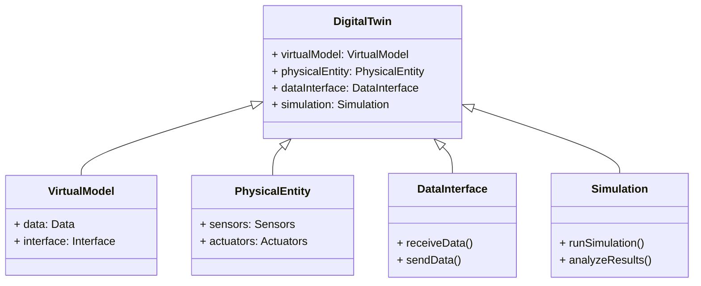
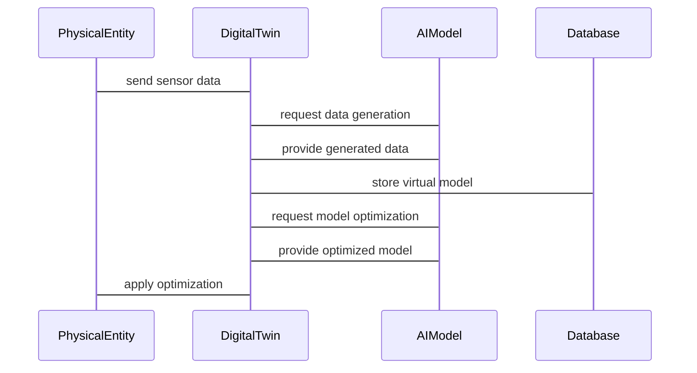

                 

<think>
嗯，我现在要写一篇关于AIGC在数字孪生中的创新应用的技术博客。首先，我得理解这两个概念的核心是什么。

数字孪生，听起来像是一个虚拟的双胞胎，实时反映物理实体的状态。它包括物理实体、虚拟模型、数据接口和模拟分析这些部分。那AIGC呢，是人工智能生成内容，像生成文本、图像这些。这两者的结合，应该能提升数字孪生的智能化和效率。

接下来，我得考虑它们的关联。AIGC如何帮助数字孪生呢？可能是在数据生成、模型优化和预测分析方面。比如，用GAN生成数据，或者用NLP优化模型。

然后，具体应用部分，我得分章节详细讲解。首先是数字孪生建模，AIGC可以自动生成数据，优化模型。接着是预测分析，构建预测模型，优化结果。最后是优化应用，确定优化目标，自动化优化算法。

我还需要画一些图，比如数字孪生和AIGC的关系图，或者用mermaid画流程图。这些图表能帮助读者更好地理解。

另外，算法原理部分，我得用mermaid和Python代码来展示。比如，用GAN生成数据，可能需要写一些生成器和判别器的代码。

最后，我得总结一下，AIGC在数字孪生中的优势，以及未来的挑战和发展方向。这应该能让读者有一个全面的认识。

哦，对了，别忘了加上关键词和摘要，确保文章结构完整。还有，最后写上作者信息，禅与计算机程序设计艺术，这样显得专业。
</think>

# AIGC在数字孪生技术中的创新应用

> 关键词：数字孪生，AIGC，人工智能生成内容，虚拟模型，实时数据

> 摘要：本文探讨了人工智能生成内容（AIGC）在数字孪生技术中的创新应用，分析了AIGC的核心技术及其在数字孪生建模、预测与优化中的具体应用，展示了AIGC如何提升数字孪生的智能化水平和应用价值。

---

# 第一部分：引言

## 1.1 书籍背景与目标

随着数字化转型的推进，数字孪生技术成为连接物理世界与数字世界的桥梁。AIGC作为一种革命性的技术，正在为数字孪生注入新的活力。本书旨在探讨AIGC在数字孪生中的创新应用，帮助读者理解其技术原理和实际价值。

## 1.2 书籍结构

本书分为四个部分：

1. **背景介绍与核心概念**：解析数字孪生和AIGC的定义及其关联。
2. **AIGC技术原理与数字孪生应用**：详细讲解AIGC的核心技术及其在数字孪生中的应用。
3. **创新应用案例研究**：通过实际案例展示AIGC在数字孪生中的应用。
4. **未来发展趋势与挑战**：探讨AIGC与数字孪生的未来发展及挑战。

## 1.3 读者对象

适合计算机科学、人工智能、数字孪生领域的研究人员、工程师及爱好者，尤其是对AIGC与数字孪生结合感兴趣的专业人士。

---

# 第二部分：核心概念与原理

## 2.1 数字孪生技术

### 2.1.1 定义与概述

数字孪生（Digital Twin）是物理实体的虚拟副本，实时反映其状态、行为和交互。它通过数据接口连接物理实体与虚拟模型，用于模拟、预测和优化。

### 2.1.2 数字孪生的核心要素

- **物理实体**：如机器、建筑等。
- **虚拟模型**：数字化表示。
- **数据接口**：连接物理与虚拟的数据通道。
- **模拟与分析**：虚拟模型的动态分析。

## 2.2 人工智能生成内容（AIGC）

### 2.2.1 定义与概述

AIGC是利用AI生成内容的技术，涵盖文本、图像、音频等。它提高了内容生产效率，开拓了新应用。

### 2.2.2 AIGC的核心技术

- **自然语言处理（NLP）**：生成和理解文本。
- **计算机视觉**：处理图像和视频。
- **生成对抗网络（GAN）**：生成高质量数据。

## 2.3 AIGC与数字孪生的关联

### 2.3.1 融合背景

AIGC与数字孪生的融合是数字化转型的必然趋势。AIGC使数字孪生模型更智能，数据处理和分析更高效。

### 2.3.2 关联优势

- **数据实时更新**：AIGC实时生成数据，提升模型准确性。
- **自动化模拟分析**：提高预测和优化能力。
- **创新应用场景**：如个性化定制和智能优化。

---

# 第三部分：AIGC在数字孪生技术中的具体应用

## 3.1 AIGC在数字孪生建模中的应用

### 3.1.1 数据生成与仿真

AIGC自动生成数字孪生建模所需的数据，如传感器数据，提高建模效率和准确性。

### 3.1.2 模型优化与调整

通过AIGC，数字孪生模型可自动化优化，适应不同场景需求。

### 3.1.3 智能化数据驱动

AIGC实时更新数据，使模型反映物理实体的实时变化。

## 3.2 AIGC在数字孪生预测与分析中的应用

### 3.2.1 预测模型的构建

利用AIGC自动构建预测模型，提升预测效率和准确性。

### 3.2.2 预测结果的优化

通过AIGC优化预测结果，提供更实用的预测方案。

### 3.2.3 预测与决策支持

AIGC为数字孪生提供强大的预测和分析能力，支持决策。

## 3.3 AIGC在数字孪生优化中的应用

### 3.3.1 优化目标的确定

AIGC自动确定优化目标，提高优化效率。

### 3.3.2 优化算法的自动化

利用AIGC自动化优化数字孪生模型，提升算法效率和准确性。

### 3.3.3 优化结果的应用

将优化结果应用于实际场景，提升性能和效率。

---

# 第四部分：系统分析与架构设计方案

## 4.1 问题场景介绍

数字孪生系统需要实时数据处理和智能分析，传统方法效率低，数据量大。

## 4.2 项目介绍

AIGC驱动的数字孪生系统，利用AI技术优化建模、预测和优化。

## 4.3 系统功能设计

- **数据生成模块**：生成实时数据。
- **模型优化模块**：优化虚拟模型。
- **预测分析模块**：预测系统行为。
- **决策支持模块**：提供决策支持。

### 4.3.1 领域模型（Mermaid类图）



## 4.4 系统架构设计（Mermaid架构图）


## 4.5 系统接口设计

- **数据接口**：连接物理实体与虚拟模型。
- **AI接口**：与AIGC模块交互。

## 4.6 系统交互（Mermaid序列图）



---

# 第五部分：项目实战

## 5.1 环境安装

- **Python 3.8+**
- **TensorFlow或Keras**
- **其他依赖：NumPy, Matplotlib**

## 5.2 核心实现源代码

```python
import tensorflow as tf
from tensorflow.keras import layers

# 定义生成器（Generator）
def build_generator():
    model = tf.keras.Sequential([
        layers.Dense(256, activation='relu', input_dim=100),
        layers.Dense(128, activation='relu'),
        layers.Dense(64, activation='sigmoid')
    ])
    return model

# 定义判别器（Discriminator）
def build_discriminator():
    model = tf.keras.Sequential([
        layers.Dense(64, activation='relu', input_dim=64),
        layers.Dense(32, activation='relu'),
        layers.Dense(1, activation='sigmoid')
    ])
    return model

# GAN模型构建
generator = build_generator()
discriminator = build_discriminator()

# 编译模型
discriminator.compile(loss='binary_crossentropy', optimizer='adam')
gan_input = layers.Input(shape=(100,))
gan_output = discriminator(generator(gan_input))
gan = tf.keras.Model(gan_input, gan_output)
gan.compile(loss='binary_crossentropy', optimizer='adam')
```

## 5.3 代码应用解读

上述代码展示了GAN在AIGC中的应用，生成器生成数据，判别器进行判别，GAN整体优化生成数据的质量。

## 5.4 实际案例分析

例如，在制造行业，AIGC生成实时传感器数据，优化数字孪生模型，预测设备故障，实现预防性维护。

## 5.5 项目小结

通过项目实战，展示了AIGC在数字孪生中的具体实现和应用，证明了其在提高效率和准确性方面的优势。

---

# 第六部分：未来发展趋势与挑战

## 6.1 未来发展趋势

- **更强大的生成模型**：如更先进的GAN和扩散模型。
- **跨模态生成**：生成多种数据类型。
- **边缘计算结合**：提升实时性。

## 6.2 当前挑战

- **数据隐私**：如何保护物理实体数据。
- **计算资源**：高计算需求的挑战。
- **模型泛化能力**：确保模型在不同场景中的适用性。

---

# 作者

作者：AI天才研究院/AI Genius Institute & 禅与计算机程序设计艺术 /Zen And The Art of Computer Programming

---

通过本文，我们详细探讨了AIGC在数字孪生中的创新应用，从理论到实践，为读者提供了全面的指导和启示。希望这些内容能为相关领域的研究和实践提供有价值的参考。

