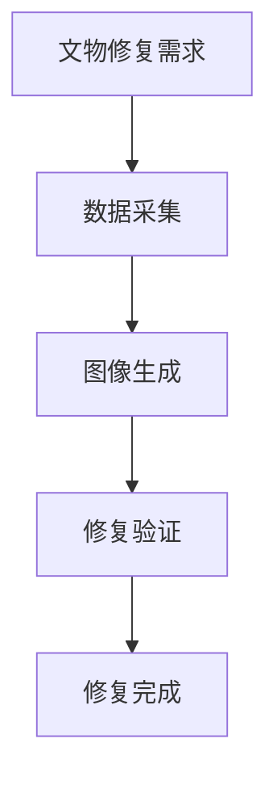
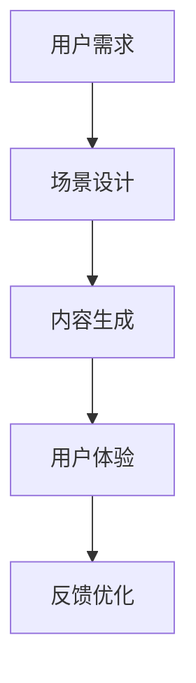
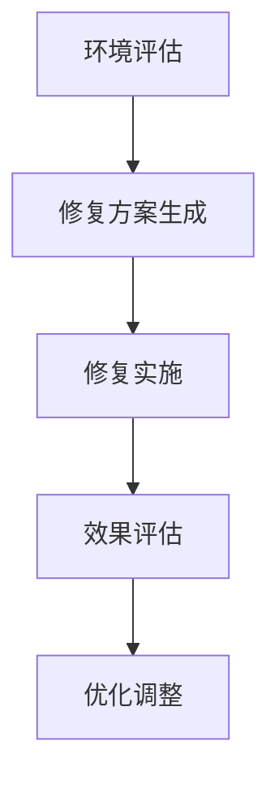
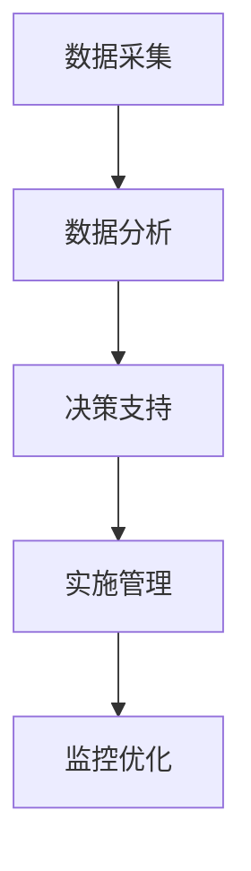
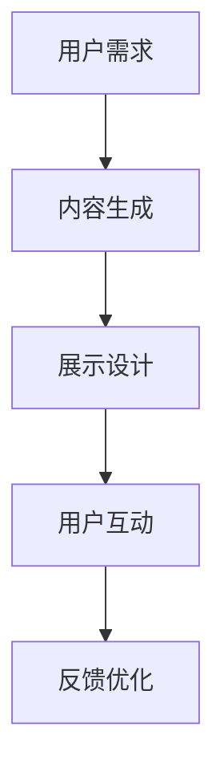
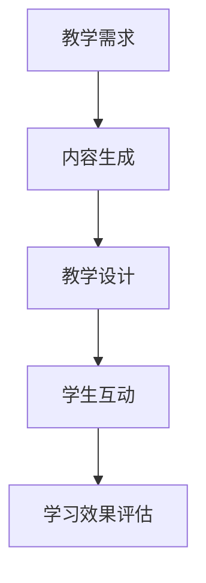

                 

<think>
嗯，用户希望我写一篇关于AIGC在文化遗产保护中的创新应用的技术博客。首先，我需要理解用户的需求。他们可能是一位技术专家或者文化遗产保护领域的专业人士，想要了解AIGC技术如何具体应用到文化遗产保护中。

用户提供的目录结构非常详细，包括背景、核心概念、应用案例和未来趋势。我需要按照这个结构来展开，确保每个部分都涵盖到位。特别是，用户强调了要使用专业的技术语言，同时保持逻辑清晰和结构紧凑。

接下来，我需要确定每个章节的核心内容。比如，问题背景部分，我应该先介绍文化和自然遗产的重要性，然后说明它们面临的挑战，再引出AIGC技术。核心概念部分，我需要详细解释AIGC的基本原理，以及如何与文化遗产保护结合起来。

在应用部分，我应该分文化遗产和自然遗产两部分，分别讨论文物修复、虚拟现实体验、景观生成和生态系统管理。每个应用点都需要有具体的例子和流程图，以帮助读者理解。

案例研究部分，我需要选择具体的案例，如故宫和大足石刻，分析它们如何应用AIGC技术，以及这些应用带来的效果和启示。未来趋势部分则需要探讨技术的发展方向、市场需求以及可能的挑战。

最后，总结和展望部分要回顾全文，强调AIGC在文化遗产保护中的重要性，并提出未来的研究方向和建议。

在写作过程中，我要确保每个小节都有足够的细节和深度，同时使用markdown格式，包括mermaid流程图和latex公式。这可能有点挑战，因为需要兼顾技术细节和可读性。此外，我还要注意字数控制在10000到12000字之间，保持文章的完整性和逻辑性。

总的来说，我需要系统地按照用户提供的大纲，逐步展开每个部分，确保内容详实、结构清晰，并且符合技术博客的高标准。这需要我对AIGC技术有深入的理解，同时对文化遗产保护领域有一定的了解，才能写出既有技术深度又易于理解的文章。
</think>

# AIGC在文化遗产保护中的创新应用

## 关键词：AIGC，文化遗产保护，文物修复，虚拟现实，生态系统管理，数字化展示

## 摘要：本文探讨了AIGC（人工智能生成内容）技术在文化遗产保护中的创新应用，涵盖文物修复、虚拟现实体验、自然景观生成与修复、文化遗产数字化展示、案例研究、未来趋势等方面。文章通过详细的技术分析和实际案例，展示了AIGC如何为文化遗产保护提供新的解决方案，并展望了未来的发展方向和挑战。

---

### 第一部分: AIGC在文化遗产保护中的创新应用

---

#### 第1章: 问题背景与核心概念

##### 1.1 问题背景

###### 1.1.1 文化和自然遗产保护的重要性

文化和自然遗产是人类文明的瑰宝，承载着历史、艺术、科学和精神价值。它们不仅是人类共同的记忆，也是未来发展的基石。保护文化遗产和自然遗产，不仅是对历史的尊重，也是对未来 generations 的责任。然而，随着时间和环境的变化，文化遗产和自然遗产面临着诸多挑战，如损坏、腐蚀、非法挖掘、生态破坏等。如何有效保护和传承这些宝贵财富，成为全球关注的焦点。

###### 1.1.2 文化和自然遗产面临的挑战

文化遗产和自然遗产的保护面临多重挑战：

1. **物理损坏**：自然老化、环境污染、人为破坏等导致文化遗产和自然景观的物理损坏。
2. **信息丢失**：文化遗产的记录和传承方式逐渐失传，导致信息的流失。
3. **资源有限**：文化遗产保护需要大量资金、技术和社会资源，但在许多地区，这些资源不足。
4. **非法活动**：非法挖掘、盗卖文化遗产的现象屡禁不止。
5. **生态破坏**：自然遗产的生态系统受到人类活动的影响，如森林砍伐、水污染等。

###### 1.1.3 AIGC技术概述

AIGC（AI Generated Content，人工智能生成内容）是利用人工智能技术自动生成文字、图像、音频、视频等内容的技术。AIGC的核心是通过深度学习模型（如GPT、Diffusion Models等）生成与人类创作相似的内容。AIGC的优势在于其高效性、多样性和创新性，能够在文化遗产保护中发挥重要作用。

---

##### 1.2 核心概念与联系

###### 1.2.1 AIGC基本原理

####### 1.2.1.1 自动生成内容的定义

AIGC是指通过人工智能算法生成内容的过程。这些内容可以是文本、图像、音频、视频等，且能够模仿人类的创作风格。

####### 1.2.1.2 自动生成内容的分类

AIGC的内容可以分为以下几类：

- **文本生成**：如新闻报道、诗歌、对话等。
- **图像生成**：如绘画、插图、风景画等。
- **音频生成**：如音乐、语音、音效等。
- **视频生成**：如短视频、动画、特效等。

####### 1.2.1.3 AIGC的优势与挑战

**优势**：

- **高效性**：AIGC可以在短时间内生成大量内容。
- **创新性**：AIGC可以创造出人类难以想到的新内容。
- **可扩展性**：AIGC可以应用于多种场景。

**挑战**：

- **质量控制**：生成的内容可能缺乏深度或逻辑性。
- **版权问题**：生成内容的版权归属尚不明确。
- **技术门槛**：需要大量数据和计算资源支持。

###### 1.2.2 文化和自然遗产保护相关概念

####### 1.2.2.1 文化和自然遗产的概念结构

| 概念 | 定义 | 示例 |
|------|------|------|
| 文化遗产 | 人类在历史上创造的物质和非物质财富 | 敦煌莫高窟、《诗经》 |
| 自然遗产 | 自然界中具有重要生态价值和美学价值的自然景观 | 长江三峡、九寨沟 |

####### 1.2.2.2 文化和自然遗产的属性特征对比表

| 属性 | 文化遗产 | 自然遗产 |
|------|----------|----------|
| 物质形态 | 文物、建筑 | 自然景观、生态系统 |
| 时间性 | 历史性 | 永续性 |
| 保护方式 | 文本记录、数字化保护 | 生态保护、技术修复 |

####### 1.2.2.3 文化和自然遗产的ER实体关系图

```mermaid
er
    entity 文化遗产 {
        文物编号
        文物名称
        文物类型
    }
    entity 自然遗产 {
        景观编号
        景观名称
        景观类型
    }
    entity 保护措施 {
        保护编号
        保护类型
        实施时间
    }
    relationship 保护措施 实施于 文化遗产 和 自然遗产
```

---

### 第2章: AIGC技术在文化遗产保护中的应用

#### 2.1 文物修复与复原

##### 2.1.1 文物修复的基本原理

###### 2.1.1.1 文物修复的技术方法

文物修复通常包括以下步骤：

1. **现状评估**：对文物的损坏程度进行评估。
2. **修复方案制定**：根据评估结果制定修复方案。
3. **修复实施**：通过物理或化学方法修复文物。
4. **修复验收**：对修复效果进行验收。

###### 2.1.1.2 AIGC在文物修复中的应用

AIGC可以通过生成图像或文本的方式，辅助文物修复工作。例如：

- **图像修复**：利用AIGC技术生成缺失部分的图像，辅助修复人员还原文物的原始样貌。
- **文本修复**：通过自然语言处理技术修复古籍中的缺失文字。

##### 2.1.2 文物复原的mermaid流程图



---

#### 2.2 虚拟现实与文化遗产体验

##### 2.2.1 虚拟现实技术概述

###### 2.2.1.1 虚拟现实的基本原理

虚拟现实（VR）通过计算机生成的三维环境，让用户沉浸式体验虚拟世界。其核心是通过传感器、显示设备和计算设备实现人与虚拟环境的交互。

###### 2.2.1.2 AIGC在虚拟现实中的应用

AIGC可以生成虚拟环境中的内容，如古建筑的复原场景、历史事件的重现等。例如，利用AIGC生成故宫的虚拟重建，让用户身临其境地体验故宫的辉煌。

##### 2.2.2 虚拟现实与文化遗产体验的mermaid流程图



---

### 第3章: AIGC技术在自然遗产保护中的应用

#### 3.1 自然景观生成与修复

##### 3.1.1 自然景观生成的原理

###### 3.1.1.1 自然景观生成的方法

自然景观生成可以通过以下方法实现：

- **数据驱动生成**：利用卫星图像、地理数据生成自然景观。
- **规则驱动生成**：基于自然规律生成地形、植被等。

###### 3.1.1.2 AIGC在自然遗产修复中的应用

AIGC可以生成自然景观的修复方案，如森林恢复、水体修复等。例如，利用AIGC生成受损生态系统的恢复方案，指导实际修复工作。

##### 3.1.2 自然景观修复的mermaid流程图



---

#### 3.2 生态系统的数字化管理

##### 3.2.1 生态系统数字化管理的基本原理

###### 3.2.1.1 生态系统数字化管理的流程

生态系统数字化管理通常包括以下步骤：

1. **数据采集**：采集生态系统的各项数据。
2. **数据分析**：分析数据以识别问题。
3. **决策支持**：基于数据生成管理方案。
4. **实施与监控**：实施管理方案并进行监控。

###### 3.2.1.2 AIGC在生态系统数字化管理中的应用

AIGC可以生成生态系统的数字化模型，帮助管理者更好地理解生态系统状态并制定保护措施。例如，利用AIGC预测森林火灾风险，制定防火策略。

##### 3.2.2 生态系统数字化管理的mermaid流程图



---

### 第4章: AIGC技术在文化遗产展示与教育中的应用

#### 4.1 文化遗产数字化展示

##### 4.1.1 文化遗产数字化展示的原理

###### 4.1.1.1 数字化展示的方法

文化遗产数字化展示可以通过以下方法实现：

- **三维建模**：创建文化遗产的三维模型。
- **虚拟现实展示**：利用VR技术展示文化遗产。

###### 4.1.1.2 AIGC在文化遗产数字化展示中的应用

AIGC可以生成文化遗产的数字化内容，如虚拟展览、互动展示等。例如，利用AIGC生成敦煌壁画的虚拟展览，让用户在全球各地都能参观。

##### 4.1.2 文化遗产数字化展示的mermaid流程图



---

#### 4.2 融合教育技术与文化遗产传播

##### 4.2.1 融合教育技术的概述

###### 4.2.1.1 教育技术的定义与分类

教育技术是指利用技术手段辅助教学活动。它可以分为以下几类：

- **多媒体教学**：利用视频、音频等多媒体手段进行教学。
- **在线教育**：通过网络平台进行远程教学。

###### 4.2.1.2 AIGC在融合教育技术中的应用

AIGC可以生成教育内容，如教材、课件、互动游戏等。例如，利用AIGC为学生生成个性化的学习内容，提升学习效果。

##### 4.2.2 融合教育技术与文化遗产传播的mermaid流程图



---

### 第5章: 案例研究与分析

#### 5.1 案例研究一：故宫的AIGC技术应用

##### 5.1.1 故宫的AIGC技术应用概述

故宫是中国最重要的文化遗产之一。为了保护和传承故宫的文化价值，研究人员利用AIGC技术生成故宫的数字化模型，用于修复、展示和教育。

##### 5.1.2 案例分析

通过AIGC技术，故宫的数字化模型可以被广泛传播和使用，让更多人了解和欣赏故宫的文化价值。

##### 5.1.3 案例总结与启示

AIGC技术为故宫的保护和传承提供了新的思路。未来，可以进一步利用AIGC技术生成更多文化遗产的数字化内容。

---

#### 5.2 案例研究二：大足石刻的AIGC技术应用

##### 5.2.1 大足石刻的AIGC技术应用概述

大足石刻是中国重要的文化遗产之一。通过AIGC技术，研究人员可以生成大足石刻的数字化内容，用于修复、展示和教育。

##### 5.2.2 案例分析

通过AIGC技术，大足石刻的数字化内容可以被广泛传播和使用，让更多人了解和欣赏大足石刻的文化价值。

##### 5.2.3 案例总结与启示

AIGC技术为大足石刻的保护和传承提供了新的思路。未来，可以进一步利用AIGC技术生成更多文化遗产的数字化内容。

---

### 第6章: AIGC技术在文化遗产保护中的未来趋势与挑战

#### 6.1 AIGC技术在文化遗产保护中的未来发展趋势

##### 6.1.1 技术演进方向

未来，AIGC技术将更加智能化和多样化，能够生成更高质量的内容。

##### 6.1.2 市场需求分析

随着文化遗产保护需求的增加，AIGC技术的市场需求将逐步扩大。

##### 6.1.3 行业应用前景

AIGC技术将在文化遗产保护的多个领域得到广泛应用，如修复、展示、教育等。

#### 6.2 AIGC技术在文化遗产保护中的挑战

##### 6.2.1 技术挑战

AIGC技术的生成质量需要进一步提高，以满足文化遗产保护的需求。

##### 6.2.2 政策与伦理问题

AIGC技术的应用需要遵守相关法律法规，同时需要考虑版权和伦理问题。

##### 6.2.3 发展瓶颈与对策

AIGC技术的发展需要多方合作，包括政府、企业、学术机构等。

---

### 第7章: 总结与展望

#### 7.1 总结

##### 7.1.1 AIGC在文化遗产保护中的应用总结

AIGC技术为文化遗产保护提供了新的解决方案，如文物修复、虚拟现实体验、数字化展示等。

##### 7.1.2 主要贡献与局限性

AIGC技术的主要贡献在于提高了文化遗产保护的效率和效果，但其生成质量仍需进一步提高。

##### 7.1.3 未来研究方向

未来，可以进一步研究AIGC技术在文化遗产保护中的多样化应用，如智能修复、互动展示等。

#### 7.2 展望

##### 7.2.1 预计影响

AIGC技术将在文化遗产保护中发挥越来越重要的作用，推动文化遗产保护的数字化和智能化。

##### 7.2.2 发展潜力

AIGC技术的发展潜力巨大，未来可以在文化遗产保护的多个领域得到广泛应用。

##### 7.2.3 建议与建议

建议加强AIGC技术的研究和应用，推动文化遗产保护的创新发展。

---

**作者：AI天才研究院/AI Genius Institute & 禅与计算机程序设计艺术 /Zen And The Art of Computer Programming**

