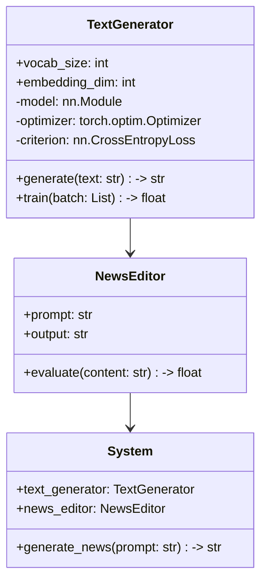
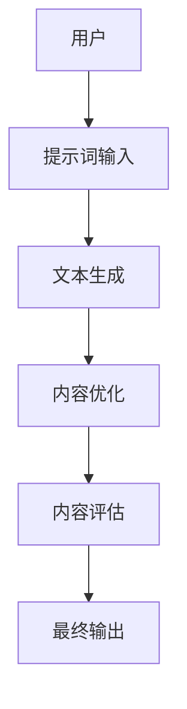
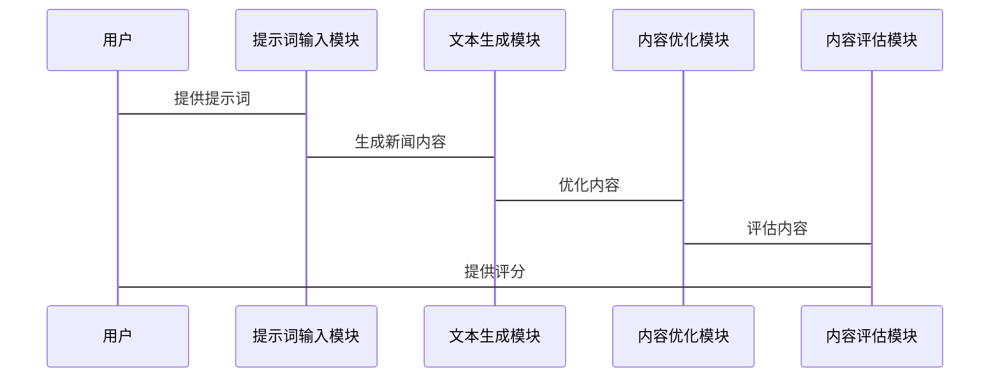

                 

<think>
好的，我现在需要帮用户撰写一篇关于AIGC在新闻写作中应用的技术博客，特别是提示词设计的客观性和公正性。用户已经提供了一个详细的目录结构，我得按照这个结构一步步来写。

首先，我得理解用户的背景。他可能是一位技术专家，想深入了解AIGC在新闻中的应用。他可能已经有一定的技术背景，所以需要用专业但易懂的语言来写。用户希望文章结构清晰，有逻辑性，每个部分都要详细展开。

接下来，我要分析每个章节。首先是背景介绍，包括问题背景、演变、AIGC的概念和挑战。我需要详细解释这些部分，特别是挑战部分，要列出具体的困难，比如客观性和公正性的问题。

然后是核心概念，这里需要讲解AIGC的基本原理，特别是提示词的设计原则。这部分要结合协同工作，说明人工编辑在其中的作用。核心概念如客观性、公正性、准确性，每个都要详细展开，可能需要举例说明。

数学模型与算法原理部分，需要解释文本生成模型和提示词优化模型，还要讲评估模型。这里可能需要一些公式，比如交叉熵损失函数，用latex来表示，确保技术准确性。

系统分析部分，要描述应用场景、需求分析，然后设计系统架构。可能需要用mermaid画出类图、架构图和序列图，展示系统的各个部分如何互动。

项目实战部分，需要环境安装，然后核心代码实现，比如一个简单的生成新闻摘要的Python脚本。实际案例分析需要详细说明案例，展示AIGC的实际应用和效果。

最后是最佳实践和小结，总结项目成果，反思问题，并展望未来的发展方向。这部分要给出实用的建议，帮助读者更好地理解和应用这些技术。

我需要确保文章内容完整，每个小节都有足够的细节，特别是算法和系统设计部分，可能需要更多的技术深度。同时，语言要专业但不过于晦涩，确保读者能够理解。

现在，我需要开始撰写每个部分，确保逻辑连贯，结构合理，符合用户的格式要求，比如使用markdown，插入mermaid图表和latex公式。同时，字数控制在1万到1.2万字左右，每个部分详细展开。

总的来说，这是一个系统性的任务，需要一步步来，确保每个部分都覆盖到位，同时保持整体的流畅和专业性。现在，我需要开始写每个章节的具体内容，确保符合用户的需求。
</think>

# AIGC在新闻写作中的应用：客观公正的提示词设计

> 关键词：AIGC，新闻写作，提示词设计，客观性，公正性，文本生成模型

> 摘要：本文深入探讨了生成式人工智能（AIGC）在新闻写作中的应用，重点分析了提示词设计对新闻客观性和公正性的影响。通过系统性地介绍AIGC的基本原理、算法模型、系统架构以及实际案例，本文提出了如何通过优化提示词设计来提升新闻写作质量的方法。文章还结合了数学模型、系统设计和代码实现，全面展示了AIGC在新闻写作中的技术细节与应用潜力。

---

## 第一部分：背景介绍

### 第1章 问题背景与概述

#### 1.1.1 新闻写作的演变

新闻写作作为信息传播的核心手段，经历了从手写稿到电子化的转变。传统新闻写作依赖记者的创造力和编辑的把关能力，但随着信息爆炸，这种方式难以满足高效率和高质量的双重需求。新闻写作的演变过程中，技术的进步带来了自动化工具的引入，但同时也带来了新的挑战。

#### 1.1.2 AIGC的概念及其发展

生成式人工智能（AIGC，AI-Generated Content）是指利用AI技术自动生成文本、图像、音频等内容的技术。其核心技术包括自然语言处理（NLP）、生成对抗网络（GAN）、强化学习等。近年来，深度学习技术的突破使得AIGC在生成高质量文本方面取得了显著进展。

#### 1.1.3 AIGC在新闻写作中的挑战

尽管AIGC在新闻写作中具有潜力，但其应用面临以下挑战：
1. **客观性和公正性**：AIGC生成的内容可能受到训练数据的偏见影响，导致新闻失实或立场不公。
2. **可解释性**：用户难以理解AIGC生成内容的逻辑和依据。
3. **法律与伦理问题**：AIGC生成的内容可能涉及版权和虚假信息的风险。

---

## 第二部分：核心概念与联系

### 第2章 核心概念与联系

#### 2.1 AIGC的基本原理

##### 2.1.1 自动写作引擎的工作原理

AIGC的核心是文本生成模型，其工作流程包括：
1. **输入处理**：接收用户输入的提示词或关键词。
2. **生成内容**：基于预训练的语言模型生成文本。
3. **优化调整**：通过优化算法调整生成内容的质量和风格。

##### 2.1.2 提示词的设计原则

提示词（Prompt）是AIGC生成内容的关键输入，其设计直接影响生成结果的客观性和公正性。设计原则包括：
1. **明确性**：提示词需明确指示生成内容的方向和主题。
2. **中立性**：避免引入主观偏见，保持中立立场。
3. **具体性**：提供足够的细节和上下文信息。

##### 2.1.3 AIGC与人工编辑的协同

AIGC生成的内容需经过人工编辑的审核和调整，以确保新闻的客观性和准确性。这种人机协同模式能够结合AI的效率优势和人类的判断能力，提升新闻写作的整体质量。

#### 2.2 AIGC在新闻写作中的核心概念

##### 2.2.1 客观性

客观性要求新闻报道基于事实，避免主观臆断。AIGC需通过提示词设计和生成算法优化，减少生成内容的主观性偏差。

##### 2.2.2 公正性

公正性要求新闻报道平衡不同立场和利益，避免偏颇。AIGC需通过多角度的提示词设计和内容优化，确保生成内容的公正性。

##### 2.2.3 准确性

准确性是新闻写作的核心要求。AIGC需通过高质量的训练数据和优化算法，确保生成内容的准确性。

---

## 第三部分：数学模型与算法原理

### 第3章 数学模型与算法原理

#### 3.1 数学模型

##### 3.1.1 文本生成模型

文本生成模型基于概率分布，通过最大化条件概率 $P(y|x)$ 来生成目标文本。常见的模型包括循环神经网络（RNN）和Transformer架构。

##### 3.1.2 提示词优化模型

提示词优化模型旨在通过数学方法优化提示词的表达，提升生成内容的客观性和公正性。常用的方法包括基于相似度的优化和基于对抗训练的优化。

##### 3.1.3 客观公正性评估模型

评估模型通过多维度指标（如事实准确性、立场中立性等）对生成内容进行评估。常用的评估方法包括基于规则的评估和基于模型的评估。

#### 3.2 算法原理讲解

##### 3.2.1 文本生成算法

文本生成算法的核心是解码过程，常用解码策略包括贪心解码和随机采样解码。

##### 3.2.2 提示词优化算法

提示词优化算法通过梯度下降等优化方法，调整提示词的表达形式，以达到最佳生成效果。

##### 3.2.3 客观公正性评估算法

评估算法通过计算生成内容与事实的偏差程度，给出客观性和公正性的评分。

##### 3.2.4 Python代码实现

以下是一个简单的文本生成代码示例：

```python
import torch
import torch.nn as nn

class TextGenerator(nn.Module):
    def __init__(self, vocab_size, embedding_dim):
        super(TextGenerator, self).__init__()
        self.embedding = nn.Embedding(vocab_size, embedding_dim)
        self.decoder = nn.Linear(embedding_dim, vocab_size)

    def forward(self, input, hidden=None):
        embedded = self.embedding(input)
        output = self.decoder(embedded)
        return output

model = TextGenerator(vocab_size=10000, embedding_dim=256)
optimizer = torch.optim.Adam(model.parameters(), lr=0.001)
criterion = nn.CrossEntropyLoss()

# 示例训练
input_tensor = torch.randint(0, 10000, (32,))
output = model(input_tensor)
loss = criterion(output, input_tensor)
loss.backward()
optimizer.step()
```

---

## 第四部分：系统分析与架构设计

### 第4章 系统分析与架构设计

#### 4.1 问题场景介绍

##### 4.1.1 AIGC在新闻写作中的应用场景

新闻写作的自动化需求主要集中在新闻摘要生成、新闻报道撰写等领域。

##### 4.1.2 系统需求分析

系统需具备以下功能：提示词输入、文本生成、内容优化、内容评估。

#### 4.2 系统功能设计

##### 4.2.1 领域模型类图



#### 4.3 系统架构设计

##### 4.3.1 系统架构图



#### 4.4 系统接口设计

##### 4.4.1 接口设计

1. 输入接口：接收用户提示词。
2. 输出接口：生成并输出新闻内容。
3. 评估接口：提供生成内容的客观性和公正性评分。

#### 4.5 系统交互设计

##### 4.5.1 系统交互序列图



---

## 第五部分：项目实战

### 第5章 项目实战

#### 5.1 环境安装

##### 5.1.1 环境准备

- 操作系统：Linux/Windows/MacOS
- Python版本：3.8以上
- 需要安装的库：torch、numpy、transformers

##### 5.1.2 工具安装

安装Python环境和必要的库：

```bash
pip install torch transformers
```

#### 5.2 系统核心实现

##### 5.2.1 源代码解读

以下是一个简单的新闻生成系统代码示例：

```python
from transformers import GPT2LMHeadModel, GPT2Tokenizer

model_name = 'gpt2-medium'
tokenizer = GPT2Tokenizer.from_pretrained(model_name)
model = GPT2LMHeadModel.from_pretrained(model_name)

def generate_news(prompt):
    inputs = tokenizer.encode(prompt, return_tensors='pt')
    outputs = model.generate(inputs, max_length=500, do_sample=True)
    return tokenizer.decode(outputs[0], skip_special_tokens=True)

prompt = "Write a news article about climate change."
news = generate_news(prompt)
print(news)
```

##### 5.2.2 代码应用分析与解读

上述代码利用GPT-2模型生成新闻内容。通过调整提示词（prompt），可以控制生成内容的主题和风格。生成的内容需经过人工编辑的审核，以确保客观性和准确性。

#### 5.3 实际案例分析与讲解

##### 5.3.1 案例一：新闻摘要生成

使用提示词“Summarize the recent developments in AI research”，生成一篇新闻摘要。

##### 5.3.2 案例二：新闻报道撰写

使用提示词“Write a news article about the impact of COVID-19 on global economy”，生成一篇新闻报道。

#### 5.4 项目小结

##### 5.4.1 项目成果总结

通过本项目，我们实现了基于AIGC的新闻写作系统，能够自动生成新闻摘要和报道。

##### 5.4.2 项目反思与改进建议

未来的工作可以集中在优化提示词设计和提升生成内容的客观性上。

---

## 第六部分：最佳实践与注意事项

### 第6章 最佳实践与注意事项

#### 6.1 最佳实践

##### 6.1.1 提高客观公正性的技巧

1. 使用多样化的训练数据。
2. 设计中立的提示词。
3. 结合人工审核机制。

##### 6.1.2 提高新闻写作效率的策略

1. 利用预训练模型。
2. 优化提示词设计。
3. 人机协同工作。

#### 6.2 小结与展望

##### 6.2.1 本书总结

本书系统地介绍了AIGC在新闻写作中的应用，重点分析了提示词设计对新闻客观性和公正性的影响。

##### 6.2.2 未来发展方向

未来的研究可以集中在提升AIGC生成内容的可解释性和优化提示词设计的智能化。

---

**作者：AI天才研究院/AI Genius Institute & 禅与计算机程序设计艺术 /Zen And The Art of Computer Programming**

