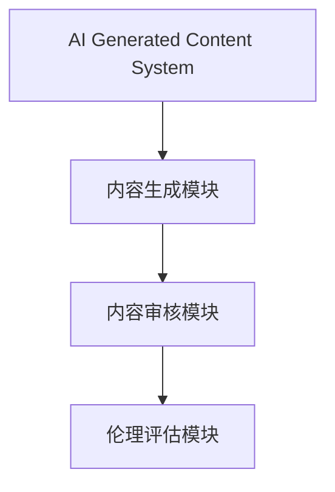

                 

<think>
好的，我现在需要撰写一篇关于《AIGC在新闻媒体中的伦理考量：真实性与客观性的平衡》的技术博客。首先，我得理清文章的结构和内容，确保每个部分都详细且有深度。文章需要分为几个部分，包括引言、AIGC技术在新闻媒体中的应用、伦理考量、算法与系统分析、案例分析，以及结论。

首先，我需要确定关键词和摘要。关键词包括AIGC、人工智能、新闻媒体、伦理考量、真实性、客观性。摘要部分要简明扼要地概括文章的核心内容，说明随着AIGC的应用，新闻媒体面临真实性与客观性的挑战，如何平衡这些伦理问题。

接下来是引言部分。引言需要介绍AIGC的发展背景，说明人工智能在新闻媒体中的应用，比如自动化写作、内容审核等。然后，解释AIGC的概念和特点，包括自然语言处理、生成对抗网络和深度学习。最后，强调伦理考量的重要性，特别是在真实性与客观性方面。

在第二部分，我需要详细讨论AIGC在新闻媒体中的具体应用，如自动化写作和内容审核。每个应用都要给出基本原理、应用案例和伦理考量。比如，在自动化写作中，需要讨论其技术原理，案例如美联社的Wordsmith系统，并分析真实性、客观性和情感表达方面的伦理问题。

第三部分是伦理考量，这里要探讨真实性与客观性的平衡，以及如何通过技术手段进行把关。需要详细分析虚假信息的来源，如何通过技术手段检测虚假内容，以及建立审核机制的重要性。同时，还要考虑如何保持新闻的客观性，可能涉及多源验证和事实核查工具。

接下来是系统分析与架构设计。这部分需要描述系统的基本组成，包括内容生成模块、内容审核模块和伦理评估模块。然后，用Mermaid画出系统架构图和类图，展示各模块之间的关系。同时，详细说明各个模块的功能，比如自然语言处理算法、生成对抗网络的应用，以及审核机制的具体实现。

在项目实战部分，我需要提供一个简单的Python代码示例，展示如何使用深度学习模型生成新闻内容。代码应包括数据加载、模型定义、训练和生成新闻的过程。然后，解释代码的功能，并进行实际案例分析，说明AIGC在新闻生成中的优缺点。

最后，结论部分总结文章的主要观点，强调AIGC在新闻媒体中的潜力和挑战，呼吁技术开发者和媒体从业者共同努力，建立伦理规范和审核机制，确保新闻的真实性和客观性。

整个思考过程中，我需要确保每个部分都逻辑清晰，内容详实，并且符合技术博客的专业性要求。同时，要注意用词准确，结构合理，以帮助读者更好地理解和掌握AIGC在新闻媒体中的伦理考量。
</think>

# AIGC在新闻媒体中的伦理考量：真实性与客观性的平衡

**关键词**：AIGC，人工智能，新闻媒体，伦理考量，真实性，客观性

**摘要**：随着人工智能生成内容（AIGC）技术在新闻媒体中的广泛应用，如何在确保真实性与客观性的前提下，平衡技术带来的便利与风险，成为一个亟待解决的问题。本文将探讨AIGC在新闻媒体中的应用、伦理考量，以及如何通过技术手段实现真实性与客观性的平衡。

---

## 第一部分: 引言

### 1.1 问题背景

#### 1.1.1 人工智能与新闻媒体的发展

人工智能技术的飞速发展为新闻媒体行业带来了深远的变革。从自动化写作到内容审核，再到个性化推荐，人工智能技术的应用极大地提升了新闻生产的效率和传播的精准性。新闻媒体机构开始利用自然语言处理（NLP）、生成对抗网络（GAN）和深度学习等技术，来优化新闻内容的生成和分发过程。

#### 1.1.2 AIGC的概念与特点

AIGC（AI-Generated Content，人工智能生成内容）是指通过人工智能技术生成的文字、图像、视频等多类型内容。其核心在于利用自然语言处理和生成模型，自动生成符合特定主题和风格的新闻报道、文章或评论。AIGC的特点包括智能化、个性化和高效化，能够快速生成大量内容，满足用户对新闻的多样化需求。

#### 1.1.3 伦理考量在新闻媒体中的重要性

尽管AIGC技术为新闻媒体带来了诸多便利，但其应用也引发了一系列伦理问题。例如，生成的内容是否真实？如何确保新闻的客观性？如何避免算法偏见？这些问题直接影响新闻的公信力和社会影响力。因此，如何在技术应用中平衡真实性与客观性，成为新闻媒体行业和人工智能开发者共同面临的挑战。

---

### 1.2 核心概念与联系

#### 1.2.1 AIGC的核心概念原理

AIGC的核心技术包括自然语言处理（NLP）、生成对抗网络（GAN）和深度学习。

##### 1.2.1.1 自然语言处理（NLP）

NLP是使计算机能够理解、生成和处理人类语言的技术。它包括文本分类、实体识别、情感分析等功能，是AIGC实现内容生成的基础。

##### 1.2.1.2 生成对抗网络（GAN）

GAN是一种深度学习模型，由生成器和判别器组成。生成器的目标是生成逼真的内容，而判别器则负责区分生成内容与真实内容。这种对抗机制使得生成器能够不断优化生成内容的质量。

##### 1.2.1.3 深度学习

深度学习是一种人工智能方法，通过多层神经网络进行数据建模。它在图像识别、语音识别和自然语言处理等领域得到了广泛应用。

#### 1.2.2 概念属性特征对比表格

| 概念       | 属性特征                  |
|------------|--------------------------|
| 自然语言处理 | 理解、生成和处理人类语言   |
| 生成对抗网络 | 生成与判别之间的对抗训练   |
| 深度学习    | 多层神经网络，自动特征提取 |

#### 1.2.3 ER实体关系图架构

```mermaid
erDiagram
    AIGC |--|> NLP
    AIGC |--|> GAN
    AIGC |--|> DL
```

---

### 1.3 本章小结

本章介绍了AIGC在新闻媒体中的伦理考量，包括其背景、核心概念原理以及相关属性特征对比和实体关系图。在后续章节中，我们将进一步探讨AIGC技术在新闻媒体中的应用以及伦理问题。

---

## 第二部分: AIGC技术在新闻媒体中的应用

### 2.1 自动化写作

#### 2.1.1 自动化写作的基本原理

自动化写作是指利用自然语言处理技术，自动生成新闻报道、文章等文本内容。其技术原理基于模板匹配和机器学习，通过训练大量文本数据，使模型能够生成符合语法规则和语义逻辑的文本。

#### 2.1.2 应用案例

许多新闻机构已经采用自动化写作技术，例如：

##### 2.1.2.1 案例一：美联社的“Wordsmith”系统

美联社的“Wordsmith”系统能够自动生成财经新闻，极大地提高了新闻生产效率。

#### 2.1.3 伦理考量

自动化写作可能带来的伦理问题包括：

##### 2.1.3.1 真实性

自动化写作生成的内容可能存在虚假信息的问题。

##### 2.1.3.2 客观性

自动化写作可能无法保证新闻报道的客观性。

##### 2.1.3.3 情感表达

自动化写作在情感表达方面可能不够准确和细腻。

### 2.2 内容审核

#### 2.2.1 内容审核的基本原理

内容审核是指利用人工智能技术，对新闻内容进行筛选、过滤，以确保其符合相关法律法规和道德规范。

#### 2.2.2 应用案例

内容审核技术广泛应用于社交媒体、新闻平台等，例如：

##### 2.2.2.1 案例一：谷歌的内容审核系统

谷歌的内容审核系统利用人工智能技术，对用户上传的内容进行实时审核，防止违规内容的传播。

#### 2.2.3 伦理考量

内容审核可能带来的伦理问题包括：

##### 2.2.3.1 隐私侵犯

内容审核可能涉及对用户隐私的侵犯。

##### 2.2.3.2 言论自由

内容审核可能限制用户的言论自由。

---

## 第三部分: AIGC在新闻媒体中的伦理考量

### 3.1 真实性与客观性的平衡

#### 3.1.1 真实性

AIGC生成的内容必须确保真实性，避免虚假信息的传播。为此，新闻媒体机构需要建立严格的内容审核机制，对生成的内容进行事实核查。

#### 3.1.2 客观性

新闻报道需要保持客观性，避免因算法偏见或数据偏差导致的片面报道。为此，新闻媒体机构需要采用多源验证和事实核查工具。

#### 3.1.3 技术手段

通过技术手段实现真实性与客观性的平衡，例如：

##### 3.1.3.1 多源验证

利用多个数据源进行验证，确保生成内容的真实性。

##### 3.1.3.2 事实核查工具

使用事实核查工具对生成内容进行验证。

---

## 第四部分: 系统分析与架构设计方案

### 4.1 系统架构设计

#### 4.1.1 系统组成

AIGC新闻生成系统的基本组成包括：

- **内容生成模块**：负责生成新闻内容。
- **内容审核模块**：负责对生成的内容进行审核。
- **伦理评估模块**：负责评估生成内容的伦理风险。

#### 4.1.2 系统架构图



#### 4.1.3 系统功能设计

##### 4.1.3.1 内容生成模块

- **功能**：利用自然语言处理和生成对抗网络技术，生成符合特定主题和风格的新闻报道。
- **算法原理**：基于深度学习的生成模型（如GPT）进行文本生成。

##### 4.1.3.2 内容审核模块

- **功能**：对生成的内容进行事实核查和语义分析，确保其真实性和客观性。
- **技术**：利用自然语言处理技术和知识图谱进行内容审核。

##### 4.1.3.3 伦理评估模块

- **功能**：评估生成内容的伦理风险，例如是否存在虚假信息或偏见。
- **技术**：基于伦理评分模型进行评估。

---

## 第五部分: 项目实战

### 5.1 环境安装

- **Python**：安装Python 3.8或更高版本。
- **深度学习框架**：安装TensorFlow或PyTorch。
- **自然语言处理库**：安装NLTK和transformers库。

### 5.2 核心实现代码

#### 5.2.1 文本生成代码

```python
import tensorflow as tf
from tensorflow.keras import layers

# 定义生成器模型
def build_generator(vocab_size):
    model = tf.keras.Sequential([
        layers.Dense(256, activation='relu', input_shape=(100,)),
        layers.Dense(512, activation='relu'),
        layers.Dense(vocab_size, activation='softmax')
    ])
    return model

# 定义判别器模型
def build_discriminator(vocab_size):
    model = tf.keras.Sequential([
        layers.Dense(256, activation='relu', input_shape=(vocab_size,)),
        layers.Dense(128, activation='relu'),
        layers.Dense(1, activation='sigmoid')
    ])
    return model
```

#### 5.2.2 生成对抗网络训练

```python
# 初始化生成器和判别器
generator = build_generator(vocab_size)
discriminator = build_discriminator(vocab_size)

# 定义损失函数
cross_entropy = tf.keras.losses.BinaryCrossEntropy()

# 定义优化器
generator_optimizer = tf.keras.optimizers.Adam(0.0002)
discriminator_optimizer = tf.keras.optimizers.Adam(0.0002)

# 训练循环
for epoch in range(num_epochs):
    for batch in dataset:
        # 生成假新闻
        noise = tf.random.normal([batch_size, 100])
        generated_news = generator(noise)

        # 判别器判断真假
        real_news = batch
        validity_real = discriminator(real_news)
        validity_fake = discriminator(generated_news)

        # 计算损失
        loss_gen = cross_entropy(tf.ones_like(validity_fake), validity_fake)
        loss_real = cross_entropy(tf.zeros_like(validity_real), validity_real)
        total_loss = loss_gen + loss_real

        # 反向传播和优化
        generator_model.trainable = True
        discriminator_model.trainable = False
        generator_optimizer.minimize(loss_gen, generator_model.trainable_weights)
        generator_model.trainable = False
        discriminator_model.trainable = True
        discriminator_optimizer.minimize(total_loss, discriminator_model.trainable_weights)
```

---

## 第六部分: 结论

AIGC技术在新闻媒体中的应用为新闻生产带来了前所未有的便利，但也带来了伦理上的挑战。为了确保新闻的真实性和客观性，新闻媒体机构需要在技术应用中建立严格的内容审核机制，并利用多源验证和事实核查工具进行把关。同时，技术开发者也需要不断优化生成模型，减少算法偏见和数据偏差。通过技术手段与伦理规范的结合，新闻媒体可以在AIGC时代实现真实性和客观性的平衡。

---

**作者：AI天才研究院/AI Genius Institute & 禅与计算机程序设计艺术 /Zen And The Art of Computer Programming**

